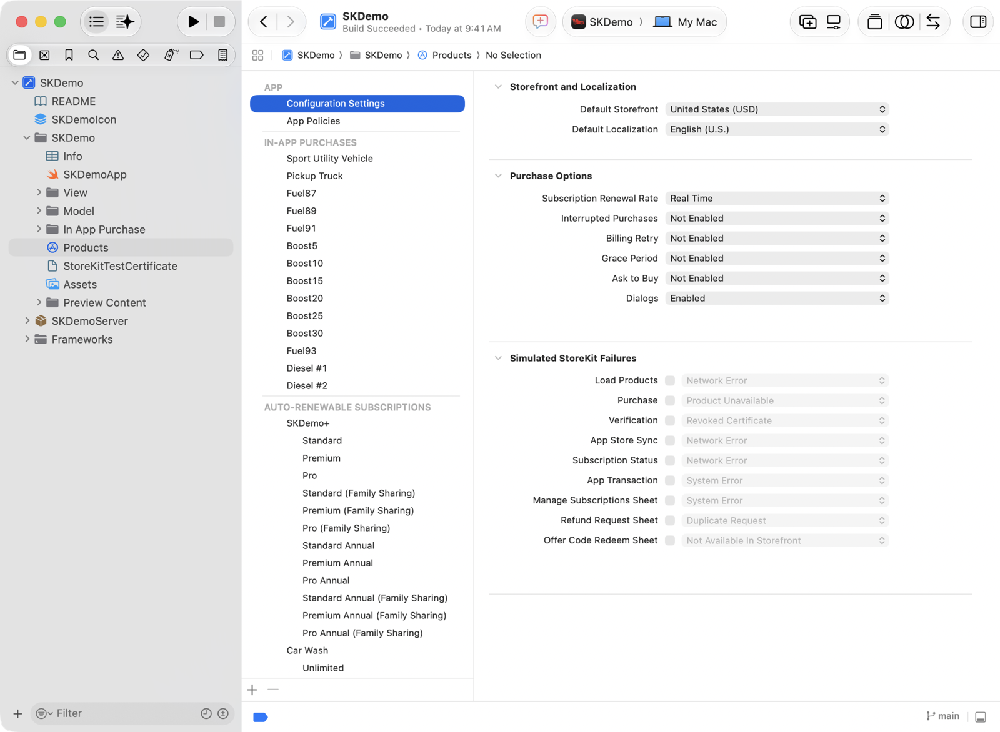
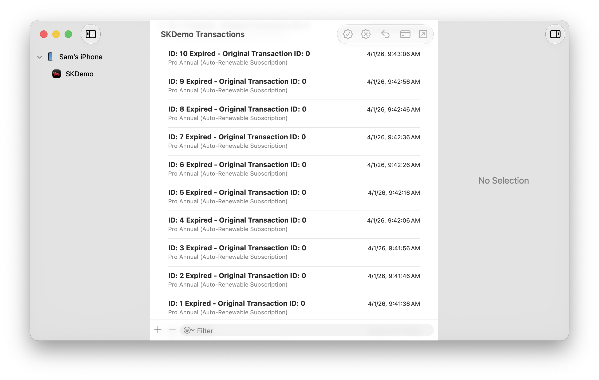
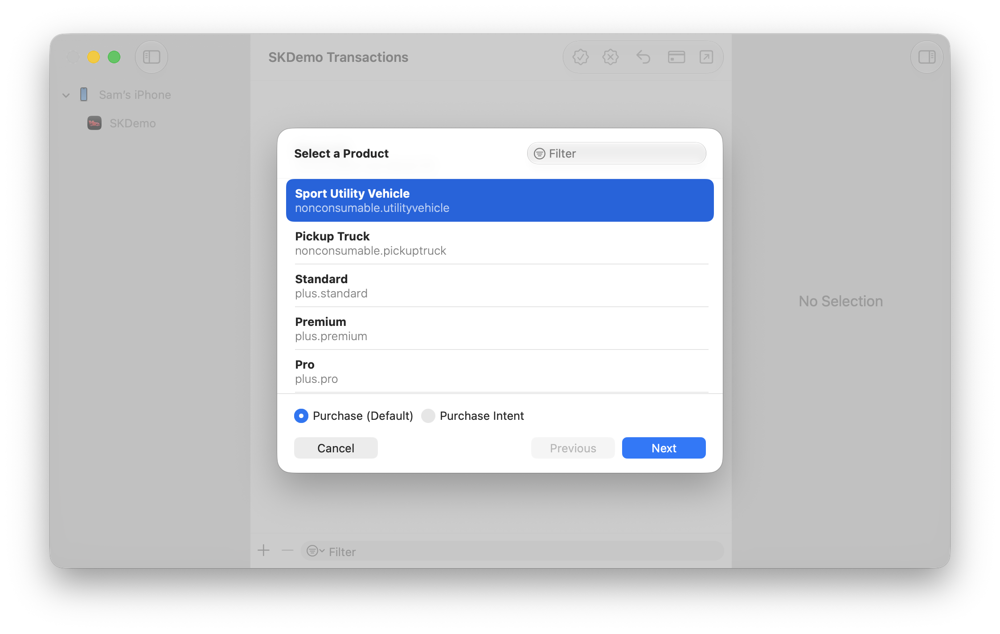
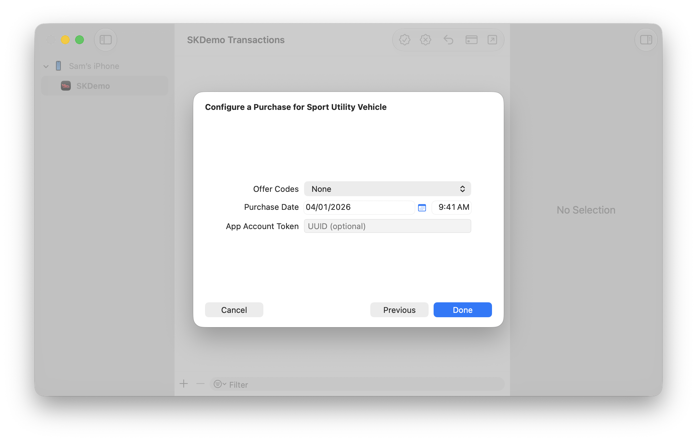
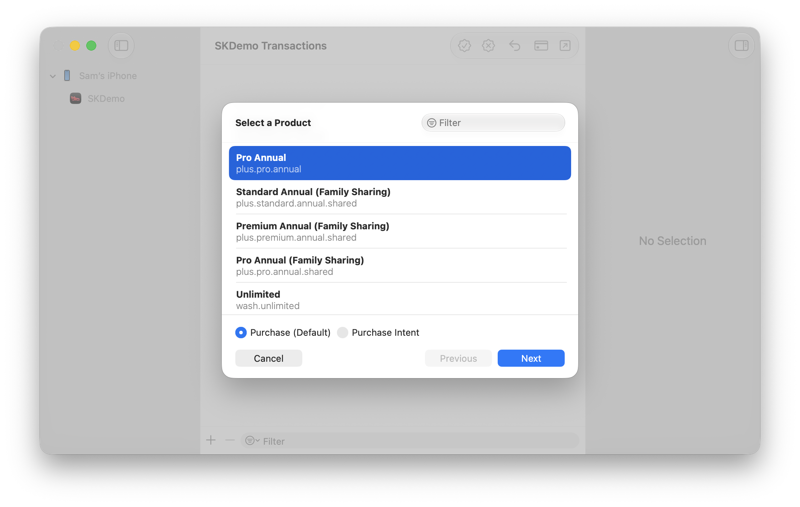
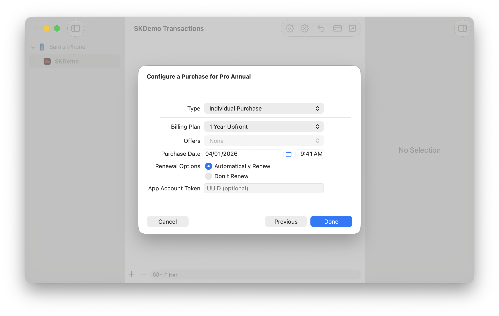
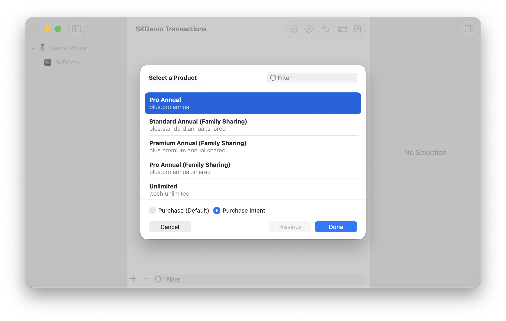

> Navigation: [Technologies](../technologies.md) · [Xcode](../xcode.md) · [Testing](testing.md)

# Testing in-app purchases with StoreKit transaction manager in Xcode

Article

Use the transaction manager within Xcode to test in-app purchases without requiring a connection to App Store servers.

## Overview

Xcode provides a _transaction manager_ that you use with StoreKit Testing in Xcode.  With transaction manager, you can test in-app purchases at any stage of development. Testing in-app purchases before pushing your app live helps you ensure a seamless purchase flow, test various edge cases and logic, and validate that purchases behave correctly.

Use the transaction manager to change settings and initiate test conditions, inspect transactions, and simulate different kinds of purchases.

> [!note] Note
> You need to set up StoreKit in Xcode before you can use the transaction manager for testing. For more information, see [Setting up StoreKit Testing in Xcode](setting-up-storekit-testing-in-xcode.md).

### Change settings and initiate test conditions

Select your StoreKit configuration file in the Project navigator and choose Editor to change the following settings:

- **Default Storefront** — Sets the [storefront](../storekit/transaction/storefront.md) property on the transaction.
- **Default Localization** — Sets the localization  that affects the currency display in the payment sheet and the values that return in the localized properties of [Product](../storekit/product.md). You provide the localized data in your StoreKit configuration file.
- **Subscription Renewal Rate** — Changes the rate at which time passes for subscriptions in the test environment compared to real time.
- **Enable Interrupted Purchases** — Causes the test environment to simulate a condition that prevents the customer from completing a purchase. Conditions that cause an interrupted purchase include a payment card expiring, or a customer needing to approve updated terms and conditions. Choose the Resolve Issue option in Debug \> StoreKit \> Manage Transactions to simulate the customer resolving the issue.
- **Enable Billing Retry on Renewal** — Causes the test environment to simulate a condition where the customer’s payment for a renewal doesn’t succeed, and the subscription enters the billing retry state. Choose the Resolve Issue option in Debug \> StoreKit \> Manage Transactions to simulate a successful billing retry.
- **Enable Billing Grace Period** — Enables Billing Grace Period for your app in the Xcode testing environment. To test this condition, set Enable Billing Retry on Renewal. When the subscription fails to renew, it goes into the billing retry state with Billing Grace Period enabled.
- **Enable Ask to Buy** — Causes the test environment to display the Ask to Buy prompt when the tester attempts a purchase. Choose the Approve Transaction or Decline Transaction option in the Debug \> StoreKit \> Manage Transactions menu to resolve the transaction.
- **Enable Dialogs** — Turn off this option to run your tests faster. When you turn this option off, you assume the user has confirmed payment. The system then suppresses confirmation animations and interactions during testing. Turn on this option to display all payment dialogs during testing.
- **Subscription Offers Key** — Provides a key that you use for signing a subscription offer in the test environment. Use this key instead of your regular key to generate the signature on your server. See [Generating a signature for promotional offers](../storekit/generating-a-signature-for-promotional-offers.md) for more information.
- **Simulate StoreKit failures** — Causes the test environment to apply the error conditions you specify to enable you to test your app’s error handling.

A screenshot in Xcode of a selected StoreKit configuration file in the Project navigator of Xcode. The sidebars shows the Configuration Settings option selected, and the main content area lists the various test conditions to test.

### Inspect transactions with the transaction manager

Use the options in the transaction manager to perform steps in an in-app purchase flow that normally occur outside your app, such as approving or declining Ask To Buy transactions, receiving refunds, and more. To open the transaction manager, choose Debug \> StoreKit \> Manage Transactions.

A screenshot of the StoreKit transaction manager listing app transactions. The left-hand side of the window lists devices and simulators along with their respective installed apps. The main content area lists the transactions. Each translation has a title, timestamp, and short product description.

The transaction manager lists all the transactions for the running app. If you have multiple apps running on multiple devices, select the app in the sidebar to view its transactions. Use the transaction manager to perform these actions:

- **Filter transactions** — Type a search term in the filter box at the bottom of the dialog to narrow the number of transactions that display.
- **Inspect a transaction** — Click a transaction, then view that transaction’s details in the inspector. Click the jump button next to a product or group to navigate to it in the StoreKit configuration file in Xcode.
- **Create a transaction** — Click the plus button on the left of the filter bar. Select the product you want to create a transaction for, and then configure the transaction. Use this feature to test in-app purchases made outside of the device, and to simulate in-app purchases that customers complete on different devices. For more information about creating transactions, see [Simulate a purchase](#Simulate-a-purchase).
- **Delete a transaction** — Select a transaction and click Delete to retest a scenario that the customer can perform only once. For example, customers can purchase a non-consumable product only once, so delete that transaction to retest the purchase. Delete subscription transactions to retest introductory offers. For more information, see [Implementing introductory offers in your app](../storekit/implementing-introductory-offers-in-your-app.md). If your app uses the [Original API for in-app purchase](https://developer.apple.com/documentation/storekit/in-app_purchase/original_api_for_in-app_purchase), refresh the receipt to get an updated receipt without the deleted transaction.
- **Send a purchase intent** — Simulate sending purchase intents to your app to ensure your app processes them correctly. For more information about receiving and handling purchase intents in your app, see [PurchaseIntent](../storekit/purchaseintent.md).  For more information about sending a purchase intent in the testing environment, see [Send a purchase intent](#Send-a-purchase-intent).
- **Approve or decline a transaction** — Click Approve or Decline to resolve a pending transaction that’s testing an Ask to Buy scenario.
- **Refund a transaction** — Click Refund to simulate a customer receiving a refund.
- **Resolve a transaction** — Click Resolve to simulate a customer resolving an interrupted purchase. To simulate the interruption, choose Editor \> Enable Interrupted Purchases.
- **Test a price increase** — Select a subscription transaction, then click the Request Price Increase Consent button in the toolbar. Test using the price increase sheet that the system presents in your app, or use the buttons to simulate the customer’s response from outside the app, such as from a push notification. Click the Approve button to indicate that the customer accepts the price increase. Click the Decline button to simulate the customer canceling the subscription.

The test environment automatically syncs the transaction changes you make. You don’t need to rebuild and run your app.

### Simulate a purchase

The StoreKit configuration file lets you define in-app purchases in two sections.  Use the Products section to define consumable and non-consumable in-app purchases.  Use the Subscriptions section to define auto-renewable subscriptions and non-renewing subscriptions.

To make a one-time in-app purchase, select the app from the left-hand side that you want to test,  then click the plus button on the left of the filter bar. From the product screen that displays, select the product you want to buy, then click Next.

A screenshot of the Storekit products for a given app. The top of the window displays an empty search. The main content area lists the products with one of the products selected. The bottom section displays the various types of purchases that can be made (the default Purchase product is selected). The bottom row lists three buttons: Cancel, Previous, and Next. The Next button is active and enabled.

On the configuration pop-up that displays, you can either accept the defaults, or change the properties to reflect the purchase you want. After you configure your in-app purchase, click the Done button.

A screenshot of the product purchase configuration popup that displays a list of configuration options from top to bottom. The Quantity option has an entered value of 1. The Purchase Date text fields contain a date and time. The App Account Token text field is empty. The bottom row lists three buttons: Cancel, Previous, and Done. The Done button is active and enabled.

If your device or simulator aren’t running, the transaction appears as a new item at the top of the transaction manager screen in the unfinished state. Unfinished transactions appear with a warning symbol next to them. To complete the transaction, run your app on a device or simulator. You can then test that your app successfully completes the transaction.

To create a test subscription purchase, return to the transaction manager main screen, click the plus button again, but this time choose an auto-renewable subscription from the products list, and then click Next.

A screenshot of the Storekit transaction manager product popup with a filtered subscription product selected. A filter text field in the upper right-hand corner contains the text pass. A filtered list of products appears in the center content area, with one of the subscription products selected. Near the bottom is a row listing the different types of in-app purchases as radio button selections. The default, Purchase, is selected. The bottom row lists three buttons: Cancel, Previous, and Next. The Next button is active and enabled.

When the subscription configuration pop-up appears, either accept the defaults, or change the properties to reflect the kind of subscription you want. For example, if your subscription has multiple offer types, you can optionally select an offer code from the offer drop-down menu. To test different renewal options, select Automatically Renew to test how renewals behave by default in production, or select Don’t Renew, which creates one purchase, and then cancels the subscription. Click Done to trigger the subscription purchase.

A screenshot that displays the product configuration options for a subscription. The first option displays Offers that can be selected from a menu. No offers are selected. Beneath it is a Purchase Date text field that contains a date and time. The Renewal Options section displays two radio button options: Automatically Renew and Don’t Renew. The Automatically Renew radio button is selected. Next is an App Account Token text field that is blank. The bottom row lists three buttons: Cancel, Previous, and Done.

To complete the test purchase, launch the app on the device or simulator where your purchases occur, and see the purchase complete in the transaction manager and appear in the app.

### Send a purchase intent

Making in-app purchases isn’t the only way people can buy content for you app or game. As a developer, you can promote in-app purchases from the App Store. When a custom sees an in-app purchase in the App Store, they can initiate a purchase. The App Store then sends that purchase intent to the customer on their device. When the customer opens their device, they complete the purchase.

> [!note] Note
> To send a purchase intent, your app needs to implement the [PurchaseIntent](https://developer.apple.com/documentation/storekit/purchaseintent) API.

This action of sending the purchase from the App Store to your app is called a purchase intent. And you can test this interaction in the transaction manager as follows:

1. Click the plus sign to create a new purchase.
2. Choose the product to send a purchase intent for.
3. Change the purchase type below the product list to Purchase Intent.
4. Click Done and check your device to continue.

A screenshot of the StoreKit transaction manager product of type Purchase Intent. The middle content area shows a selected product with the product type Purchase Intent radio button selected as its purchase type. Near the bottom is a row listing the different types of in-app purchases as radio button selections. The bottom row lists three buttons: Cancel, Previous, and Done. The Done button is active and enabled.

Once the customer confirms the purchase on their device, the purchase completes. After that, the transaction appears.

## See Also

### StoreKit

- [Setting up StoreKit Testing in Xcode](setting-up-storekit-testing-in-xcode.md) — Prepare your test environment to test in-app purchases with data you configure locally.
