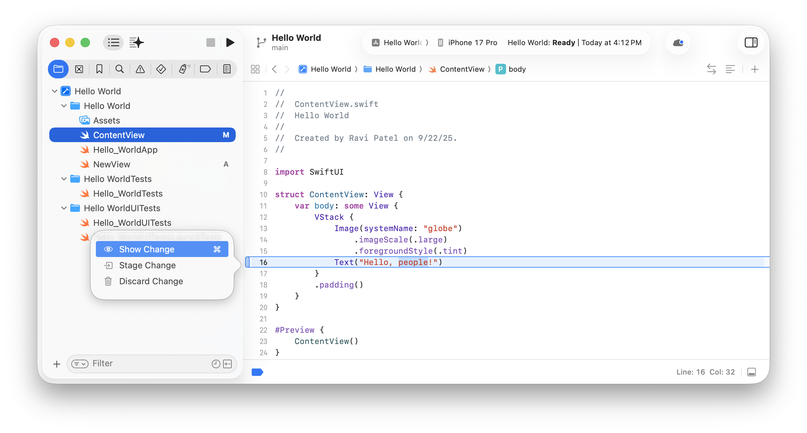
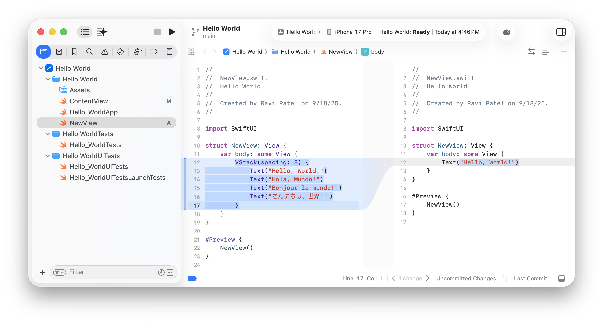
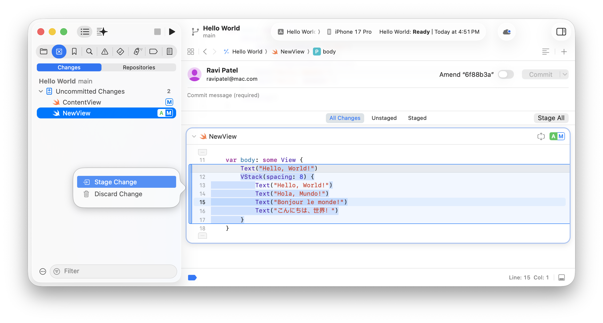
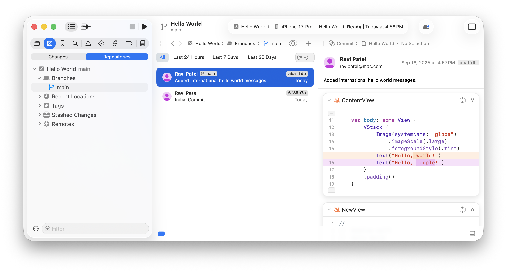

> Navigation: [Technologies](../technologies.md) · [Xcode](../xcode.md) · [Source control management](source-control-management.md)

# Tracking code changes in a source control repository

Article

Create a history of incremental changes to your project using commits and pushing to remote repositories.

## Overview

When you use a source control repository to manage your Xcode project, you can save changes to your repository in incremental states called commits. A _commit_ consists of a snapshot of your project’s state at a particular point in time, a message that describes the set of changes from the previous state, and additional metadata like a unique hash that identifies the commit.

Conceptual diagram that shows one row of four commits. The rightmost commit contains a label that describes some information about the commit, including a commit hash, commit message, and author name.

First you stage the changes to your project files that you want to include in a commit. For a local repository, you then commit the changes, and for a remote repository, you both commit and push the changes remotely. Then you can navigate the history of your commits, compare changes between specific commits, and quickly restore your project to the state of a commit.

### View changes in the Project navigator and source editor

As you make changes to your project files, Xcode tracks those changes and marks them both in the Project navigator and in the source editor.

- The Project navigator annotates files with changes since the last commit, using an _A_ for new files or an _M_ for modified files.
- The source editor displays a change bar in the gutter.

If you hover over the change bar, the source editor highlights both the lines and the text in the lines that you changed. Then use the change bar pop-up menu to show, stage, or discard a change you make.

A screenshot of the project editor showing an annotated modified file and a new file in the Project navigator. The source editor highlights the line of the file that changed and shows a pop-up menu that appears when you click the change bar in the gutter.

### Compare changes in the source editor

To compare changes you make to one file, select that file in the Project navigator and click the Enable Code Review button in the upper-right corner above the source editor (View \> Show Code Review). The source editor switches to a comparison view that highlights the changes between the current file and the most recent commit.

The source editor compares changes inline by default. To view changes in separate views in the editor area, choose Side by Side Comparison from the Adjust Editor Options button next to the Enable Code Review button.

A screenshot of the project editor showing the Project navigator on the left and the comparison view on the right. The view shows a side-by-side comparison highlighting the changes between the current local version on the left and the last commit on the right.

To view changes directly in the source editor, choose Inline Comparison instead.

Then use the controls at the bottom of the comparison view to navigate between the changes to a file and to choose other commits to compare your current changes against.

### Stage the changes you want to commit

Review all changes to your project files before you save them permanently in your source control repository.

Choose Integrate \> Commit, and Xcode opens the Source Control navigator with the Changes tab selected. Use the controls in the detail area on the right to stage the changes you want to include in the commit.

A screenshot of the project editor showing the Source Control navigator with the Changes tab selected on the left and the changes to the selected file highlighted on the right with a Stage All button and commit message text field above.

Scroll the detail area to review changes to all files or select a file in the navigator to jump to changes to a specific file.

To include all the changes in a commit, just click the Stage All button. Otherwise, pick the changes you want to include while reviewing them in the detail area. You can still modify the files you see from this editor, such as deleting changes that you inadvertently added, before a commit.

Using the toolbar controls, you can perform these actions:

- To filter the files, click the All Changes, Unstaged, or Staged tabs.
- To toggle whether to stage all changes, click the Stage All or Unstage All button on the right of the tabs.

Using the controls that appear on a file header, you can take these actions:

- To hide or show a file, click the disclosure triangle on the left of the filename.
- To show just the changes or the entire file, click the Collapse/Expand File button on the right of the filename.
- To stage or unstage all changes to a file, click the button on the far right of the filename and choose Stage Changes or Unstage Changes from the pop-up menu.

For individual changes to files, perform these actions using the change bar pop-up menu:

- To include an unstaged change, choose Stage Change.
- To delete an unstaged change, choose Discard Change.
- To exclude a staged change, choose Unstage Change.

For example, if you want to commit most of the changes, click the Stage All button and then unstage individual files or changes to files using the file controls or change bar pop-up menu.

### Commit and push changes to your repository

When you’re ready to save your work, choose Integrate \> Commit. Click Stage All or choose the changes you want to commit using the controls below. Enter a commit message and choose Commit or Commit and Push from the Commit pop-up menu.

In the dialog that appears, select the branch, select the “Include tags” option if you want to push tags, and click Push. For local repositories, you don’t see the option to push changes because you just commit changes.

When using remote repositories, you can make one or more commits and then a push, separately. For example, separate feature changes into different commits and then push them all together. For each set of staged changes, click Commit instead of choosing Commit and Push. Then click Push, or choose Integrate \> Push, to upload all the pending commits.

### View the history of project commits

Xcode lets you view the entire history of commits to the branches in your source control repository.

1. Open the Source Control navigator and click the Repositories tab.
2. Expand your repository and the Branches folder.
3. Select a branch to display a list of commits in the editor area.
4. Double-click a commit in the list to display the details below or on the right depending on your layout.

A screenshot of the project editor with the main branch selected in the Repositories navigator on the left, a commit selected in the list of commits in the middle, and the selected commit details on the right.

Use the tabs above the list of commits and the Filter field to limit or expand the list. Similar to staging changes, collapse or expand a file using the disclosure triangle next to the filename and view just the changes or the entire file using the Collapse/Expand File button on the right of the filename.

### Restore your project to a previous state

You can quickly restore your code to a previous state in your source control repository by checking out a specific commit. Xcode restores your project files to the state that the commit you choose specifies.

Before you restore a previous commit of the code, make sure you don’t have any uncommitted changes. If you do, you can either discard the changes (Integrate \> Discard All Changes) or save them to apply later by stashing them (Integrate \> Stash All Changes).

1. Open the Source Control navigator.
2. In the Repositories navigator, expand your repository and the Branches folder.
3. Select the branch that contains the commit you want to restore.
4. In the detail view, Control-click the desired commit and choose Switch to “[_commit-hash_]”.
5. In the dialog, click Switch. Xcode restores your project’s state to the earlier commit.

To learn more about restoring changes that you stash, see [Organizing your code changes with source control](organizing-your-code-changes-with-source-control.md).

## See Also

### Essentials

- [Configuring your Xcode project to use source control](configuring-your-xcode-project-to-use-source-control.md) — Sync code changes between team members and development computers by setting up your Xcode project to use Git source control.
