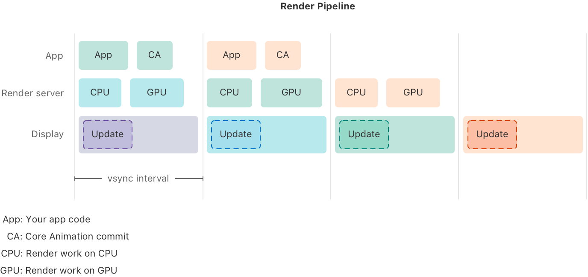
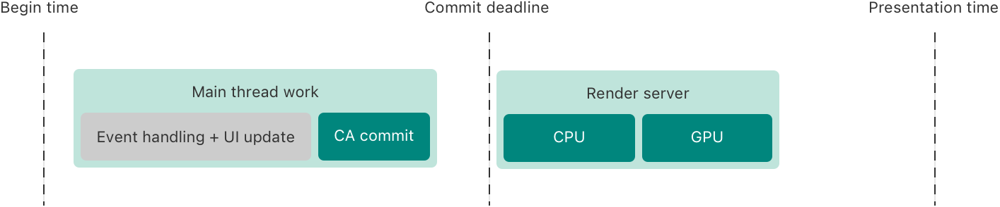
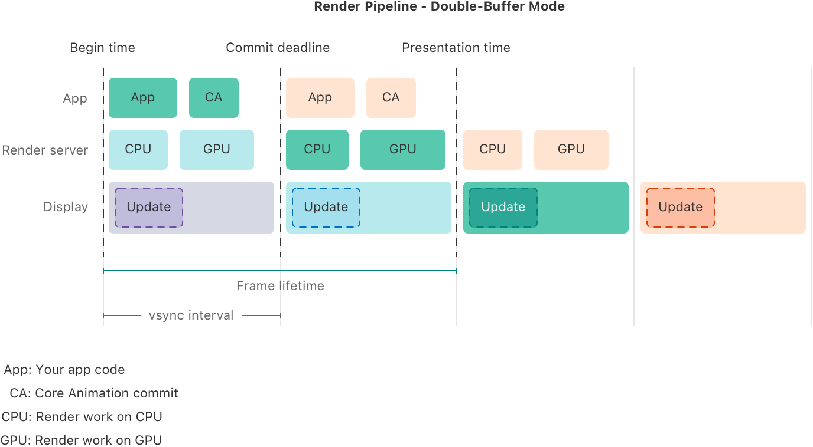
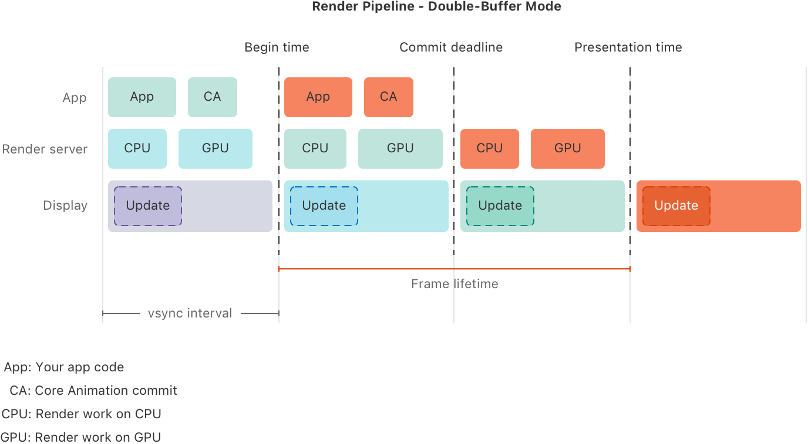
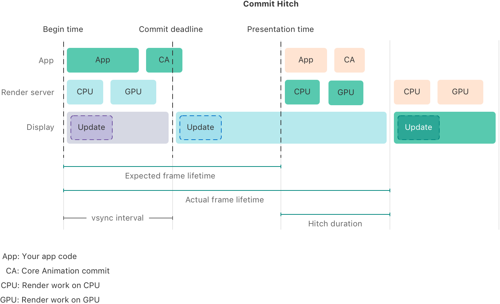
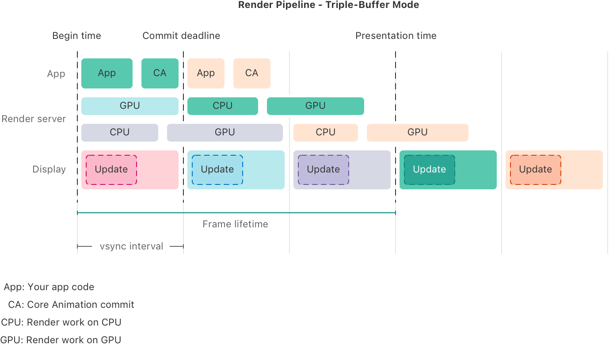
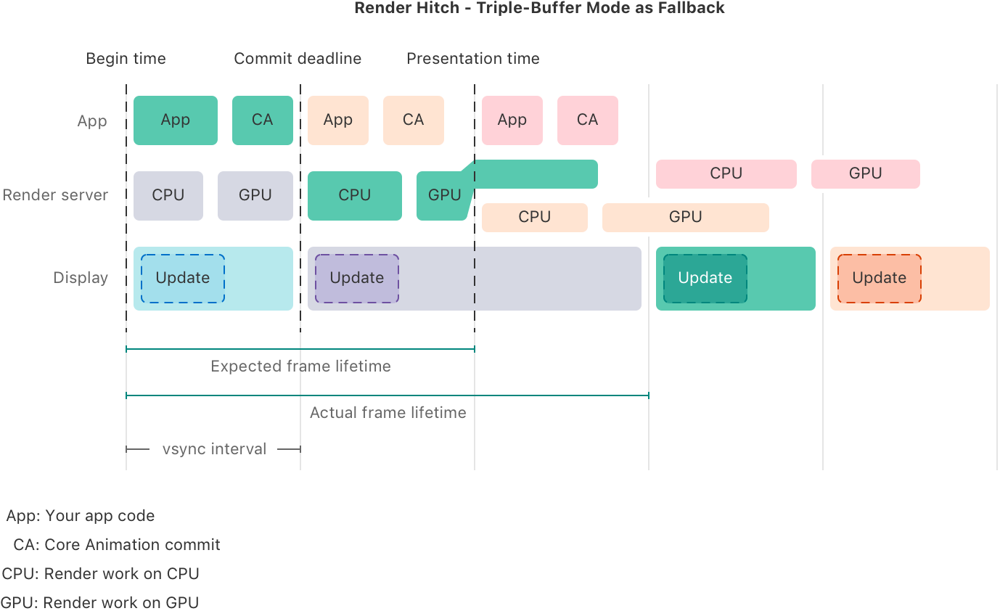
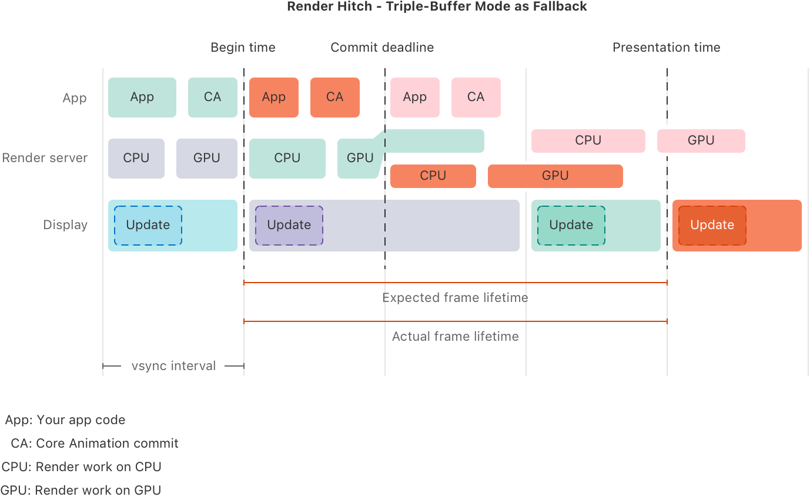

> Navigation: [Technologies](../technologies.md) · [Xcode](../xcode.md) · [Performance and metrics](performance-and-metrics.md)

# Understanding hitches in your app

Article

Determine the cause of interruptions in motion by examining the render loop.

## Overview

Human perception is very sensitive to interruptions in motion. When a fluid motion onscreen gets _stuck_ for a short time, even a couple of milliseconds can be noticeable. This type of interruption is known as a _hitch_. Hitches happen during continuous interactions, like scrolling or dragging, or during animations. Each hitch impacts the user experience, so you want as few hitches as possible in your app. Minimize the hitch rate as much as possible to provide the best experience for your users.

The Hitches metric in Xcode Organizer tracks animation interruptions across all animated interactions in your app — not just scrolling. The Hitches metric measures hitch rate in milliseconds of pause per second (ms/s) for each type of animation in your app. A hitch rate at or below 10 ms/s is good; at or below 25 ms/s is a warning; at or below 50 ms/s is critical; and above 50 ms/s warrants immediate attention. Use the Hitches metric to identify and prioritize hitch-related regressions across every part of your UI.

> [!note] Note
> This article assumes a basic understanding of the event-handling and rendering loop, as well as a basic understanding of hangs and hitches, and how they differ. If you’re not familiar with hangs and hitches, see [Understanding user interface responsiveness](understanding-user-interface-responsiveness.md) for more information about them, as well as the event-handling and rendering loop.

An interruption in motion occurs when the display doesn’t update at the expected pace. The display doesn’t update in time when the next frame isn’t ready for display, so the frame is late.

A delay due to a late frame often causes the system to skip one or more subsequent frames, which is why such behavior is also referred to as a _frame drop_. However, dropping a frame is just one potential response the system uses to recover from a late frame, and not every hitch causes a frame drop.

When a frame is late, it’s usually due to a delay occurring somewhere in the render loop. These delays are the result of a delay in the main thread, most often in the commit phase, known as a _commit hitch_, or a delay in the render phase, known as a _render hitch_.

> [!tip] Tip
> Hitches are related to hangs because an unresponsive main thread can cause both. Whether long-running work on the main thread causes a commit hitch or a hang depends on which user interaction the main thread work coincides with. The hang detection tools detect all cases of extended unresponsive main thread periods, so they can also detect a major source of commit hitches. If you fix all hangs in the area of the app you’re investigating, you’re likely to eliminate many hitches as well. For more information about hangs, see [Understanding hangs in your app](understanding-hangs-in-your-app.md).

> [!note] Note
> The Hitches instrument isn’t available for visionOS, and hitch metrics in Xcode Organizer aren’t available for tvOS or visionOS. For visionOS apps, use the RealityKit Trace template in Instruments to analyze rendering performance and dropped frames. For more information, see [Analyzing the performance of your visionOS app](../visionos/analyzing-the-performance-of-your-visionos-app.md).

### Understand the render loop

Whereas the main thread handles only a single event at a time, the render loop prepares a frame in multiple stages. Although each stage processes only one frame at a time, all stages work together on multiple frames in parallel. Each stage has a tight deadline to hand off its frame to the next stage to ensure it’s ready for the screen refresh.

A timeline illustration titled Render Pipeline that consists of four columns that all have the same width and three rows. The top row is labeled App, the second is labeled Render server, and the third is labeled Display. The width of the first column is labeled vsync interval. A legend below the timeline has four entries that read App: Your app code, CA: Core Animation commit, CPU: Render work on CPU, and GPU: Render work on GPU. The first row  contains two green rectangles labeled App and CA in the first column, two orange rectangles labeled App and CA in the second column, and the third and fourth columns are blank. The second row has two blue rectangles labeled CPU and GPU in the first column, two green rectangles labeled CPU and GPU in the second column, two orange rectangles labeled CPU and GPU in the third column, and the fourth column is blank. The third row has a horizontal rectangle in each column that spans the column’s width. The horizontal rectangle is purple in the first column, blue in the second, green in the third, and orange in the fourth. In each horizontal rectangle, there’s a smaller rectangle with a dashed outline labeled Update. 

A display updating at a 120 Hz refresh rate updates 120 times per second, or every 8.3 ms. That means the app needs to update the UI every 8.3 ms, and render a new frame every 8.3 ms. By default, each stage then has up to 8.3 ms to do its work as well.

Even a few milliseconds of additional delay can cause a stage to miss its deadline. Even though the render server is a separate process, it performs work on behalf of the app, and this work may be too complex to finish in time. To find and understand hitches, you need to look at the work on the main thread _and_ the work on the render server.

### Understand the display refresh interval and associated deadlines

Apple devices update their displays at a regular, but variable, refresh rate. During user interaction, a display updates at the maximum refresh rate the device supports. When there’s nothing new to display, some displays reduce the refresh rate. The point in time when the display updates is called the _vertical sync_ or _vsync_. Whenever a vsync occurs, the new frame needs to be ready so the display driver can start to update the pixels of the display.

So for each frame, the render loop targets a specific vsync in the future to display the new frame, which is called the _presentation time_. It then calculates intermediate deadlines backward from there. The render loop operates in multiple stages with individual deadlines, starting with the UI update in your app’s main thread.

A timeline illustration consisting of two horizontal blocks and three vertical dashed lines labeled Begin time, Commit deadline, and Presentation time. The first horizontal block, labeled Main thread work, is positioned between the Begin time line and the Commit deadline line. It contains two smaller blocks labeled Event handling + UI update, and CA commit. The second horizontal block, labeled Render server, is positioned between the Commit deadline line and the Presentation time line. It contains two smaller blocks labeled CPU and GPU.

Your app’s main thread handles the event and computes a new UI update. The UI framework collects all the changes to the UI and sends the new state over to the render server, which is referred to as the _Core Animation commit_. Unlike hangs in discrete interaction, where only a delay on the order of 100 ms or more on the main thread becomes noticeable, people are much more sensitive to interruptions in fluid motion. Even a few milliseconds of delay can cause the main thread work to miss the commit deadline, resulting in a noticeable hitch.

Immediately after the commit deadline, the render server starts working to transform your app’s UI representation into a bitmap to display onscreen. The render server does this in two steps:

1. On the CPU, it precomputes the work it needs to render.
2. On the GPU, it executes the actual rendering, and renders the new frame into a render buffer.

After the render server finishes rendering, during the next vsync interval, the display driver reads from the prepared render buffer, and uses that information to update the screen.

There are three important times in this process: the presentation time, the commit deadline, and the begin time. These times usually, but not always, align with the vsyncs of the underlying display, meaning that the presentation time is at a given vsync, the commit deadline is a vsync before that, and the begin time is a vsync before the commit deadline.

- **Presentation time** — This is the scheduled time for a given frame to appear onscreen. Missing this time means the frame has to wait for the next vsync before the display driver swaps it onto the screen, causing the frame to appear onscreen late.
- **Commit deadline** — This is the time when the commit needs to finish so the render server has enough time to render the frame for the presentation time. To maximize the time it can spend on a frame, the render server starts rendering immediately after the commit deadline. If the app misses the commit deadline, the render server starts rendering with the next commit deadline, which is usually the next vsync, and the frame is late again.
- **Begin time** — This is the earliest time the app can commit a UI update for a given frame. Committing any earlier interferes with the UI update in the previous frame. Usually, the begin time of a given frame B is the commit deadline of the preceding frame A.

Although the render server starts work immediately after the commit deadline, and the display driver starts updating the display with a vsync, the other work isn’t necessarily in alignment with these times. The render server’s work might finish before the presentation time, in which case, it waits until the next commit deadline to start work on the next frame.

Depending on the platform, the work on the main thread may or may not align with the begin time or the commit deadline. To reduce input delays, the system may process events as soon as they come in, depending on the rendering mode, the input device, and the platform. Alternatively, the system might hold events and only deliver them to the app’s main thread at the begin time to maximize the time the app has to compute the UI update for the next frame before the next commit deadline. Regardless of when work on a frame actually starts, the begin time is the earliest time the system can start work for the frame.

Although the app itself works on only a single frame at a time, the individual stages of the rendering loop can happen in parallel. So while the display is displaying a given frame, and the render server is rendering the next frame, the app can start work on the frame after that.

A timeline illustration titled Render Pipeline — Double-Buffer Mode that consists of four columns and three rows. Three dashed vertical lines, labeled Begin time, Commit deadline, and Presentation time, form the borders of the first and second columns. The top row is labeled App, the second is labeled Render server, and the third is labeled Display. Below the three rows, a horizontal line labeled Frame lifetime spans the first and second columns, extending from the Begin time line to the Presentation time line. The width of the first column is labeled vsync interval. A legend below the timeline has four entries that read App: Your app code, CA: Core Animation commit, CPU: Render work on CPU, and GPU: Render work on GPU. The first row  contains two green rectangles labeled App and CA in the first column, two orange rectangles labeled App and CA in the second column, and the third and fourth columns are blank. The second row has two blue rectangles labeled CPU and GPU in the first column, two green rectangles labeled CPU and GPU in the second column, two orange rectangles labeled CPU and GPU in the third column, and the fourth column is blank. The third row has a horizontal rectangle in each column that spans the column’s width. The horizontal rectangle is purple in the first column, blue in the second, green in the third, and orange in the fourth. In each horizontal rectangle, there’s a smaller rectangle with a dashed outline labeled Update. 

As such, the deadlines are all relative to an individual frame. One frame’s commit deadline is the begin time of the next frame.

A timeline illustration titled Render Pipeline — Double-Buffer Mode that consists of four columns and three rows. Three dashed vertical lines, labeled Begin time, Commit deadline, and Presentation time, form the borders of the second and third columns. The top row is labeled App, the second is labeled Render server, and the third is labeled Display. Below the three rows, a horizontal line labeled Frame lifetime spans the second and third columns, extending from the Begin time line to the Presentation time line. The width of the first column is labeled vsync interval. A legend below the timeline has four entries that read App: Your app code, CA: Core Animation commit, CPU: Render work on CPU, and GPU: Render work on GPU. The first row contains two green rectangles labeled App and CA in the first column, two orange rectangles labeled App and CA in the second column, and the third and fourth columns are blank. The second row has two blue rectangles labeled CPU and GPU in the first column, two green rectangles labeled CPU and GPU in the second column, two orange rectangles labeled CPU and GPU in the third column, and the fourth column is blank. The third row has a horizontal rectangle in each column that spans the column’s width. The horizontal rectangle is purple in the first column, blue in the second, green in the third, and orange in the fourth. In each horizontal rectangle, there’s a smaller rectangle with a dashed outline labeled Update.

Although the begin time and the commit deadline often align with a vsync, this isn’t always the case. For example, for variable refresh rate displays, the refresh rate might change during the runtime of your app, causing these times to be out of sync with the display updates. Devices can also switch to a low-latency mode, where the time the render server spends on a frame is less than one vsync interval, so the app attempts to process events as quickly as possible to minimize delays between a user input and a screen update, such as in drawing apps.

> [!note] Note
> In most cases, the begin time and the commit deadline align with a vsync, so the illustrations in this article represent that scenario. However, if they differ, or if you plan to make calculations based on these times, use the begin time, commit deadline, and presentation time of the relevant API instead of vsyncs.

### Understand frame lifetime and hitch duration

Most Apple devices operate in a double-buffer mode, meaning that the render server and the display driver share two buffers. The display driver uses one buffer to read pixel values for the screen, and the render server uses the other buffer to render the next frame for display. When the vsync occurs, the render server and the display driver switch buffers. So the display driver uses the newly rendered buffer to update the screen, and the render server renders a new frame into the buffer that the display driver used for the previous frame.

Because it can take up to one vsync interval for the display driver to update all pixels on the screen, the time between triggering a display update and updating the last pixel onscreen is three vsync intervals — one on the main thread, one on the render server, and one on the display driver. However, the app’s main thread and the render server each have only a single vsync interval to finish their work. An individual vsync interval can be as short as 16.7 ms for a 60 Hz refresh rate (1s/60), or 8.3 ms for a 120 Hz refresh rate (1s/120). This means that in double-buffer mode, the delay between the app beginning work on a screen update and the screen actually updating is 50 ms at 60 Hz, or 25 ms at 120 Hz, but each individual frame only stays onscreen for one-third of that time.

The _expected frame lifetime_ is the time between the begin time and the presentation time, which is the time the app and the render server have to perform their work on the frame. The _actual frame lifetime_ starts at the begin time and ends with the vsync that swaps the frame onto the display. Neither of these frame lifetimes includes the time the display driver takes to update the screen. Because of this, although the expected delay between the app beginning work and the last pixel onscreen updating is three vsync intervals, the expected frame lifetime only measures the first two intervals.

When everything operates correctly, the expected frame lifetime and the actual frame lifetime are the same. When the actual frame lifetime is longer than the expected frame lifetime, the new frame doesn’t appear onscreen in time, so the previous frame needs to stay onscreen longer than expected, and a hitch occurs. The difference between the actual frame lifetime and the expected frame lifetime is called the _hitch duration_, which is the amount of time the frame is late. So in the illustration below, the hitch duration is one vsync interval, or 16.7 ms for a 60 Hz refresh rate.

A timeline illustration titled Commit Hitch that consists of four columns and three rows. Three dashed vertical lines, labeled Begin time, Commit deadline, and Presentation time, form the borders of the first and second columns. The top row is labeled App, the second is labeled Render server, and the third is labeled Display. Below the three rows, a horizontal line labeled Expected frame lifetime spans the first and second columns, extending from the Begin time line to the Presentation time line. A line below that, labeled Actual Frame lifetime, spans the first and third columns. The width of the first column is labeled vsync interval, and the width of the third column is labeled Hitch duration. A legend below the timeline has four entries that read App: Your app code, CA: Core Animation commit, CPU: Render work on CPU, and GPU: Render work on GPU. The first row contains two green rectangles labeled App and CA in the first column, and the CA rectangle crosses the Commit deadline line slightly into the second column. The first row in the second column is blank otherwise. The first row in the third column contains two orange rectangles labeled App and CA, and the first row in the fourth column is blank. The second row has two blue rectangles labeled CPU and GPU in the first column, the second column is blank, there are two green rectangles labeled CPU and GPU in the third column, and two orange rectangles labeled CPU and GPU in the fourth column. The third row has a purple horizontal rectangle spanning the first column, a blue horizontal rectangle spanning the second and third columns, and a green horizontal rectangle spanning the fourth column. In each horizontal rectangle, there’s a smaller rectangle with a dashed outline labeled Update.

Depending on various circumstances, rendering can also happen in triple-buffer mode. Triple-buffer mode works like double-buffer mode except that at any point in time, the render server may be working on the next two frames in parallel, and may use two separate buffers to do so, while the display driver displays a third frame onscreen.

A timeline illustration titled Render Pipeline — Triple-Buffer Mode that consists of five columns and three rows. Three dashed vertical lines, labeled Begin time, Commit deadline, and Presentation time, form the left and right borders of the first column, and the right border of the third column. The top row is labeled App, the second row, labeled Render server, consists of two subrows, and the third row is labeled Display. Below the three rows, a horizontal line labeled Frame lifetime spans the first and third columns, extending from the Begin time line to the Presentation time line. The width of the first column is labeled vsync interval. A legend below the timeline has four entries that read App: Your app code, CA: Core Animation commit, CPU: Render work on CPU, and GPU: Render work on GPU. The first row contains two green rectangles labeled App and CA in the first column, two orange rectangles labeled App and CA in the second column, and the third, fourth, and fifth columns are blank. The first subrow has one blue rectangle labeled GPU in the first column, one green rectangle labeled CPU in the second column, followed by a green rectangle labeled GPU that crosses into the third column, and the fourth and fifth columns are blank. The second subrow has a gray rectangle labeled CPU in the first column, followed by a gray rectangle labeled GPU that crosses into the second column, an orange rectangle labeled CPU in the third column, followed by an orange rectangle labeled GPU that crosses into the fourth column, and the fifth column is blank. The third row has a horizontal rectangle in each column that spans the column’s width. The horizontal rectangle is red in the first column, blue in the second, purple in the third, green in the fourth, and orange in the fifth. In each horizontal rectangle, there’s a smaller rectangle with a dashed outline labeled Update.

In triple-buffer mode, the app still needs to finish all work within a single vsync interval, but the render server has two vsync intervals to finish its work, and can work on two frames in parallel. In this mode, the delay between the begin time and the presentation time of a frame — the expected frame lifetime — is three vsync intervals, or 25 ms at 120 Hz, and 50 ms at 60 Hz. Accordingly, the delay between the app beginning work on a frame and the last pixel onscreen updating is four vsync intervals, or 33.3 ms at 120 Hz, and 66.7 ms at 60 Hz. Although the delay is longer than in double-buffer mode, no frame arrives later than expected. The display updates at its expected refresh rate and displays a new frame at every vsync, enabling fluid motion onscreen.

### Understand commit hitches and render hitches

The work to update the screen consists of two parts — the work that the app’s process performs and the work that the render server performs. And because each chunk of work has its own deadline, you can differentiate different types of hitches. In the Commit Hitch illustration above, the app’s process doesn’t meet the commit deadline, which causes the render server to start one vsync later, resulting in a hitch. Because the app process is responsible for this hitch — the Core Animation commit doesn’t finish in time for the vsync — this is called a _commit hitch_.

Although the time that the display driver needs to update the pixels onscreen from a render buffer is the same no matter how complex the UI is, this isn’t the case for the render server. A complex render request can cause the render server to take longer than the available time, resulting in a missed deadline. When the work in the app process finishes on time, but the work on the render server doesn’t, it’s called a _render hitch_.

One of the reasons the system may switch to triple buffering is to recover from a render hitch. In the illustration below, the render server doesn’t render the green frame within one vsync interval, so the rendering isn’t complete by presentation time. In response, the render server uses a third frame buffer and switches to triple-buffer mode to start rendering the next frame while the GPU finishes work on the previous frame. This avoids dropping the green frame, but it’s still onscreen one vsync later than scheduled, which might cause a perceptible interruption in motion, resulting in a hitch.

A timeline illustration titled Render Hitch — Triple-Buffer Mode as Fallback that consists of five columns and three rows. Three dashed vertical lines, labeled Begin time, Commit deadline, and Presentation time, form the borders of the first and second columns. The top row is labeled App, the second row, labeled Render server, splits into two subrows at the Presentation time line, and the third row is labeled Display. Below the three rows, a horizontal line labeled Expected frame lifetime spans the first and second columns, extending from the Begin time line to the Presentation time line. A line below that, labeled Actual frame lifetime, spans the first and third columns. The width of the first column is labeled vsync interval. A legend below the timeline has four entries that read App: Your app code, CA: Core Animation commit, CPU: Render work on CPU, and GPU: Render work on GPU. The first row contains two green rectangles labeled App and CA in the first column, two orange rectangles labeled App and CA in the second column, two red rectangles labeled App and CA in the third column, and the fourth and fifth columns are blank. The second row has two gray rectangles labeled CPU and GPU in the first column, one green rectangle labeled CPU in the second column, followed by a green rectangle labeled GPU that crosses above and into the first subrow of the third column, and a red rectangle labeled CPU in the fourth column, followed by a red rectangle labeled GPU that crosses into the fifth column. The second subrow has an orange rectangle in the third column, followed by an orange rectangle that crosses into the fourth column, and the fifth column is blank. The third row has a horizontal blue rectangle in the first column, a gray horizontal rectangle that spans the second and third columns, a green horizontal rectangle in the fourth column, and an orange horizontal rectangle in the fifth column. In each horizontal rectangle, there’s a smaller rectangle with a dashed outline labeled Update. 

In the following illustration, the frame’s actual frame lifetime is also three vsyncs because the render server is operating in triple-buffer mode. This is expected, and it isn’t a hitch because it manages to update the screen on each vsync going forward.

A timeline illustration titled Render Pipeline — Triple-Buffer Mode as Fallback that consists of five columns and three rows. Three dashed vertical lines, labeled Begin time, Commit deadline, and Presentation time, form the right borders of the first, second, and fourth columns. The top row is labeled App, the second row, labeled Render server, splits into two subrows at the Commit deadline line, and the third row is labeled Display. Below the three rows, a horizontal line labeled Expected frame lifetime spans the second, third, and fourth columns, extending from the Begin time line to the Presentation time line. A line below that, labeled Actual frame lifetime, also spans the second, third, and fourth columns. The width of the first column is labeled vsync interval. A legend below the timeline has four entries that read App: Your app code, CA: Core Animation commit, CPU: Render work on CPU, and GPU: Render work on GPU. The first row contains two green rectangles labeled App and CA in the first column, two orange rectangles labeled App and CA in the second column, two red rectangles labeled App and CA in the third column, and the fourth  and fifth columns are blank. The second row has two gray rectangles labeled CPU and GPU in the first column, one green rectangle labeled CPU in the second column, followed by a green rectangle labeled GPU that crosses above and over into the first subrow of the third column, and a red rectangle labeled CPU in the fourth column, followed by a red rectangle that crosses into the fifth column. The second subrow has one orange rectangle labeled CPU in the third column, followed by an orange rectangle that crosses into the fourth column, and the fourth column is blank. The third row has a horizontal blue rectangle in the first column, a gray horizontal rectangle that spans the second and third columns, a green horizontal rectangle in the third column, and an orange horizontal rectangle in the fourth column. In each horizontal rectangle, there’s a smaller rectangle with a dashed outline labeled Update.

The system can also use the triple-buffer mode during regular operation for various reasons, such as to save energy by running the GPU in a low-power mode and giving it more time to finish, or when a specific use case needs more time to render on the CPU and GPU than is available in a single vsync interval.

The preparation step of the rendering occurs on the CPU, and the actual rendering occurs on the GPU. Although the GPU can perform the work in parallel, the CPU can’t. Therefore, even in triple-buffer mode, the render server’s CPU work still needs to complete within a single vsync interval to avoid starting on the next frame’s CPU work late, and to give the GPU sufficient time to finish its work before the presentation time.

Even though rendering occurs inside the render server and not in the app itself, a render hitch is usually due to the app, such as when the scheduled UI update is too complex to render in time. You need to pay attention to both commit hitches and render hitches. The type of hitch provides a hint to the underlying reason, as well as the part of your app you need to optimize to avoid the hitch in the future.

> [!note] Note
> For more information, see [Explore UI animation hitches and the render loop](https://developer.apple.com/videos/play/tech-talks/10855/).

## See Also

### Responsiveness

- [Analyzing responsiveness issues in your shipping app](analyzing-responsiveness-issues-in-your-shipping-app.md) — Identify responsiveness issues your users encounter, and use the hang and hitch data in Xcode Organizer to determine which issues are most important to fix.
- [Improving app responsiveness](improving-app-responsiveness.md) — Create a user experience that feels responsive by removing hangs and hitches from your app.
- [Understanding user interface responsiveness](understanding-user-interface-responsiveness.md) — Make your app more responsive by examining the event-handling and rendering loop.
- [Understanding and improving SwiftUI performance](understanding-and-improving-swiftui-performance.md) — Identify and address long-running view updates, and reduce the frequency of updates.
- [Understanding hangs in your app](understanding-hangs-in-your-app.md) — Determine the cause for delays in user interactions by examining the main thread and the main run loop.
- [Diagnosing performance issues early](diagnosing-performance-issues-early.md) — Diagnose potential performance issues in your app during development and testing with the Thread Performance Checker tool in Xcode.
- [Reducing your app’s launch time](reducing-your-app-s-launch-time.md) — Create a more responsive experience with your app by minimizing time spent in startup.
- [Reducing terminations in your app](reduce-terminations-in-your-app.md) — Minimize how frequently the system stops your app by addressing common termination reasons.
