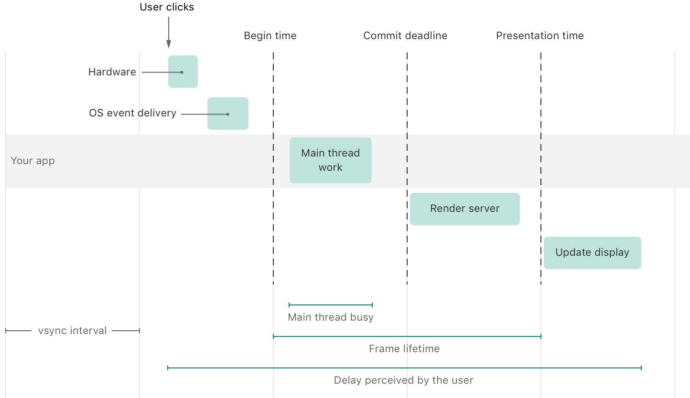

> Navigation: [Technologies](../technologies.md) · [Xcode](../xcode.md) · [Performance and metrics](performance-and-metrics.md)

# Understanding user interface responsiveness

Article

Make your app more responsive by examining the event-handling and rendering loop.

## Overview

Human perception is adept at identifying motion and linking cause to effect through sequential actions. This is important for graphical user interfaces because they rely on making the user believe a certain interaction with a device causes a specific effect, and that the objects onscreen behave sufficiently realistically. For example, a button needs to highlight when a person taps or clicks it, and when someone drags an object across the screen, it needs to follow the mouse or finger.

There are two ways this illusion can break down:

- The time between user input and the screen update is too long, so the app’s UI doesn’t seem like it’s responding instantaneously anymore. A noticeable delay between user input and the corresponding screen update is called a _hang_. For more information, see [Understanding hangs in your app](understanding-hangs-in-your-app.md).
- The motion onscreen isn’t fluid like it would be in the real world. An example is when the screen seems to get stuck and then jumps ahead during scrolling or during an animation. This is called a _hitch_. For more information, see [Understanding hitches in your app](understanding-hitches-in-your-app.md).

This article covers different types of user interactions and how the event-handling and rendering loop processes events to handle them. This foundational knowledge helps you understand what causes hangs and hitches, how the two are similar, and what differentiates them.

### Understand different types of interactions

A _discrete_ user interaction occurs when the user performs a single well-contained interaction and the screen then updates in response. An example is when somebody presses a key on the keyboard and the corresponding letter then appears onscreen. Another example is pressing a button on a touchscreen. However, in that case, there are two discrete interactions. First, the finger presses down on the button and, in response, the button changes color or otherwise indicates it’s in a pressed state. Then, the finger lifts and, in response, the button changes back to its previous visual state to show it’s no longer pressed.

A _continuous_ user interaction occurs when the user performs a longer series of movements or gestures, and the screen updates continuously throughout the interaction. Examples of this include scrolling through a list, dragging an icon, and using a two-finger pinch gesture to zoom in or out on a map.

In general, humans are much more sensitive to delays in continuous interactions than delays in discrete interactions. A small latency that isn’t noticeable for a discrete user interaction may become visible during a continuous user interaction, such as when a dragged icon doesn’t quite keep up with the user’s finger.

Humans are even more sensitive to nonfluid motion. In the example of dragging an icon, a delay of 50 milliseconds (ms) between the finger changing direction and the icon changing direction may be noticeable when looking for it. However, it isn’t obvious when the delay stays constant and the icon moves smoothly.

If the latency between a change in user interaction and the corresponding screen update is smaller, but inconsistent, the icon seems to sometimes get stuck for a moment and then jumps ahead. This kind of jarring movement is far more noticeable than a slightly longer delay. For this reason, Apple devices often optimize for smooth motion while accepting a slightly longer interaction latency, if necessary. There are times when both an extremely low interaction latency and fluid motion onscreen are crucial to making an interaction feel real. One example of this is drawing onscreen with Apple Pencil.

### Understand the event-handling and rendering pipeline

For a single user-input event, there are several steps in the event’s journey through the system.

A timeline illustration with a horizontal bar labeled Your app that spans five columns. The first column has a label called vsync interval spanning it at the bottom. At the top left above the second column, a label called User clicks has an arrow pointing down to a square labeled Hardware. Below that and to the right above the horizontal bar is a rectangle labeled OS event delivery. Both rectangles are  in the second column. A dashed line separating the second and third column is labeled Begin time. In the third column, a rectangle labeled Main thread work sits on the horizontal bar. A horizontal line labeled Main thread busy appears at the bottom of the column aligned with the rectangle. A dashed line separating the third and fourth column is labeled Commit deadline. The fourth column contains a rectangle labeled Render server below the horizontal bar. The rectangle is left-aligned to the dashed line labeled Commit deadline, but not aligned with the right side of the column. A dashed line that separates the fourth and fifth column is labeled Presentation time. A horizontal line at the bottom labeled Frame lifetime spans the third and fourth columns starting at the dashed line labeled Begin time and ending at the dashed line labeled Presentation time. The fifth column contains a rectangle labeled Update display below the horizontal bar that is left-aligned in its column. A horizontal line at the bottom labeled Delay perceived by the user spans from the User clicks arrow on the left to the right side of the Update display rectangle.

As the diagram above illustrates, a user interaction propagates through the system as follows:

- **User clicks** — The user interacts with an input device by performing a click, tap, or press.
- **Hardware** — The hardware, such as a mouse, touchscreen, or keyboard, recognizes the input, and forwards it to the operating system (OS).
- **OS event delivery** — The operating system determines which process is responsible for handling the user input event, which is usually the currently active app or the app that owns the window where the event occurs.
- **Main thread work** — The system puts the event in an app-specific queue, and it’s the responsibility of the main thread of the app to pick up the events and process them. The thread is called the _main thread_ due to this responsibility, and because it’s also the only thread in your app that can modify the view hierarchy, which makes up your app’s UI. If a UI update is necessary, the app updates the view hierarchy, still on the main thread. The app also updates the layer tree (containment, position) and provides content for the individual layers to display. However, compositing the layers into a single bitmap image to display onscreen doesn’t happen inside the app.
- **Render server** — The render server is a separate process that handles all rendering of the various processes that need to draw to the screen. It composites the layer trees from the apps and the system processes into a final image.
- **Update display** — When the final image representing the new frame is ready, the display driver uses it to update the display. The display driver checks at regular intervals to determine whether the screen needs updating. The time when a display update can start is known as the _vertical sync_, or _vsync_, and the time between two potential display updates is the _vsync interval_, or the _display refresh interval_.

### Differentiate hangs and hitches

As mentioned above, a hang is a noticeable delay in a discrete user interaction, and it’s almost always the result of long-running work on the main thread. Long-running work on the main thread can also cause hitches, but for hitches, the threshold is lower. Discrete interaction delays only start becoming noticeable as hangs when the main thread is unresponsive for about 50 ms to 100 ms or longer. However, a delay as small as the length of a single refresh interval — generally between 8 ms and 16 ms, depending on the refresh rate of the display — can cause a hitch. Delays in the render server can also cause a hitch, but usually aren’t long enough to cause a hang.

For a hang, only the delay between a user interaction and the corresponding screen update is relevant. For more information about hangs, see [Understanding hangs in your app](understanding-hangs-in-your-app.md). To avoid a hitch, which describes a failure in fluid motion, it’s only relevant to be able to update the screen with each screen refresh. The delay between user input and screen update isn’t relevant for a hitch. For more information about hitches, see [Understanding hitches in your app](understanding-hitches-in-your-app.md).

Because of the much lower time thresholds for hitches, as well as the fact that an unresponsive main thread can also cause hitches, when the system detects a potential hang, the same system state might also cause a hitch.

### Understand when the system reports hitches and hangs

Because the system detects hitches by measuring the time between the start of a screen update event and the UI updating, it can only detect hitches when user interaction is happening or another trigger for screen updates exists. When no such trigger exists, the display doesn’t need to update, so the frame can’t be late.

Although a hang is also only noticeable by the user when they interact with their device, the system can detect the conditions leading to a hang by examining the behavior of the main run loop. It measures extended periods of unresponsiveness of the main run loop, regardless of whether the user happens to be interacting with the app at the time. In that sense, the system reports _potential hangs_, conditions that would cause a hang if the user were to interact with the device during that time. For hitches, the system only reports actual delays in screen updates. It can’t detect device states that would potentially lead to a hitch.

### Fix hangs first

Prioritize investigating and addressing hangs first because they’re easier to understand and usually easier to fix.
And by fixing the hangs, you’re likely to fix major sources of hitches as well.

When analyzing the hangs, do the following:

- Separate UI update work from non-UI tasks, such as loading updated data, and ensure the non-UI work runs on a background queue.
- Look for hangs where the main thread is doing too much work.
  Investigate whether you can do less work, like reloading only the data for the currently visible objects instead of every object in the list even if it isn’t onscreen.

After fixing any hangs, you can look at the hitches in your app, which requires understanding the work of the render server on the main thread, in addition to the work your app is doing there.

To learn about the various tools to detect hangs and hitches, and best practices to avoid them, see [Improving app responsiveness](improving-app-responsiveness.md).

## See Also

### Responsiveness

- [Analyzing responsiveness issues in your shipping app](analyzing-responsiveness-issues-in-your-shipping-app.md) — Identify responsiveness issues your users encounter, and use the hang and hitch data in Xcode Organizer to determine which issues are most important to fix.
- [Improving app responsiveness](improving-app-responsiveness.md) — Create a user experience that feels responsive by removing hangs and hitches from your app.
- [Understanding and improving SwiftUI performance](understanding-and-improving-swiftui-performance.md) — Identify and address long-running view updates, and reduce the frequency of updates.
- [Understanding hangs in your app](understanding-hangs-in-your-app.md) — Determine the cause for delays in user interactions by examining the main thread and the main run loop.
- [Understanding hitches in your app](understanding-hitches-in-your-app.md) — Determine the cause of interruptions in motion by examining the render loop.
- [Diagnosing performance issues early](diagnosing-performance-issues-early.md) — Diagnose potential performance issues in your app during development and testing with the Thread Performance Checker tool in Xcode.
- [Reducing your app’s launch time](reducing-your-app-s-launch-time.md) — Create a more responsive experience with your app by minimizing time spent in startup.
- [Reducing terminations in your app](reduce-terminations-in-your-app.md) — Minimize how frequently the system stops your app by addressing common termination reasons.
