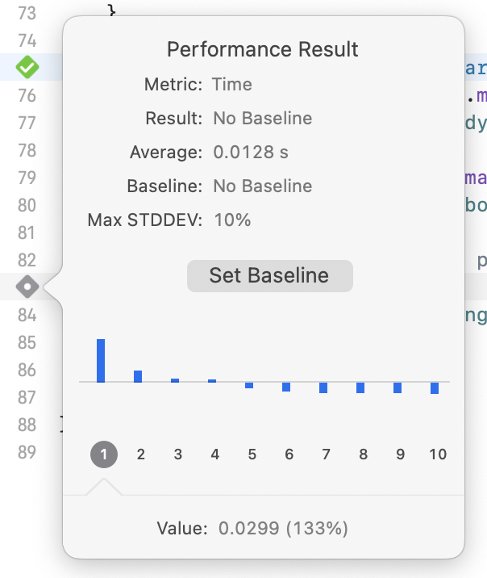

> Navigation: [Technologies](../technologies.md) · [Xcode](../xcode.md) · [Testing](testing.md)

# Writing and running performance tests

Article

Repeatably gather metrics on the performance of your code.

## Overview

People perceive responsiveness and efficiency as positive contributions to an app’s experience. Use performance tests to record metrics on the performance critical parts of your code, and discover when the performance regresses below an acceptable baseline.

### Create a test target

Performance tests use the same [XCTest](../xctest.md) framework to validate code behavior. Create a test target in your Xcode project that you can add behavior and performance tests to. To learn how to add a new target to your project, see [Configuring a new target in your project](configuring-a-new-target-in-your-project.md).

### Add a test case class and performance test methods

You organize performance tests into test case classes, which are subclasses of [XCTestCase](../xctest/xctestcase.md). For information on creating test case classes and test methods, see [Defining Test Cases and Test Methods](../xctest/defining-test-cases-and-test-methods.md).

A performance test method is a method on a test case class with a name that starts with `test`, no arguments, and no return value. The performance test calls one of the following methods to instruct XCTest to record metrics on your code’s performance:

- **[measure(_:)](<../xctest/xctestcase/measure(__).md>)** — Records the default performance metrics for the duration of execution of the block argument, using the default measure options.
- **[measureMetrics(_:automaticallyStartMeasuring:for:)](<../xctest/xctestcase/measuremetrics(__automaticallystartmeasuring_for_).md>)** — Records the specified performance metrics, either for the duration of execution of the block argument, or, if you pass `false` for the `automaticallyStartMeasuring` parameter, between calls to [startMeasuring()](<../xctest/xctestcase/startmeasuring().md>) and [stopMeasuring()](<../xctest/xctestcase/stopmeasuring().md>) within the block argument.
- **[measure(metrics:block:)](<../xctest/xctestcase/measure(metrics_block_).md>)** — Records the specified metrics for the duration of execution of the block argument, using the default measure options.
- **[measure(metrics:options:block:)](<../xctest/xctestcase/measure(metrics_options_block_).md>)** — Records the specified metrics, either for the duration of execution of the block argument or between calls to [startMeasuring()](<../xctest/xctestcase/startmeasuring().md>) and [stopMeasuring()](<../xctest/xctestcase/stopmeasuring().md>) within the block argument, depending on the specified measure options.
- **[measure(options:block:)](<../xctest/xctestcase/measure(options_block_).md>)** — Records the default metrics, either for the duration of execution of the block argument or between calls to [startMeasuring()](<../xctest/xctestcase/startmeasuring().md>) and [stopMeasuring()](<../xctest/xctestcase/stopmeasuring().md>) within the block argument, depending on the specified measure options.

### Determine the performance metrics to record

The default behavior for [measure(_:)](<../xctest/xctestcase/measure(__).md>) and [measure(options:block:)](<../xctest/xctestcase/measure(options_block_).md>) is to record the time spent in the measured code, in seconds. Change the default set of metrics collected by performance test methods in a test case class by overriding [defaultPerformanceMetrics](../xctest/xctestcase/defaultperformancemetrics.md) and [defaultMetrics](../xctest/xctestcase/defaultmetrics.md). Use a different measurement function from the list above to record different metrics in a specific test.

For information on the available metrics and on implementing your own metrics, see [XCTMetric](../xctest/xctmetric.md).

### Configure your scheme and test plan for accurate performance measurements

Xcode uses test plans you create in your Xcode project to determine which tests to run for a scheme, and how to configure the tests. To ensure that you’re gathering real-world behavior metrics for your app, configure the performance test plan so it replicates the conditions under which the code runs on device. Configure your scheme to build for testing using the Release build configuration, and turn off the “Debug executable” setting.

Configure your test plan to disable code coverage and the runtime sanitization options. For more information on configuring test plans, see [Improving code assessment by organizing tests into test plans](organizing-tests-to-improve-feedback.md).

### Run your performance test method

Run your performance tests in the same way that you run tests to verify code behavior, as described in [Running tests and interpreting results](running-tests-and-interpreting-results.md). In addition to the test outcome status icon in the source editor gutter next to the test method definition, Xcode shows an icon in the editor gutter next to any call to the performance measurement functions listed above. This icon is in one of the following states, depending on the outcome of the performance measurement:

| Performance measurement status icon | Description |
|---|---|
|  | A gray icon with a checkmark indicates that the recorded metrics were compared with the baseline value. |
|  | A gray icon with a dot indicates that no baseline value was recorded for XCTest to compare the recorded metrics against. |

Click the performance measurement outcome icon to view a graph of the most recent values for the metrics recorded in the test, along with the average (mean) value for each metric recorded, as shown in the figure below.

A screenshot of the performance report overlay in Xcode. A graph shows the most recent values for the metrics gathered, and the average value, baseline value, and accepted maximum standard deviation are reported.

### Set a baseline and tolerance

Define the threshold value for the recorded metrics in a performance test by setting a baseline value and maximum standard deviation. The test fails if the recorded metric is worse than the baseline value by more than the maximum standard deviation.

To set the baseline value for a performance test’s metric, follow these steps:

1. In Xcode, click the icon next to the performance measurement function call in the test to open the performance report overlay.
2. Click Set Baseline.

You can subsequently change the baseline value by doing the following:

1. In Xcode, click the icon next to the performance measurement function call in the test to open the performance report overlay.
2. Click Edit.
3. Enter a new baseline value, or click Accept to use the current average recorded value as the new baseline.
4. Enter a value in the Max STDDEV field to define the maximum standard deviation of the recorded metric from the baseline.
5. Click Save.

### Diagnose a failing performance test

If a test fails, you can find out more details about why the test failed by Control-clicking the icon in the editor gutter next to the failing test, and choosing “Profile [the test’s name]” to open the test in Instruments. Alternatively, navigate to the failing test in the Xcode test navigator, Control-click it, and choose “Profile [the test’s name]”.

For information on how performance tests fit into an overall life cycle of improving your app’s performance, see [Improving your app’s performance](improving-your-app-s-performance.md).
