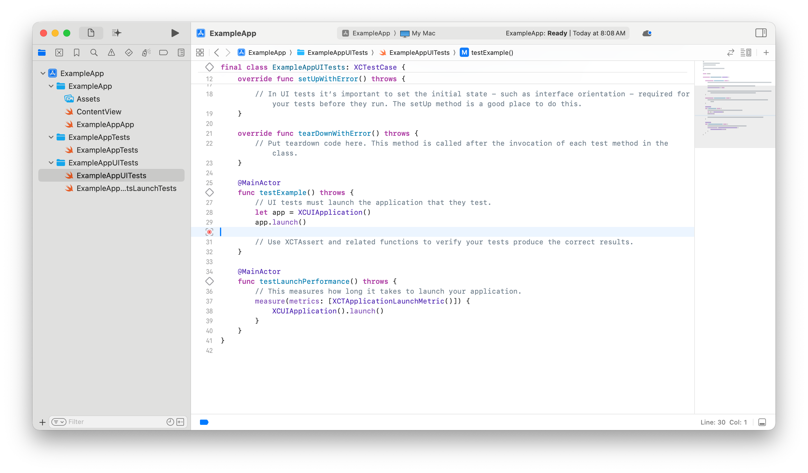

> Navigation: [Technologies](../technologies.md) · [XCUIAutomation](../xcuiautomation.md)

# Recording UI automation for testing

Article

Capture and replay interaction sequences to verify your app’s behavior.

## Overview

When you write UI tests with XCUIAutomation, you use [XCUIElementQuery](xcuielementquery.md) to find the elements in your app that your test interacts with. You can write your own element queries, but doing so can be difficult if you aren’t familiar with the UI framework’s element hierarchy. Use UI recording to replicate your app interactions so that Xcode constructs the element queries for you.

### Create a test class and test method

In the UI automation test target for your app, create a class that subclasses [XCTestCase](../xctest/xctestcase.md). Then add a test method with no parameters, and a name that begins with the word `test`. For more information on test methods, see [Defining Test Cases and Test Methods](../xctest/defining-test-cases-and-test-methods.md).

### Record your interaction with your app

Click in the test method body at the line where you want to record your test’s interactions with your app, and click the record button (red dot) at the edge of the editor.

Xcode asks if you want to start recording a UI test. Click Yes.

If your app isn’t running already, Xcode builds it and launches it. Then, as you interact with elements in your app, Xcode adds queries to the test that locate those elements, and actions that replicate your interactions with the elements. When you finish interacting with the app, stop recording by clicking the stop button at the edge of the editor.

> [!note] Note
> The first time you record a UI test, Xcode prompts you to grant it access to control the computer. In this alert, click Open Settings. Next, in the Accessibility privacy settings, toggle the Xcode Helper switch to the on position.

You can also record interactions with your app’s settings UI and any alert panels it creates. In these situations, you don’t need to launch your app in the test.

### Select appropriate element queries

When you interact with elements in your app’s UI while recording UI automation, Xcode adds element queries to the test that locate the elements you interact with. Multiple element queries can identify the same element; for example, you can identify a button by its title, or by its index in its parent view’s collection of buttons. For each element query that Xcode adds to your test, it provides a collection of alternative queries that locate the same element.

To choose from multiple queries representing the same UI element, click the disclosure triangle next to the element query. Choose the query that best represents the meaning of the element in your app. For example, if you’re likely to move a given button when redesigning your app’s UI, but the name of the button never changes, choose a query that locates it by name instead of its index in its parent element.

To commit your choice of element query, double-click the entry in the disclosure list.

### Verify the state of your app

In your test method, after the interactions that Xcode recorded, add assertions to verify that your app’s UI is in the expected state following the interactions. Use element queries to find UI elements, and assertion macros from [XCTest](../xctest.md) to assert that the elements have the expected properties.

> [!note] Note
> A test method that doesn’t contain any assertions passes if it runs to completion without throwing any errors. Use this to test that recorded interactions in your app are still possible in updated versions, and that the app doesn’t crash when you interact with it.

### Interact with multiple apps

You can record interaction with multiple apps in a UI test, for example, to make changes in Settings or to validate that actions you make in one of your apps are reflected in another app’s UI.

Your test can interact with any app that’s installed on the device or Simulator where you run the test. Xcode automatically creates [XCUIApplication](xcuiapplication.md) instances for apps you interact with while you record a test.
