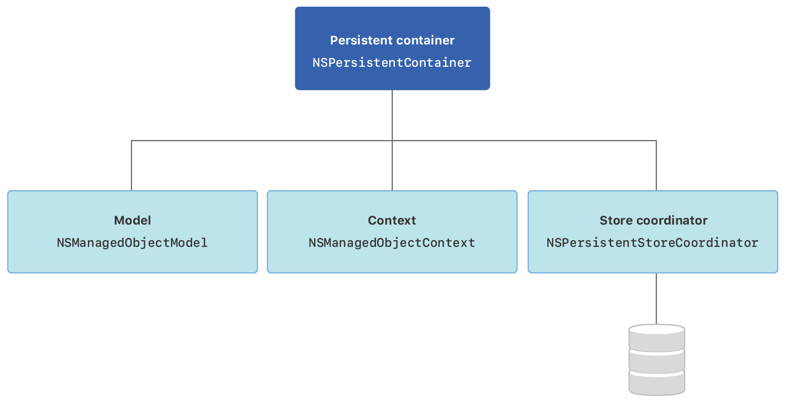

> 导航：[技术](../technologies.md) · [Core Data](../coredata.md)

# Core Data 栈

API 集合

管理和持久化你 App 的模型层。

## 概述

Core Data 提供了一组类，协同支持你 App 的模型层：

- 一个 [NSManagedObjectModel](nsmanagedobjectmodel.md) 实例描述你 App 的类型，包括它们的属性和关系。
- 一个 [NSManagedObjectContext](nsmanagedobjectcontext.md) 实例追踪你 App 类型实例的更改。
- 一个 [NSPersistentStoreCoordinator](nspersistentstorecoordinator.md) 实例负责将你 App 类型的实例保存到存储中，以及从存储中获取它们。

示意图：一个持久化容器实例包含对托管对象模型、托管对象上下文以及一个连接到 App 存储的持久化存储协调器的引用。

你可以使用一个 [NSPersistentContainer](nspersistentcontainer.md) 实例同时设置模型、上下文和存储协调器。

## 主题

### 栈设置

- [NSPersistentContainer](nspersistentcontainer.md) — 一个容器，封装你 App 中的 Core Data 栈。

### 对象建模

- [NSManagedObjectModel](nsmanagedobjectmodel.md) — `.xcdatamodeld` 文件的程序化表示，描述你的对象。
- [NSEntityDescription](nsentitydescription.md) — Core Data 实体的描述。
- [NSPropertyDescription](nspropertydescription.md) — 属于某个实体的单个属性的描述。
- [NSAttributeDescription](nsattributedescription.md) — 属于某个实体的单个特性的描述。
- [NSDerivedAttributeDescription](nsderivedattributedescription.md) — 对相关特性执行计算来推导其值的特性的描述。
- [NSRelationshipDescription](nsrelationshipdescription.md) — 两个实体之间关系的描述。

### 对象管理

- [NSManagedObjectContext](nsmanagedobjectcontext.md) — 操作和追踪托管对象更改的对象空间。
- [NSManagedObject](nsmanagedobject.md) — 所有 Core Data 模型对象继承的基类。
- [NSManagedObjectID](nsmanagedobjectid.md) — 托管对象的紧凑通用标识符。

### 存储协调

- [NSPersistentStoreCoordinator](nspersistentstorecoordinator.md) — 使 App 的上下文和底层持久化存储协同工作的对象。
- [NSPersistentStore](nspersistentstore.md) — 所有 Core Data 持久化存储的抽象基类。
- [NSPersistentStoreDescription](nspersistentstoredescription.md) — 用于创建和加载持久化存储的描述对象。
- [NSPersistentStoreRequest](nspersistentstorerequest.md) — 用于从持久化存储检索数据或向持久化存储保存数据的条件。
- [NSPersistentStoreResult](nspersistentstoreresult.md) — 从持久化存储协调器返回的结果的抽象基类。
- [NSPersistentStoreAsynchronousResult](nspersistentstoreasynchronousresult.md) — 用于表示异步请求结果的具体类。
- [NSSaveChangesRequest](nssavechangesrequest.md) — 对托管对象上下文执行保存操作时，对象存储需要做的一系列更改的封装。
- [NSAtomicStore](nsatomicstore.md) — 一个抽象超类，你继承它以创建 Core Data 原子存储。
- [NSAtomicStoreCacheNode](nsatomicstorecachenode.md) — 用于表示 Core Data 原子存储中基本节点的具体类。
- [NSIncrementalStore](nsincrementalstore.md) — 定义 Core Data 与存储通信的 API 的抽象超类。
- [NSIncrementalStoreNode](nsincrementalstorenode.md) — 用于表示 Core Data 增量存储中基本节点的具体类。

## 另请参阅

### 基础

- [创建 Core Data 模型](creating-a-core-data-model.md) — 用数据模型文件定义你 App 的对象结构。
- [设置 Core Data 栈](setting-up-a-core-data-stack.md) — 设置管理和持久化你 App 对象的类。
- [处理 Core Data 中的不同数据类型](handling-different-data-types-in-core-data.md) — 为各种数据类型创建、存储和呈现记录。
- [在两个 Core Data 存储之间链接数据](linking-data-between-two-core-data-stores.md) — 将数据组织在两个不同的存储中，并在它们之间实现链接。
