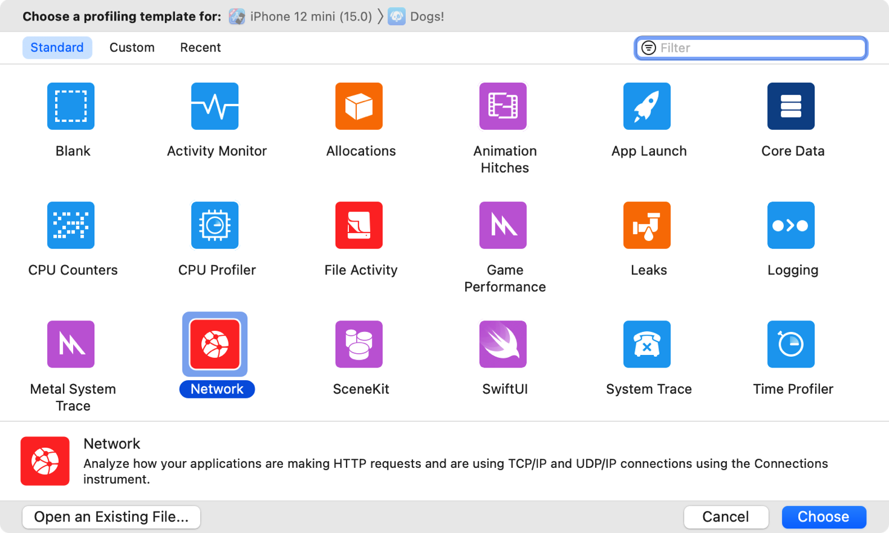
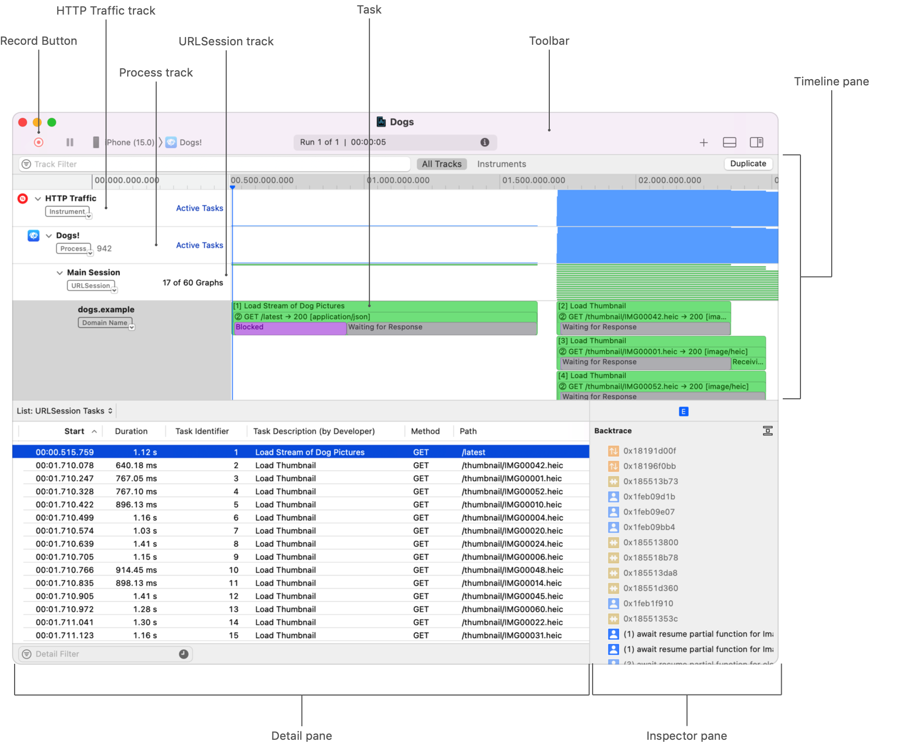
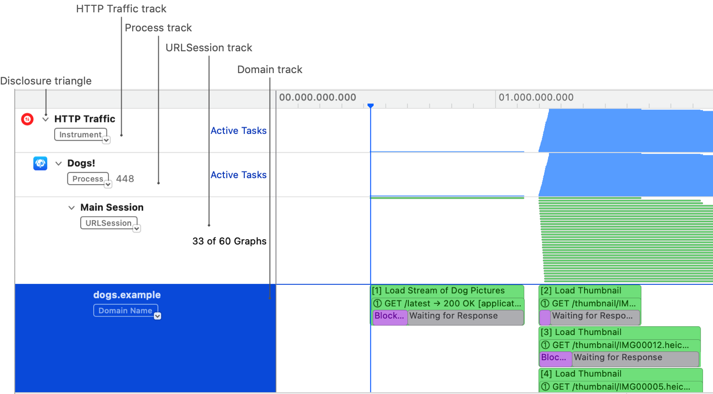
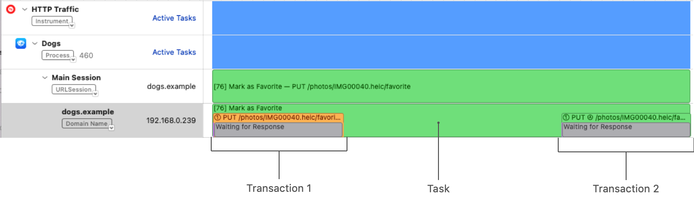
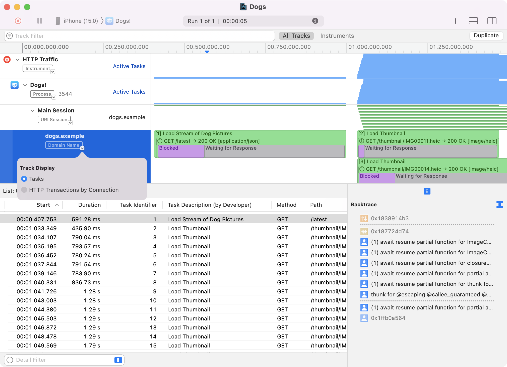
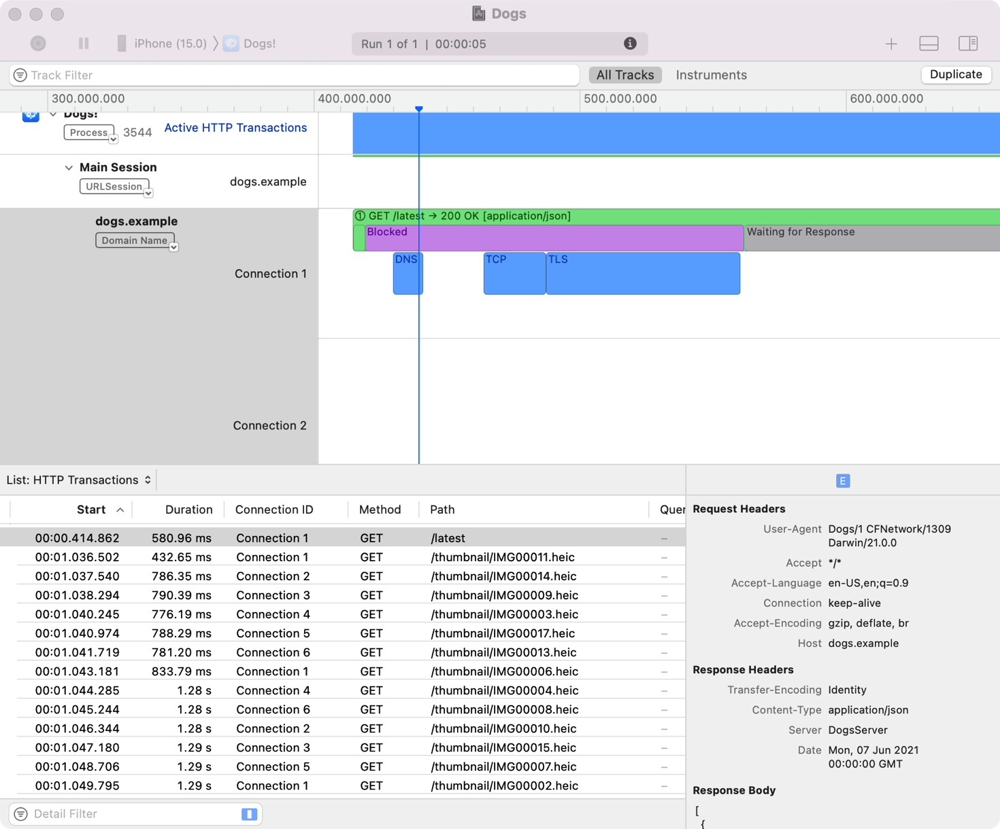
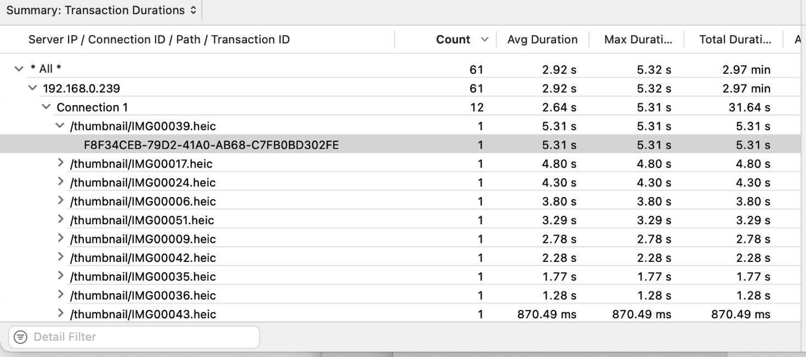

> 导航：[技术](../technologies.md) · [Foundation](../foundation.md) · [URL 加载系统](url-loading-system.md)

# 使用 Instruments 分析 HTTP 流量

<sub>文章</sub>

测量 App 基于 HTTP 的网络性能和使用情况。

## 概述

HTTP Traffic instrument 是 Instruments 的一个组成部分。Instruments 是用于分析和测试 iOS、iPadOS、watchOS、tvOS 和 macOS App 性能的工具，而 HTTP Traffic instrument 会截取、记录并可视化目标进程的流量。

> [!important] 重要
> 此 instrument 会以未加密状态，将已加密和未加密的 HTTP 流量记录到追踪文稿及系统日志中。这些追踪文稿和日志文件可能包含敏感信息。

此 instrument 会在内部从 URL 加载系统收集详细信息，包括标头和正文内容、连接建立时长以及请求和响应时间。然后，它会记录这些数据，将其重新组合成精确的时间区间并附加元数据。

> [!note] WWDC21 相关场次
> 第 10212 场：[在 Instruments 中分析 HTTP 流量](https://developer.apple.com/videos/play/wwdc2021/10212/)

### 启动 Instruments 并开始记录

从 Xcode 的 Product 菜单中选取 Profile。Instruments 启动后，选择 Network 模板，然后点按 Choose。



Network Connections 和 HTTP Traffic instrument 会与时间线及详细信息面板一起出现在新窗口中。下图高亮显示了需要关注的区域。



<sub>Instruments 窗口的图像，显示了主要区域：时间线面板、工具栏、详细信息面板和检查器面板。工具栏中有记录按钮。窗口顶部包含 HTTP Traffic instrument、进程轨道、URLSession 轨道和任务区域。</sub>

点按工具栏中的 Record 按钮。随后会出现一个对话框，说明捕获 HTTP 流量并以未加密方式存储的风险。如果你接受此风险，请点按 Record Anyway。App 随即启动，instrument 开始监测。

### 查看轨道层级结构

HTTP Traffic 轨道位于最上方，显示当前记录会话的所有 HTTP 流量。你还可以使用 HTTP Traffic instrument 子轨道的层级结构，查看从不同维度拆分的已捕获流量。要显示子轨道，请点按 HTTP Traffic 旁边的显示三角形。

第一个层级按进程组织流量，为每个已捕获进程显示一条轨道。每个进程包含一条或多条 [URLSession](urlsession.md) 轨道，而每个会话包含一组域轨道。



<sub>Instruments 窗口局部的图像，显示 HTTP Traffic 轨道、进程轨道和域轨道。域轨道显示 dogs.example 域的缩略加载事务。</sub>

HTTP Traffic 轨道和进程轨道显示聚合视图，呈现任意时间点有多少任务或事务处于活动状态。会话轨道会显示每个任务和事务各自的时间区间。

会话轨道对应你在代码中创建的 [URLSession](urlsession.md)。会话名称来自 [sessionDescription](urlsession/sessiondescription.md) 属性。为会话命名后，你可以在查看 App 的 HTTP 流量时引用它。以下示例展示了如何命名会话：

```swift
let session = URLSession(configuration:.default)
session.sessionDescription = "Main Session"
```

### 查看任务和事务

有时，完成一个 [URLSession](urlsession.md) 任务需要多轮请求与响应。每一对请求和响应称为一个_事务（transaction）_。

域轨道提供更详细的信息。除了任务信息外，它们还会显示底层事务和事务状态。下面是 dogs.example 域轨道，其中显示一个包含两个事务的任务。



事务包含五种按以下顺序发生的状态：缓存查找、阻塞、发送请求、等待响应和接收响应。下图显示了这些状态。


<sub>显示事务从左到右进展的图示：缓存查找、阻塞、发送请求、等待响应和接收响应。</sub>

有些状态的持续时间远短于其他状态。例如，缓存查找可能需要几毫秒，而阻塞可能持续一秒或更长。因此，在默认缩放级别下，缓存查找状态可能不可见。如果想查看某个特定状态，请使用鼠标或触控板放大事务的对应区域，以显示更多信息。

Instruments 在轨道区域提供两种显示样式。默认显示样式会列出 [URLSession](urlsession.md) 任务。下面是 dogs.example 会话的任务。



<sub>显示 dogs.example 域轨道中 URL 会话任务的图像。所选任务的栈回溯显示在检查器面板中。</sub>

你还可以显示按连接分组的事务。要切换到此样式，请点按域名旁边的箭头。这有助于你了解事务的执行方式以及底层连接对它们的影响。下面是按连接分组的事务。



<sub>显示按连接分组事务的图像。连接 1 下方有两个事务。第一个事务处于选中状态，其请求标头显示在检查器面板中。</sub>

更改轨道显示样式时，详细信息面板和检查器会随之更新。选择 Tasks 显示时，详细信息面板显示任务相关信息，检查器则显示所选任务恢复执行时的栈回溯。

选择 HTTP Transactions by Connection 显示时，详细信息面板显示事务相关信息。检查器会显示所选事务的请求标头、响应标头以及请求和响应正文。

除了详细信息面板中的两个列表外，还有一个摘要视图。从弹出式菜单中选择 “Summary: Transaction Durations”。摘要视图会按 IP 地址、连接和路径对连接进行分层分组。



<sub>显示按 IP 地址和连接分组事务的图像。其中显示所选事务的数量、平均时长、最大时长和总时长。</sub>

## 另请参阅

### 基础

- [将网站数据获取到内存中](fetching-website-data-into-memory.md) — 从 URL 会话创建数据任务，将数据直接接收到内存中。
- [URLSession](urlsession.md) — 协调一组相关网络数据传输任务的对象。
- [URLSessionTask](urlsessiontask.md) — 在 URL 会话中执行的任务，例如下载特定资源。
