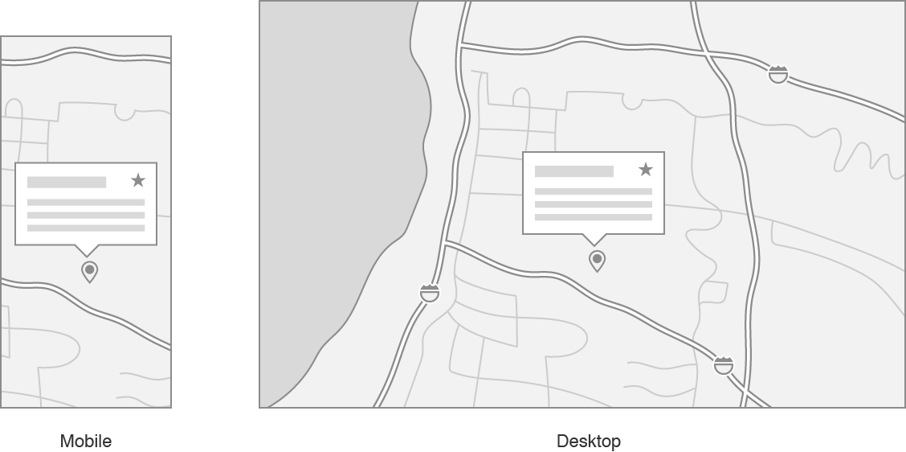

> 导航：[技术](../technologies.md) · [Foundation](../foundation.md) · [任务管理](task-management.md)

# 使用 Handoff 继续用户活动

<sub>示例代码</sub>

定义并管理你 App 中哪些活动可以在设备之间继续。

## 概述

此示例 App 会搜索 Apple Store 零售店位置，并将其显示在地图上。用户可以选择某家商店的地图注解来查看地址，并将其标记为个人收藏。当用户更改可见区域或查看单家商店时，App 会使用 Handoff 与用户的其他设备共享这些活动。如果用户更换设备，可以使用 Handoff 启动 App，并返回在原设备上进行的操作。



示例项目同时针对 macOS 和 iOS 构建，因此你可以在 Mac、iPhone 和 iPad 上运行它。该项目不包含 watchOS 或 tvOS App。

### 配置示例代码项目

`HandoffMapViewer` 必须在实际设备上运行；iOS 版本无法在 Simulator 中运行。

若要配置 Mac 以运行示例代码项目，请打开「系统偏好设置」，然后执行以下操作：

1. 在「蓝牙」设置中，点按「打开蓝牙」。
2. 在 iCloud 设置中，确认你已登录 iCloud。如果尚未登录，请点按「登录」，然后输入 Apple ID 和密码。
3. 在「通用」设置中，选择“允许在这台 Mac 和 iCloud 设备之间使用 Handoff”。

若要配置 iOS 设备以运行示例代码项目，请打开「设置」App，然后执行以下操作：

1. 在「蓝牙」设置中，轻点以打开蓝牙。
2. 如果尚未使用 Apple ID 登录，请轻点「设置」顶部的用户横幅进行登录。然后轻点以打开 iCloud。
3. 在「通用」设置中，轻点以打开 Handoff。

若要配置示例代码项目以便在你的设备上运行，请在 Xcode 中打开 `HandoffMapViewer.xcodeproj` 项目，然后执行以下操作：

1. 在项目导览器顶部选择 `HandoffMapViewer` 项目，选择 `HandoffMapViewerMac` 目标，再选择“通用”标签页，然后将 Bundle Identifier 更改为唯一值，例如使用你的组织名称代替 `com.example` 的值。
2. 在项目导览器中保持选中 `HandoffMapViewer` 项目，选择 `HandoffMapViewerIOS` 目标，再选择“通用”标签页，然后将 Bundle Identifier 更改为上一步使用的相同值。
3. 若要运行 macOS 版本，请构建 `HandoffMapViewerMac` 目标并在本机运行，或者将 `Products` 文件夹中的 App 文件复制到另一台 Mac 并在那里运行。
4. 若要运行 iOS 版本，请构建 `HandoffMapViewerIOS` 目标，并在一台已连接的 iOS 设备上运行。

### 定义用户活动

实现 Handoff 时，你需要确定用户可以在 App 中执行、且能够在第二台设备上重现其状态的具体活动。示例 App 包含两个用户活动：

- 查看地图区域。
- 查看某家 Apple Store 零售店的详细信息，并编辑其“favorite”值。

> [!note] 注意
> 请注意，除了 Handoff，你的 App 通常还有其他持久化和同步策略。例如，示例 App 使用 iCloud 键值存储来记录哪些商店已标记为个人收藏。这样一来，即使不通过 Handoff 启动 App（例如从 macOS 程序坞或 iOS 主屏幕启动），App 也能使用个人收藏数据。

你可以在 App 的 `Info.plist` 中提供一个键名为 `NSUserActivityTypes` 的条目，告知 Handoff 你的 App 可以继续哪些活动。此条目的类型为 `Array`，每个成员都是一个 `String`，代表一种受支持的 Handoff 活动。在示例 App 中，macOS 和 iOS 目标的 `Info.plist` 文件都包含 `map-viewing` 和 `store-editing` 活动。

```
<key>NSUserActivityTypes</key>
<array>
  <string>com.example.apple-samplecode.HandoffMapViewer.map-viewing</string>
  <string>com.example.apple-samplecode.HandoffMapViewer.store-editing</string>
</array>
```

### 管理用户活动

在运行时，使用 `NSUserActivity` 类型表示用户活动。你使用一个字符串标识符来初始化用户活动对象，该标识符与之前在 `Info.plist` 中使用的相同。此对象还有一个 `isEligibleForHandoff` 属性，用于将活动开放给 Handoff；以及一个 `userInfo` 字典，其中包含在接收设备上重新创建 App 状态所需的数据。

在示例 App 中，`MapViewController` 管理两个 `NSUserActivity` 实例（instance），分别对应 `map-viewing` 和 `store-editing` 活动。当地图区域发生变化时，它会将 `userActivity` 属性（在 macOS 的 `NSViewController` 和 iOS 的 `UIViewController` 中定义）设置为 `map-viewing` 活动。这会将它设为当前活动，取代此前可能发送给 Handoff 的任何其他活动；同时将 `needsSave` 设置为 `true`，表示该活动有新数据要发送到远程设备。

```swift
userActivity = mapViewingActivity
mapViewingActivity.needsSave = true
mapViewingActivity.becomeCurrent()
```

对视图控制器的 `userActivity` 调用 `needsSave`，最终会触发对 `updateUserActivityState(_:)` 方法的回调；此方法在 iOS 的 `UIResponder` 和 macOS 的 `NSResponder` 中声明。这是 App 在 Handoff 收到活动之前刷新活动对象 `userInfo` 的机会。示例 App 的实现会调用便利函数 `updateViewingRegion(_:)`；该函数在 `NSUserActivity` 的扩展（extension）中定义，用于将地图视图的 `MKCoordinateRegion` 编码为 `userInfo` 字典中的键值条目。

```swift
func updateViewingRegion(_ region: MKCoordinateRegion) {
    let updateDict = [
        NSUserActivity.regionCenterLatitudeKeyString: region.center.latitude,
        NSUserActivity.regionCenterLongitudeKeyString: region.center.longitude,
        NSUserActivity.regionSpanLatitudeKeyString: region.span.latitudeDelta,
        NSUserActivity.regionSpanLongitudeKeyString: region.span.longitudeDelta]
    addUserInfoEntries(from: updateDict)
}
```

### 接收用户活动

当你转到另一台设备时，macOS 或 iOS 会提示有可用的 Handoff 活动。macOS 会在程序坞开头显示 Handoff 图标，并通过徽章指示来源设备的类型。在 iOS 上，Handoff 横幅会出现在 App 切换器的屏幕底部，其中显示 App 和来源设备名称。

当你使用 Handoff 提示启动 App 时，系统会调用 `UIApplicationDelegate`（iOS）或 `NSApplicationDelegate`（macOS）中的方法来提供 Handoff 活动。`application(_:continue:restorationHandler:)` 方法会提供该活动以及一个完成处理程序（completion handler）；你需要调用此处理程序并传入能够处理该活动的视图控制器数组。iOS App 委托（app delegate）中的实现只会找到并传入第一个视图控制器，即 `MapViewController` 的实例。

```swift
func application(_ application: UIApplication, continue userActivity: NSUserActivity,
                 restorationHandler: @escaping ([UIUserActivityRestoring]?) -> Void) -> Bool {
    guard let topNav = application.keyWindow?.rootViewController as? UINavigationController,
        let mapVC = topNav.viewControllers.first as? MapViewController else {
        return false
    }
    
    mapVC.loadView()
    restorationHandler([mapVC])
    return true
}
```

macOS App 委托中的实现与此类似，但它会遍历关键窗口的层级结构，而不是 iOS 导览控制器（navigation controller）叠放：

```swift
func application(_ application: NSApplication, continue userActivity: NSUserActivity,
                 restorationHandler: @escaping ([NSUserActivityRestoring]) -> Void) -> Bool {
    guard let mapVC = application.keyWindow?.windowController?.contentViewController as? MapViewController else {
        return false
    }
    
    mapVC.loadView()
    restorationHandler([mapVC])
    return true
}
```

### 更新 App 状态

视图控制器会在 `restoreUserActivityState(_:)` 方法中接收 `NSUserActivity`。`MapViewController` 会检查该活动，确定它是地图查看活动还是商店编辑活动，然后根据需要更新 UI。对于地图查看活动，它会使用 `userInfo` 中的值创建新的 `MKCoordinateRegion`，从而重置地图区域。

```swift
func viewingRegion() -> MKCoordinateRegion? {
    guard let centerLatitude = userInfo?[NSUserActivity.regionCenterLatitudeKeyString] as? CLLocationDegrees,
        let centerLongitude = userInfo?[NSUserActivity.regionCenterLongitudeKeyString] as? CLLocationDegrees,
        let spanLatitude = userInfo?[NSUserActivity.regionSpanLatitudeKeyString] as? CLLocationDegrees,
        let spanLongitude = userInfo?[NSUserActivity.regionSpanLongitudeKeyString] as? CLLocationDegrees else {
            return nil
    }
    return MKCoordinateRegion(center: CLLocationCoordinate2D(latitude: centerLatitude,
                                                             longitude: centerLongitude),
                              span: MKCoordinateSpan(latitudeDelta: spanLatitude,
                                                     longitudeDelta: spanLongitude))
}
```

对于商店编辑活动，视图控制器还会从 `userInfo` 中获取商店的 URL 和位置坐标。App 会等到地图为正在编辑的商店添加 `MKAnnotationView`，从而知道要把弹出窗口锚定在哪里。

### 更新原始设备的状态（可选）

`NSUserActivity` 类具有一个类型为 `NSUserActivityDelegate` 的 `delegate` 属性。当你在另一台设备上继续活动时，该属性会通知活动的来源设备。来源设备可以借此清理自己的 UI 状态。

在示例 App 中，轻点 Apple Store 零售店的图钉会显示一个弹出窗口，其中包含商店的详细信息，以及用于将商店标记为个人收藏的切换（iOS）或复选框（macOS）。`MapViewContoller` 使用 `storeEditingActivity` 属性表示此活动，并将自身设为活动的委托。当你在第二台设备上继续编辑时，来源设备上的委托会收到此活动已继续的通知，并关闭自己的弹出窗口。

```swift
func userActivityWasContinued(_ userActivity: NSUserActivity) {
    DispatchQueue.main.async {[weak self] in
        if let detailVC = self?.presentedViewController as? StoreDetailViewController,
           userActivity.activityType == NSUserActivity.storeEditingActivityType {
            detailVC.dismiss(animated: true)
        }
    }
}
```

> [!note] 注意
> 并非所有 App 都需要更新来源 App 的状态。在示例 App 中，关闭弹出窗口是为了温和地提醒用户不要同时从两台设备进行编辑。示例既未明确禁止，也未明确支持这种操作。

## 另请参阅

### 活动共享

- [创建用户活动对象](creating-a-user-activity-object.md) — 识别关键的用户交互，并包含用于日后恢复这些交互的信息。
- [在你的 App 中实现 Handoff](implementing-handoff-in-your-app.md) — 直接创建、发送和接收用户活动。
- [通过基于用户活动的建议提高 App 使用率](increasing-app-usage-with-suggestions-based-on-user-activities.md) — 从 App 中捕获信息并将其作为主动建议展示在整个系统中，从而提供连续的用户体验。
- [支持创建快速备忘录](supporting-the-creation-of-quick-notes.md) — 支持创建包含你 App 内容的备忘录。
- [NSUserActivity](nsuseractivity.md) — 你的 App 在某一时刻状态的表示形式。
- [NSUserActivityDelegate](nsuseractivitydelegate.md) — 用户活动实例通过其向委托通知更新的接口。

## 下载

- [ContinuingUserActivitiesWithHandoff.zip](https://docs-assets.developer.apple.com/published/fb0d52fad60a/ContinuingUserActivitiesWithHandoff.zip)
