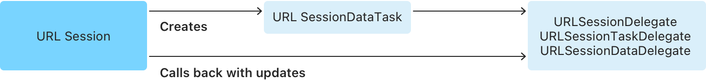

> 导航：[技术](../technologies.md) · [Foundation](../foundation.md) · [URL 加载系统](url-loading-system.md)

# 将网站数据获取到内存中

<sub>文章</sub>

通过从 URL 会话创建数据任务，将数据直接接收到内存中。

## 概述

对于与远程服务器之间的小规模交互，可以使用 [URLSessionDataTask](urlsessiondatatask.md) 类将响应数据接收到内存中（这与 [URLSessionDownloadTask](urlsessiondownloadtask.md) 类不同，后者会把数据直接存储到文件系统）。数据任务非常适合调用 Web 服务端点等用途。

你使用 URL 会话实例创建任务。如果需求相当简单，可以使用 [URLSession](urlsession.md) 类的 [sharedSession](urlsession/shared.md) 实例。如果希望通过委托（delegate）回调与传输过程交互，则需要创建会话，而不是使用共享实例。创建会话时，你会使用 [URLSessionConfiguration](urlsessionconfiguration.md) 实例，并传入一个实现 [URLSessionDelegate](urlsessiondelegate.md) 或其某个子协议的类。会话可重复用于创建多个任务，因此请为所需的每一种独特配置创建会话并将其存储为属性。

> [!note] 注意
> 请注意不要创建超出需要数量的会话。例如，如果 App 中有多个部分需要配置相近的会话，请创建一个会话并在它们之间共享。

获得会话后，可以使用某个 `dataTask()` 方法创建数据任务。任务创建时处于挂起状态，可以通过调用 [- resume](<urlsessiontask/resume().md>) 启动。

### 使用完成处理程序接收结果

获取数据最简单的方法是创建使用完成处理程序（completion handler）的数据任务。采用这种安排时，任务会把服务器响应、数据以及可能出现的错误传递给你提供的完成处理程序 block。下图展示了会话与任务之间的关系，以及结果如何传递给完成处理程序。


<sub>URL 会话创建 URL 会话数据任务的示意图。任务随后将原始请求、获取的数据或错误发送给完成处理程序。</sub>

要创建使用完成处理程序的数据任务，请调用 `URLSession` 的 [- dataTaskWithURL:](<urlsession/datatask(with_)-10dy7.md>) 方法。你的完成处理程序需要完成三项工作：

1. 验证 `error` 参数是否为 `nil`。如果不是，则发生了传输错误；处理错误并退出。
2. 检查 `response` 参数，验证状态码是否表示成功，以及 MIME 类型是否为预期值。如果不是，则处理服务器错误并退出。
3. 按需使用 `data` 实例。

以下示例展示用于获取 URL 内容的 `startLoad()` 方法。它首先使用 [URLSession](urlsession.md) 类的共享实例创建数据任务，该任务会将结果传递给完成处理程序。检查本地和服务器错误后，该处理程序将数据转换为字符串，并用它填充 `WKWebView` outlet。当然，你的 App 也可以将获取的数据用于其他用途，例如将其解析到数据模型中。

创建完成处理程序以接收数据加载结果

```swift
func startLoad() {
    let url = URL(string: "https://www.example.com/")!
    let task = URLSession.shared.dataTask(with: url) { data, response, error in
        if let error = error {
            self.handleClientError(error)
            return
        }
        guard let httpResponse = response as? HTTPURLResponse,
            (200...299).contains(httpResponse.statusCode) else {
            self.handleServerError(response)
            return
        }
        if let mimeType = httpResponse.mimeType, mimeType == "text/html",
            let data = data,
            let string = String(data: data, encoding: .utf8) {
            DispatchQueue.main.async {
                self.webView.loadHTMLString(string, baseURL: url)
            }
        }
    }
    task.resume()
}

```

> [!important] 重要
> 完成处理程序是在不同于创建任务所用 Grand Central Dispatch 队列的队列上调用的。因此，任何使用 `data` 或 `error` 更新 UI 的工作（例如更新 `webView`），都应像此处所示明确放到主队列上。

### 使用委托接收传输详情和结果

为了在任务进行过程中更深入地访问其活动，可以在创建数据任务时为会话设置委托，而不是提供完成处理程序。下图展示了这种安排。



<sub>URLSession 创建 URLSessionDataTask 的示意图。会话通过回调向委托提供进度更新、获取的数据、认证质询和其他事件。</sub>

使用此方法时，数据的各个部分会在到达时传给 [URLSessionDataDelegate](urlsessiondatadelegate.md) 的 [- URLSession:dataTask:didReceiveData:](<urlsessiondatadelegate/urlsession(__datatask_didreceive_).md>) 方法，直至传输完成或因错误而失败。随着传输进行，委托还会接收其他类型的事件。

使用委托方式时，需要创建自己的 `URLSession` 实例，而不能使用 `URLSession` 类的简单 `shared` 实例。创建新会话后，你可以将自己的类设为会话的委托，如以下示例所示。

声明你的类实现一个或多个委托协议（[URLSessionDelegate](urlsessiondelegate.md)、[URLSessionTaskDelegate](urlsessiontaskdelegate.md)、[URLSessionDataDelegate](urlsessiondatadelegate.md) 和 [URLSessionDownloadDelegate](urlsessiondownloaddelegate.md)）。然后使用初始化方法 [+ sessionWithConfiguration:delegate:delegateQueue:](<urlsession/init(configuration_delegate_delegatequeue_).md>) 创建 URL 会话实例。你可以自定义与此初始化方法配合使用的配置实例。例如，将 [waitsForConnectivity](urlsessionconfiguration/waitsforconnectivity.md) 设为 [true](../swift/true.md) 是一种良好做法。这样一来，会话会等待合适的连接，而不会在所需连接不可用时立即失败。

创建使用委托的 URLSession

```swift
private lazy var session: URLSession = {
    let configuration = URLSessionConfiguration.default
    configuration.waitsForConnectivity = true
    return URLSession(configuration: configuration,
                      delegate: self, delegateQueue: nil)
}()
```

以下示例展示一个使用此会话启动数据任务，并通过委托回调处理收到的数据和错误的 `startLoad()` 方法。此代码清单实现了三个委托回调：

- [- URLSession:dataTask:didReceiveResponse:completionHandler:](<urlsessiondatadelegate/urlsession(__datatask_didreceive_completionhandler_).md>) 验证响应是否具有表示成功的 HTTP 状态码，以及 MIME 类型是否为 `text/html` 或 `text/plain`。如果任一条件不满足，任务会被取消；否则允许其继续。
- [- URLSession:dataTask:didReceiveData:](<urlsessiondatadelegate/urlsession(__datatask_didreceive_).md>) 获取任务收到的每个 `Data` 实例，并将其附加到名为 `receivedData` 的缓冲区。
- [- URLSession:task:didCompleteWithError:](<urlsessiontaskdelegate/urlsession(__task_didcompletewitherror_).md>) 首先查看是否发生传输层错误。如果没有错误，它会尝试将 `receivedData` 缓冲区转换为字符串，并将其设为 `webView` 的内容。

将委托与 URL 会话数据任务配合使用

```swift
var receivedData: Data?

func startLoad() {
    loadButton.isEnabled = false
    let url = URL(string: "https://www.example.com/")!
    receivedData = Data()
    let task = session.dataTask(with: url)
    task.resume()
}

// 委托方法

func urlSession(_ session: URLSession, dataTask: URLSessionDataTask, didReceive response: URLResponse,
                completionHandler: @escaping (URLSession.ResponseDisposition) -> Void) {
    guard let response = response as? HTTPURLResponse,
        (200...299).contains(response.statusCode),
        let mimeType = response.mimeType,
        mimeType == "text/html" else {
        completionHandler(.cancel)
        return
    }
    completionHandler(.allow)
}

func urlSession(_ session: URLSession, dataTask: URLSessionDataTask, didReceive data: Data) {
    self.receivedData?.append(data)
}

func urlSession(_ session: URLSession, task: URLSessionTask, didCompleteWithError error: Error?) {
    DispatchQueue.main.async {
        self.loadButton.isEnabled = true
        if let error = error {
            handleClientError(error)
        } else if let receivedData = self.receivedData,
            let string = String(data: receivedData, encoding: .utf8) {
            self.webView.loadHTMLString(string, baseURL: task.currentRequest?.url)
        }
    }
}
```

各个委托协议还提供了上述代码之外的其他方法，用于处理认证质询、跟随重定向及其他特殊情况。`URLSession` 讨论中的“使用 URL 会话”介绍了传输期间可能发生的各种回调。

## 另请参阅

### 基础

- [使用 Instruments 分析 HTTP 流量](analyzing-http-traffic-with-instruments.md) — 测量 App 基于 HTTP 的网络性能和使用情况。
- [URLSession](urlsession.md) — 协调一组相关网络数据传输任务的对象。
- [URLSessionTask](urlsessiontask.md) — 在 URL 会话中执行的任务，例如下载特定资源。
