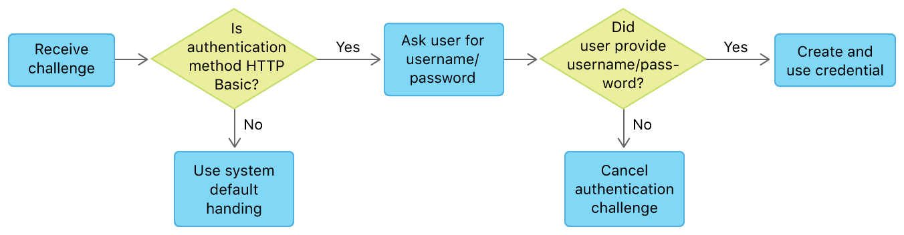

> 导航：[Technologies](../technologies.md) · [Foundation](../foundation.md) · [URL Loading System](url-loading-system.md)

# 处理认证质询

当服务器要求对 URL 请求进行认证时作出适当响应。

## 概述

App 使用 [URLSessionTask](urlsessiontask.md) 发出请求时，服务器可能会在继续之前一次或多次要求提供凭据。会话任务会尝试为你处理这些要求。如果无法处理，它会调用会话的[委托（delegate）](urlsession/delegate.md)来处理质询。

实现本文所述的委托方法，以响应 App 所连接服务器发出的质询。如果没有实现委托，服务器可能会拒绝你的请求，此时你收到的会是 HTTP 状态码为 `401`（Forbidden）的响应，而不是预期数据。

### 确定适当的委托方法

根据收到的一个或多个质询的性质，实现一个或两个委托认证方法。

- 实现 [URLSessionDelegate](urlsessiondelegate.md) 的 [- URLSession:didReceiveChallenge:completionHandler:](<urlsessiondelegate/urlsession(__didreceive_completionhandler_).md>) 方法，以处理会话范围的质询，例如传输层安全性（Transport Layer Security，TLS）验证。成功处理此类质询后，你的操作会对从该 [URLSession](urlsession.md) 创建的所有任务持续生效。
- 实现 [URLSessionTaskDelegate](urlsessiontaskdelegate.md) 的 [- URLSession:task:didReceiveChallenge:completionHandler:](<urlsessiontaskdelegate/urlsession(__task_didreceive_completionhandler_).md>) 方法，以处理特定于任务的质询，例如用户名/密码认证要求。从给定会话创建的每个任务都可能发出自己的质询。

> [!note] 注意
> 有关哪些认证方法属于会话范围或特定于任务，请参阅 [NSURLProtectionSpace 认证方法常量](nsurlprotectionspace-authentication-method-constants.md)。

举一个简单示例，考虑请求受 [RFC 7617](https://tools.ietf.org/html/rfc7617) 所定义 HTTP Basic 认证保护的 `http` URL 时会发生什么。由于这是特定于任务的质询，你需要通过实现 [- URLSession:task:didReceiveChallenge:completionHandler:](<urlsessiontaskdelegate/urlsession(__task_didreceive_completionhandler_).md>) 来处理它。

> [!note] 注意
> 如果通过 `https` 连接，你还会收到服务器信任质询。有关处理此类会话范围质询的信息，请参阅[执行手动服务器信任认证](performing-manual-server-trust-authentication.md)。

[图 1](/documentation/foundation/url_loading_system/handling_an_authentication_challenge#2948287)概述了响应 HTTP Basic 质询的策略。



<sub>展示处理认证质询时各状态和选择的决策树。第一个决策点是收到的质询认证方法是否为 HTTP Basic；如果不是，则使用系统默认处理。如果是，系统会要求用户提供用户名和密码。第二个决策点询问用户是否提供了用户名和密码。如果提供，则创建并使用凭据；如果没有，则取消质询。</sub>

以下各节实现此策略。

### 确定认证质询的类型

收到认证质询时，使用委托方法确定质询类型。委托方法会收到一个描述所发质询的 [URLAuthenticationChallenge](urlauthenticationchallenge.md) 实例。该实例包含 [protectionSpace](urlauthenticationchallenge/protectionspace.md) 属性，其 [authenticationMethod](urlprotectionspace/authenticationmethod.md) 属性表明所发质询的种类，例如请求用户名和密码或客户端证书。你可以使用此值确定自己能否处理该质询。

你可以直接调用传入质询的完成处理程序来响应质询，并传入表明响应方式的 [AuthChallengeDisposition](urlsession/authchallengedisposition.md)。根据具体情况，使用 disposition 参数提供凭据、取消请求或允许继续执行默认处理。

以下示例测试认证方法是否为预期的 HTTP Basic 类型。如果 `authenticationMethod` 属性表明是其他种类的质询，它会使用 [NSURLSessionAuthChallengePerformDefaultHandling](urlsession/authchallengedisposition/performdefaulthandling.md) disposition 调用完成处理程序。让任务使用默认处理可能会满足该质询；否则，任务会继续处理响应中的下一个质询并再次调用此委托。此过程会持续进行，直到任务到达你预期处理的 HTTP Basic 质询。

检查认证质询的认证方法

```swift
let authMethod = challenge.protectionSpace.authenticationMethod
guard authMethod == NSURLAuthenticationMethodHTTPBasic else {
    completionHandler(.performDefaultHandling, nil)
    return
}
```

### 创建凭据实例

若要成功响应质询，你需要提交适用于所收质询类型的凭据。对于 HTTP Basic 和 HTTP Digest 质询，需要提供用户名和密码。以下示例展示了一个辅助方法：如果用户界面栏位已填写，则尝试从中创建 [URLCredential](urlcredential.md) 实例。

从用户界面值创建 URLCredential

```swift
func credentialsFromUI() -> URLCredential? {
    guard let username = usernameField.text, !username.isEmpty,
        let password = passwordField.text, !password.isEmpty else {
            return nil
    }
    return URLCredential(user: username, password: password,
                         persistence: .forSession)
}
```

在此示例中，返回的 [URLCredential](urlcredential.md) 采用 [NSURLCredentialPersistenceForSession](urlcredential/persistence-swift.enum/forsession.md) 持久性，因此只由创建任务的 [URLSession](urlsession.md) 实例存储。对于其他会话实例创建的任务以及 App 以后运行时，你需要提供新的 [URLCredential](urlcredential.md) 实例。

### 调用完成处理程序

尝试创建凭据实例后，你必须调用完成处理程序来响应质询。

- 如果无法创建凭据，或者用户明确取消，请调用完成处理程序并传入 [NSURLSessionAuthChallengeCancelAuthenticationChallenge](urlsession/authchallengedisposition/cancelauthenticationchallenge.md) disposition。
- 如果可以创建凭据实例，请使用 [NSURLSessionAuthChallengeUseCredential](urlsession/authchallengedisposition/usecredential.md) disposition 将它传给完成处理程序。

以下示例展示了这两个选项。

调用认证质询完成处理程序

```swift
guard let credential = credentialOrNil else {
    completionHandler(.cancelAuthenticationChallenge, nil)
    return
}
completionHandler(.useCredential, credential)
```

如果你提供的凭据被服务器接受，任务会开始上传或下载数据。

> [!important] 重要
> 在等待用户完成用户名/密码对话框等情况下，你可以将完成处理程序传给其他方法，或暂时存储在属性中。但最终必须调用完成处理程序来完成质询并允许任务继续，即使你选择取消也是如此，如上一示例的失败情况所示。

### 妥善处理失败

如果凭据被拒绝，系统会再次调用委托方法。发生这种情况时，回调会通过 [URLAuthenticationChallenge](urlauthenticationchallenge.md) 参数的 [proposedCredential](urlauthenticationchallenge/proposedcredential.md) 属性提供被拒绝的凭据。质询实例还包含 [previousFailureCount](urlauthenticationchallenge/previousfailurecount.md) 属性，表明凭据被拒绝的次数。你可以使用这些属性确定下一步操作。例如，如果 [previousFailureCount](urlauthenticationchallenge/previousfailurecount.md) 大于零，可以使用 [proposedCredential](urlauthenticationchallenge/proposedcredential.md) 的用户字符串填充用户名/密码重新输入界面。

## 主题

### 创建 URL 凭据

- [执行手动服务器信任认证](performing-manual-server-trust-authentication.md) — 在你的 App 中评估服务器的安全凭据。

## 另请参阅

### 认证与凭据

- [URLAuthenticationChallenge](urlauthenticationchallenge.md) — 服务器发出的要求客户端进行认证的质询。
- [URLCredential](urlcredential.md) — 一种认证凭据，包含特定于凭据类型以及要使用的持久存储类型（如果有）的信息。
- [URLCredentialStorage](urlcredentialstorage.md) — 共享凭据缓存的管理器。
- [URLProtectionSpace](urlprotectionspace.md) — 要求认证的服务器或服务器区域，通常称为 realm。
