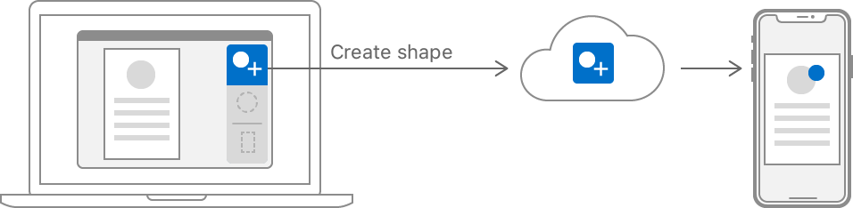

> 导航：[Technologies](../technologies.md) · [Foundation](../foundation.md) · [Task Management](task-management.md)

# 在你的 App 中实现 Handoff

<sub>文章</sub>

直接创建、发送和接收用户活动。

## 概述

使用 Handoff 将用户在一台 iOS、watchOS 或 macOS 设备上开始的活动转移到另一台设备上。例如，macOS 上的矢量图形应用可以将某个正在进行的编辑操作的详细信息发送到用户的 iPhone，以便在那里继续编辑。



<sub>示意图展示了一个在 MacBook 上打开的应用。三个活动之一「创建形状」被选中。图中展示了该活动被传递到一部 iPhone，后者呈现出与 MacBook 上相似的用户界面。</sub>

你可以通过以下方式在你的 App 中实现 Handoff：

- 将用户活动表示为 [NSUserActivity](nsuseractivity.md) 的实例。
- 在用户于你的 App 中执行操作时更新活动实例。
- 在其他设备上，通过你的 App 接收来自 Handoff 的活动。

> [!important] 重要
> 要在不同平台上的多个 App 之间进行 Handoff，你的 App 必须共享相同的开发者 Team ID。这意味着你必须通过 App Store 发布你的 App，或者使用相同的凭证对它们进行签名。

### 在你的 App 的 Info.plist 中声明 Handoff 活动

首先要确定哪些活动适合与 Handoff 配合使用。选择那些能代表用户在某个时间点正在做什么的活动，比如创建一个形状或编辑文稿属性。为你的每个活动选择一个全局唯一的标识符字符串，采用反向 DNS 的模式，例如 `com.example.app.activity-name`。

你可以使用 App 的 `Info.plist` 文件来声明你的 App 能够从 Handoff 接收活动。在这个文件中创建一个新的顶层条目，键为 [NSUserActivityTypes](https://developer.apple.com/library/archive/documentation/General/Reference/InfoPlistKeyReference/Articles/CocoaKeys.html#//apple_ref/doc/uid/TP40009251-SW28)，类型为 `Array`。数组中的每个成员都应该是一个 `String`，其值为你的某个活动标识符。下面的示例展示了一个 `NSUserActivityTypes` 条目的 `Info.plist` XML 源码，它声明了 App 可以继续的三个活动：

```other
<key>NSUserActivityTypes</key>
<array>
    <string>com.example.myapp.create-shape</string>
    <string>com.example.myapp.edit-shape</string>
    <string>com.example.myapp.edit-document-properties</string>
</array>
```

你的 App 不需要在所有平台上发送和接收同一组标识符。例如，你可能有一个较大的 macOS App 和一套较小的 iOS App。在这种情况下，macOS App 可能会处理你所有的活动，而每个 iOS App 只处理这些活动中的一部分。此外，尽管 watchOS 可以发送用户活动，但它无法接收用户活动，因此 watchOS App 不需要声明 `NSUserActivityTypes` 属性。

你的 App 可以拥有多个活动，每个活动都有不同的细节要发送给 Handoff。请确定你在接收设备上重新创建该活动所需要的信息。请注意只包含用户活动中的临时性细节，而不要包含 App 需要永久存储的任何信息。例如，如果用户正在处理一份文稿，该活动应该指明用户正在编辑的是哪份文稿——以及可能是文稿的哪个部分。不要把文稿本身作为活动的一部分包含进去，因为用户也可能不通过 Handoff 启动你的 App，比如通过点按其 App 图标。相反，应使用 iCloud Drive 之类的技术在用户的设备之间共享文稿。

### 创建用户活动对象

在运行时，为你 App 的每个活动创建 [NSUserActivity](nsuseractivity.md) 实例。使用与 `Info.plist` 中相同的标识符字符串来表明你的 App 可以继续哪些活动。

[NSUserActivity](nsuseractivity.md) 类包含一个 [userInfo](nsuseractivity/userinfo.md) 字典，你可以用它在其他设备上重新创建该活动。该活动类型还有一个 [requiredUserInfoKeys](nsuseractivity/requireduserinfokeys.md) 属性，你需要在其中填入使该活动可恢复所需的最小字典键集合。该活动还包含一个你应该设置的、用户可读的 [title](nsuseractivity/title.md) 属性。如果该活动还支持搜索，系统会在搜索结果中显示这个标题。

```swift
let activity = NSUserActivity(activityType: "com.example.myapp.create-shape")
activity?.isEligibleForHandoff = true
activity?.requiredUserInfoKeys = ["shape-type"]
activity.title = NSLocalizedString("Creating shape", comment: "Creating shape activity")
```

[NSResponder](../appkit/nsresponder.md)（macOS）和 [UIResponder](../uikit/uiresponder.md)（iOS）类定义了一个 [userActivity](../uikit/uiresponder/useractivity.md) 属性。由于 [NSViewController](../appkit/nsviewcontroller.md) 和 [UIViewController](../uikit/uiviewcontroller.md) 都是这些响应者类型的子类，你可以设置这个属性来表示该控制器正在管理的活动。你的 App 可以让多个视图控制器共享同一个活动。反过来，如果单个视图控制器支持多个活动，你也可以根据需要将该视图控制器的 [userActivity](../uikit/uiresponder/useractivity.md) 重新赋值为不同的 [NSUserActivity](nsuseractivity.md) 实例。

### 在用户处于活跃状态时更新活动

当用户与你的 App 交互时，更新用户活动以保存其交互的状态。如果你已经设置了响应者的 [userActivity](../uikit/uiresponder/useractivity.md) 属性，系统会自动调用它的 [updateUserActivityState(_:)](<../uikit/uiresponder/updateuseractivitystate(__).md>)（iOS）或 [updateUserActivityState(_:)](<../appkit/nsresponder/updateuseractivitystate(__).md>)（macOS）方法。重写这个方法，以便向活动的 [userInfo](nsuseractivity/userinfo.md) 字典写入新的值。

你在 [userInfo](nsuseractivity/userinfo.md) 中使用的键和值必须是 [NSArray](nsarray.md)、[NSData](nsdata.md)、[NSDate](nsdate.md)、[NSDictionary](nsdictionary.md)、[NSNull](nsnull.md)、[NSNumber](nsnumber.md)、[NSSet](nsset.md)、[NSString](nsstring.md) 或 [NSURL](nsurl.md)（或它们的 Swift 桥接等效类型）之一。创建一个字典，其中包含在另一台设备上重新创建该活动所需的任何数据，然后调用 [- addUserInfoEntriesFromDictionary:](<nsuseractivity/adduserinfoentries(from_).md>) 来更新该活动。同时，最好为字典本身提供一个用于版本控制的键值对。这样，你以后就可以更改活动的字典表示形式，并能够检测出不兼容的版本。

```swift
override func updateUserActivityState(_ activity: NSUserActivity) {
    if activity.activityType == "com.example.myapp.create-shape" {
        let updateDict:  [AnyHashable : Any] = [
            "shape-type" : currentShapeType(),
            "activity-version" : 1
        ]
        activity.addUserInfoEntries(from: updateDict)
    }
}
```

在 [userInfo](nsuseractivity/userinfo.md) 中传输的负载应尽可能小，将总大小保持在 3KB 以内。如果你必须传输比这更多的数据，可以使用延续流（continuation stream）直接连接两台设备（参见 Working with continuation streams）。

### 在 App 委托中接收用户活动

当用户从另一台设备通过 Handoff 启动你的 App 时，App 会收到对其 App 委托中相应方法的回调。你需要实现这些方法来接受该活动，并在你的 App 中恢复其状态。

启动你的 App 后，Handoff 会调用 [UIApplicationDelegate](../uikit/uiapplicationdelegate.md)（iOS）的 [application(_:willContinueUserActivityWithType:)](<../uikit/uiapplicationdelegate/application(__willcontinueuseractivitywithtype_).md>) 方法，或 [NSApplicationDelegate](../appkit/nsapplicationdelegate.md)（macOS）的 [application(_:willContinueUserActivityWithType:)](<../appkit/nsapplicationdelegate/application(__willcontinueuseractivitywithtype_).md>) 方法。实现这个方法，更新你的 UI，以向用户表明它正在从另一台设备接收该活动。如果 Handoff 因某种原因失败，系统会调用 [application(_:didFailToContinueUserActivityWithType:error:)](<../uikit/uiapplicationdelegate/application(__didfailtocontinueuseractivitywithtype_error_).md>)（iOS），或 [application(_:didFailToContinueUserActivityWithType:error:)](<../appkit/nsapplicationdelegate/application(__didfailtocontinueuseractivitywithtype_error_).md>)（macOS）。

> [!note] 注意
> 尽管 watchOS 可以创建 [NSUserActivity](nsuseractivity.md) 对象并将其发送到其他设备，但 Handoff 无法启动 watchOS App。

Handoff 会通过 [application(_:continue:restorationHandler:)](<../uikit/uiapplicationdelegate/application(__continue_restorationhandler_).md>)（iOS），或 [application(_:continue:restorationHandler:)](<../appkit/nsapplicationdelegate/application(__continue_restorationhandler_).md>)（macOS）委托方法将活动提供给你的 App。实现该方法时，创建一个需要为该活动进行更新的视图控制器数组，并将这个数组提供给完成处理程序。如果你的实现成功处理了该活动，则返回 [true](../swift/true.md)；否则返回 [false](../swift/false.md)。下面的示例展示了一个 iOS App 委托查找其顶层视图控制器并将其提供给完成处理程序的过程。

```swift
func application(_ application: UIApplication, continue userActivity: NSUserActivity,
                 restorationHandler: @escaping ([UIUserActivityRestoring]?) -> Void) -> Bool {
    guard let topNav = application.keyWindow?.rootViewController as? UINavigationController,
        let shapesVC = topNav.viewControllers.first as? MyShapesViewController else {
            return false
    }
    restorationHandler([shapesVC])
    return true
}

```

### 在你的 App 中继续该活动

在上一步中提供给完成处理程序的每个视图控制器，都会收到对其 [restoreUserActivityState(_:)](<../uikit/uiresponder/restoreuseractivitystate(__).md>)（iOS），或 [restoreUserActivityState(_:)](<../appkit/nsuseractivityrestoring/restoreuseractivitystate(__).md>)（macOS）方法的调用。使用这个方法来更新视图控制器的状态，使其与源设备的状态相匹配。如果你有多种活动类型，可以使用 [activityType](nsuseractivity/activitytype.md) 来确定你正在处理的是哪一种活动。然后，从活动的 [userInfo](nsuseractivity/userinfo.md) 字典中获取值，以更新视图控制器的状态。

```swift
override func restoreUserActivityState(_ userActivity: NSUserActivity) {    super.restoreUserActivityState(userActivity)
    guard userActivity.activityType == "com.example.myapp.create-shape",
        let type = userActivity.userInfo?["shape-type"] as? String,
        let version = userActivity.userInfo?["activity-version"] as? Int,
        version >= 1 else {
            return
    }
    
    createShape(type: type)
}
```

对于在 [userInfo](nsuseractivity/userinfo.md) 字典中传输的 URL，你必须先调用 [startAccessingSecurityScopedResource()](<url/startaccessingsecurityscopedresource().md>)，并且它必须返回 [true](../swift/true.md)，然后你才能访问该 URL。使用完该 URL 后，调用 [stopAccessingSecurityScopedResource()](<url/stopaccessingsecurityscopedresource().md>)。另外请注意，系统会修改指向 iCloud 文稿的 `file:` URL，使其在接收设备上指向同一份文稿。

## 另请参阅

### Activity Sharing

- [Creating a user activity object](creating-a-user-activity-object.md) — 确定关键的用户交互，并包含用于在之后恢复它们的信息。
- [Continuing User Activities with Handoff](continuing-user-activities-with-handoff.md) — 定义并管理你 App 的哪些活动可以在设备之间继续。
- [Increasing App Usage with Suggestions Based on User Activities](increasing-app-usage-with-suggestions-based-on-user-activities.md) — 通过从你的 App 中捕获信息，并将这些信息作为主动建议展示在整个系统中，来提供连续的用户体验。
- [Supporting the creation of Quick Notes](supporting-the-creation-of-quick-notes.md) — 支持创建包含你 App 内容的备忘录。
- [NSUserActivity](nsuseractivity.md) — 你的 App 在某一时刻状态的表示形式。
- [NSUserActivityDelegate](nsuseractivitydelegate.md) — 用户活动实例通过其向委托通知更新的接口。
</content>
