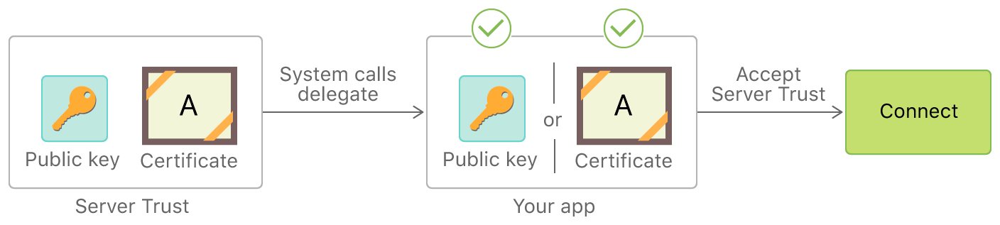

> 导航：[技术](../technologies.md) · [Foundation](../foundation.md) · [URL 加载系统](url-loading-system.md) · [处理认证质询](handling-an-authentication-challenge.md)

# 执行手动服务器信任认证

<sub>文章</sub>

在你的 App 中评估服务器的安全凭据。

## 概述

当你在 URL 请求中使用安全连接（例如 `https`）时，[URLSessionDelegate](urlsessiondelegate.md) 会收到一个认证类型为 [NSURLAuthenticationMethodServerTrust](nsurlauthenticationmethodservertrust.md) 的认证质询（authentication challenge）。其他质询是服务器要求你的 App 认证自身，而此质询则让你有机会认证服务器的凭据。

> [!tip] 提示
> 有关认证质询的介绍，请参阅[处理认证质询](handling-an-authentication-challenge.md)。

### 确定何时适合手动评估服务器信任

在大多数情况下，你应让 URL 加载系统的默认处理方式评估服务器信任（server trust）。没有委托（delegate）或未处理认证质询时，便会得到这种行为。不过，在以下场景中，自行评估可能很有用：

- 你希望接受原本会被系统拒绝的服务器凭据。例如，你的 App 与使用自签名证书的开发服务器建立安全连接，而该证书通常无法匹配系统信任存储中的任何内容。
- 你希望拒绝原本会被系统接受的凭据。例如，你希望将 App“固定”到你所控制的一组特定密钥或证书，而不是接受任何有效凭据。

[图 1](/documentation/foundation/url_loading_system/handling_an_authentication_challenge/performing_manual_server_trust_authentication#2959678)说明 App 如何通过提供委托方法处理认证质询，从而执行手动凭据评估。这会绕过默认处理。委托转而直接将服务器证书或其公钥与存储在 App 套装中的证书或密钥副本（或二者任一的哈希）进行比较。如果委托认定服务器凭据有效，它便接受服务器信任并允许连接继续。



<sub>由委托方法手动评估服务器信任的流程图。服务器信任中的证书与 App 套装内的证书匹配，因此手动接受服务器信任，流程最终进入“连接”状态。</sub>

> [!note] 注意
> 如果你连接的域启用了 [App Transport Security (ATS)](urlsession.md#App-Transport-Security-ATS)，[URLSession](urlsession.md) 会强制实施该机制。它会对连接使用的证书、TLS 版本和密码套件应用安全要求。对于受 ATS 保护的域，你无法放宽服务器信任要求，但可以使用本文所示的手动评估技术收紧要求。有关更多详情，请参阅[信息属性列表键参考](https://developer.apple.com/library/archive/documentation/General/Reference/InfoPlistKeyReference/Introduction/Introduction.html#//apple_ref/doc/uid/TP40009247)中的 [NSAppTransportSecurity](https://developer.apple.com/library/archive/documentation/General/Reference/InfoPlistKeyReference/Articles/CocoaKeys.html#//apple_ref/doc/plist/info/NSAppTransportSecurity)。

### 处理服务器信任认证质询

要执行手动服务器信任认证，请实现 [URLSessionDelegate](urlsessiondelegate.md) 的 [- URLSession:didReceiveChallenge:completionHandler:](<urlsessiondelegate/urlsession(__didreceive_completionhandler_).md>) 方法。调用该方法时，你的实现首先需要检查：

- 质询类型是服务器信任，而不是其他种类的质询。
- 质询的主机名与你要为其执行手动凭据评估的主机匹配。

以下示例展示如何使用传给 [- URLSession:didReceiveChallenge:completionHandler:](<urlsessiondelegate/urlsession(__didreceive_completionhandler_).md>) 回调的 `challenge` 参数测试这些条件。它获取质询的 [protectionSpace](urlauthenticationchallenge/protectionspace.md)，并用它执行上述两项检查。首先，它从保护空间获取 [authenticationMethod](urlprotectionspace/authenticationmethod.md)，并检查认证类型是否为 [NSURLAuthenticationMethodServerTrust](nsurlauthenticationmethodservertrust.md)。然后，它确保保护空间的 [host](urlprotectionspace/host.md) 与预期名称 `example.com` 匹配。如果任一条件不满足，它便以 [NSURLSessionAuthChallengePerformDefaultHandling](urlsession/authchallengedisposition/performdefaulthandling.md) 处置方式调用 `completionHandler`，允许系统处理该质询。

测试服务器信任认证质询的质询类型和主机名。

```swift
let protectionSpace = challenge.protectionSpace
guard protectionSpace.authenticationMethod ==
    NSURLAuthenticationMethodServerTrust,
    protectionSpace.host.contains("example.com") else {
        completionHandler(.performDefaultHandling, nil)
        return
}
```

### 评估质询中的凭据

要访问服务器凭据，请从保护空间获取 [serverTrust](urlprotectionspace/servertrust.md) 属性（[SecTrust](../security/sectrust.md) 类的一个实例）。以下示例展示如何访问服务器信任并接受或拒绝它。代码清单首先尝试从保护空间获取 [serverTrust](urlprotectionspace/servertrust.md) 属性；如果该属性为 `nil`，则回退到默认处理。随后，它将服务器信任传给私有辅助方法 `checkValidity(of:)`，该方法会把服务器信任中的证书或公钥与存储在 App 套装中的已知有效值进行比较。

评估服务器信任实例中的凭据。

```swift
guard let serverTrust = protectionSpace.serverTrust else {
    completionHandler(.performDefaultHandling, nil)
    return
}
if checkValidity(of: serverTrust) {
    let credential = URLCredential(trust: serverTrust)
    completionHandler(.useCredential, credential)
} else {
    // 在此显示 UI，警告用户服务器凭据
    // 无效，并取消加载。
    completionHandler(.cancelAuthenticationChallenge, nil)
}
```

代码确定服务器信任的有效性后，会采取以下两种操作之一：

- 如果服务器信任的凭据有效，则根据服务器信任创建新的 [URLCredential](urlcredential.md) 实例。然后以 [NSURLSessionAuthChallengeUseCredential](urlsession/authchallengedisposition/usecredential.md) 处置方式调用 `completionHandler`，并传入新创建的凭据。这会指示系统接受服务器凭据。
- 如果质询的凭据无效，则以 [NSURLSessionAuthChallengeCancelAuthenticationChallenge](urlsession/authchallengedisposition/cancelauthenticationchallenge.md) 处置方式调用 `completionHandler`。这会指示系统拒绝服务器凭据。

> [!tip] 提示
> 如需进一步了解如何评估 [SecTrust](../security/sectrust.md) 实例，或如何从中访问证书或公钥，请参阅[证书、密钥与信任服务](../security/certificate-key-and-trust-services.md)。

### 制定长期服务器认证策略

如果你确定需要在某些或全部情况下手动评估服务器信任，请提前规划 App 在需要更改服务器凭据时应如何应对。请牢记以下准则：

- 将服务器凭据与公钥进行比较，而不是在 App 套装中存储单个证书。这样，你可以为同一密钥重新颁发证书并更新服务器，而无需更新 App。
- 比较颁发证书的证书颁发机构（CA）的密钥，而不是使用叶子密钥。这样，你可以部署包含由同一 CA 签名的新密钥的证书。
- 使用一组密钥或 CA，以便更平稳地轮换服务器凭据。
