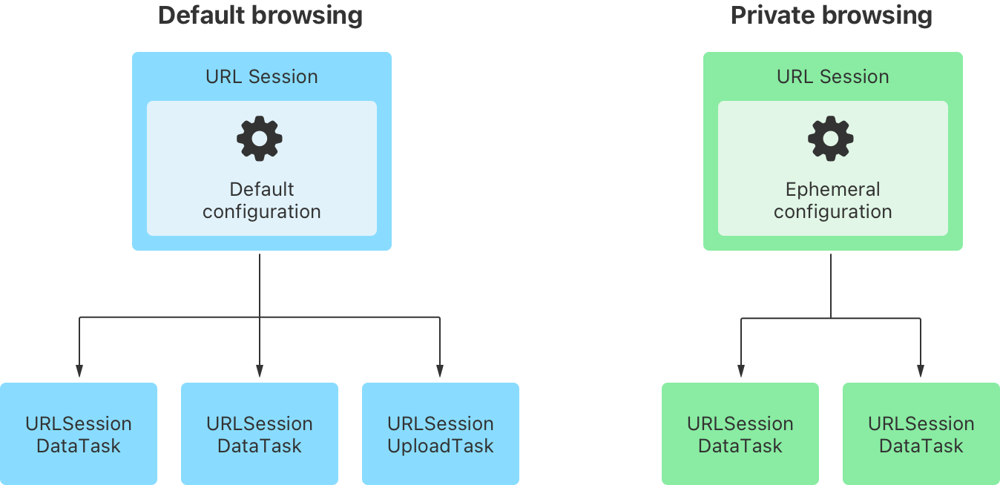

> 导航：[Technologies](../technologies.md) · [Foundation](../foundation.md)

# URL 加载系统

API 集合

使用标准互联网协议与 URL 交互并与服务器通信。

## 概述

URL 加载系统提供对由 URL 标识的资源的访问，可使用 `https` 这样的标准协议，也可使用你自己创建的自定协议。加载是异步执行的，因此你的 App 可以保持响应，并在数据或错误到达时进行处理。

你使用一个 [URLSession](urlsession.md) 实例来创建一个或多个 [URLSessionTask](urlsessiontask.md) 实例，这些实例可以为你的 App 获取并返回数据、下载文件，或者将数据和文件上传到远程位置。要配置一个会话，可以使用一个 [URLSessionConfiguration](urlsessionconfiguration.md) 对象，它控制诸如如何使用缓存和 cookie，或者是否允许在蜂窝网络上建立连接之类的行为。

你可以重复使用同一个会话来创建任务。例如，一个网页浏览器可能针对常规浏览和隐私浏览使用各自独立的会话，其中隐私会话不会缓存其数据。[图 1](/documentation/foundation/url_loading_system#2927983) 展示了具有这些配置的两个会话随后如何创建多个任务。

展示两种场景的图示：默认浏览和隐私浏览，每种场景都由一个 URL Session 创建多个 URL Session Task。在默认浏览场景中，URL Session 包含一个默认配置。在隐私浏览场景中，它包含一个临时配置。

每个会话都关联一个委托，用于接收周期性更新（或错误）。默认委托会调用你提供的一个完成处理程序代码块；如果你选择提供自己的自定委托，则不会调用这个代码块。

你可以将会话配置为在后台运行，这样当 App 被挂起时，系统可以代表它下载数据，并唤醒该 App 以传递结果。

## 主题

### 基础

- [Fetching website data into memory](fetching-website-data-into-memory.md) — 通过从 URL 会话创建一个数据任务，直接将数据接收到内存中。
- [Analyzing HTTP traffic with Instruments](analyzing-http-traffic-with-instruments.md) — 衡量你 App 基于 HTTP 的网络性能和使用情况。
- [URLSession](urlsession.md) — 一个协调一组相关网络数据传输任务的对象。
- [URLSessionTask](urlsessiontask.md) — 在某个 URL 会话中执行的一项任务，例如下载特定的资源。

### 请求与响应

- [URLRequest](urlrequest.md) — 一个与协议或 URL scheme 无关的 URL 加载请求。
- [NSURLRequest](nsurlrequest.md) — 一个与协议或 URL scheme 无关的 URL 加载请求。
- [NSMutableURLRequest](nsmutableurlrequest.md) — 一个与协议或 URL scheme 无关的可变 URL 加载请求。
- [URLResponse](urlresponse.md) — 与某个 URL 加载请求的响应相关联的元数据，与协议和 URL scheme 无关。
- [HTTPURLResponse](httpurlresponse.md) — 与某个 HTTP 协议 URL 加载请求的响应相关联的元数据。

### 上传

- [Building a resumable upload server with SwiftNIO](building-a-resumable-upload-server-with-swiftnio.md) — 通过将可续传上传转换为常规上传，在 SwiftNIO 中支持 HTTP 可续传上传协议。
- [Uploading data to a website](uploading-data-to-a-website.md) — 将数据从你的 App 提交到服务器。
- [Uploading streams of data](uploading-streams-of-data.md) — 向服务器发送数据流。
- [Pausing and resuming uploads](pausing-and-resuming-uploads.md) — 暂停并恢复某次上传，而无需从头开始，即使连接被中断也是如此。

### 下载

- [Downloading files from websites](downloading-files-from-websites.md) — 将文件直接下载到文件系统。
- [Pausing and resuming downloads](pausing-and-resuming-downloads.md) — 允许用户恢复某次下载而无需从头开始。
- [Downloading files in the background](downloading-files-in-the-background.md) — 创建在你的 App 处于非活跃状态时下载文件的任务。

### 缓存行为

- [Accessing cached data](accessing-cached-data.md) — 控制 URL 请求如何使用先前缓存的数据。
- [CachedURLResponse](cachedurlresponse.md) — 对某个 URL 请求的一个缓存响应。
- [URLCache](urlcache.md) — 一个将 URL 请求映射到缓存响应对象的对象。

### 认证与凭据

- [Handling an authentication challenge](handling-an-authentication-challenge.md) — 在服务器要求对 URL 请求进行认证时做出恰当的响应。
- [URLAuthenticationChallenge](urlauthenticationchallenge.md) — 来自服务器、要求客户端进行认证的一项挑战。
- [URLCredential](urlcredential.md) — 一个认证凭据，由特定于凭据类型的信息，以及要使用的持久化存储类型（如果有的话）组成。
- [URLCredentialStorage](urlcredentialstorage.md) — 一个共享凭据缓存的管理者。
- [URLProtectionSpace](urlprotectionspace.md) — 服务器或服务器上要求进行认证的某个区域，通常称为 realm。

### 网络活动归因

- [Inspecting app activity data](../network/inspecting-app-activity-data.md) — 验证你的 App 只访问你所预期的用户数据和网络资源。
- [Indicating the source of network activity](../network/indicating-the-source-of-network-activity.md) — 控制 App 隐私报告将网络流量归因于该 App 还是用户。

### Cookie

- [HTTPCookie](httpcookie.md) — 一个 HTTP cookie 的表示。
- [HTTPCookieStorage](httpcookiestorage.md) — 一个管理 cookie 存储的容器。

### 错误

- [URLError](urlerror.md) — URL 加载 API 返回的错误代码。
- [URL Loading System error info keys](url-loading-system-error-info-keys.md) — 识别 URL 加载 API 产生的错误对象的 user info 字典中的这些键。

### 旧版

- [Legacy URL Loading Systems](legacy-url-loading-systems.md) — 将你的代码迁移出这些旧版对象。

## 另请参阅

### 网络

- [Bonjour](bonjour.md) — 在本地网络上公布服务以便于发现，或发现他人公布的服务。
