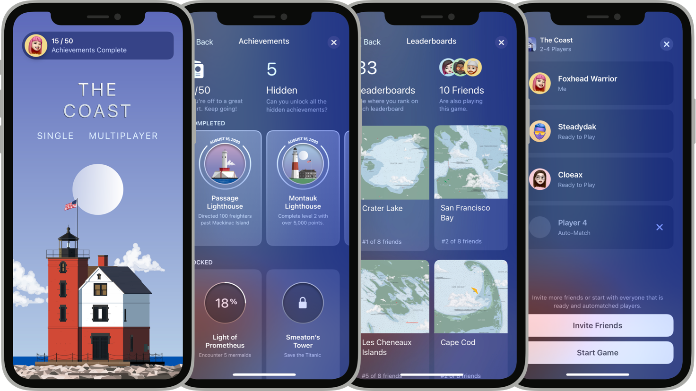

> 导航：[Technologies](technologies.md)

# GameKit

框架

让玩家能够与好友互动、比较排行榜排名、获得成就，以及参与多人游戏。

## 概述

使用 GameKit 框架实现 Game Center 社交游戏网络功能。Game Center 是 Apple 提供的一项服务，它提供单一账户，用于在玩家的所有游戏和设备之间标识玩家身份。玩家在设备上登录 Game Center 后，就能访问好友并使用你实现的 Game Center 功能。

多个 iPhone 屏幕展示了这些 Game Center 功能：访问点、成就仪表板、排行榜仪表板，以及邀请好友。

在使用 GameKit 类之前，你必须在项目中启用 Game Center，并在代码中初始化本地玩家；否则，你的游戏会收到 [GKErrorNotAuthenticated](gamekit/gkerror/code/notauthenticated.md) 错误。

如果你有现成的 Unity 项目，可以通过 [Apple Unity 插件](https://github.com/Apple/UnityPlugins) 访问 GameKit 框架。

### 实现 Game Center 功能

启用 Game Center 后，你可以实现许多有用的功能来增强游戏体验。

你可以添加排行榜，让玩家看到自己在好友和全世界玩家中的排名情况。创建定期排行榜来组织常规竞赛，为玩家提供更多争夺最高分的机会。随着玩家在你的游戏中不断推进，你可以用成就来奖励他们，鼓励他们继续玩下去。

GameKit 支持实时和回合制多人游戏体验。玩家可以选择自动匹配，也可以邀请好友加入游戏。你可以支持回合制游戏，让对局以一系列交替回合的形式进行，玩家即使在你的游戏未处于前台时也能收到邀请。

GameKit 还提供用户界面组件，让玩家可以直接在你的游戏中查看精彩内容并访问他们的 Game Center 数据。访问点为玩家提供了一种打开仪表板的方式，他们可以在其中浏览个人资料、排行榜和成就，以及管理好友列表。

关于在你的 App 中设计 Game Center 功能，请参阅 [人机界面指南 \> 技术 \> Game Center](https://developer.apple.com/design/human-interface-guidelines/game-center)。

## 主题

### 基础

- [初始化和配置 Game Center](gamekit/initializing-and-configuring-game-center.md) — 在你的 Xcode 项目中启用 Game Center、配置功能，并在本地测试它们。
- [验证玩家身份](gamekit/authenticating-a-player.md) — 确认玩家凭据和设备功能，并检查账户限制。
- [为下载量大的游戏改善玩家体验](gamekit/improving-the-player-experience-for-games-with-large-downloads.md) — 在基础安装包中提供充足的内容，然后使用按需资源和 Background Assets API 来处理额外内容。
- [Game Center Entitlement](bundleresources/entitlements/com.apple.developer.game-center.md) — 一个布尔值，指示 App 的用户是否可以在排行榜上查看和比较成就、邀请好友，以及开始多人游戏。

### 玩家

- [在你的游戏中让玩家与好友建立联系](gamekit/connecting-players-with-their-friends-in-your-game.md) — 让玩家能够在你的游戏中与好友建立联系并互动。
- [将玩家的游戏数据保存到 iCloud 账户](gamekit/saving-the-player-s-game-data-to-an-icloud-account.md) — 在游戏进行中或结束后，将游戏数据保存到玩家的 iCloud 账户中，以便可以从任意设备访问。
- [使用范围标识符保护玩家隐私](gamekit/protecting-the-player-s-privacy-using-scoped-identifiers.md) — 在传输或保存玩家数据时，使用 GameKit 提供给你的范围标识符作为玩家 ID。
- [GKLocalPlayer](gamekit/gklocalplayer.md) — 在运行游戏的设备上登录 Game Center 的本地玩家。
- [GKPlayer](gamekit/gkplayer.md) — 运行你的游戏的本地玩家可以通过 Game Center 邀请和沟通的远程玩家。
- [GKBasePlayer](gamekit/gkbaseplayer.md) — 一个类，为不同的玩家对象提供通用数据和方法。
- [GKLocalPlayerListener](gamekit/gklocalplayerlistener.md) — 一个协议，用于处理 Game Center 玩家的事件。
- [GKPlayerAuthenticationDidChangeNotificationName](foundation/nsnotification/name-swift.struct/gkplayerauthenticationdidchangenotificationname.md) — GameKit 验证本地玩家身份后发布的通知。
- [GKPlayerDidChangeNotificationName](foundation/nsnotification/name-swift.struct/gkplayerdidchangenotificationname.md) — 玩家对象的数据发生变化时发布的通知。

### Game Center 界面

- [为你的游戏添加访问点](gamekit/adding-an-access-point-to-your-game.md) — 为用户提供便捷的方式连接到 Game Center 仪表板。
- [显示 Game Center 仪表板](gamekit/displaying-the-game-center-dashboard.md) — 为玩家提供一个界面，让他们可以从你的游戏导览到自己的 Game Center 数据。
- [GKAccessPoint](gamekit/gkaccesspoint.md) — 一个对象，让玩家可以在你的游戏中查看和管理自己的 Game Center 信息。
- [GKDialogController](gamekit/gkdialogcontroller.md) — 一个对象，提供在 macOS 游戏中呈现仪表板的能力。
- [GKViewController](gamekit/gkviewcontroller.md) — GameKit 视图控制器类所采用的抽象基础协议。

### 排行榜

- [用排行榜鼓励进步和竞争](gamekit/encourage-progress-and-competition-with-leaderboards.md) — 让玩家衡量自己的进步，并与好友和其他人比较技能。
- [创建定期排行榜](gamekit/creating-recurring-leaderboards.md) — 为你的游戏创建一个按计划为玩家分数排名的排行榜。
- [为你的游戏添加定期排行榜](gamekit/adding-recurring-leaderboards-to-your-game.md) — 通过添加具有持续时间并会重复的排行榜，鼓励你的游戏中的竞争。
- [GKLeaderboard](gamekit/gkleaderboard.md) — Game Center 为某个游戏存储的排行榜。
- [GKLeaderboardSet](gamekit/gkleaderboardset.md) — 将排行榜组织成逻辑清晰、连贯一致的分组。
- [GKLeaderboardScore](gamekit/gkleaderboardscore.md) — 有关玩家在某个排行榜上的分数的信息。

### 成就

- [用成就奖励玩家](gamekit/rewarding-players-with-achievements.md) — 使用成就来激励玩家，让他们更投入你的游戏。
- [GKAchievement](gamekit/gkachievement.md) — 玩家在你的游戏中取得进步并达成目标时，你可以授予的成就。
- [GKAchievementDescription](gamekit/gkachievementdescription.md) — 一个对象，包含用于向玩家展示某项成就的文字和图片。

### 挑战

- [从排行榜创建引人入胜的挑战](gamekit/creating-engaging-challenges-from-leaderboards.md) — 通过在你的游戏中添加挑战来鼓励友好竞争。
- [为你的挑战选择排行榜](gamekit/choosing-a-leaderboard-for-your-challenges.md) — 了解在游戏中配置挑战时，哪些玩法效果更好。
- [GKChallengeDefinition](gamekit/gkchallengedefinition.md) — 一个对象，表示你为该挑战定义的静态元数据。
- [GKShowChallengeBanners](bundleresources/information-property-list/gkshowchallengebanners.md) — 一个布尔值，指示 GameKit 是否可以在游戏中显示挑战横幅。 _(已废弃)_

### 活动

- [为你的游戏创建活动](gamekit/creating-activities-for-your-game.md) — 使用活动向玩家展示游戏内容，并鼓励他们彼此建立联系。
- [GKGameActivity](gamekit/gkgameactivity.md) — 一个对象，表示当前游戏中某个游戏活动的单个实例。
- [GKGameActivityDefinition](gamekit/gkgameactivitydefinition.md) — 一个对象，表示你为该活动定义的静态元数据。
- [GKGameActivityListener](gamekit/gkgameactivitylistener.md) — 一个对象，响应活动事件。

### 实时游戏

- [创建实时游戏](gamekit/creating-real-time-games.md) — 开发多个玩家实时互动的游戏。
- [为游戏寻找多名玩家](gamekit/finding-multiple-players-for-a-game.md) — 发现其他玩家并邀请他们参与实时游戏。
- [在实时游戏中的玩家之间交换数据](gamekit/exchanging-data-between-players-in-real-time-games.md) — 在实时多人游戏中的玩家之间发送数据。
- [为多人游戏添加语音聊天](gamekit/adding-voice-chat-to-multiplayer-games.md) — 让玩家能够与多人游戏中的所有玩家或某几组玩家进行语音聊天。
- [为自定义服务器托管的游戏寻找玩家](gamekit/finding-players-for-custom-server-based-games.md) — 通过创建带有托管对局的游戏会话，将玩家连接到你自定义的服务器托管游戏。
- [匹配规则](gamekit/matchmaking-rules.md) — Game Center 会按你创建的特定顺序应用不同类型的规则，以找到最合适的匹配对象。
- [GKMatchRequest](gamekit/gkmatchrequest.md) — 一个对象，封装了创建实时或回合制对局的参数。
- [GKMatchmaker](gamekit/gkmatchmaker.md) — 一个对象，可在不向玩家呈现界面的情况下与其他玩家创建对局。
- [GKMatchmakerViewController](gamekit/gkmatchmakerviewcontroller.md) — 一个界面，让玩家可以邀请其他玩家加入实时游戏，并自动匹配以填补任何空位。
- [GKInviteEventListener](gamekit/gkinviteeventlistener.md) — 一个协议，处理来自 Game Center 的邀请事件。
- [GKInvite](gamekit/gkinvite.md) — 由另一名玩家发给本地玩家、邀请其加入对局的邀请。
- [GKMatch](gamekit/gkmatch.md) — 一组登录 Game Center 的玩家之间的对等网络。

### 回合制游戏

- [创建回合制游戏](gamekit/creating-turn-based-games.md) — 开发多个玩家轮流行动、并可以在等待轮到自己时交换数据的游戏。
- [开始回合制对局并在玩家之间传递回合](gamekit/starting-turn-based-matches-and-passing-turns-between-players.md) — 让 Game Center 在回合制游戏中的玩家之间存储和转发对局数据。
- [在回合制游戏中向玩家发送消息](gamekit/sending-messages-to-players-in-turn-based-games.md) — 通过发送消息和游戏数据，将对局事件通知玩家。
- [在回合制游戏的玩家之间交换数据](gamekit/exchanging-data-between-players-in-turn-based-games.md) — 让玩家在等待轮到自己时能够交换游戏数据并发送消息。
- [GKTurnBasedMatchmakerViewController](gamekit/gkturnbasedmatchmakerviewcontroller.md) — 一个界面，让玩家可以邀请其他玩家加入回合制对局，并自动匹配以填补任何空位。
- [GKTurnBasedMatch](gamekit/gkturnbasedmatch.md) — 一个对象，封装了玩家轮流进行的游戏的对局数据。
- [GKTurnBasedParticipant](gamekit/gkturnbasedparticipant.md) — 回合制对局中的一名参与者。
- [GKTurnBasedEventListener](gamekit/gkturnbasedeventlistener.md) — 处理对局中参与者之间的回合制事件和数据交换事件的协议。
- [GKTurnBasedExchange](gamekit/gkturnbasedexchange.md) — 参与者在回合制对局中发送的交换请求信息。
- [GKTurnBasedExchangeReply](gamekit/gkturnbasedexchangereply.md) — 有关接收方对交换请求所做回应的详细信息。
- [GKGameCenterBadgingDisabled](bundleresources/information-property-list/gkgamecenterbadgingdisabled.md) — 一个布尔值，指示 GameKit 是否可以为回合制游戏图标添加徽章。

### 错误

- [GKError](gamekit/gkerror.md) — 此框架使用的错误结构。
- [Code](gamekit/gkerror/code.md) — GameKit 错误域的错误代码。
- [GKErrorDomain](gamekit/gkerrordomain.md) — 一般游戏错误的错误域。

### 已废弃

- [已废弃的符号](gamekit/deprecated-symbols.md) — 查看不受支持的符号及其替代方案。
