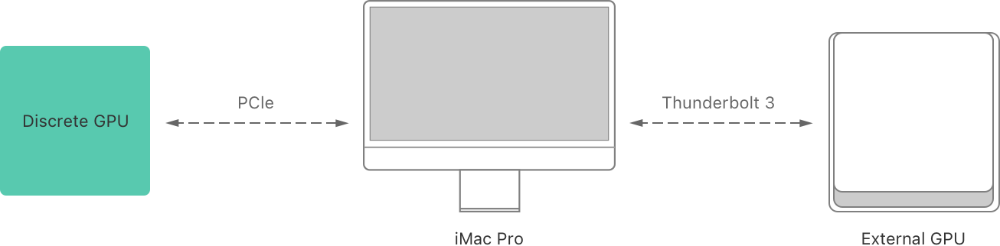
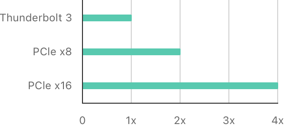
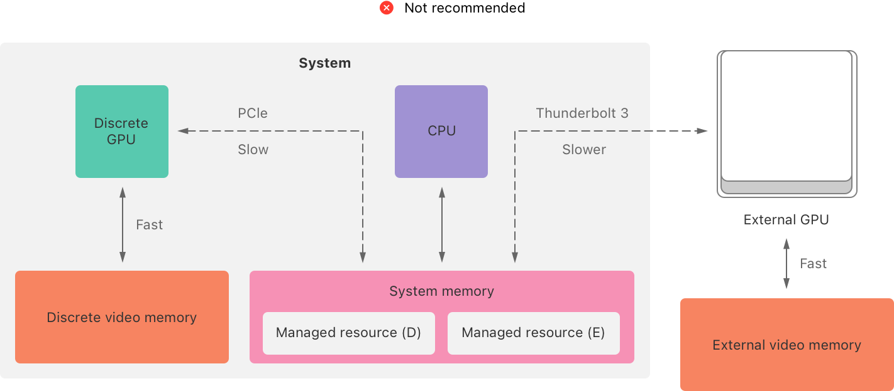
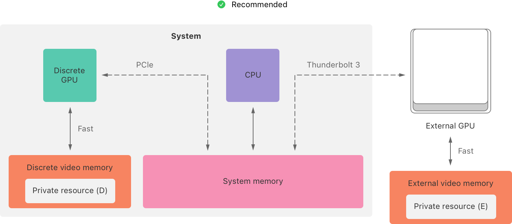
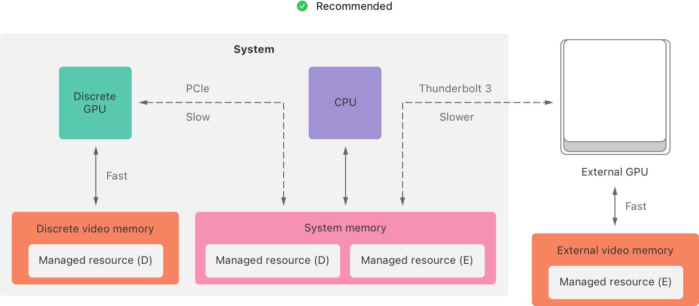
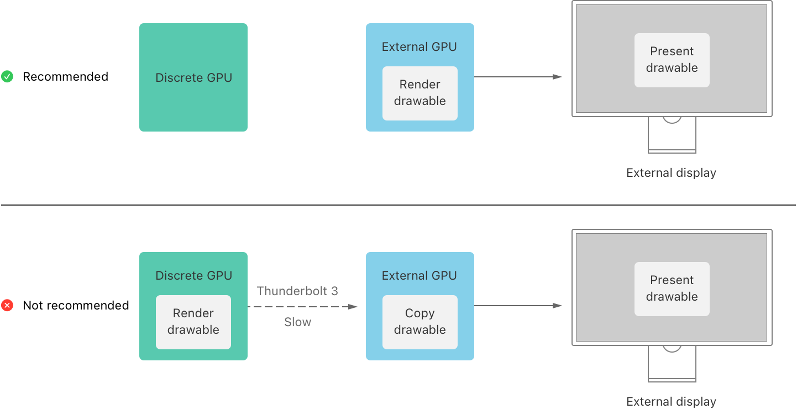
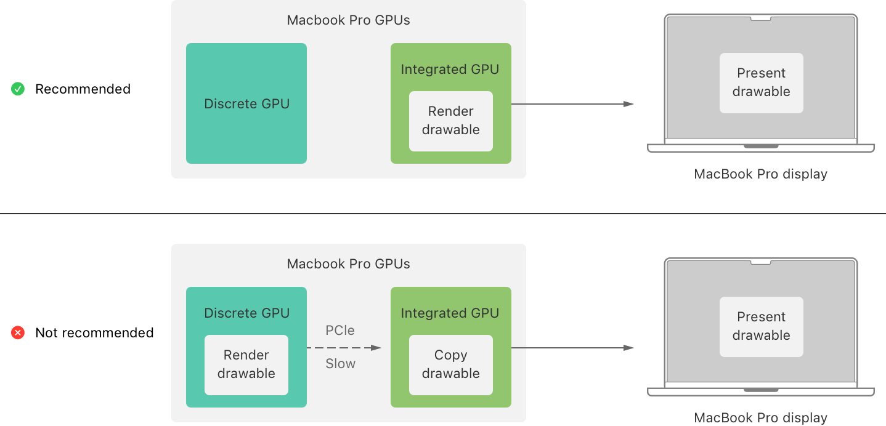

> 导航：[技术](../technologies.md) · [Metal](../metal.md) · [GPU 设备与任务提交](gpu-devices-and-work-submission.md) · [多 GPU 系统](multi-gpu-systems.md)

# 根据 GPU 内存带宽权衡进行调整

文章

根据 Mac 上 GPU 的内存带宽，为任务选择合适的 GPU 和内存存储模式。

## 概述

GPU 内存_带宽_衡量的是 GPU 与系统之间通过总线（如 PCI Express (PCIe) 或 Thunderbolt）进行数据传输的速度。在开发高性能 Metal App 时，考虑系统中每个 GPU 的带宽非常重要。一个本身性能强大的 GPU，如果与系统的连接带宽相对较低，可能并非某些任务的最佳选择。

### 考虑 GPU 如何连接到系统

GPU 的带宽主要取决于将其连接到系统的总线：

- **外置** GPU 通过外部 Thunderbolt 3 总线连接到系统。
- **独立** GPU 是内置 GPU，拥有自己的显存（仅有 GPU 可访问的独立内存），并通过内部 PCIe 总线连接到系统。
- **集成** GPU 是内置 GPU，使用系统内存并与 CPU 共享总线。

一个系统示意图，展示了 iMac Pro 及其与内置独立 GPU 和外置 GPU 的连接。独立 GPU 通过内部 PCIe 总线连接到 iMac，外置 GPU 通过外部 Thunderbolt 3 总线连接。

独立 GPU 的 PCIe 总线可以有 8 个或 16 个内存通道——分别对应 PCIe x4 或 PCIe x16——具体取决于 GPU 和 Mac 机型。在系统和外置 GPU 之间传输数据可能比使用内置 GPU 花费更多时间，因为外置 GPU 通常具有较低的带宽连接，例如 Thunderbolt 3。

一个水平条形图，展示了 Thunderbolt 3 (1x)、8 通道 PCIe (2x) 和 16 通道 PCIe (4x) 的相对带宽。

此外，将数据从一个 GPU 传输到另一个 GPU 可能代价更高，因为系统无法直接在 GPU 之间传输数据。相反，此过程通常需要先将数据复制到系统内存，然后再复制到目标 GPU。

### 为资源选择合适的存储模式

你可以通过为 App 的资源选择合适的存储模式，来最小化带宽成本——即跨总线的数据传输次数。有关为特定 GPU 选择存储模式的更多信息，请参阅[为 Apple GPU 选择资源存储模式](choosing-a-resource-storage-mode-for-apple-gpus.md)和[为 Intel 和 AMD GPU 选择资源存储模式](choosing-a-resource-storage-mode-for-intel-and-amd-gpus.md)。Metal 使用资源的存储模式来决定将其保存在哪个内存位置。资源的存储模式选项包括以下内容：

- **[MTLStorageModeShared](mtlstoragemode/shared.md)**——共享资源驻留在系统内存中，对独立 GPU 和外置 GPU 而言访问速度较慢。
- **[MTLStorageModePrivate](mtlstoragemode/private.md)**——私有资源驻留在显存中，对独立 GPU 和外置 GPU 而言访问速度快。
- **[MTLStorageModeManaged](mtlstoragemode/managed.md)**——托管资源同时驻留在系统内存和显存中（双副本），对独立 GPU 和外置 GPU 而言访问速度快。

独立 GPU 和外置 GPU 在访问共享资源时具有最高的数据传输成本，因为它们对系统内存的访问相对较慢。

一个系统示意图，不推荐这种设置：独立 GPU 和外置 GPU 都将共享资源存储在系统内存中，而不是通过直接、快速的连接存储在它们各自的专用显存中（分别为独立内存和外置内存）。两个 GPU 和 CPU 可以通过不同的连接访问系统内存以及其他 GPU 的资源：独立 GPU 通过内部 PCIe 连接，外置 GPU 通过外部 Thunderbolt 3 连接，CPU 直接连接到系统内存。

私有资源在独立 GPU 和外置 GPU 上具有最低的数据传输成本，因为它们对显存的独占访问速度相对较快。

一个系统示意图，推荐这种设置：独立 GPU 和外置 GPU 都通过直接、快速的连接，将私有资源存储在其各自的专用显存中（分别为独立内存和外置内存）。两个 GPU 和 CPU 可以通过不同的连接访问系统内存：独立 GPU 通过内部 PCIe 连接，外置 GPU 通过外部 Thunderbolt 3 连接，CPU 直接连接到系统内存。

托管资源在独立 GPU 和外置 GPU 上可能具有适度的数据传输成本。CPU（以及集成 GPU）可以快速访问系统内存中的副本，而其他 GPU 可以快速访问其显存中的副本。

一个系统示意图，推荐这种设置：独立 GPU 和外置 GPU 都通过直接、快速的连接，将托管资源存储在其各自的专用显存中（分别为独立内存和外置内存），同时也存储在系统内存中。两个 GPU 和 CPU 可以通过不同的连接访问系统内存：独立 GPU 通过内部 PCIe 连接，外置 GPU 通过外部 Thunderbolt 3 连接，CPU 直接连接到系统内存。每个 GPU 可以通过系统内存中的该资源副本来访问另一个 GPU 的托管资源。

你可以通过高效地运行稀疏 blit 操作来保持这些副本同步（请参阅[在 macOS 中同步托管资源](synchronizing-a-managed-resource-in-macos.md)）。

### 在驱动目标显示器的同一 GPU 上渲染可绘制对象

在 Metal 中，**可绘制对象**（drawable），由 [MTLDrawable](mtldrawable.md) 表示，是桥接 Metal 和 [Core Animation](../quartzcore.md) 的一种类型。每个 drawable 都包含一个纹理，你的 App 可以使用 Metal 渲染它，然后使用 Core Animation 在设备的显示器上呈现。

如果 drawable 属于不驱动显示器的 GPU，那么在显示器上呈现 drawable 可能会产生显著的带宽成本。无论显示器是内置的还是外接的，只有一个 GPU 可以驱动它，而将 drawable 呈现到显示器的最快路径是使用驱动该显示器的同一 GPU 来渲染该 drawable。否则，系统必须将 drawable 从渲染它的 GPU 传输到驱动显示器的 GPU。

例如，假设一台 Mac 同时拥有一个独立 GPU 和一个驱动外接显示器的外置 GPU。如果你的 App 使用独立 GPU 渲染 drawable，系统必须通过 Thunderbolt 3 总线将 drawable 传输到外置 GPU，才能在外接显示器上呈现。如果你的 App 使用外置 GPU（因为它也驱动了 drawable 的目标显示器）来渲染 drawable，则可以避免此传输。

一个系统示意图，展示了 drawable 的两种可能路径，分别从外置 GPU 或独立 GPU 开始。该图推荐了使用外置 GPU 渲染 drawable 的路径，因为它是驱动外接显示器的同一 GPU。该图不鼓励在外置 GPU 驱动显示器时使用独立 GPU 渲染 drawable，因为这会迫使系统通过 Thunderbolt 3 总线传输每个 drawable。

类似地，具有多个内置 GPU 的 Mac 系统可能需要在以下情况传输一个 GPU 渲染的 drawable：如果另一个 GPU 驱动目标显示器。例如，假设一台启用了自动图形切换功能的 MacBook Pro 当前正在使用集成 GPU 驱动内置显示器。如果你的 App 使用独立 GPU 渲染 drawable，系统必须通过内部 PCIe 总线将 drawable 的内容传输到集成 GPU。当集成 GPU 驱动内置显示器时，你的 App 可以使用集成 GPU 渲染 drawable，从而避免此传输。

一个系统示意图，展示了 drawable 的两种可能路径，分别从集成 GPU 或独立 GPU 开始。该图推荐了使用集成 GPU 渲染 drawable 的路径，因为它是驱动内置显示器的同一 GPU。该图不鼓励在集成 GPU 驱动内置显示器时使用独立 GPU 渲染 drawable，因为这会迫使系统通过 PCIe 总线传输每个 drawable。

## 另请参阅

### 选择 GPU

- [评估基于 Intel 的 Mac 上的多 GPU 和多显示器设置](assessing-multi-gpu-and-multi-display-setups-on-an-intel-based-mac.md)——了解 Mac 可能的 GPU 和显示器配置及其限制。
- [选择用于图形渲染的设备对象](selecting-device-objects-for-graphics-rendering.md)——在多个 GPU 之间动态切换，以高效渲染到显示器。
- [选择用于计算处理的设备对象](selecting-device-objects-for-compute-processing.md)——在多个 GPU 之间动态切换，以高效执行计算密集型模拟。
