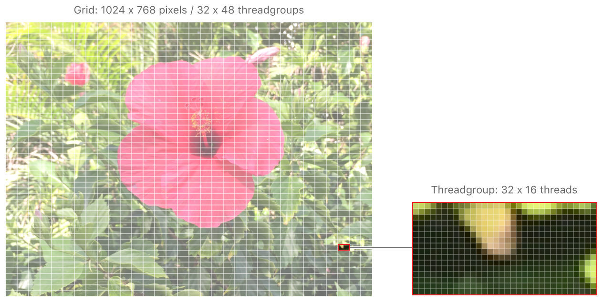
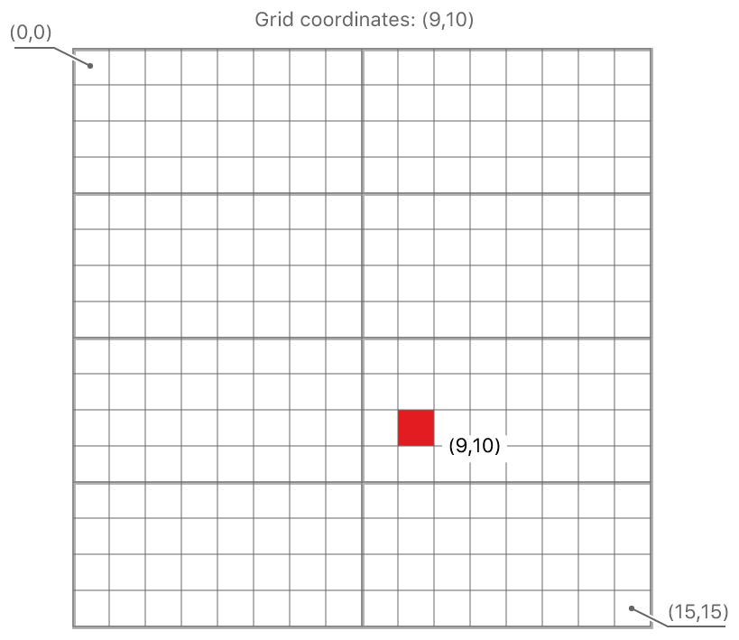
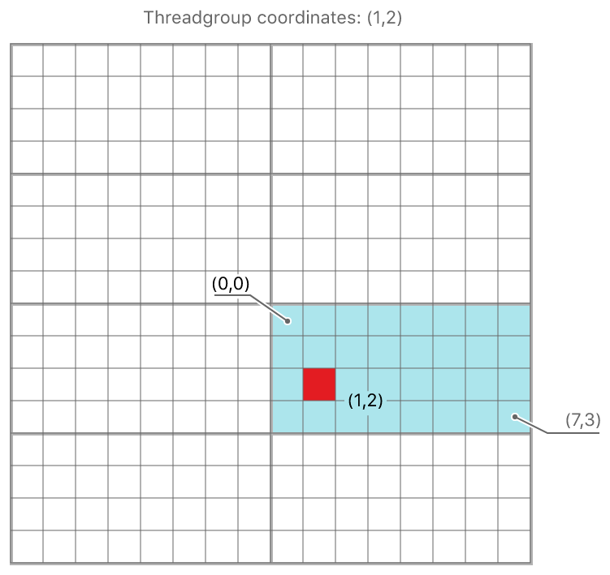
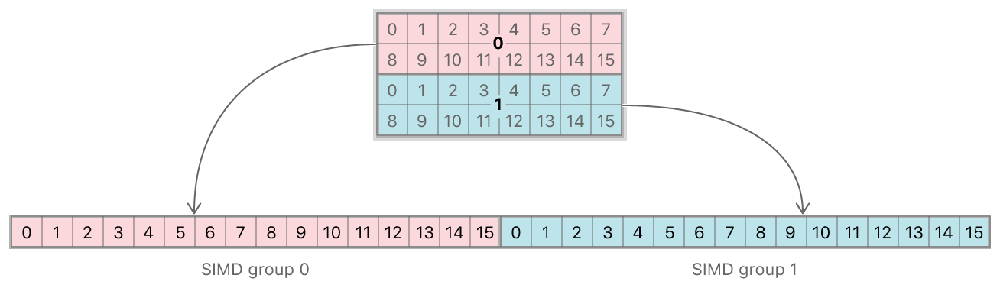
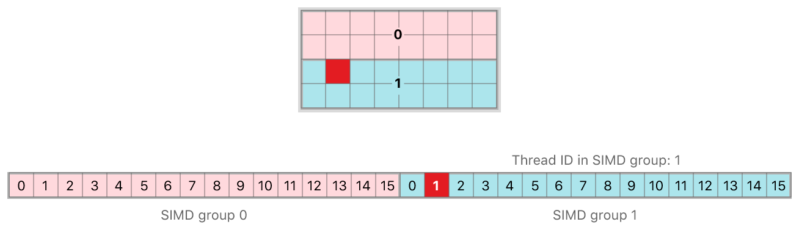

> 导航：[技术](../technologies.md) · [Metal](../metal.md) · [计算通道](compute-passes.md)

# 创建线程（Thread）与线程组（Threadgroup）

<sub>文章</sub>

了解 Metal 如何组织计算处理工作负载。

## 概述

计算通道可以在 1D、2D 或 3D 网格（grid）上运行核函数（kernel function）。网格中的每个点代表一个 _线程（thread）_，它是核函数的一个单独实例。例如，在图像处理中，网格通常是一个 2D 的线程矩阵——表示整个图像——每个线程对应正在被处理的图像中的一个像素。

每个线程属于一个 _线程组（threadgroup）_，线程组内的线程一起运行并共享一个公共的内存块。你可以设计核函数，让每个线程独立运行，也可以让它们作为一个团队在共同的工作集上协作。

### 通过线程在网格中的位置进行标识

[图 1](/documentation/metal/compute_passes/creating_threads_and_threadgroups#2928936) 显示了一个正在被计算核处理的图像是如何被划分为线程组，以及每个线程组是如何由单个线程组成的。每个线程处理一个像素。



你可以通过线程在网格中的位置来识别它，这是一个唯一的位置，可以使你的核函数能够为每个线程执行不同的操作。下面来自[在一个通道中结合 blit 和计算操作](combining-blit-and-compute-operations-in-a-single-pass.md)的示例核函数有一个 `gridID` 参数，这是一个表示每个线程 2D 坐标的向量，它在从一种纹理读取和写入另一种纹理时应用。

```metal
kernel void
convertToGrayscale(texture2d<half, access::read>  inTexture  [[texture(ComputeTextureBindingIndexForColorImage)]],
                   texture2d<half, access::write> outTexture [[texture(ComputeTextureBindingIndexForGrayscaleImage)]],
                   uint2                          gridId     [[thread_position_in_grid]])
{

    // 检查网格的这一部分是否在纹理的边界内。
    if ((gridId.x >= outTexture.get_width()) ||
        (gridId.y >= outTexture.get_height()))
    {
        // 对于超出目标纹理边界的坐标，提前退出。
        return;
    }

    /// 输入纹理在线程坐标处的数据值。
    half4 colorValue  = inTexture.read(gridId);

    /// 输入纹理颜色值的灰度等效值。
    half grayValue = dot(colorValue.rgb, kRec709LumaCoefficients);

    // 将灰度值写入输出纹理的线程坐标位置。
    outTexture.write(half4(grayValue, grayValue, grayValue, 1.0), gridId);
}
```

`[[thread_position_in_grid]]` 是一个 _特性限定符（attribute qualifier）_。特性限定符通过其双中括号语法识别，允许将核参数绑定到资源和内置变量——在此例中，将线程在网格中的位置绑定到核函数。

例如，对于一个 16 x 16 的网格，被划分为 2 x 4 个 8 x 4 线程的线程组，一个单独的线程（在[图 2](/documentation/metal/compute_passes/creating_threads_and_threadgroups#2929009) 中以红色显示）在网格中的位置为 (9,10)：



### 通过线程在线程组中的位置进行标识

线程在其线程组中的位置也可以通过特性限定符 `[[thread_position_in_threadgroup]]` 获得，而线程组在网格中的位置可以通过 `[[threadgroup_position_in_grid]]` 获得。

根据网格的形状不同，这些位置属性可以是一个标量值，也可以是包含两个或三个元素的向量。对于 2D 网格，位置属性是两个元素的向量，原点位于左上角。

在[图 2](/documentation/metal/compute_passes/creating_threads_and_threadgroups#2929009) 中标识的线程位于网格中位置为 (1,2) 的线程组内，并且它在该线程组中的位置为 (1,2)，如[图 3](/documentation/metal/compute_passes/creating_threads_and_threadgroups#2929421) 所示：



使用以下代码，你还可以根据线程在其线程组中的位置以及线程组的大小和在网格中的位置来计算线程在网格中的位置：

```metal
kernel void 
myKernel(uint2 threadgroup_position_in_grid   [[ threadgroup_position_in_grid ]],
         uint2 thread_position_in_threadgroup [[ thread_position_in_threadgroup ]],
         uint2 threads_per_threadgroup        [[ threads_per_threadgroup ]]) 
{
    
    uint2 thread_position_in_grid = 
        (threadgroup_position_in_grid * threads_per_threadgroup) + 
        thread_position_in_threadgroup;
}
```

### SIMD 组

线程组中的线程进一步组织为单指令多数据（SIMD）组，也称为 _warps_ 或 _wavefronts_，它们并发执行。一个 SIMD 组中的线程执行相同的代码。避免编写可能导致核函数 _发散（diverge）_ 的代码；也就是说，避免遵循不同的代码路径。一个典型的发散例子是由使用 _if_ 语句引起的。即使 SIMD 组中的单个线程走了与其他线程不同的路径，该组中的所有线程也会执行两个分支，并且该组的执行时间是这两个分支执行时间的总和。

线程组到 SIMD 组的划分由 Metal 定义。在核函数执行期间，对于具有相同启动参数（launch parameters）的给定核函数的多次调度（dispatch），以及调度内从一个线程组到另一个线程组，这种划分保持不变。

SIMD 组中的线程数由计算管线状态对象（compute pipeline state object）的 [threadExecutionWidth](mtlcomputepipelinestate/threadexecutionwidth.md) 返回。特性限定符允许你访问 SIMD 组在线程组内的标量索引，以及线程在 SIMD 组内的标量索引：

- **`[[simdgroup_index_in_threadgroup]]`** —— SIMD 组在其线程组中的唯一标量索引。
- **`[[thread_index_in_simdgroup]]`** —— 线程在其 SIMD 组中的唯一标量索引，也称为 _通道 ID（lane ID）_。

尽管线程组可以是多维的，但 SIMD 组是 1D 的。因此，对于所有线程组形状，线程在 SIMD 组内的位置都是一个标量值。SIMD 组大小保持不变，并且不受线程组大小的影响。

例如，使用[图 2](/documentation/metal/compute_passes/creating_threads_and_threadgroups#2929009) 中相同的 16 x 16 网格，线程执行宽度为 16，一个 8 x 4 的线程组由 2 个 SIMD 组组成。因为一个 SIMD 组包含 16 个线程，每个 SIMD 组构成线程组中的 2 行：



在[图 5](/documentation/metal/compute_passes/creating_threads_and_threadgroups#2929426) 中以红色显示的线程的 `[[simdgroup_index_in_threadgroup]]` 值为 1，`[[thread_index_in_simdgroup]]` 值为 1：



## 另请参阅

### 编码计算通道

- [计算线程组（Threadgroup）和网格（Grid）大小](calculating-threadgroup-and-grid-sizes.md)——在调度计算处理工作负载时，计算线程组和网格的最佳大小。
- [MTL4ComputeCommandEncoder](mtl4computecommandencoder.md)——将单个通道的计算调度、资源复制命令和加速结构构建命令编码到命令缓冲区中。
- [MTLComputeCommandEncoder](mtlcomputecommandencoder.md)——将单个计算通道的计算调度命令编码到命令缓冲区中。
