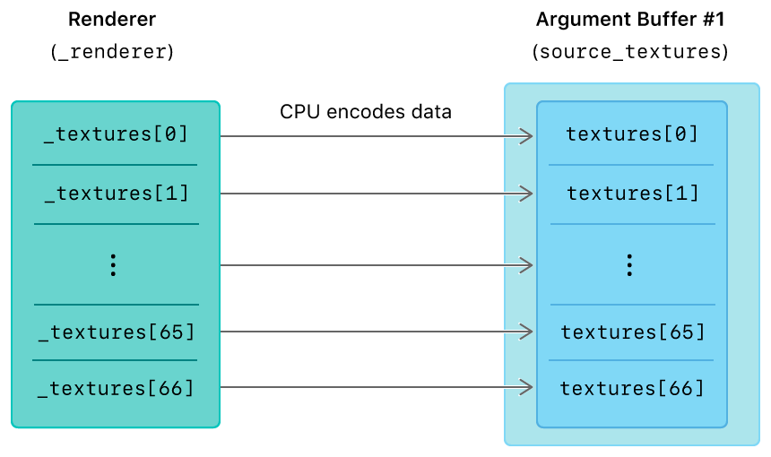
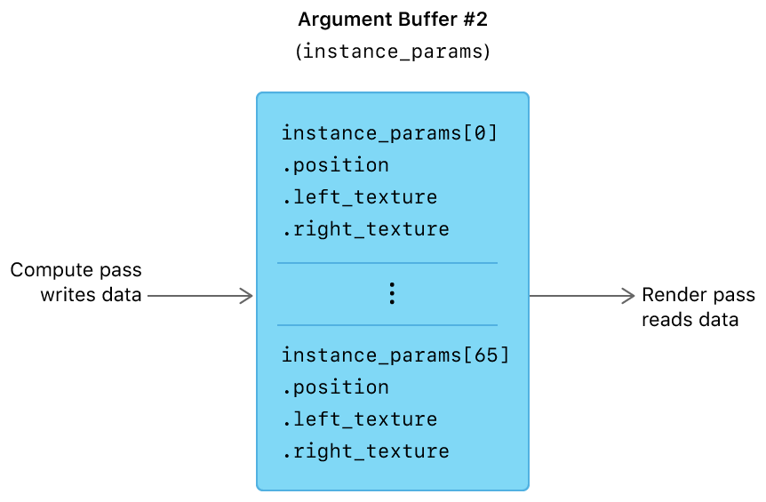

> 导航：[Technologies](../technologies.md) · [Metal](../metal.md) · [Buffers](buffers.md)

# 在 GPU 上编码参数缓冲区

<sub>示例代码</sub>

使用计算流程编码参数缓冲区，并在随后的渲染流程中访问其参数。

## 概述

在[将参数缓冲区与资源堆结合使用](using-argument-buffers-with-resource-heaps.md)中，你学习了如何将参数缓冲区与资源数组和资源堆结合起来。

在本示例中，你将学习如何使用图形函数或计算函数将资源编码到参数缓冲区中。具体来说，你会学习如何从计算流程中把数据写入参数缓冲区，然后在渲染流程中读取该数据。该示例渲染了一个由多个四边形实例组成的网格，每个四边形上应用了两张纹理，纹理会在四边形内部从左向右滑动，并在多个四边形之间从左向右移动。

### 准备工作

该示例只能在支持 Tier 2 参数缓冲区的设备上运行。Tier 2 设备允许图形函数或计算函数将数据编码到参数缓冲区中，而 Tier 1 设备只允许这些函数从参数缓冲区中读取数据。此外，相较于 Tier 1 设备，Tier 2 设备在实例化绘制调用中能够访问更多纹理。有关参数缓冲区分层、限制和功能的更多信息，请参阅[通过使用参数缓冲区提升 CPU 性能](improving-cpu-performance-by-using-argument-buffers.md)。

该示例在渲染器初始化时会检查是否支持 Tier 2 参数缓冲区。

**AAPLRenderer.m**

```objective-c
if(_view.device.argumentBuffersSupport != MTLArgumentBuffersTier2)
{
    NSAssert(0, @"This sample requires a Metal device that supports Tier 2 argument buffers.");
}
```

### 将数据编码到参数缓冲区中

在初始化期间，该示例使用 CPU 将数据编码到由 `SourceTextureArguments` 结构体定义的参数缓冲区中。

**AAPLShaders.metal**

```metal
struct SourceTextureArguments {
    texture2d<float>    texture [[ id(AAPLArgumentBufferIDTexture) ]];
};
```

该参数缓冲区由 `_sourceTextures` 缓冲区支持，并通过 `updateInstances` 函数中的 `source_textures` 变量进行访问。`source_textures` 是一个指向无边界结构体数组的指针，其中每个结构体都包含对一张纹理的引用。



<sub>布局示意图，展示了将一个纹理数组编码为参数缓冲区中一组指向这些纹理的引用数组。</sub>

初始化完成后，该示例在每一帧都会使用 GPU 将数据编码到另一个由 `InstanceArguments` 结构体定义的参数缓冲区中。

**AAPLShaders.metal**

```metal
struct InstanceArguments {
    vector_float2    position;
    texture2d<float> left_texture;
    texture2d<float> right_texture;
};
```

该参数缓冲区由 `_instanceParameters` 缓冲区支持，并通过 `updateInstances`、`vertexShader` 和 `fragmentShader` 函数中的 `instance_params` 变量进行访问。`instance_params` 是一个结构体数组，其数据在计算流程中填充，随后在渲染流程中通过实例化绘制调用进行访问。



### 创建参数缓冲区结构体数组

该示例定义了一个 `InstanceArguments` 结构体，一个计算函数 `updateInstances` 会将一个向量和两张纹理编码到其中。

**AAPLShaders.metal**

```metal
struct InstanceArguments {
    vector_float2    position;
    texture2d<float> left_texture;
    texture2d<float> right_texture;
};
```

以往的参数缓冲区示例使用 `encodedLength` 属性直接确定支持某个参数缓冲区结构体所需的 `MTLBuffer` 大小。然而，本示例需要为随后渲染流程中渲染的每个四边形都保留该结构体的一个实例。因此，该示例将 `encodedLength` 的值乘以实例总数，实例总数由常量 `AAPLNumInstances` 的值定义。

**AAPLRenderer.m**

```objective-c
NSUInteger instanceParameterLength = instanceParameterEncoder.encodedLength * AAPLNumInstances;

_instanceParameters = [_device newBufferWithLength:instanceParameterLength options:0];
```

> [!note] 注意
> 在本示例中，定义 `InstanceArguments` 结构体并不需要 `[[id(n)]]` 属性限定符。只有在通过 Metal API 使用 CPU 编码参数时才需要这个限定符，而通过图形函数或计算函数使用 GPU 编码参数时则不需要。

### 使用计算函数编码参数缓冲区

对于每个要渲染的四边形，该示例都会执行 `updateInstances` 计算函数，以确定该四边形的位置和纹理。该示例执行的计算流程会遍历 `instance_params` 数组，并为每个四边形编码正确的数据。该示例通过在 `instanceID` 索引值处的数组元素上设置 `InstanceArguments` 值，将数据编码到 `instance_params` 中。

**AAPLShaders.metal**

```metal
// Select the element in the instance_params array which stores the parameter for the quad.
device InstanceArguments & quad_params = instance_params[instanceID];

// Store the position of the quad.
quad_params.position = position;

// Select and store the textures to apply to this quad.
quad_params.left_texture = source_textures[left_texture_index].texture;
quad_params.right_texture = source_textures[right_texture_index].texture;
```

### 使用参数缓冲区渲染实例

该示例发出一次实例化绘制调用来渲染所有四边形，同时只产生极少量的 CPU 开销。将这种技巧与参数缓冲区结合，使得该示例可以在同一次绘制调用中为每个四边形使用一组独特的资源，其中每个实例绘制一个四边形。

该示例在顶点函数和片段函数的签名中都声明了一个 `instanceID` 变量。渲染管线使用 `instanceID` 在此前由 `updateInstances` 计算函数编码的 `instance_params` 数组中进行索引。

在顶点函数中，`instanceID` 被定义为带有 `[[instance_id]]` 属性限定符的一个参数。

**AAPLShaders.metal**

```metal
vertex RasterizerData
vertexShader(uint                            vertexID        [[ vertex_id ]],
             uint                            instanceID      [[ instance_id ]],
             const device AAPLVertex        *vertices        [[ buffer(AAPLVertexBufferIndexVertices) ]],
             const device InstanceArguments *instance_params [[ buffer(AAPLVertexBufferIndexInstanceParams) ]],
             constant AAPLFrameState        &frame_state     [[ buffer(AAPLVertexBufferIndexFrameState) ]])
```

顶点函数从参数缓冲区读取位置数据，从而将四边形渲染到可绘制对象中的正确位置。

**AAPLShaders.metal**

```metal
float2 quad_position = instance_params[instanceID].position;
```

随后，顶点函数通过 `RasterizerData` 结构体和 `[[stage_in]]` 属性限定符，将 `instanceID` 变量传递给片段函数。（在片段函数中，`instanceID` 通过 `in` 参数访问。）

**AAPLShaders.metal**

```metal
fragment float4
fragmentShader(RasterizerData            in              [[ stage_in ]],
               device InstanceArguments *instance_params [[ buffer(AAPLFragmentBufferIndexInstanceParams) ]],
               constant AAPLFrameState  &frame_state     [[ buffer(AAPLFragmentBufferIndexFrameState) ]])
```

片段函数从参数缓冲区中指定的两张纹理进行采样，然后根据 `slideFactor` 的值选择输出的采样结果。

**AAPLShaders.metal**

```metal
texture2d<float> left_texture = instance_params[instanceID].left_texture;
texture2d<float> right_texture = instance_params[instanceID].right_texture;

float4 left_sample = left_texture.sample(texture_sampler, in.tex_coord);
float4 right_sample = right_texture.sample(texture_sampler, in.tex_coord);

if(frame_state.slideFactor < in.tex_coord.x)
{
    output_color = left_sample;
}
else
{
    output_color = right_sample;
}
```

片段函数输出所选取的采样结果。左侧纹理从左边滑入，右侧纹理向右边滑出。当右侧纹理完全滑出四边形后，该示例会在下一次计算流程中将这张纹理指定为左侧纹理。这样一来，每张纹理就会在整个四边形网格中从左向右移动。

### 后续步骤

在本示例中，你学习了如何使用图形函数或计算函数将资源编码到参数缓冲区中。在[使用参数缓冲区动态渲染地形](rendering-terrain-dynamically-with-argument-buffers.md)中，你将学习如何结合多种参数缓冲区技巧来实时渲染动态地形。

## 另请参阅

### Argument buffers

- [通过使用参数缓冲区提升 CPU 性能](improving-cpu-performance-by-using-argument-buffers.md) — 通过将资源分组到参数缓冲区中来优化你的 App 的性能。
- [使用参数缓冲区管理资源组](managing-groups-of-resources-with-argument-buffers.md) — 创建参数缓冲区以组织相关资源。
- [跟踪参数缓冲区的资源驻留情况](tracking-the-resource-residency-of-argument-buffers.md) — 优化参数缓冲区内的资源性能。
- [为参数缓冲区建立索引](indexing-argument-buffers.md) — 在参数缓冲区内分配资源索引。
- [使用参数缓冲区动态渲染地形](rendering-terrain-dynamically-with-argument-buffers.md) — 使用参数缓冲区结合 GPU 驱动的管线实时渲染地形。
- [将参数缓冲区与资源堆结合使用](using-argument-buffers-with-resource-heaps.md) — 通过在参数缓冲区内使用数组并将其与资源堆结合，来减少 CPU 开销。
- [MTLArgumentDescriptor](mtlargumentdescriptor.md) — 参数缓冲区内某个参数的表示形式。
- [MTLArgumentEncoder](mtlargumentencoder.md) — 可用于将参数数据编码到参数缓冲区中的接口。
- [MTLAttributeStrideStatic](mtlattributestridestatic.md)

## 下载

- [EncodingArgumentBuffersOnTheGPU.zip](https://docs-assets.developer.apple.com/published/1c138b5e911a/EncodingArgumentBuffersOnTheGPU.zip)
