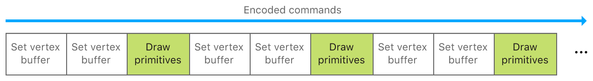
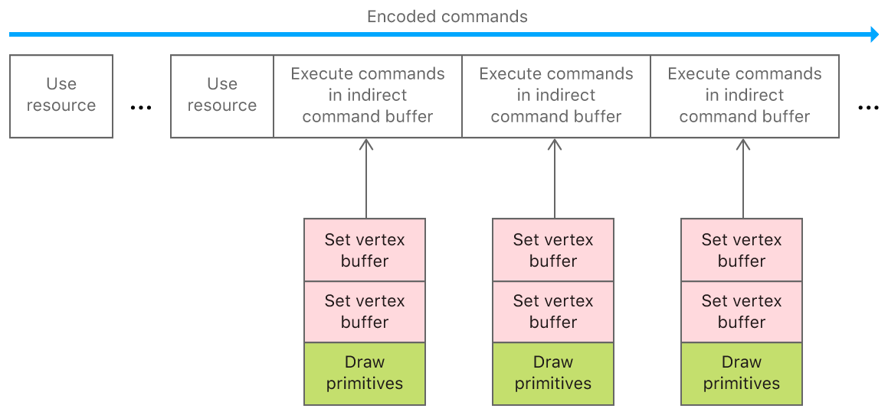
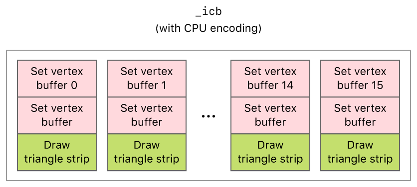

> 导航：[Technologies](../technologies.md) · [Metal](../metal.md) · [Indirect command encoding](indirect-command-encoding.md)

# 在 CPU 上编码间接命令缓冲区

<sub>示例代码</sub>

通过重用命令来减少 CPU 开销并简化命令执行。

## 概述

该示例 App 介绍了_间接命令缓冲区_（indirect command buffer，ICB），它能让你存储重复的命令以供以后使用。由于 Metal 在执行完一个普通命令缓冲区及其命令后会将其丢弃，因此可以使用 ICB 为 App 中常见的指令节省高昂的分配、释放和编码时间。此外，使用 ICB 还能带来以下好处：

- 由于你只需一次调用即可执行一个 ICB，从而减少渲染任务。
- 通过在初始化时创建 ICB，将高昂的命令管理工作移出 App 在渲染或计算时的关键路径。

ICB 发挥效用的一个典型场景是游戏的抬头显示（head-up display，HUD），原因在于：

- 你每一帧都要渲染 HUD。
- HUD 的外观在各帧之间通常是静态的。

ICB 在渲染典型 3D 场景中的静态对象时同样很有用。由于编码后的命令通常会生成轻量级的数据结构，ICB 也适合用来保存复杂的绘制。

本示例演示了如何设置一个 ICB 来重复渲染一系列形状。虽然在 GPU 上编码 ICB 可以获得更高的指令并行度，但为了简单起见，本示例在 CPU 上编码 ICB。有关更高级的用法，请参阅[在 GPU 上编码间接命令缓冲区](encoding-indirect-command-buffers-on-the-gpu.md)。

### 准备工作

该示例包含 macOS 和 iOS 目标（target）。请在实体设备上运行 iOS scheme，因为模拟器不支持 Metal。

以下及更高版本系列的 GPU 支持 ICB：

- `MTLFeatureSet_iOS_GPUFamily3_v4`
- `MTLFeatureSet_macOS_GPUFamily2_v1`

你可以使用 [MTLDevice](mtldevice.md) 的 [- supportsFeatureSet:](<mtldevice/supportsfeatureset(__).md>) 方法，在运行时检查你所选择的 GPU 是否支持 ICB：

**AAPLViewController.m**

```objective-c
#if TARGET_IOS
    supportICB = [_view.device supportsFeatureSet:MTLFeatureSet_iOS_GPUFamily3_v4];
#else
    supportICB = [_view.device supportsFeatureSet:MTLFeatureSet_macOS_GPUFamily2_v1];
#endif
```

本示例在其视图控制器的 `viewDidLoad:` 回调中为此调用 `supportsFeatureSet:`。

### 单条命令与间接命令缓冲区的对比

Metal App，尤其是游戏，通常包含多条渲染命令，每条命令都关联一组渲染状态、缓冲区和绘制调用。要为某个渲染流程执行这些命令，App 首先要将它们编码到某个命令缓冲区内的渲染命令编码器中。

你可以通过调用 [MTLRenderCommandEncoder](mtlrendercommandencoder.md) 的方法，例如 [- setVertexBuffer:offset:atIndex:](<mtlrendercommandencoder/setvertexbuffer(__offset_index_).md>) 或 [- drawPrimitives:vertexStart:vertexCount:instanceCount:baseInstance:](<mtlrendercommandencoder/drawprimitives(type_vertexstart_vertexcount_instancecount_baseinstance_).md>)，将单条命令编码到渲染命令编码器中。



从编码角度看，重新创建与之前队列中相同的绘制既繁琐，在运行时性能也不佳。相反，可以使用 [MTLIndirectRenderCommand](mtlindirectrendercommand.md) 将重复的绘制及其数据缓冲区移入一个 [MTLIndirectCommandBuffer](mtlindirectcommandbuffer.md) 实例，从而用命令填充该 ICB。当你准备好使用该 ICB 时，可以通过调用 `MTLRenderCommandEncoder` 实例的 [executeCommandsInBuffer:withRange:](mtlrendercommandencoder/executecommandsinbuffer_withrange_.md) 方法来编码对它的单次执行。



<sub>布局示意图，展示了在间接命令缓冲区内被编码为一组命令的渲染命令，而该间接命令缓冲区本身又被编码为一条单独的命令。</sub>

> [!note] 注意
> 要访问某个间接命令缓冲区所引用的各个单独缓冲区，你需要为想要使用的每个缓冲区调用 `useResource:usage:` 方法。更多信息请参阅“执行间接命令缓冲区”一节。

### 定义渲染命令和继承的渲染状态

对于间接命令缓冲区 `_indirectCommandBuffer`，该示例定义了以下渲染命令：

1. 为每个网格设置一个使用其独有顶点数据的顶点缓冲区
2. 设置另一个顶点缓冲区，使用对所有网格通用的变换数据
3. 设置另一个顶点缓冲区，其中包含每个网格的参数数组
4. 绘制该网格的三角形

该示例对 CPU 和 GPU 采用不同方式编码这些命令。不过，这些命令仍会被编码到两个版本的间接命令缓冲区中。

该示例还允许 `_indirectCommandBuffer` 从其父编码器 `renderEncoder` 继承渲染管线状态。此外，`_indirectCommandBuffer` 还会隐式继承所有无法编码到其中的渲染状态，比如渲染流程的剔除模式以及深度或模板状态。

### 创建间接命令缓冲区

该示例通过一个 [MTLIndirectCommandBufferDescriptor](mtlindirectcommandbufferdescriptor.md) 创建了 `_indirectCommandBuffer`，该描述符定义了间接命令缓冲区的特性和限制。

**AAPLRenderer.m**

```objective-c
        MTLIndirectCommandBufferDescriptor* icbDescriptor = [MTLIndirectCommandBufferDescriptor new];

        // Indicate that the only draw commands will be standard (non-indexed) draw commands.
        icbDescriptor.commandTypes = MTLIndirectCommandTypeDraw;

        // Indicate that buffers will be set for each command IN the indirect command buffer.
        icbDescriptor.inheritBuffers = NO;

        // Indicate that a max of 3 buffers will be set for each command.
        icbDescriptor.maxVertexBufferBindCount = 3;
        icbDescriptor.maxFragmentBufferBindCount = 0;

#if defined TARGET_MACOS || defined(__IPHONE_13_0)
        // Indicate that the render pipeline state object will be set in the render command encoder
        // (not by the indirect command buffer).
        // On iOS, this property only exists on iOS 13 and later.  It defaults to YES in earlier
        // versions
        if (@available(iOS 13.0, *)) {
            icbDescriptor.inheritPipelineState = YES;
        }
#endif

        _indirectCommandBuffer = [_device newIndirectCommandBufferWithDescriptor:icbDescriptor
                                                                 maxCommandCount:AAPLNumObjects
                                                                         options:0];
```

该示例指定了命令的类型 `commandTypes` 以及命令的最大数量 `maxCount`，以便 Metal 在内存中预留足够的空间，使该示例能够成功地（用 CPU 或 GPU）编码 `_indirectCommandBuffer`。

### 使用 CPU 编码间接命令缓冲区

在 CPU 端，该示例使用一个 [MTLIndirectRenderCommand](mtlindirectrendercommand.md) 实例将命令编码到 `_indirectCommandBuffer` 中。对于每个要渲染的形状，该示例都会编码两条 [- setVertexBuffer:offset:atIndex:](<mtlindirectrendercommand/setvertexbuffer(__offset_at_).md>) 命令和一条 [- drawPrimitives:vertexStart:vertexCount:instanceCount:baseInstance:](<mtlindirectrendercommand/drawprimitives(__vertexstart_vertexcount_instancecount_baseinstance_).md>) 命令。

**AAPLRenderer.m**

```objective-c
//  Encode a draw command for each object drawn in the indirect command buffer.
for (int objIndex = 0; objIndex < AAPLNumObjects; objIndex++)
{
    id<MTLIndirectRenderCommand> ICBCommand =
        [_indirectCommandBuffer indirectRenderCommandAtIndex:objIndex];

    [ICBCommand setVertexBuffer:_vertexBuffer[objIndex]
                         offset:0
                        atIndex:AAPLVertexBufferIndexVertices];

    [ICBCommand setVertexBuffer:_indirectFrameStateBuffer
                         offset:0
                        atIndex:AAPLVertexBufferIndexFrameState];

    [ICBCommand setVertexBuffer:_objectParameters
                         offset:0
                        atIndex:AAPLVertexBufferIndexObjectParams];

    const NSUInteger vertexCount = _vertexBuffer[objIndex].length/sizeof(AAPLVertex);

    [ICBCommand drawPrimitives:MTLPrimitiveTypeTriangle
                   vertexStart:0
                   vertexCount:vertexCount
                 instanceCount:1
                  baseInstance:objIndex];
}
```

该示例只在编码任何后续渲染命令之前执行这一次编码。`_indirectCommandBuffer` 总共包含 16 条绘制调用，每个待渲染形状对应一条。每条绘制调用都引用同一份变换数据 `_uniformBuffers`，但使用不同的顶点数据 `_vertexBuffers[indx]`。虽然 CPU 只编码一次数据，但该示例每帧仍会发出 16 条绘制调用。



### 更新 ICB 所使用的数据

要更新提供给 GPU 的数据，通常的做法是在一组缓冲区中循环使用，让 CPU 更新其中一个的同时 GPU 读取另一个（参见[在 GPU 和 CPU 之间同步事件](synchronizing-events-between-a-gpu-and-the-cpu.md)）。但对于 ICB，你无法照搬这种模式，因为在命令编码完成后，你无法再更新 ICB 的缓冲区集合；不过，你可以遵循一个两步流程，从 CPU 端拼接（blit）数据更新。首先，在 CPU 上更新动态缓冲区数组中的单个缓冲区：

**AAPLRenderer.m**

```objective-c
_frameNumber++;

_inFlightIndex = _frameNumber % AAPLMaxFramesInFlight;

AAPLFrameState * frameState = _frameStateBuffer[_inFlightIndex].contents;
```

然后，将 CPU 端的缓冲区集合拼接（blit）到 ICB 可以访问的位置（参见 `_indirectFrameStateBuffer`）：

**AAPLRenderer.m**

```objective-c
/// Encode blit commands to update the buffer holding the frame state.
id<MTLBlitCommandEncoder> blitEncoder = [commandBuffer blitCommandEncoder];

[blitEncoder copyFromBuffer:_frameStateBuffer[_inFlightIndex] sourceOffset:0
                   toBuffer:_indirectFrameStateBuffer destinationOffset:0
                       size:_indirectFrameStateBuffer.length];

[blitEncoder endEncoding];
```

### 执行间接命令缓冲区

该示例调用 `executeCommandsInBuffer:withRange:` 方法来执行 `_indirectCommandBuffer` 中的命令。

**AAPLRenderer.m**

```objective-c
// Draw everything in the indirect command buffer.
[renderEncoder executeCommandsInBuffer:_indirectCommandBuffer withRange:NSMakeRange(0, AAPLNumObjects)];
```

与参数缓冲区中的参数类似，该示例调用 `useResource:usage:` 方法，以表明 GPU 可以访问某个间接命令缓冲区内的资源。

**AAPLRenderer.m**

```objective-c
// Make a useResource call for each buffer needed by the indirect command buffer.
for (int i = 0; i < AAPLNumObjects; i++)
{
    [renderEncoder useResource:_vertexBuffer[i] usage:MTLResourceUsageRead];
}

[renderEncoder useResource:_objectParameters usage:MTLResourceUsageRead];

[renderEncoder useResource:_indirectFrameStateBuffer usage:MTLResourceUsageRead];
```

该示例在每一帧都会继续执行 `_indirectCommandBuffer`。

## 另请参阅

### Indirect command buffers

- [创建间接命令缓冲区](creating-an-indirect-command-buffer.md) — 配置一个描述符以指定间接命令缓冲区的属性。
- [间接指定绘制和调度参数](specifying-drawing-and-dispatch-arguments-indirectly.md) — 如果你在编码命令时不知道绘制或调度调用的参数，请使用间接命令。
- [在 GPU 上编码间接命令缓冲区](encoding-indirect-command-buffers-on-the-gpu.md) — 通过在 GPU 上生成渲染命令，最大化 CPU 到 GPU 的并行度。
- [MTLIndirectCommandBuffer](mtlindirectcommandbuffer.md) — 一个包含可重用命令的命令缓冲区，可在 CPU 或 GPU 上编码。
- [MTLIndirectCommandBufferDescriptor](mtlindirectcommandbufferdescriptor.md) — 用于自定间接命令缓冲区的配置。
- [MTLIndirectCommandType](mtlindirectcommandtype.md) — 你可以编码到间接命令缓冲区中的命令类型。
- [MTLIndirectCommandBufferExecutionRange](mtlindirectcommandbufferexecutionrange.md) — 间接命令缓冲区中的一段命令范围。
- [MTLIndirectCommandBufferExecutionRangeMake](<mtlindirectcommandbufferexecutionrangemake(____).md>) — 创建一个命令执行范围。

## 下载

- [EncodingIndirectCommandBuffersOnTheCPU.zip](https://docs-assets.developer.apple.com/published/2af775e98586/EncodingIndirectCommandBuffersOnTheCPU.zip)
