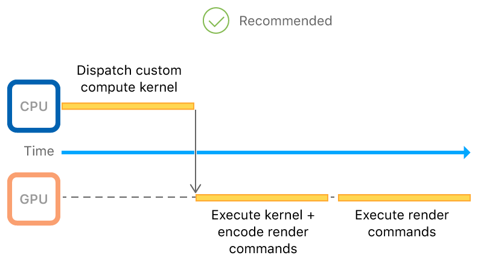
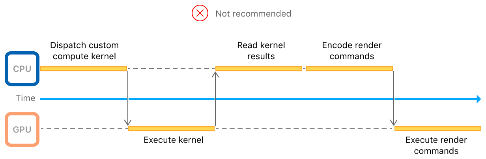

> 导航：[Technologies](../technologies.md) · [Metal](../metal.md) · [Indirect command encoding](indirect-command-encoding.md)

# 在 GPU 上编码间接命令缓冲区

<sub>示例代码</sub>

通过在 GPU 上生成渲染命令，最大化 CPU 到 GPU 的并行度。

## 概述

该示例 App 演示了如何使用_间接命令缓冲区_（indirect command buffer，ICB）从 GPU 发出渲染指令。当你有一个在计算内核中运行的渲染算法时，可以使用 ICB 根据该算法的结果生成绘制调用。该示例 App 使用一个计算内核，移除提交渲染的不可见对象，只为场景中当前可见的对象生成绘制命令。



<sub>一个算法及其依赖的渲染指令在 GPU 上执行的流程图。左侧代表 CPU 的主体通过计算内核将该算法分派给 GPU。一条线从左侧主体流向中间代表 GPU 的另一个主体，该主体执行计算内核并使用 ICB 生成其依赖的渲染命令。一条线从中间主体流向右侧同样代表 GPU 的另一个主体，该主体执行这些渲染命令。</sub>

如果没有 ICB，你就无法在 GPU 上提交渲染命令。此时，CPU 必须等待计算内核的结果，然后才能生成渲染命令。随后，GPU 还要等待渲染命令跨越 CPU 到 GPU 的桥梁传送过来。下图展示了这种方式如何导致更慢的往返过程：



示例代码工程[在 CPU 上编码间接命令缓冲区](encoding-indirect-command-buffers-on-the-cpu.md)通过创建单个 ICB 以便每帧重用其命令，介绍了 ICB 的基本用法。前一个示例通过重用命令节省了高昂的命令编码时间，而本示例则使用 ICB 实现了一条 GPU 驱动的渲染管线。

本示例展示的技巧包括从 GPU 发出绘制调用，以及执行一组精选绘制的流程。

### 准备工作

该工程包含 macOS 和 iOS 目标（target）。请在实体设备上运行 iOS scheme，因为模拟器不支持 Metal。

该示例调用了 [MTLComputeCommandEncoder](mtlcomputecommandencoder.md) 实例的
[- dispatchThreads:threadsPerThreadgroup:](<mtlcomputecommandencoder/dispatchthreads(__threadsperthreadgroup_).md>) 方法，该方法适用于支持以下及更高版本特性集的 GPU：

- MTLFeatureSet_iOS_GPUFamily4_v2
- MTLFeatureSet_macOS_GPUFamily2_v1

### 定义 ICB 读取的数据

在理想情况下，你会把每个网格存储在各自的缓冲区中。然而，在 iOS 上，运行于 GPU 的内核在每次执行时只能访问有限数量的数据缓冲区。为了减少 ICB 执行期间所需的缓冲区数量，你需要将所有网格打包进一个单独的缓冲区，各自使用不同的偏移量。然后，使用另一个缓冲区来存储每个网格的偏移量和大小。具体流程如下。

在初始化时，为每个网格创建数据：

**AAPLRenderer.m**

```objective-c
for(int objectIdx = 0; objectIdx < AAPLNumObjects; objectIdx++)
{
    // Choose the parameters to generate a mesh so that each one is unique.
    uint32_t numTeeth = random() % 50 + 3;
    float innerRatio = 0.2 + (random() / (1.0 * RAND_MAX)) * 0.7;
    float toothWidth = 0.1 + (random() / (1.0 * RAND_MAX)) * 0.4;
    float toothSlope = (random() / (1.0 * RAND_MAX)) * 0.2;

    // Create a vertex buffer and initialize it with a unique 2D gear mesh.
    tempMeshes[objectIdx] = [self newGearMeshWithNumTeeth:numTeeth
                                               innerRatio:innerRatio
                                               toothWidth:toothWidth
                                               toothSlope:toothSlope];
}
```

统计各个网格及累计的网格大小，并创建容器缓冲区：

**AAPLRenderer.m**

```objective-c
size_t bufferSize = 0;

for(int objectIdx = 0; objectIdx < AAPLNumObjects; objectIdx++)
{
    size_t meshSize = sizeof(AAPLVertex) * tempMeshes[objectIdx].numVerts;
    bufferSize += meshSize;
}

_vertexBuffer = [_device newBufferWithLength:bufferSize options:0];
```

最后，将每个网格插入容器缓冲区，同时在第二个缓冲区中记录其偏移量和大小：

**AAPLRenderer.m**

```objective-c
for(int objectIdx = 0; objectIdx < AAPLNumObjects; objectIdx++)
{
    // Store the mesh metadata in the `params` buffer.

    params[objectIdx].numVertices = tempMeshes[objectIdx].numVerts;

    size_t meshSize = sizeof(AAPLVertex) * tempMeshes[objectIdx].numVerts;

    params[objectIdx].startVertex = currentStartVertex;

    // Pack the current mesh data in the combined vertex buffer.

    AAPLVertex* meshStartAddress = ((AAPLVertex*)_vertexBuffer.contents) + currentStartVertex;

    memcpy(meshStartAddress, tempMeshes[objectIdx].vertices, meshSize);

    currentStartVertex += tempMeshes[objectIdx].numVerts;

    free(tempMeshes[objectIdx].vertices);

    // Set the other culling and mesh rendering parameters.

    // Set the position of each object to a unique space in a grid.
    vector_float2 gridPos = (vector_float2){objectIdx % AAPLGridWidth, objectIdx / AAPLGridWidth};
    params[objectIdx].position = gridPos * AAPLObjecDistance;

    params[objectIdx].boundingRadius = AAPLObjectSize / 2.0;
}
```

### 动态更新 ICB 读取的数据

通过从渲染管线所处理的数据中剔除不可见的顶点，可以节省大量的渲染时间和开销。为此，可以使用同一个计算内核（该内核编码 ICB 的命令）来持续更新 ICB 的数据缓冲区：

**AAPLShaders.metal**

```metal
// Check whether the object at 'objectIndex' is visible and set draw parameters if so.
// Otherwise, reset the command.
kernel void
cullMeshesAndEncodeCommands(uint                         objectIndex   [[ thread_position_in_grid ]],
                            constant AAPLFrameState     *frame_state   [[ buffer(AAPLKernelBufferIndexFrameState) ]],
                            device AAPLObjectPerameters *object_params [[ buffer(AAPLKernelBufferIndexObjectParams)]],
                            device AAPLVertex           *vertices      [[ buffer(AAPLKernelBufferIndexVertices) ]],
                            device ICBContainer         *icb_container [[ buffer(AAPLKernelBufferIndexCommandBufferContainer) ]])
{
    float2 worldObjectPostion  = frame_state->translation + object_params[objectIndex].position;
    float2 clipObjectPosition  = frame_state->aspectScale * AAPLViewScale * worldObjectPostion;

    const float rightBounds =  1.0;
    const float leftBounds  = -1.0;
    const float upperBounds =  1.0;
    const float lowerBounds = -1.0;

    bool visible = true;

    // Set the bounding radius in the view space.
    const float2 boundingRadius = frame_state->aspectScale * AAPLViewScale * object_params[objectIndex].boundingRadius;

    // Check if the object's bounding circle has moved outside of the view bounds.
    if(clipObjectPosition.x + boundingRadius.x < leftBounds  ||
       clipObjectPosition.x - boundingRadius.x > rightBounds ||
       clipObjectPosition.y + boundingRadius.y < lowerBounds ||
       clipObjectPosition.y - boundingRadius.y > upperBounds)
    {
        visible = false;
    }
    // Get indirect render commnd object from the indirect command buffer given the object's unique
    // index to set parameters for drawing (or not drawing) the object.
    render_command cmd(icb_container->commandBuffer, objectIndex);

    if(visible)
    {
        // Set the buffers and add a draw command.
        cmd.set_vertex_buffer(frame_state, AAPLVertexBufferIndexFrameState);
        cmd.set_vertex_buffer(object_params, AAPLVertexBufferIndexObjectParams);
        cmd.set_vertex_buffer(vertices, AAPLVertexBufferIndexVertices);

        cmd.draw_primitives(primitive_type::triangle,
                            object_params[objectIndex].startVertex,
                            object_params[objectIndex].numVertices, 1,
                            objectIndex);
    }

    // If the object isn't visible, Metal doesn't set a draw command as long as the app resets
    // the indirect command buffer commands with a blit encoder before encoding the draw.
}
```

GPU 的并行特性会为你自动划分这个计算任务，从而使多个屏幕外的网格被并发剔除。

### 使用参数缓冲区将 ICB 传递给计算内核

要在 GPU 上获取一个 ICB 并让计算内核能够访问它，你需要通过参数缓冲区来传递它，具体如下：

将容器参数缓冲区定义为一个包含单个成员（即该 ICB）的结构体：

**AAPLShaders.metal**

```metal
// This is the argument buffer that contains the ICB.
struct ICBContainer
{
    command_buffer commandBuffer [[ id(AAPLArgumentBufferIDCommandBuffer) ]];
};
```

将该 ICB 编码到参数缓冲区中：

**AAPLRenderer.m**

```objective-c
id<MTLArgumentEncoder> argumentEncoder =
    [GPUCommandEncodingKernel newArgumentEncoderWithBufferIndex:AAPLKernelBufferIndexCommandBufferContainer];

_icbArgumentBuffer = [_device newBufferWithLength:argumentEncoder.encodedLength
                                       options:MTLResourceStorageModeShared];
_icbArgumentBuffer.label = @"ICB Argument Buffer";

[argumentEncoder setArgumentBuffer:_icbArgumentBuffer offset:0];

[argumentEncoder setIndirectCommandBuffer:_indirectCommandBuffer
                                  atIndex:AAPLArgumentBufferIDCommandBuffer];
```

通过在内核的计算命令编码器上设置该参数缓冲区，将该 ICB（`_indirectCommandBuffer`）传递给内核：

**AAPLRenderer.m**

```objective-c
[computeEncoder setBuffer:_icbArgumentBuffer offset:0 atIndex:AAPLKernelBufferIndexCommandBufferContainer];
```

由于你是通过参数缓冲区传递该 ICB，因此标准的参数缓冲区规则也同样适用。在该 ICB 上调用 `useResource`，告知 Metal 准备好使用它：

**AAPLRenderer.m**

```objective-c
[computeEncoder useResource:_indirectCommandBuffer usage:MTLResourceUsageWrite];
```

### 编码并优化 ICB 命令

在开始编码之前，将该 ICB 的命令重置为初始状态：

**AAPLRenderer.m**

```objective-c
[resetBlitEncoder resetCommandsInBuffer:_indirectCommandBuffer
                              withRange:NSMakeRange(0, AAPLNumObjects)];
```

通过分派该计算内核来编码该 ICB 的命令：

**AAPLRenderer.m**

```objective-c
[computeEncoder dispatchThreads:MTLSizeMake(AAPLNumObjects, 1, 1)
          threadsPerThreadgroup:MTLSizeMake(threadExecutionWidth, 1, 1)];
```

通过调用 `optimizeIndirectCommandBuffer:withRange:`，优化你的 ICB 命令，移除空命令或冗余状态：

**AAPLRenderer.m**

```objective-c
[optimizeBlitEncoder optimizeIndirectCommandBuffer:_indirectCommandBuffer
                                         withRange:NSMakeRange(0, AAPLNumObjects)];
```

本示例之所以要优化 ICB 命令，是因为内核为每次绘制都设置一个缓冲区、并为每个不可见对象都编码空命令，由此产生了冗余状态。通过移除这些空命令，你可以释放命令缓冲区中大量的空白空间，否则 Metal 在运行时会耗费时间跳过这些空白。

> [!note] 注意
> 如果你优化了一个间接命令缓冲区，就无法再使用起始位置落在已优化区域内的范围来调用 `executeCommandsInBuffer:withRange:`。请改为指定一个起始于开头、并在已优化区域内或结尾处结束的范围。

### 执行该 ICB

通过在渲染命令编码器上调用 `executeCommandsInBuffer`，绘制屏幕上的网格：

**AAPLRenderer.m**

```objective-c
[renderEncoder executeCommandsInBuffer:_indirectCommandBuffer withRange:NSMakeRange(0, AAPLNumObjects)];
```

虽然你可以在计算内核中编码一个 ICB 的命令，但你需要从主机 App 中调用 `executeCommandsInBuffer`，以编码一条包含该计算内核所编码的全部命令的单一命令。这样做能让你选择该 ICB 的命令进入的队列和缓冲区。你调用 `executeIndirectCommandBuffer` 的时机，决定了该 ICB 的命令在你可能同时编码到同一缓冲区中的其他命令之间的位置。

## 另请参阅

### Indirect command buffers

- [创建间接命令缓冲区](creating-an-indirect-command-buffer.md) — 配置一个描述符以指定间接命令缓冲区的属性。
- [间接指定绘制和调度参数](specifying-drawing-and-dispatch-arguments-indirectly.md) — 如果你在编码命令时不知道绘制或调度调用的参数，请使用间接命令。
- [在 CPU 上编码间接命令缓冲区](encoding-indirect-command-buffers-on-the-cpu.md) — 通过重用命令来减少 CPU 开销并简化命令执行。
- [MTLIndirectCommandBuffer](mtlindirectcommandbuffer.md) — 一个包含可重用命令的命令缓冲区，可在 CPU 或 GPU 上编码。
- [MTLIndirectCommandBufferDescriptor](mtlindirectcommandbufferdescriptor.md) — 用于自定间接命令缓冲区的配置。
- [MTLIndirectCommandType](mtlindirectcommandtype.md) — 你可以编码到间接命令缓冲区中的命令类型。
- [MTLIndirectCommandBufferExecutionRange](mtlindirectcommandbufferexecutionrange.md) — 间接命令缓冲区中的一段命令范围。
- [MTLIndirectCommandBufferExecutionRangeMake](<mtlindirectcommandbufferexecutionrangemake(____).md>) — 创建一个命令执行范围。

## 下载

- [EncodingIndirectCommandBuffersOnTheGPU.zip](https://docs-assets.developer.apple.com/published/7aef47e24b2b/EncodingIndirectCommandBuffersOnTheGPU.zip)
