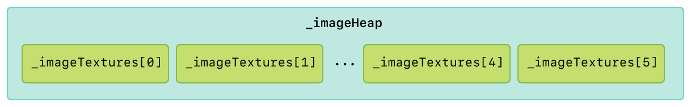
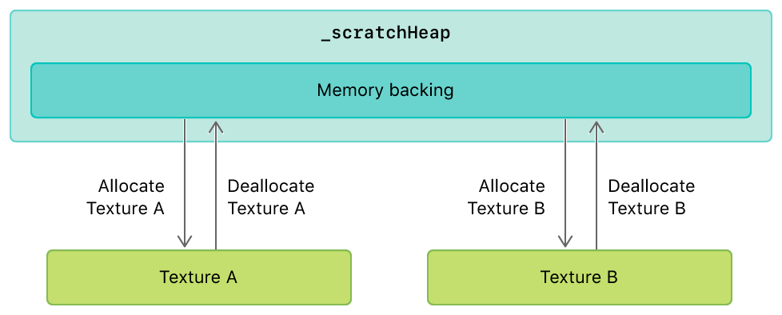
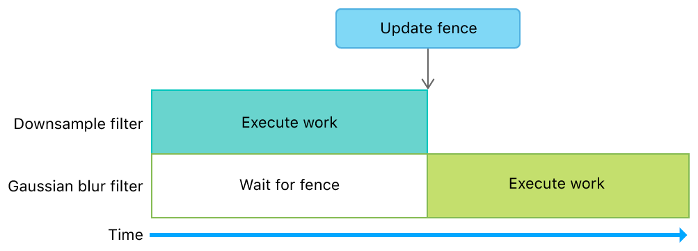
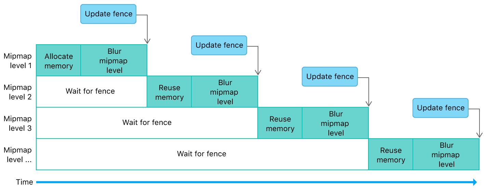

> 导航：[Technologies](../technologies.md) · [Metal](../metal.md) · [Memory heaps](memory-heaps.md)

# 使用堆和栅栏实现多阶段图像过滤器

<sub>示例代码</sub>

使用栅栏（fence）同步对堆上分配的资源的访问。

## 概述

该示例演示了：

- 为静态和动态纹理创建堆
- 使用别名（aliasing）来减少临时资源所占用的内存量
- 使用栅栏来管理生产和消费动态纹理的编码器之间的依赖关系

该实现以有序的方式，为一个包含下采样和高斯模糊过滤器的过滤器图最大限度地减少了内存使用量。


### 开始使用

该 Xcode 项目包含用于在 macOS、iOS 或 tvOS 上运行该示例的方案（scheme）。iOS 或 tvOS 模拟器不支持 Metal，因此 iOS 和 tvOS 方案需要实体设备才能运行该示例。默认方案是 macOS，它会在你的 Mac 上按原样运行该示例。

### 优化资源分配和性能

将纹理存储在堆中，可以让该示例对资源内存的分配和访问方式拥有更多控制权。而且，从堆中分配资源也比从设备中分配资源快得多。当资源从设备分配时，Metal 会创建并跟踪额外的状态，以确保该资源的内存在需要该资源的任意命令缓冲区的整个生命周期内都得到分配、同步并保持可用。即使该资源本身在命令缓冲区开始执行之前就已被销毁，Metal 也会这样做。

尽管 Metal 也对堆执行这一过程，但它不会对堆内部的资源执行这一过程。因此，App 需要在从堆创建对象和重用内存时执行显式的细粒度同步。不过，从堆分配资源的总体成本远低于从设备分配资源的成本，尤其是在一帧的处理过程中。

### 为静态纹理创建堆

该示例将图像文件加载到一个名为 `_imageTextures` 的数组中。该示例并不直接使用 `_imageTextures`，而是使用 `_imageHeap`，静态纹理就是从这个堆中分配的。该示例通过累加所有静态纹理的大小，创建一个足够大、能存储所有静态纹理的堆。对于 `_imageTextures` 中的每个纹理，该示例都会调用 `heapTextureSizeAndAlignWithDescriptor:` 方法来计算为每个纹理分配足够内存所需的大小和对齐值。

**AAPLRenderer.m**

```objective-c
for(uint32_t i = 0; i < AAPLNumImages; i++)
{
    // 使用纹理的属性创建描述符
    MTLTextureDescriptor *descriptor = [AAPLRenderer newDescriptorFromTexture:_imageTextures[i]
                                                                  storageMode:heapDescriptor.storageMode];

    // 根据给定的描述符确定堆所需的大小
    MTLSizeAndAlign sizeAndAlign = [_device heapTextureSizeAndAlignWithDescriptor:descriptor];

    // 对齐大小，以便在这个纹理之后能容纳更多资源
    sizeAndAlign.size = alignUp(sizeAndAlign.size, sizeAndAlign.align);

    // 累加堆容纳这个纹理所需的大小
    heapDescriptor.size += sizeAndAlign.size;
}

// 创建一个足够大的堆以容纳所有资源
_imageHeap = [_device newHeapWithDescriptor:heapDescriptor];
```

对于 `_imageTextures` 中的每个纹理，该示例都会从堆中分配一个新纹理 `heapTexture`。

**AAPLRenderer.m**

```objective-c
MTLTextureDescriptor *descriptor = [AAPLRenderer newDescriptorFromTexture:_imageTextures[i]
                                                              storageMode:_imageHeap.storageMode];

// 从堆中创建一个纹理
id<MTLTexture> heapTexture = [_imageHeap newTextureWithDescriptor:descriptor];
```

该示例将 `_imageTextures[i]` 的内容位块传输（blit）到 `heapTexture`，然后用 `heapTexture` 替换 `_imageTextures[i]`。

**AAPLRenderer.m**

```objective-c
MTLRegion region = MTLRegionMake2D(0, 0, _imageTextures[i].width, _imageTextures[i].height);

for(NSUInteger level = 0; level < _imageTextures[i].mipmapLevelCount;  level++)
{
    for(NSUInteger slice = 0; slice < _imageTextures[i].arrayLength; slice++)
    {
        [blitEncoder copyFromTexture:_imageTextures[i]
                         sourceSlice:slice
                         sourceLevel:level
                        sourceOrigin:region.origin
                          sourceSize:region.size
                           toTexture:heapTexture
                    destinationSlice:slice
                    destinationLevel:level
                   destinationOrigin:region.origin];
    }

    region.size.width /= 2;
    region.size.height /= 2;
    if(region.size.width == 0) region.size.width = 1;
    if(region.size.height == 0) region.size.height = 1;
}

// 用堆中的新纹理替换原始纹理
_imageTextures[i] = heapTexture;
```



### 为动态纹理创建堆

该示例使用一个单独的堆 `_scratchHeap`，从中分配具有临时生命周期的动态纹理。这些纹理与在给定帧中被过滤的静态纹理具有相同的属性。

**AAPLRenderer.m**

```objective-c
id<MTLTexture> inTexture = _imageTextures[_currentImageIndex];

[self createScratchHeap:inTexture];
```

该示例使用 `_scratchHeap` 为下采样和高斯模糊过滤器快速分配临时纹理。因此，`_scratchHeap` 所需的大小和对齐值，等于每个过滤器各自所需值之和。

**AAPLRenderer.m**

```objective-c
MTLSizeAndAlign downsampleSizeAndAlignRequirement = [_downsample heapSizeAndAlignWithInputTextureDescriptor:descriptor];
MTLSizeAndAlign gaussianBlurSizeAndAlignRequirement = [_gaussianBlur heapSizeAndAlignWithInputTextureDescriptor:descriptor];

NSUInteger requiredAlignment = MAX(gaussianBlurSizeAndAlignRequirement.align, downsampleSizeAndAlignRequirement.align);
NSUInteger gaussianBlurSizeAligned = alignUp(gaussianBlurSizeAndAlignRequirement.size, requiredAlignment);
NSUInteger downsampleSizeAligned = alignUp(downsampleSizeAndAlignRequirement.size, requiredAlignment);
NSUInteger requiredSize = gaussianBlurSizeAligned + downsampleSizeAligned;

if(!_scratchHeap || requiredSize > [_scratchHeap maxAvailableSizeWithAlignment:requiredAlignment])
{
    MTLHeapDescriptor *heapDesc = [[MTLHeapDescriptor alloc] init];

    heapDesc.size        = requiredSize;
    heapDesc.storageMode = heapStorageMode;

    _scratchHeap = [_device newHeapWithDescriptor:heapDesc];
}
```

从 `_scratchHeap` 分配的任何纹理也可以被释放，这让该示例可以重用同一份内存来分配另一个纹理。



<sub>布局示意图，展示了从单个堆中分配多个动态纹理，并将它们释放回同一个堆的过程。</sub>

### 管理过滤器之间的依赖关系

该示例使用 `_fence` 来控制对从 `_scratchHeap` 分配的动态纹理的访问，并防止过滤器图中出现 GPU 数据争用。这个栅栏确保动态纹理上的操作在过滤器图开始执行依赖于先前操作结果的后续操作之前已经完成。

第一个过滤器由该示例在 `AAPLDownsampleFilter` 中实现，它会从堆中创建一个动态纹理 `outTexture`，并为 mipmap 分配足够的空间。

**AAPLFilter.m**

```objective-c
MTLTextureDescriptor *textureDescriptor = [MTLTextureDescriptor texture2DDescriptorWithPixelFormat:inTexture.pixelFormat
                                                                                             width:inTexture.width
                                                                                            height:inTexture.height
                                                                                         mipmapped:YES];
textureDescriptor.storageMode = heap.storageMode;
textureDescriptor.usage = MTLTextureUsageShaderWrite | MTLTextureUsageShaderRead;

id <MTLTexture> outTexture = [heap newTextureWithDescriptor:textureDescriptor];
```

下采样过滤器随后将源纹理 `inTexture` 位块传输到 `outTexture`，并生成 mipmap。

**AAPLFilter.m**

```objective-c
[blitCommandEncoder copyFromTexture:inTexture
                        sourceSlice:0
                        sourceLevel:0
                       sourceOrigin:(MTLOrigin){ 0, 0, 0 }
                         sourceSize:(MTLSize){ inTexture.width, inTexture.height, inTexture.depth }
                          toTexture:outTexture
                   destinationSlice:0
                   destinationLevel:0
                  destinationOrigin:(MTLOrigin){ 0, 0, 0}];

[blitCommandEncoder generateMipmapsForTexture:outTexture];
```

最后，下采样过滤器调用 `updateFence:` 和 `endEncoding` 方法，表明其操作已经完成。

**AAPLFilter.m**

```objective-c
[blitCommandEncoder updateFence:fence];

[blitCommandEncoder endEncoding];
```

第二个过滤器由该示例在 `AAPLGaussianBlurFilter` 中实现，它会在创建计算命令编码器后立即调用 `waitForFence:`。这会强制高斯模糊过滤器等待下采样过滤器完成其工作后，再开始自己的工作。之所以需要这样的等待期，是因为高斯模糊过滤器依赖于下采样过滤器生成的动态纹理数据。如果没有这个栅栏，GPU 可能会并行执行这两个过滤器，从而读取到从堆中分配的、尚未初始化的动态纹理数据。

**AAPLFilter.m**

```objective-c
[computeEncoder waitForFence:fence];
```



### 在过滤器内部重用内存并管理依赖关系

高斯模糊过滤器会对下采样过滤器生成的动态纹理的每个 mipmap 级别执行一次水平模糊和一次垂直模糊。对于每个 mipmap 级别，该示例都会从动态纹理堆中分配一个临时纹理 `intermediaryTexture`。

**AAPLFilter.m**

```objective-c
id <MTLTexture> intermediaryTexture = [heap newTextureWithDescriptor:textureDescriptor];
```

这个纹理是临时的，因为它仅被用作水平模糊的输出目标，以及垂直模糊的输入源。在该示例执行完这些模糊操作之后，最终的纹理数据存储在 `outTexture` 中（它是 `inTexture` 的一个纹理视图）。因此，`intermediaryTexture` 中包含的纹理数据在每次 mipmap 级别迭代之后都不再被使用。

**AAPLFilter.m**

```objective-c
// 使用输入纹理作为输入执行水平模糊
// 并将输入纹理某个 mipmap 级别的视图作为输出

[computeEncoder setComputePipelineState:_horizontalKernel];

[computeEncoder setTexture:inTexture
                   atIndex:AAPLBlurTextureIndexInput];

[computeEncoder setTexture:intermediaryTexture
                   atIndex:AAPLBlurTextureIndexOutput];

[computeEncoder setBytes:&mipmapLevel
                  length:sizeof(mipmapLevel)
                 atIndex:AAPLBlurBufferIndexLOD];

[computeEncoder dispatchThreadgroups:threadgroupCount
               threadsPerThreadgroup:threadgroupSize];

// 使用经过水平模糊处理的纹理作为输入执行垂直模糊
// 并将输入纹理某个 mipmap 级别的视图作为输出

[computeEncoder setComputePipelineState:_verticalKernel];

[computeEncoder setTexture:intermediaryTexture
                   atIndex:AAPLBlurTextureIndexInput];

[computeEncoder setTexture:outTexture
                   atIndex:AAPLBlurTextureIndexOutput];

static const uint32_t mipmapLevelZero = 0;
[computeEncoder setBytes:&mipmapLevelZero
                  length:sizeof(mipmapLevelZero)
                 atIndex:AAPLBlurBufferIndexLOD];

[computeEncoder dispatchThreadgroups:threadgroupCount
               threadsPerThreadgroup:threadgroupSize];
```

该示例并没有为每个 mipmap 级别分配新的内存，而是重用为 `intermediaryTexture` 已分配的现有内存。在每次 mipmap 级别迭代之后，该示例都会调用 `makeAliasable` 方法，表明这块内存可以被同一个动态纹理堆中后续的分配重用。

**AAPLFilter.m**

```objective-c
[intermediaryTexture makeAliasable];
```

这种内存重用在各个 mipmap 级别之间创建了动态纹理依赖关系。因此，在对每个 mipmap 级别执行模糊之后，该示例都会调用 `updateFence:` 和 `endEncoding` 方法，表明模糊操作已经完成。

**AAPLFilter.m**

```objective-c
[computeEncoder updateFence:fence];

[computeEncoder endEncoding];
```

由于该示例已经调用了 `waitForFence:` 方法来等待下采样过滤器完成其工作，该示例便利用这同一次调用，在开始新一轮 mipmap 级别迭代之前，等待任何先前的 mipmap 级别完成其工作。



## 另请参阅

### 资源内存分配与管理

- [Using argument buffers with resource heaps](using-argument-buffers-with-resource-heaps.md) — 通过在参数缓冲区内部使用数组并将其与资源堆结合，来降低 CPU 开销。
- [Implementing a multistage image filter using heaps and events](implementing-a-multistage-image-filter-using-heaps-and-events.md) — 使用事件（event）同步对堆上分配的资源的访问。
- [MTLHeap](mtlheap.md) — 一个内存池，你可以从中为资源分配子内存。
- [MTLHeapDescriptor](mtlheapdescriptor.md) — 用于自定义 Metal 内存堆行为的配置。
- [MTLHeapType](mtlheaptype.md) — 用于选择堆类型的选项。
- [MTLSizeAndAlign](mtlsizeandalign.md) — 某个资源的大小和对齐方式，以字节为单位。

## 下载

- [ImplementingAMultistageImageFilterUsingHeapsAndFences.zip](https://docs-assets.developer.apple.com/published/90274df6ea7a/ImplementingAMultistageImageFilterUsingHeapsAndFences.zip)
