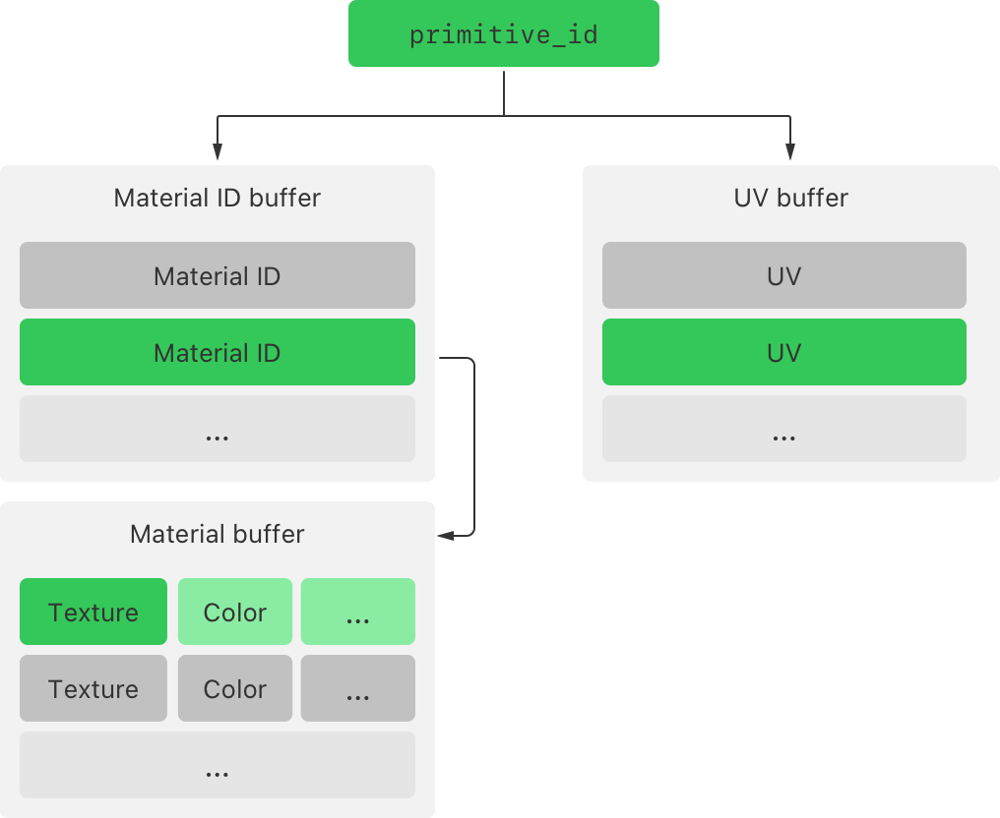

> 导航：[Technologies](../technologies.md) · [Metal](../metal.md) · [Ray tracing with acceleration structures](ray-tracing-with-acceleration-structures.md)

# 使用逐图元数据改进光线追踪数据访问

<sub>文章</sub>

通过将自定义图元数据直接存储在加速结构中，简化数据访问并提高 GPU 利用率。

## 概述

创建光线追踪渲染器——或者使用光线追踪实现其他行为——所需的不仅仅是简单的几何图形。你的 App 还需要向光线追踪内核提供自定义数据。例如，渲染器可能需要 UV 坐标和纹理，以及颜色和其他材质属性，才能计算出正确的反射和光照。有些光线追踪器会使用同样这些元素来实现其他行为。例如，你可以使用 alpha 纹理和纹理查找，在自定义相交函数中实现不透明度。你如何组织自定义数据，会同时影响光线追踪内核的可读性和性能。

考虑下图，它描述了一种组织 App 数据的可能方式。一种材质由多份数据组成，这些数据以纹理和常量的形式存储，供渲染器用来计算光照和着色。几何图形中的每个图元都可以应用不同的材质。为避免重复存储材质数据，该 App 会在一个 Metal 缓冲区中为每种材质存储一份副本，并在第二个 Metal 缓冲区中为每个图元存储一个材质 ID。第三个 Metal 缓冲区包含每个图元的 UV 数据。使用这种数据组织方式的着色器或内核，需要先使用图元索引获取材质 ID 和 UV 坐标，然后使用材质 ID 查找材质数据。对于几何图形的多个实例，更复杂的渲染器可以更进一步，使用另一个缓冲区来保存实例化数据。



<sub>一张框图，展示了相交函数如何遍历中间数据结构，以获取执行相交测试所需的数据。该图展示了三个 Metal 缓冲区，分别包含每个图元的 UV 坐标、每个图元的材质 ID，以及每种材质的材质数据。相交函数使用图元 ID 获取对应的材质 ID 和 UV 坐标，然后使用材质 ID 获取材质数据。</sub>

获取计算结果所需的数据，要求内核对多个指针进行解引用，并存储更多中间变量。在复杂的渲染器中，由此带来的性能损耗可能很小。另一方面，当你使用带有自定义相交函数的图元运行相交器（intersector）时，该相交器可能会为每条光线执行多次相交测试。这类函数通常比着色器简单得多，因此解引用额外指针所带来的损耗，在执行内核的总时间中可能占据更大的比例。

为了获得更好的 Metal 性能，将图元数据复制到加速结构中，并在着色器中直接访问它。使用逐图元数据可以简化你的着色器，使其更易读，并且你无需再根据图元 ID 执行单独的数据查找。这还能降低遍历数据的开销，同时减少 GPU 开销。对于你在 GPU 上频繁运行的内核或函数，或者包含大量内存操作的函数，使用逐图元数据来提升性能。

### 为图元数据创建一个数据类型

首先，在你的项目中 App 的 CPU 代码与着色器代码共享的文件里，为你的逐图元数据定义一个结构体。例如，你可以在定义着色器和计算内核的参数类型的同一处定义这个数据结构：

```objective-c
#include <simd/simd.h>

struct PrimitiveTextureData {
    uint64_t textureAddress;
    vector_float2 coordinates[3];
};

struct TriangleData {
    vector_float3 normal0;
    vector_float3 normal1;
    vector_float3 normal2;

    vector_float3 color0;
    vector_float3 color1;
    vector_float3 color2;
};
```

逐图元数据类型可以存储与参数缓冲区相同的类型（参见 [Improving CPU performance by using argument buffers](improving-cpu-performance-by-using-argument-buffers.md)），包括基本标量类型、向量类型，以及对 Metal 资源的引用。Metal 不限制逐图元数据结构体的大小，但带有大型图元数据的加速结构可能需要显著更多的内存，并且创建、复制和重新拟合（refit）耗时更长。额外的数据也可能影响你着色器在运行时的性能。为获得最佳效果，将数据限制为在几何图形的多个实例之间保持一致的值，并只存储执行最频繁或最耗费资源的任务所需的那些值。

> [!tip] 提示
> 在对存储数据的方式做出任何更改之前和之后，都对你的 App 进行性能分析，以便你能衡量这些更改带来的收益。

减小逐图元结构体大小的一种方法，是在其中包含一个指向另一个缓冲区的指针。虽然这种方法带回了早先那种缓冲区方式的一些复杂性，但它仍然能相对快速地访问次级结构体中的数据。将你最常需要的数据放在逐图元结构体中，只在必要时才访问次级结构体。为获得更好的缓存性能，将两个结构体打包，使你同时访问的值在内存中彼此靠近。

### 将逐图元数据添加到你的加速结构中

你可以通过在创建加速结构时包含图元数据，将其添加到加速结构中。首先将图元数据复制到一个 [MTLBuffer](mtlbuffer.md) 实例中。每个图元都需要拥有自己的一份图元数据实例，按线性顺序存储。

在配置几何图形描述符时，将 [primitiveDataBuffer](mtlaccelerationstructuregeometrydescriptor/primitivedatabuffer.md) 属性设置为指向这个缓冲区。如果数据不是从缓冲区的起始位置开始，将 [primitiveDataBufferOffset](mtlaccelerationstructuregeometrydescriptor/primitivedatabufferoffset.md) 设置为缓冲区内逐图元数据第一个字节所在的位置。

接下来，将 [primitiveDataElementSize](mtlaccelerationstructuregeometrydescriptor/primitivedataelementsize.md) 属性设置为你的图元数据结构体的大小，并将 [primitiveDataStride](mtlaccelerationstructuregeometrydescriptor/primitivedatastride.md) 属性设置为缓冲区中两个连续逐图元数据实例之间的字节数。stride 属性默认值为 `0`，这告知 Metal 该缓冲区的 stride 与元素大小相同。

[MTLAccelerationStructureGeometryDescriptor](mtlaccelerationstructuregeometrydescriptor.md) 类型为其子类定义了这些属性，这些子类包括以下描述符类型：

- [MTLAccelerationStructureTriangleGeometryDescriptor](mtlaccelerationstructuretrianglegeometrydescriptor.md)
- [MTLAccelerationStructureMotionTriangleGeometryDescriptor](mtlaccelerationstructuremotiontrianglegeometrydescriptor.md)
- [MTLAccelerationStructureCurveGeometryDescriptor](mtlaccelerationstructurecurvegeometrydescriptor.md)
- [MTLAccelerationStructureMotionCurveGeometryDescriptor](mtlaccelerationstructuremotioncurvegeometrydescriptor.md)
- [MTLAccelerationStructureBoundingBoxGeometryDescriptor](mtlaccelerationstructureboundingboxgeometrydescriptor.md)
- [MTLAccelerationStructureMotionBoundingBoxGeometryDescriptor](mtlaccelerationstructuremotionboundingboxgeometrydescriptor.md)

在下面的示例中，该方法为一个三角形几何图形描述符配置逐图元数据，所用的缓冲区为每个三角形都包含一份图元数据实例。

```swift
func configure(geometryDescriptor: MTLAccelerationStructureTriangleGeometryDescriptor,
               with trianglePrimitiveData: MTLBuffer) {
    geometryDescriptor.primitiveDataBuffer = trianglePrimitiveData
    geometryDescriptor.primitiveDataBufferOffset = 0
    geometryDescriptor.primitiveDataElementSize = MemoryLayout<PrimitiveTextureData>.size
    geometryDescriptor.primitiveDataStride = MemoryLayout<PrimitiveTextureData>.stride
}
```

当你创建加速结构时，Metal 会将数据从图元数据缓冲区复制到新的结构中。之后，如果你不再需要图元数据缓冲区，可以将其删除。

### 在光线追踪内核中访问逐图元数据

当你的光线追踪内核调用一个相交方法时，Metal 会将任何被相交图元的图元数据包含在相交结果中。通过访问 `primitive_data` 字段来获取该图元的数据：

```metal
/// GPU 每向场景中投射一条光线，就调用一次此内核。
kernel void rayTracingKernel(uint2 threadID [[thread_position_in_grid]],
// ...
                             instance_acceleration_structure accelerationStructure [[buffer(4)]],
                             intersection_function_table<triangle_data, instancing> intersectionFunctionTable [[buffer(5)]]
                             )
{
    /// 表示光线追踪场景中的单条光线。
    ray ray;

    /// 用于测试光线与场景几何图形之间相交情况的相交器（intersector）。
    intersector<triangle_data, instancing> triangleIntersector;

    /// 表示与场景几何图形相交结果的结果值类型。
    intersector<triangle_data, instancing>::result_type result;

    ...

    // 测试光线与加速结构几何图形的相交情况。
    result = triangleIntersector.intersect(ray, accelerationStructure);

    if (result.type != intersection_type::none) {
        const device PrimitiveTextureData *textureData;

        // 获取光线所相交三角形特有的数据。
        textureData = (const device PrimitiveTextureData *) result.primitive_data;

        vector_float2 uv = textureData->coordinates;
        uint64_t texture = textureData->textureAddress;

        ...
    }
}
```

如果你的实现使用相交函数，通过添加一个带有 `[[primitive_data]]` 属性的参数，来访问候选图元的图元数据：

```metal
/// 该三角形内核的相交函数。
[[intersection(triangle)]]
bool triangle_intersection_function(const device PrimitiveTextureData *textureData [[primitive_data]]
                                    ... ) {
    ...

    return true;
}
```

最后，如果你的实现使用相交查询，通过调用该查询的 `get_candidate_primitive_data()` 和 `get_committed_primitive_data()` 方法来访问某个图元的数据。

```metal
intersection_query<triangle_data, instancing> query;

const device PrimitiveTextureData* candidatePrimitiveData;
const device PrimitiveTextureData* committedPrimitiveData;

...

candidatePrimitiveData = (const device PrimitiveTextureData *) query.get_candidate_primitive_data();

...

committedPrimitiveData = (const device PrimitiveTextureData *) query.get_committed_primitive_data();
```

> [!tip] 提示
> 通过转换为使用带有相交器（可选配自定义相交函数）的内核的实现，来提升使用相交查询的 Metal App 的运行时性能。

## 另请参阅

### 加速结构

- [MTLAccelerationStructure](mtlaccelerationstructure.md) — 一组模型数据，用于 GPU 加速的光线与模型相交计算。
- [MTL4AccelerationStructureDescriptor](mtl4accelerationstructuredescriptor.md) — Metal 4 加速结构描述符的基类。
- [MTLAccelerationStructureDescriptor](mtlaccelerationstructuredescriptor.md) — 定义新加速结构配置的各个类的基类。
- [MTL4PrimitiveAccelerationStructureDescriptor](mtl4primitiveaccelerationstructuredescriptor.md) — 直接引用几何形状（例如三角形和边界框）的图元加速结构的描述符。
- [MTLPrimitiveAccelerationStructureDescriptor](mtlprimitiveaccelerationstructuredescriptor.md) — 包含几何图元的加速结构的描述。
- [MTL4InstanceAccelerationStructureDescriptor](mtl4instanceaccelerationstructuredescriptor.md) — 实例加速结构的描述符。
- [MTLInstanceAccelerationStructureDescriptor](mtlinstanceaccelerationstructuredescriptor.md) — 一种从图元加速结构的实例派生而来的加速结构的描述。
- [MTLAccelerationStructureCommandEncoder](mtlaccelerationstructurecommandencoder.md) — 为单个流程编码构建和重新拟合加速结构的命令。
- [MTLAccelerationStructureUsage](mtlaccelerationstructureusage.md) — 影响 Metal 构建加速结构方式及该加速结构行为的选项。
- [MTLAccelerationStructureRefitOptions](mtlaccelerationstructurerefitoptions.md)
