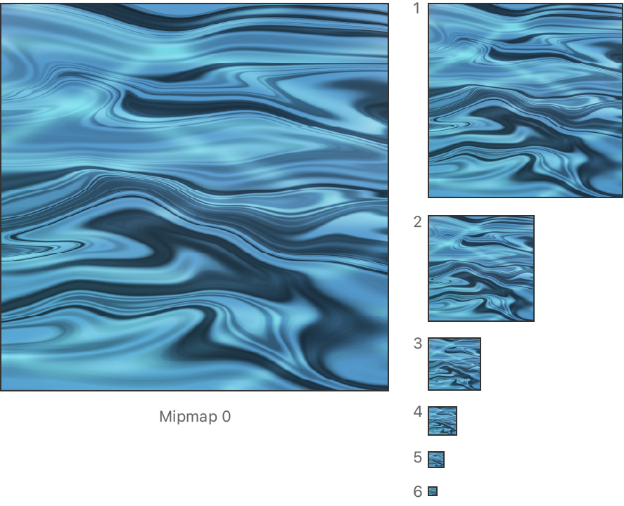
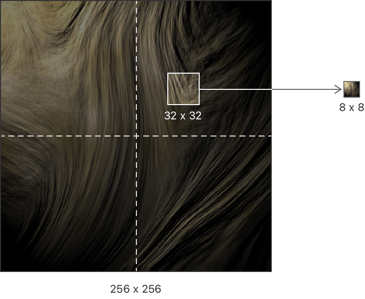

> 导航：[Technologies](../technologies.md) · [Metal](../metal.md) · [Textures](textures.md)

# 使用 mipmap 提升纹理采样质量与性能

文章

通过创建纹理的较小版本，避免纹理渲染瑕疵并减轻 GPU 的工作负载。

## 概述

_mipmap_ 是同一纹理图像逐级缩小的版本，每一级都为该纹理提供不同的细节层级（LOD）。一个纹理的 _mipmap 链_是其完整的 mipmap 集合。带有 mipmap 的纹理有助于你的 App 消除诸如锯齿和摩尔纹之类的常见视觉问题，同时降低 GPU 的内存带宽占用。

__纹理最大的版本是 mipmap `0`，它位于 mipmap 链的顶端。次大的版本是 mipmap `1`，在链中低一级。

展示一个纹理 mipmap 链的示意图，左侧是分辨率最大的图像，标注为「Mipmap 0」。右侧的六张图像标注为 1 到 6，是原始纹理逐级缩小的版本，每一级 mipmap 的大小都是前一级的 25%。

链中每一个非零 mipmap 级别的面积，都是前一个 mipmap 级别面积的 25%。一个纹理最小的 mipmap 在每个维度上至少为 1 像素。

带有 mipmap 的纹理让 GPU 可以选择从与其正在渲染的图元大小最接近的 mipmap 尺寸中采样。当纹理的尺寸与输出图元的尺寸相近时，GPU 的纹理采样硬件效果最佳。如果没有 mipmap，GPU 只能对全尺寸纹理进行采样，即便输出图元远小于该纹理也是如此。在这种情况下，硬件通常需要获取纹理中相当大的一部分，才能正确地进行颜色过滤。

例如，要将一张 256 x 256 的纹理过滤为 8 x 8 的渲染结果，GPU 需要为每个输出像素混合该纹理 25% 的内容。此外，当渲染相对较小的图元时，你无法精确控制 GPU 从纹理中获取哪些像素并加以混合。这种不精确性可能会产生明显错误的图像，尤其是当它跨越多个帧时，例如在动画过程中。

展示一张 256 x 256 像素纹理图像的示意图，由两条相互垂直、在纹理中心相交的虚线将其分为四个象限。在右上象限中，示意图高亮标出了纹理中一个 32 x 32 像素的方形样本。一个箭头从该方形样本指向右侧一个更小的方块。这个较小的方块是该较大纹理的输出渲染结果，大小为 8 x 8 像素。

带有 mipmap 的纹理还有助于提升你 App 的性能，因为 GPU 通过从更小的 mipmap 中采样，可以使用更少的内存带宽和内存缓存。

你可以分别按照[创建带 mipmap 的纹理](creating-a-mipmapped-texture.md)和[生成 mipmap 数据](generating-mipmap-data.md)中的步骤，创建一个带有 mipmap 的纹理并初始化其 mipmap 链。

## 另请参阅

### 纹理 mipmap

- [创建带 mipmap 的纹理](creating-a-mipmapped-texture.md) — 决定你正在创建的纹理是否需要 mipmap。
- [向 mipmap 中复制数据或从中复制数据](copying-data-into-or-out-of-mipmaps.md) — 指定数据传输所影响的 mipmap。
- [生成 mipmap 数据](generating-mipmap-data.md) — 在创作内容时或在运行时创建你的 mipmap。
- [为采样器添加 mipmap 过滤](adding-mipmap-filtering-to-samplers.md) — 指定 GPU 如何对你纹理中的 mipmap 进行采样。
- [限制对特定 mipmap 的访问](restricting-access-to-specific-mipmaps.md) — 设置某个采样器可以访问的 mipmap 级别范围。
- [通过细节层级查询预测 GPU 会采样哪些 mip](predicting-which-mips-the-gpu-samples-with-level-of-detail-queries.md) — 提前确定 GPU 采样某个纹理所需的 mipmap 级别。
- [动态调整纹理细节层级](dynamically-adjusting-texture-level-of-detail.md) — 推迟生成或加载更大的 mipmap，直到需要该细节层级为止。
