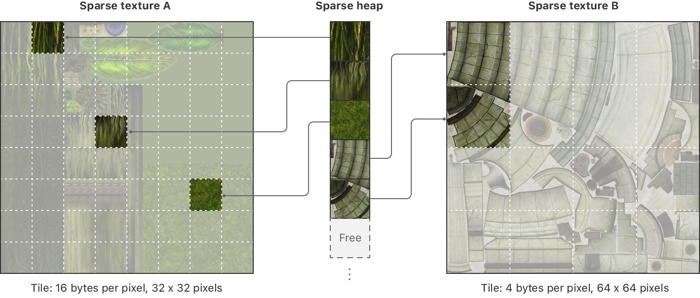

> 导航：[技术](../technologies.md) · [Metal](../metal.md) · [纹理](textures.md)

# 管理稀疏纹理内存

<sub>文章</sub>

通过使用稀疏纹理，直接控制纹理数据的内存分配。

## 概述

默认情况下，创建纹理时 Metal 会分配内存来保存纹理的像素数据。在某些场景下（例如实现纹理流送时），通常你只会用到这部分内存的一小部分。使用稀疏纹理时，你可以掌握纹理数据内存管理的所有权，自行决定何时为纹理分配和解除分配内存。通过这种方式，稀疏纹理帮助你更高效地使用内存。

要使用稀疏纹理，先分配一个用于分配内存的稀疏堆，然后在这个堆上创建稀疏纹理。初始状态下，纹理没有存储空间。要为纹理内的某个区域添加存储空间，需要请求 GPU 将该堆的内存映射给该区域。*稀疏 tile*（sparse tile）是一种内存分配（区别于 GPU 用于基于 tile 的渲染的 memory tile）。稀疏 tile 在概念上类似于虚拟内存页。当某个区域不需要存储空间时，你可以取消映射它的稀疏 tile，从而回收那块内存。



<sub>示意图显示一个稀疏堆和两个稀疏纹理。每个纹理都有几个区域映射到了堆的稀疏 tile 上。</sub>

由于稀疏纹理与纹理 mipmap 紧密相关，在使用稀疏纹理前，你应该熟悉 mipmap。更多信息，请参阅[通过 mipmap 提升纹理采样质量和性能](improving-texture-sampling-quality-and-performance-with-mipmaps.md)。

### 检查稀疏纹理支持

并非所有 GPU 都支持稀疏纹理。在尝试使用稀疏纹理之前，先在设备对象上检查支持情况：

```objective-c
- (Boolean) supportsSparseTextures
{
    return [_device supportsFamily: MTLGPUFamilyApple6 ];
}
```

## 另请参阅

### 稀疏纹理

- [创建稀疏堆和稀疏纹理](creating-sparse-heaps-and-sparse-textures.md) — 通过创建稀疏堆来为稀疏纹理分配内存。
- [在像素区域与稀疏 tile 区域之间转换](converting-between-pixel-regions-and-sparse-tile-regions.md) — 了解稀疏纹理的内容在内存中如何组织。
- [为稀疏纹理分配内存](assigning-memory-to-sparse-textures.md) — 使用资源状态编码器为稀疏纹理分配和解除分配稀疏 tile。
- [读写稀疏纹理](reading-and-writing-to-sparse-textures.md) — 决定如何处理对未映射纹理区域的访问。
- [估算纹理区域被访问的频率](estimating-how-often-a-texture-region-is-accessed.md) — 使用纹理访问模式来确定何时需要映射纹理区域。
- [MTLResourceStatePassDescriptor](mtlresourcestatepassdescriptor.md) — 资源状态 pass 的配置，用于创建资源状态命令编码器。
- [MTLResourceStatePassSampleBufferAttachmentDescriptor](mtlresourcestatepasssamplebufferattachmentdescriptor.md) — 描述在资源状态 pass 开始和结束时存储 GPU 计数器信息的位置。
- [MTLResourceStatePassSampleBufferAttachmentDescriptorArray](mtlresourcestatepasssamplebufferattachmentdescriptorarray.md) — 资源状态 pass 的采样缓冲区附件数组。
- [MTLResourceStateCommandEncoder](mtlresourcestatecommandencoder.md) — 一个编码器，负责编码修改资源配置的命令。
- [MTLMapIndirectArguments](mtlmapindirectarguments.md) — 使用间接命令时用于映射稀疏纹理区域的数据布局。
