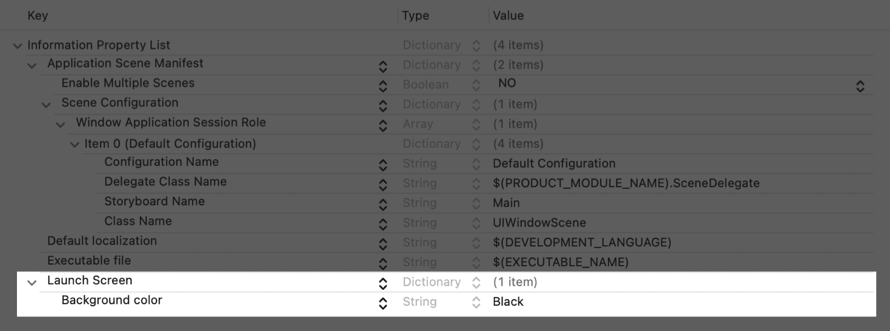

> 导航：[Technologies](../technologies.md) · [Metal](../metal.md)

# 在 iPadOS 中管理你的 Metal App 窗口

<sub>文章</sub>

设置一个能够动态调整你 Metal 内容尺寸的窗口。

## 概述

场景（scene）代表你 App UI 的单个实例。你可以选择是否允许用户为你的 App 创建多个场景。通常情况下，Metal App 和游戏只支持单个场景，因为它们需要优先访问设备上的可用资源。在 iPadOS 26 及更高版本中，如果用户已启用多任务处理，他们始终都可以调整你 App 场景的尺寸。

未采用基于场景的生命周期的 App，在 iOS 26 和 iPadOS 26 上启动时会记录一条警告，必须进行更新。在下一个主要版本中，使用最新 SDK 构建时将强制要求基于场景的生命周期。

> [!important] 重要
> 由于 [UIRequiresFullScreen](../bundleresources/information-property-list/uirequiresfullscreen.md) 已废弃，你将无法再选择退出 iPad 多任务处理和动态调整尺寸。

有关迁移你 iPad App 的更多信息，请参阅 [TN3192：将你的 iPad App 从已废弃的 UIRequiresFullScreen 键迁移出来](../technotes/tn3192-migrating-your-app-from-the-deprecated-uirequiresfullscreen-key.md) 和 [TN3187：迁移到 UIKit 基于场景的生命周期](../technotes/tn3187-migrating-to-the-uikit-scene-based-life-cycle.md)。

## 创建窗口

在 iPad 上，通过将 [UIWindowScene](../uikit/uiwindowscene.md) 用于 UIKit、将 [Scene](../swiftui/scene.md) 用于 SwiftUI 来管理窗口。要在某个场景下配置 [UIWindow](../uikit/uiwindow.md)，你需要指定一个内容视图控制器，并将你的 Metal 视图嵌入到该控制器中。

要为你的 Metal 项目配置场景支持：

1. 打开 Xcode 项目。
2. 在项目导航器中选择该项目。
3. 选择 App target。
4. 导览到 General 标签页。
5. 在 Deployment Info 部分，选择“Scene manifest”。
6. 如果尚不存在 [UIApplicationSceneManifest](../bundleresources/information-property-list/uiapplicationscenemanifest.md) 键，请添加它。
7. 为你的项目配置该字典值。

**Swift**

```json
<key>UIApplicationSceneManifest</key>
<dict>
    <key>UIApplicationSupportsMultipleScenes</key>
    <false/> 
    <key>UISceneConfigurations</key>
    <dict>
        <key>UIWindowSceneSessionRoleApplication</key>
        <array>
            <dict>
                <key>UISceneConfigurationName</key>
                <string>Default Configuration</string>
                <key>MyCustomSceneDelegateClass</key>
                <string>$(PRODUCT_MODULE_NAME).SceneDelegate</string>
                <key>UISceneStoryboardFile</key>
                <string>Main</string> 
                <key>UISceneClassName</key>
                <string>UIWindowScene</string> 
            </dict>
        </array>
    </dict>
</dict>
```

**Objective-C**

```json
<key>UIApplicationSceneManifest</key>
<dict>
    <key>UIApplicationSupportsMultipleScenes</key>
    <false/> 
    <key>UISceneConfigurations</key>
    <dict>
        <key>UIWindowSceneSessionRoleApplication</key>
        <array>
            <dict>
                <key>UISceneConfigurationName</key>
                <string>Default Configuration</string>
                <key>MyCustomSceneDelegateClass</key>
                <string>SceneDelegate</string>
                <key>UISceneStoryboardFile</key>
                <string>Main</string> 
                <key>UISceneClassName</key>
                <string>UIWindowScene</string> 
            </dict>
        </array>
    </dict>
</dict>
```

要为需要精细控制的复杂场景提供动态场景配置，请为 UIKit 实现 [application(_:configurationForConnecting:options:)](<../uikit/uiapplicationdelegate/application(__configurationforconnecting_options_).md>)，并为使用 SwiftUI 生命周期的 App 实现 [UIApplicationDelegateAdaptor](../swiftui/uiapplicationdelegateadaptor.md)。这样就可以提供动态场景配置：

**Swift**

```swift
@UIApplicationMain
class AppDelegate: UIResponder, UIApplicationDelegate {
    func application(
        _ application: UIApplication,
        configurationForConnecting connectingSceneSession: UISceneSession,
        options: UIScene.ConnectionOptions
    ) -> UISceneConfiguration {

        // 每个场景配置都有一个特定于 App 的唯一配置
        // 名称，你可以用它来标识该场景。这个配置
        // 名称对应 `Info.plist` 场景清单中的条目。
        var configurationName: String!
    
        // activity 类型决定要创建哪个场景。
        switch options.userActivities.first?.activityType {
        case "com.apple.gallery.openInspector":
            // 创建一个照片检查器窗口场景。
            configurationName = "Inspector Configuration"
        default:
            // 创建一个默认的图库窗口场景。
            configurationName = "Default Configuration"
        }
        
        return UISceneConfiguration(
            name: configurationName,
            sessionRole: connectingSceneSession.role
        )
    }

    // 当用户关闭某个场景会话时（例如关闭一个窗口），
    // 系统会调用这个委托方法。
    // 
    // 如果系统在 App 未运行时结束了某个会话，它会在
    // 调用 `application(_:didFinishLaunchingWithOptions:)`
    // 之后不久调用 application(_:didDiscardSceneSessions:)。
    // 
    // 使用这个方法为该场景释放特定于场景的资源，
    // 因为它们不会再返回。
    func application(_ application: UIApplication, 
                     didDiscardSceneSessions sceneSessions: Set<UISceneSession>) {
    
    }
}
```

**Objective-C**

```objc
- (UISceneConfiguration *)application:(UIApplication *)application 
                          configurationForConnectingSceneSession:(UISceneSession *)connectingSceneSession 
                          options:(UISceneConnectionOptions *)options {
                          
    // 每个场景配置都有一个特定于 App 的唯一配置
    // 名称，你可以用它来标识该场景。这个配置
    // 名称对应 `Info.plist` 场景清单中的条目。
    NSString *configurationName;

    // activity 类型决定要创建哪个场景。
    NSString *activityType = options.userActivities.allObjects.firstObject.activityType;

    if ([activityType isEqualToString:@"com.apple.gallery.openInspector"]) {
        // 创建一个照片检查器窗口场景。
        configurationName = @"Inspector Configuration";
    } else {
        // 创建一个默认的图库窗口场景。
        configurationName = @"Default Configuration";
    }

    return [[UISceneConfiguration alloc] initWithName: configurationName
                                         sessionRole: connectingSceneSession.role];
}

// 当用户关闭某个场景会话时（例如关闭一个窗口），
// 系统会调用这个委托方法。
// 
// 如果系统在 App 未运行时结束了某个会话，它会在
// 调用 `application(_:didFinishLaunchingWithOptions:)`
// 之后不久调用 application(_:didDiscardSceneSessions:)。
// 
// 使用这个方法为该场景释放特定于场景的资源，
// 因为它们不会再返回。
- (void)application:(UIApplication *)application 
        didDiscardSceneSessions:(NSSet<UISceneSession *> *)sceneSessions {
        
}
```

有关动态配置的更多信息，请参阅 [TN3187：迁移到 UIKit 基于场景的生命周期](../technotes/tn3187-migrating-to-the-uikit-scene-based-life-cycle.md#Provide-scene-configurations-from-your-app-delegate-for-dynamic-configuration)。有关为你的 App 添加场景支持的更多信息，请参阅 [Specifying the scenes your app supports](../uikit/specifying-the-scenes-your-app-supports.md)。

## 为你的窗口选择内容尺寸和样式

添加场景支持后，请配置窗口场景的初始尺寸和样式。当你的 App 创建或恢复用户界面的某个实例时，系统会调用 [scene(_:willConnectTo:options:)](<../uikit/uiscenedelegate/scene(__willconnectto_options_).md>)。这个委托方法会提供一个窗口场景，供你用来配置尺寸约束和样式。对于 Metal App 和游戏来说，这通常是单个场景。

使用 [UISceneSizeRestrictions](../uikit/uiscenesizerestrictions.md) 来约束你想要的最小尺寸，并处理宽高比变化：

**Swift**

```swift
class SceneDelegate: UIResponder, UIWindowSceneDelegate {

    var window: UIWindow?

    func scene(_ scene: UIScene,
               willConnectTo session: UISceneSession,
               options connectionOptions: UIScene.ConnectionOptions) {

        guard let windowScene = scene as? UIWindowScene else { return }
        windowScene.sizeRestrictions?.minimumSize.width = 640.0
    }
}
```

**Objective-C**

```objc
- (void)scene:(UIScene *)scene
        willConnectToSession:(UISceneSession *)session
        options:(UISceneConnectionOptions *)connectionOptions {

    UIWindowScene *windowScene = (UIWindowScene *)scene;
    if (![windowScene isKindOfClass:[UIWindowScene class]]) {
      return;
    }

    windowScene.sizeRestrictions.minimumSize = CGSizeMake(640.0,
                                                          windowScene.sizeRestrictions.minimumSize.height);
}        
```

在 SwiftUI 中，使用 [windowResizability(_:)](<../swiftui/scene/windowresizability(__).md>) 修饰符，让你场景的内容能够提供尺寸信息：

```swift
@main
struct MyApp: App {
    var body: some Scene {
        WindowGroup {
            ContentView()
               .frame(minWidth: 640, minHeight: 360)
        }
        .windowResizability(.contentMinSize)
    }
}
```

要获取显示缩放比例，请从 [UITraitCollection](../uikit/uitraitcollection.md) 访问 [displayScale](../uikit/uitraitcollection/displayscale.md)，并在 [viewIsAppearing(_:)](<../uikit/uiviewcontroller/viewisappearing(__).md>) 中执行必要的更新。要计算用于更新 [MTLDrawable](mtldrawable.md) 尺寸的像素值，请将视图的 frame 与你 [CAMetalLayer](../quartzcore/cametallayer.md) 的 [contentsScale](../quartzcore/calayer/contentsscale.md) 相乘：

**Swift**

```swift
guard let metalLayer = view.layer as? CAMetalLayer else {
    return
}
// 获取与窗口显示缩放比例相匹配的比例。
let screenScale = metalLayer.contentsScale

// 以像素为单位计算 drawable 的尺寸。
let sizeInPixels = CGSize(width: view.frame.width * screenScale,
                          height: view.frame.height * screenScale)
metalLayer.drawableSize = sizeInPixels
```

**Objective-C**

```objc
CAMetalLayer *metalLayer = (CAMetalLayer *)self.view.layer;
if (![metalLayer isKindOfClass:[CAMetalLayer class]]) {
    return;
}
// 获取与窗口显示缩放比例相匹配的比例。
CGFloat screenScale = metalLayer.contentsScale;

// 以像素为单位计算 drawable 的尺寸。
CGSize sizeInPixels = CGSizeMake(self.view.frame.size.width * screenScale,
                                 self.view.frame.size.height * screenScale);
metalLayer.drawableSize = sizeInPixels;
```

当用户调整窗口尺寸时，Metal 视图有可能只渲染到窗口的一部分。在这种情况下，请添加一个背景色为黑色的启动屏幕来为呈现内容加上黑边（letterbox），然后为你的视图配置内容重力（content gravity）属性，使 drawable 内容均匀缩放。



**Swift**

```swift
override func viewDidLoad() {
    super.viewDidLoad()
    guard let metalLayer = view.layer as? CAMetalLayer else { return }

    metalLayer.isOpaque = true
    metalLayer.backgroundColor = UIColor.black.cgColor
    
    // 对于游戏，设置内容重力，让你 drawable 场景
    // 的宽高比均匀缩放，避免内容被挤压。
    metalLayer.contentsGravity = .resizeAspect
}
```

**Objective-C**

```objc
- (void)viewDidLoad {
    [super viewDidLoad];

    CAMetalLayer *metalLayer = (CAMetalLayer *)self.view.layer;
    if (![metalLayer isKindOfClass:[CAMetalLayer class]]) {
        return;
    }

    metalLayer.opaque = YES;
    metalLayer.backgroundColor = [UIColor blackColor].CGColor;
    
    // 对于游戏，设置内容重力，让你 drawable 场景
    // 的宽高比均匀缩放，避免内容被挤压。
    metalLayer.contentsGravity = kCAGravityResizeAspect;
}
```

## 处理窗口尺寸调整

调整窗口尺寸时，系统会设置 [isInteractivelyResizing](../uikit/uiwindowscene/geometry/isinteractivelyresizing.md)，并调用场景委托的
[windowScene(_:didUpdateEffectiveGeometry:)](<../uikit/uiwindowscenedelegate/windowscene(__didupdateeffectivegeometry_).md>) 方法，让 App 能够处理窗口尺寸的变化。当窗口调整尺寸时，请继续以现有渲染目标尺寸进行渲染，直到用户停止调整窗口尺寸，此时你才可以更新为新的渲染目标尺寸。不要在用户调整窗口尺寸的过程中查询窗口尺寸。而是应该在你的渲染器中跟踪状态，然后在用户完成窗口尺寸调整后执行必要的渲染尺寸更新。有关响应场景尺寸变化的更多信息，请参阅 [TN3187：迁移到 UIKit 基于场景的生命周期](../technotes/tn3187-migrating-to-the-uikit-scene-based-life-cycle.md#Provide-scene-configurations-from-your-app-delegate-for-dynamic-configuration)。

如果你使用 [MetalKit](../metalkit.md)，你的 App 会收到 [mtkView(_:drawableSizeWillChange:)](<../metalkit/mtkviewdelegate/mtkview(__drawablesizewillchange_).md>) 委托视图回调：

**Swift**

```swift
func mtkView(_ view: MTKView, drawableSizeWillChange size: CGSize) {

    /// 你响应 drawable 尺寸或朝向变化的代码。

    /// 用新的宽高比尺寸更新投影矩阵。
    let aspect = Float(size.width / size.height)
    projectionMatrix = matrix_perspective_right_hand(fovyRadians: 65.0 * (.pi / 180.0),
                                                     aspect: aspect,
                                                     nearZ: 0.1,
                                                     farZ: 100.0)
}

func matrix_perspective_right_hand(fovyRadians: Float,
                                   aspect: Float,
                                   nearZ: Float,
                                   farZ: Float) -> matrix_float4x4 {
    let ys = 1 / tanf(fovyRadians * 0.5)
    let xs = ys / aspect
    let zs = farZ / (nearZ - farZ)

    return matrix_float4x4(columns: (
      simd_float4(xs,  0,        0,  0),    // Column 0
      simd_float4( 0, ys,        0,  0),    // Column 1
      simd_float4( 0,  0,       zs, -1),    // Column 2
      simd_float4( 0,  0, nearZ * zs, 0)    // Column 3
    ))
}
```

**Objective-C**

```objc
- (void)mtkView:(nonnull MTKView *)view 
        drawableSizeWillChange:(CGSize)size {
        
    /// 你响应 drawable 尺寸或朝向变化的代码。

    /// 用新的宽高比尺寸更新投影矩阵。
    float aspect = size.width / (float)size.height;
    _projectionMatrix = matrix_perspective_right_hand(65.0f * (M_PI / 180.0f), 
                                                      aspect, 
                                                      0.1f, 
                                                      100.0f);
}

matrix_float4x4 matrix_perspective_right_hand(float fovyRadians, 
                                              float aspect, 
                                              float nearZ, 
                                              float farZ) {
    float ys = 1 / tanf(fovyRadians * 0.5);
    float xs = ys / aspect;
    float zs = farZ / (nearZ - farZ);

    return (matrix_float4x4) {{
        { xs,   0,          0,  0 },    // Column 0
        {  0,  ys,          0,  0 },    // Column 1
        {  0,   0,         zs, -1 },    // Column 2
        {  0,   0, nearZ * zs,  0 }     // Column 3
    }};
}
```

你的 [CAMetalLayer](../quartzcore/cametallayer.md) 视图会收到对 [UIView](../uikit/uiview.md) 生命周期方法 [layoutSubviews()](<../uikit/uiview/layoutsubviews().md>)
的调用，以及相关属性的更新——[contentScaleFactor](../uikit/uiview/contentscalefactor.md)、[frame](../uikit/uiview/frame.md) 和 [bounds](../uikit/uiview/bounds.md)。使用这些相关属性来更新 [MTLDrawable](mtldrawable.md) 的尺寸，具体做法是从 [coordinateSpace](../uikit/uiwindowscene/geometry/coordinatespace.md) 获取窗口场景的 [bounds](../uikit/uicoordinatespace/bounds.md)，再乘以你 [CAMetalLayer](../quartzcore/cametallayer.md) 的 [contentsScale](../quartzcore/calayer/contentsscale.md)：

**Swift**

```swift
func resizeDrawable(scaleFactor: CGFloat) {
    var newSize = self.bounds.size
    newSize.width *= scaleFactor
    newSize.height *= scaleFactor

    if newSize.width <= 0 || newSize.height <= 0 {
        return
    }

    if let metalLayer = layer as? CAMetalLayer {
        if newSize.width == metalLayer.drawableSize.width &&
           newSize.height == metalLayer.drawableSize.height {
            return
        }                

        metalLayer.drawableSize = newSize
    }

    delegate?.drawableResize(newSize)
}
```

**Objective-C**

```objc
- (void)resizeDrawable:(CGFloat)scaleFactor
{
    CGSize newSize = self.bounds.size;
    newSize.width *= scaleFactor;
    newSize.height *= scaleFactor;

    if(newSize.width <= 0 || newSize.width <= 0)
    {
        return;
    }

    if(_metalLayer) {
        if(newSize.width == _metalLayer.drawableSize.width &&
           newSize.height == _metalLayer.drawableSize.height)
        {
            return;
        }

        _metalLayer.drawableSize = newSize;
    } 

    [_delegate drawableResize:newSize];
}
```

## 处理窗口在多个显示器之间的移动

在 iPad 上，你可以使用 [UITraitCollection](../uikit/uitraitcollection.md) 来协助提供一个灵活的窗口环境，让你的 App 能够在多个显示器之间渲染和移动窗口。为了免去手动注册 trait 变化的需要，可使用 [Automatic trait tracking](../uikit/automatic-trait-tracking.md) 来观察你需要的特定视图的值。在某些情况下，对于 [UITraitCollection](../uikit/uitraitcollection.md) 未提供的某个 trait（例如 [nativeScale](../uikit/uiscreen/nativescale.md)），你可能需要使用 [UIScreen](../uikit/uiscreen.md) 来访问它。

当你 App 的场景几何形状发生变化时——例如在屏幕之间移动时——[UIWindowSceneDelegate](../uikit/uiwindowscenedelegate.md) 会调用 [windowScene(_:didUpdateEffectiveGeometry:)](<../uikit/uiwindowscenedelegate/windowscene(__didupdateeffectivegeometry_).md>) 方法，以检查窗口几何形状并执行必要的更新：

**Swift**

```swift
func windowScene(
    _ windowScene: UIWindowScene,
    didUpdateEffectiveGeometry previousGeometry: UIWindowScene.Geometry) {

    let geometry = windowScene.effectiveGeometry
    let sceneSize = geometry.coordinateSpace.bounds.size

    // 在场景几何形状变化后执行必要的更新。
    if sceneSize != previousSceneSize {
        previousSceneSize = sceneSize
    }
}
```

**Objective-C**

```objc
- (void)windowScene:(UIWindowScene *)windowScene
        didUpdateEffectiveGeometry:(UIWindowSceneGeometry *)previousGeometry {

    UIWindowSceneGeometry *geometry = windowScene.effectiveGeometry;
    CGSize sceneSize = geometry.coordinateSpace.bounds.size;

    // 在场景几何形状变化后执行必要的更新。
    if (!CGSizeEqualToSize(sceneSize, self.previousSceneSize)) {
        self.previousSceneSize = sceneSize;
    }
}
```

有关在 iPadOS 中支持多台显示器的更多信息，请参阅 [Presenting content on a connected display](../uikit/presenting-content-on-a-connected-display.md)。有关在 macOS 中管理你 Metal App 窗口的更多信息，请参阅 [Managing your game window for Metal in macOS](managing-your-game-window-for-metal-in-macos.md)。

## 为设备旋转锁定界面朝向

有些 Metal App 和游戏可能需要锁定界面朝向，让屏幕几何形状在用户旋转设备时保持不变。要锁定朝向，请在你的视图控制器中调用 [setNeedsUpdateOfPrefersInterfaceOrientationLocked()](<../uikit/uiviewcontroller/setneedsupdateofprefersinterfaceorientationlocked().md>)，并通过 [windowScene(_:didUpdateEffectiveGeometry:)](<../uikit/uiwindowscenedelegate/windowscene(__didupdateeffectivegeometry_).md>) 的 `previousEffectiveGeometry` 参数检查界面是否已经被锁定：

**Swift**

```swift
class SceneDelegate: UIResponder, UIWindowSceneDelegate {
    var myGameInstance = MyGame()

    func windowScene(
        _ windowScene: UIWindowScene,
        didUpdateEffectiveGeometry previousGeometry: UIWindowScene.Geometry) {

        let wasLocked = previousGeometry.isInterfaceOrientationLocked
        let isLocked = windowScene.effectiveGeometry.isInterfaceOrientationLocked

        if wasLocked != isLocked {
            myGameInstance.pauseIfNeeded(isInterfaceOrientationLocked: isLocked)
        }
    }
}
```

**Objective-C**

```objc
- (void)windowScene:(UIWindowScene *)windowScene
        didUpdateEffectiveGeometry:(UIWindowSceneGeometry *)previousGeometry {

    BOOL wasLocked = previousGeometry.interfaceOrientationLocked;
    BOOL isLocked = windowScene.effectiveGeometry.interfaceOrientationLocked;

    if (wasLocked != isLocked) {
        [self.myGameInstance pauseIfNeededWithIsInterfaceOrientationLocked: isLocked];
    }
}
```

有关锁定你 App 朝向的更多信息，请参阅 [TN3192：将你的 iPad App 从已废弃的 UIRequiresFullScreen 键迁移出来](../technotes/tn3192-migrating-your-app-from-the-deprecated-uirequiresfullscreen-key.md#Request-scene-orientation-lock)。

## 另请参阅

### 呈现

- [Managing your game window for Metal in macOS](managing-your-game-window-for-metal-in-macos.md) — 设置一个窗口和视图，以最佳方式显示你的 Metal 内容。
- [Adapting your game interface for smaller screens](adapting-your-game-interface-for-smaller-screens.md) — 让玩家选择运行你游戏的所有设备上的文本都清晰可读。
- [Onscreen presentation](onscreen-presentation.md) — 在你的 App 中向用户展示 GPU 渲染流程的输出。
- [HDR content](hdr-content.md) — 利用高动态范围，在你的 App 和游戏中呈现更鲜艳的色彩。
