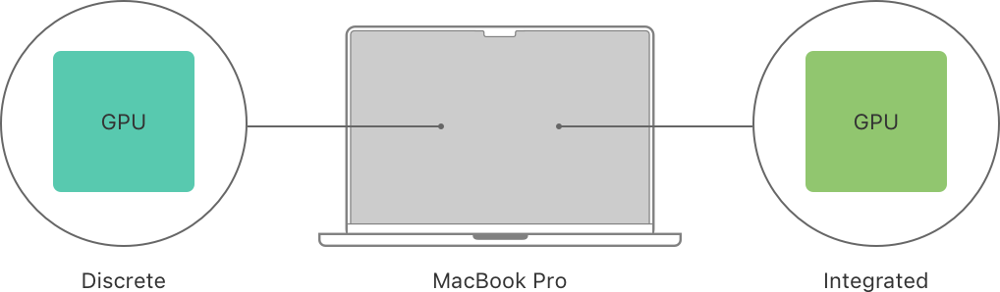
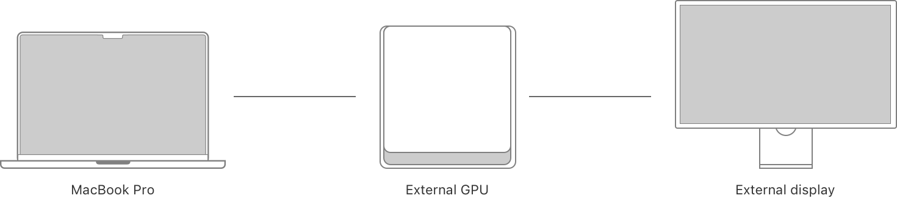
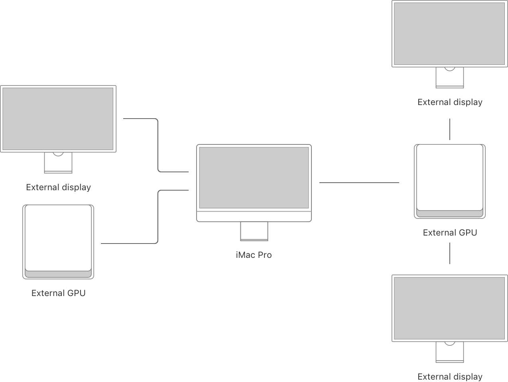

> 导航：[Technologies](../technologies.md) · [Metal](../metal.md) · [GPU devices and work submission](gpu-devices-and-work-submission.md)

# 多 GPU 系统

API 集合

定位并使用内部与外部 GPU 及其显示器、显存，并权衡各自的性能取舍。

## 概述

在支持多个 GPU 的系统上，你的 App 可以向其中任意一个或全部 GPU 提交工作。例如，每台 Mac 笔记本电脑（比如 MacBook Pro）都配有一个内置 GPU，有些型号则有两个。

Mac 可能会通过 Thunderbolt 连接到外部 GPU 及其显示器。

有些系统可能会有更复杂的内部与多个外部 GPU 及显示器排列方式。

系统示意图，展示一台 iMac Pro 连接到一台外部显示器、一个外部 GPU，以及另一个同时连接了另外两台外部显示器的外部 GPU。

有关配备 GPU 和显示器的 Mac 配置的更多信息，请参阅[在基于 Intel 的 Mac 上评估多 GPU 与多显示器配置](assessing-multi-gpu-and-multi-display-setups-on-an-intel-based-mac.md)。

首先定位系统中的所有 GPU 并识别它们的类型（参阅[在基于 Intel 的 Mac 上查找多个 GPU](finding-multiple-gpus-on-an-intel-based-mac.md)）。你也可以改为定位驱动某个显示器的具体 GPU（参阅[获取驱动某个视图显示的 GPU](getting-the-gpu-that-drives-a-views-display.md)）。

在选择 GPU 时，请考虑其显存带宽以及该 GPU 内存资源的存储模式选项（参阅[针对 GPU 显存带宽取舍进行调整](adjusting-for-gpu-memory-bandwidth-tradeoffs.md)）。

有关在图形渲染或计算处理工作流程中使用外部 GPU 的示例，请参阅以下内容：

- [为图形渲染选择设备对象](selecting-device-objects-for-graphics-rendering.md)
- [为计算处理选择设备对象](selecting-device-objects-for-compute-processing.md)

有关外部 GPU 配置的更多信息，请参阅[在你的 Mac 上使用外部图形处理器](https://support.apple.com/kb/HT208544)。

> [!note] 注意
> 系统可能会在任意时刻获得或失去一个外部 GPU（参阅[处理外部 GPU 的添加与移除](handling-external-gpu-additions-and-removals.md)）。

## 主题

### 定位 GPU

- [在基于 Intel 的 Mac 上查找多个 GPU](finding-multiple-gpus-on-an-intel-based-mac.md) — 为你的 App 定位、识别并选择合适的 GPU。
- [获取驱动某个视图显示的 GPU](getting-the-gpu-that-drives-a-views-display.md) — 让你的显示器始终使用最优设备。
- [MTLCopyAllDevices](<mtlcopyalldevices().md>) — 返回系统中所有 Metal 设备实例组成的数组。
- [MTLCopyAllDevicesWithObserver(handler:)](<mtlcopyalldeviceswithobserver(handler_).md>) — 返回系统中所有 Metal GPU 设备组成的数组，并注册一个通知处理程序，供设备列表发生变化时 Metal 调用。
- [MTLRemoveDeviceObserver](<mtlremovedeviceobserver(__).md>) — 移除一个已注册的设备通知观察者。 _(已废弃)_
- [CGDirectDisplayCopyCurrentMetalDevice(_:)](<../coregraphics/cgdirectdisplaycopycurrentmetaldevice(__).md>) — 返回当前正在驱动某个显示器的 GPU 设备实例。
- [MTLDeviceNotificationHandler](mtldevicenotificationhandler.md) — 系统添加或移除 GPU 设备时 Metal 会调用的 Swift 闭包或 Objective-C 代码块。 _(已废弃)_
- [MTLDeviceNotificationName](mtldevicenotificationname.md) — 代表系统中某个 GPU 设备发生变化的通知。 _(已废弃)_

### 选择 GPU

- [针对 GPU 显存带宽取舍进行调整](adjusting-for-gpu-memory-bandwidth-tradeoffs.md) — 根据 Mac 上某个 GPU 的显存带宽，为任务选择合适的 GPU 与内存存储模式。
- [在基于 Intel 的 Mac 上评估多 GPU 与多显示器配置](assessing-multi-gpu-and-multi-display-setups-on-an-intel-based-mac.md) — 了解 Mac 可能采用的 GPU 与显示器配置及其限制。
- [为图形渲染选择设备对象](selecting-device-objects-for-graphics-rendering.md) — 在多个 GPU 之间动态切换，以高效地渲染到显示器。
- [为计算处理选择设备对象](selecting-device-objects-for-compute-processing.md) — 在多个 GPU 之间动态切换，以高效执行计算密集型模拟。

### 使用外部 GPU

- [处理外部 GPU 的添加与移除](handling-external-gpu-additions-and-removals.md) — 注册并响应由用户发起的外部 GPU 通知。
- [在已连接的 GPU 之间传输数据](transferring-data-between-connected-gpus.md) — 使用 GPU 之间的高速连接快速传输数据。

## 另请参阅

### 定位与检查 GPU 设备

- [获取默认 GPU](getting-the-default-gpu.md) — 选择系统的默认 GPU 设备来运行你的 Metal 代码。
- [检测 GPU 特性与 Metal 软件版本](detecting-gpu-features-and-metal-software-versions.md) — 使用设备对象的属性来确定你在 Metal 中执行任务的方式。
- [MTLCreateSystemDefaultDevice](<mtlcreatesystemdefaultdevice().md>) — 返回 Metal 选定作为默认值的设备实例。
- [MTLDevice](mtldevice.md) — App 用来绘制图形并并行运行计算的、面向 GPU 的主要 Metal 接口。
