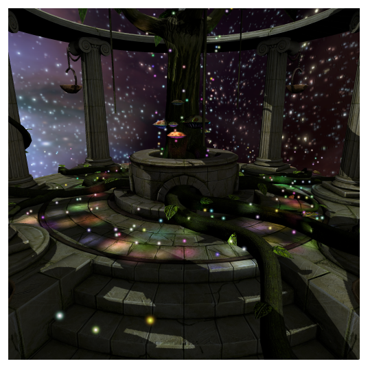
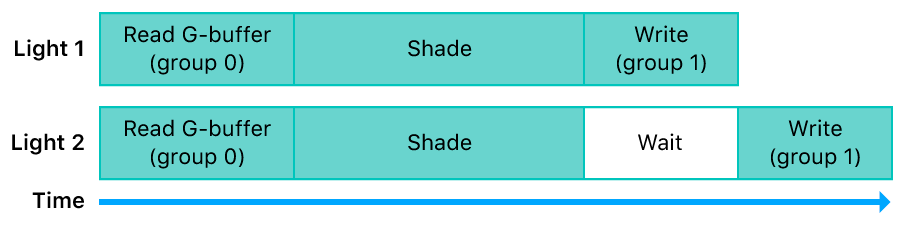
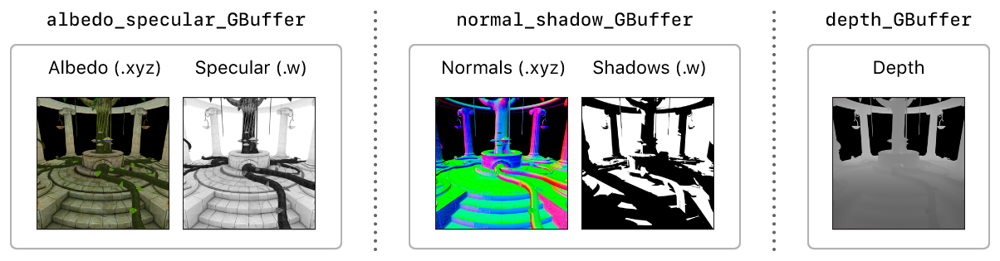
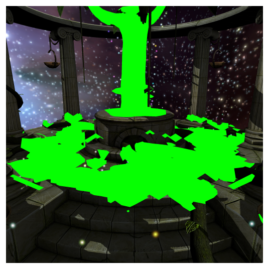

> 导航：[Technologies](../technologies.md) · [Metal](../metal.md) · [Metal sample code library](metal-sample-code-library.md)

# 用 C++ 通过延迟光照渲染场景

<sub>示例代码</sub>

通过实现一个针对即时模式和基于分块的延迟渲染器 GPU 进行优化的延迟光照渲染器，避免昂贵的光照计算。

## 概述

该示例演示了一个延迟光照渲染器，它使用阴影贴图实现阴影，并使用模板缓冲区剔除光照体积。



相比正向光照，延迟光照能够更轻松地渲染大量光源。举例来说，使用正向光照时，在包含大量光源的场景中，让每个片段都计算每个光源的贡献是不可行的。需要实现复杂的排序和分箱算法，将光照贡献的计算限制在只影响每个片段的那些光源上。而使用延迟光照，可以轻松地将多个光源应用于场景。

### 配置示例代码项目

该 Xcode 项目包含用于在 macOS、iOS 或 tvOS 上运行该示例的方案（scheme）。默认方案是 macOS，它会在你的 Mac 上按原样运行该示例。

> [!note] 注意
> 将渲染目标拆分为不同的组以供片段函数执行，需要一台支持栅格顺序组（raster order group）的 macOS 或 iOS 设备。查询你设备的 `rasterOrderGroupsSupported` 属性以确定是否支持。

该示例包含以下预处理器条件，你可以修改它们来控制 App 的配置。

**AAPLConfig.h**

```cpp
#define USE_EYE_DEPTH              1
#define LIGHT_STENCIL_CULLING      1
#define SUPPORT_BUFFER_EXAMINATION 1
```

以下是它们各自会修改的 App 行为：

- `USE_EYE_DEPTH` — 启用时，将眼部空间中的深度值写入几何缓冲区的深度分量。这使延迟流程能够更轻松地计算眼部空间的片段位置以应用光照。禁用时，屏幕深度会被写入几何缓冲区的深度分量，并且需要在延迟流程中额外执行一次从屏幕空间到眼部空间的逆变换才能计算光照贡献。
- `LIGHT_STENCIL_CULLING` — 启用时，使用模板缓冲区来避免对与 3D 光照体积不相交的片段执行光照计算。禁用时，GPU 会为屏幕空间中被某个光源覆盖的所有片段计算光照。这意味着需要进行昂贵光照计算的片段数量，会大大超过实际所需的数量。
- `SUPPORT_BUFFER_EXAMINATION` — 启用运行时切换缓冲区检查模式的功能。受此定义保护的代码仅用于检查或调试底层实现的各个部分。

在 macOS 上，按下以下按键可在运行时检查场景：

- 按 1 可同时查看所有检查视图。
- 按 2 可查看几何缓冲区的反照率（albedo）数据。
- 按 3 可查看几何缓冲区的法线数据。
- 按 4 可查看几何缓冲区的深度数据。
- 按 5 可查看几何缓冲区的高光数据。
- 按 6 可查看几何缓冲区的阴影数据。
- 按 7 可查看阴影贴图。
- 按 8 可查看被遮罩后的光照体积覆盖范围。
- 按 9 可查看完整的光照体积覆盖范围。
- 按 0 或回车可退出检查视图，返回标准视图。

在 iOS 上，运行时点按屏幕即可在标准视图和检查视图之间切换。

### 回顾重要概念

在开始使用该示例 App 之前，先回顾以下概念，以便更好地理解延迟光照渲染器的关键细节以及一些独特的 Metal 特性。

**传统延迟光照渲染器**

传统的延迟光照渲染器通常拆分为两个渲染流程：

- **第一个流程：几何缓冲区渲染。** 渲染器绘制并变换场景的模型，片段函数将结果渲染到一组被称为 _几何缓冲区（geometry buffer）_ 或 _g-buffer_ 的纹理中。几何缓冲区包含来自模型的材质颜色，以及逐片段的法线、阴影和深度值。
- **第二个流程：延迟光照与合成。** 渲染器绘制每个光照体积，使用几何缓冲区数据重建每个片段的位置并应用光照计算。随着各个光源被绘制，每个光源的输出会与之前光源的输出叠加混合。最后，渲染器通过执行一个全屏四边形或一个计算内核，将阴影和方向光等其他数据合成到场景中。


> [!note] 注意
> 一些 macOS GPU 采用 _即时模式渲染（IMR）_ 架构。在 IMR GPU 上，延迟光照渲染器至少需要两个渲染流程才能实现。因此，该示例针对 App 的 macOS 版本实现了一个两阶段延迟光照算法。iOS 和 tvOS 模拟器运行在 macOS 的 Metal 实现之上，因此它们也使用这个两阶段延迟光照算法。

**Apple 芯片 GPU 上的单流程延迟光照**

Apple 芯片 GPU（存在于所有 iOS 和 tvOS 设备以及现在的某些 macOS 设备上）采用基于分块的延迟渲染（TBDR）架构，这使它们能够将数据渲染到 GPU 内部的分块内存中。通过渲染到分块内存，设备避免了 GPU 与系统内存之间（经由带宽受限的内存总线）可能产生的昂贵往返。GPU 是否会将分块内存写入系统内存，取决于以下配置：

- App 渲染命令编码器的存储操作（store action）。
- App 纹理的存储模式。

当 `MTLStoreActionStore` 被设置为存储操作时，某个渲染流程的渲染目标的输出数据会从分块内存写入系统内存，这些渲染目标由纹理支持。如果这些数据随后被用于后续的渲染流程，这些纹理的输入数据会从系统内存读入 GPU 中的纹理缓存。因此，一个访问系统内存的传统延迟光照渲染器，需要在第一个和第二个渲染流程之间将几何缓冲区数据存储在系统内存中。


<sub>示意图，展示了传统延迟光照算法中的几何缓冲区数据如何在 GPU 与系统内存之间传输。</sub>

然而，由于 TBDR 架构的缘故，Apple 芯片 GPU 还可以在任意给定时刻从分块内存中读取数据。这使得片段着色器能够在分块内存中的渲染目标数据再次被写入之前，对其进行读取和计算。这一特性使该示例得以避免在第一个和第二个渲染流程之间将几何缓冲区数据存储到系统内存中；因此，延迟光照渲染器可以通过单个渲染流程实现。

几何缓冲区数据在单个渲染流程内完全由 GPU 生成和消费，而不涉及 CPU。因此，这些数据在渲染流程开始之前不会从系统内存加载，在渲染流程结束之后也不会存储到系统内存中。光照片段函数并非从系统内存中的纹理读取几何缓冲区数据，而是在几何缓冲区仍作为渲染目标附加到渲染流程时直接从中读取数据。因此，无需为几何缓冲区纹理分配系统内存，这些纹理中的每一个都可以声明为 `MTLStorageModeMemoryless` 存储模式。


> [!note] 注意
> 允许 TBDR GPU 在片段函数中读取已附加渲染目标的这一特性，也被称为 _可编程混合（programmable blending）_。

**使用栅格顺序组的延迟光照**

默认情况下，当片段着色器向某个像素写入数据时，GPU 会等待该着色器完全写完该像素之后，才开始执行针对同一像素的另一个片段着色器。


栅格顺序组让 App 能够提高 GPU 片段着色器的并行化程度。借助栅格顺序组，片段函数可以将渲染目标拆分到不同的执行组中。这种拆分使得 GPU 能够在某一组中的渲染目标上进行读取和计算，而无需等待另一组中某个片段着色器实例先完成对像素的数据写入。



在该示例中，一些光照片段函数使用了以下栅格顺序组：

- **栅格顺序组 0。** `AAPLLightingROG` 用于包含光照计算结果的渲染目标。
- **栅格顺序组 1。** `AAPLGBufferROG` 用于光照函数中的几何缓冲区数据。

这些栅格顺序组使 GPU 能够在片段着色器中读取几何缓冲区并执行光照计算，而无需等待前一个片段着色器实例的光照计算写完其输出数据。

### 渲染一帧延迟光照画面

该示例按以下顺序渲染这些阶段，来渲染每一个完整的帧：

1. 阴影贴图
2. 几何缓冲区
3. 方向光
4. 光照遮罩
5. 点光源
6. 天空盒
7. 精灵光

该示例的单流程延迟渲染器在单个渲染流程中生成几何缓冲区，并执行所有后续阶段。这种单流程实现之所以可行，是因为 iOS 和 tvOS GPU 具有 TBDR 架构，允许设备从分块内存中的渲染目标读取几何缓冲区数据。

**AAPLRenderer_SinglePassDeferred.cpp**

```cpp
MTL::RenderCommandEncoder* pRenderEncoder = pCommandBuffer->renderCommandEncoder(m_pViewRenderPassDescriptor);
pRenderEncoder->setLabel( AAPLSTR( "Combined GBuffer & Lighting Pass" ) );

Renderer::drawGBuffer( pRenderEncoder );

drawDirectionalLight( pRenderEncoder );

Renderer::drawPointLightMask( pRenderEncoder );

drawPointLights( pRenderEncoder );

Renderer::drawSky( pRenderEncoder );

Renderer::drawFairies( pRenderEncoder );

pRenderEncoder->endEncoding();
```

该示例的传统延迟渲染器在一个渲染流程中生成几何缓冲区，然后在另一个渲染流程中执行所有后续阶段。这种两流程实现对于采用 IMR 架构的 GPU 是必需的，因为这类 GPU 不支持在片段函数中读取渲染目标的颜色数据。

**AAPLRenderer_TraditionalDeferred.cpp**

```cpp
MTL::RenderCommandEncoder* pRenderEncoder = pCommandBuffer->renderCommandEncoder( m_pGBufferRenderPassDescriptor );
pRenderEncoder->setLabel( AAPLSTR( "GBuffer Generation" ) );

Renderer::drawGBuffer( pRenderEncoder );

pRenderEncoder->endEncoding();
```

**AAPLRenderer_TraditionalDeferred.cpp**

```cpp
MTL::RenderCommandEncoder* pRenderEncoder = pCommandBuffer->renderCommandEncoder( m_pFinalRenderPassDescriptor );
pRenderEncoder->setLabel( AAPLSTR( "Lighting & Composition Pass" ) );

drawDirectionalLight( pRenderEncoder );

Renderer::drawPointLightMask( pRenderEncoder );

drawPointLights( pRenderEncoder );

Renderer::drawSky( pRenderEncoder );

Renderer::drawFairies( pRenderEncoder );

pRenderEncoder->endEncoding();
```

### 渲染阴影贴图

该示例通过从光源（太阳）的视角渲染模型，为场景中的单个方向光渲染一张阴影贴图。


阴影贴图的渲染管线有一个顶点函数但没有片段函数；因此，该示例无需执行渲染管线的更多阶段，就能确定写入阴影贴图的屏幕空间深度值。（此外，由于没有片段函数，这次渲染执行得很快。）

**AAPLRenderer.cpp**

```cpp
MTL::RenderPipelineDescriptor* pRenderPipelineDescriptor = MTL::RenderPipelineDescriptor::alloc()->init();
pRenderPipelineDescriptor->setLabel( AAPLSTR( "Shadow Gen" ) );
pRenderPipelineDescriptor->setVertexDescriptor( nullptr );
pRenderPipelineDescriptor->setVertexFunction( pShadowVertexFunction );
pRenderPipelineDescriptor->setFragmentFunction( nullptr );
pRenderPipelineDescriptor->setDepthAttachmentPixelFormat( shadowMapPixelFormat );

m_pShadowGenPipelineState = m_pDevice->newRenderPipelineState( pRenderPipelineDescriptor, &pError );
```

在为阴影贴图绘制几何图形之前，该示例设置了一个深度偏移值，以减少阴影伪影：

**AAPLRenderer.cpp**

```cpp
pEncoder->setDepthBias( 0.015, 7, 0.02 );
```

然后，在几何缓冲区阶段的片段函数中，该示例测试该片段是否被遮挡并处于阴影中：

**AAPLGBuffer.metal**

```metal
half shadow_sample = shadowMap.sample_compare(shadowSampler, in.shadow_uv, in.shadow_depth);
```

该示例将 `sample_compare` 函数的结果存储在 `normal_shadow` 渲染目标的 `w` 分量中：

**AAPLGBuffer.metal**

```metal
gBuffer.normal_shadow = half4(eye_normal.xyz, shadow_sample);
```

在方向光和点光源的合成阶段，该示例会从几何缓冲区读取阴影值并将其应用于该片段。

### 渲染几何缓冲区

该示例的几何缓冲区包含以下纹理：

- `albedo_specular_GBuffer`，存储反照率和高光数据。反照率数据存储在 `x`、`y`、`z` 分量中；高光数据存储在 `w` 分量中。
- `normal_shadow_GBuffer`，存储法线和阴影数据。法线数据存储在 `x`、`y`、`z` 分量中；阴影数据存储在 `w` 分量中。
- `depth_GBuffer`，存储眼部空间中的深度值。



当该示例渲染几何缓冲区时，传统延迟渲染器和单流程延迟渲染器都会将所有几何缓冲区纹理作为渲染目标附加到该渲染流程。不过，由于具有 TBDR 架构的设备既能渲染几何缓冲区又能在单个渲染流程内读取它，该示例以无内存（memoryless）存储模式创建几何缓冲区纹理，这表示不会为这些纹理分配系统内存。相反，这些纹理只在渲染流程持续期间被分配并填充到分块内存中。

该示例在通用的 `drawableSizeWillChange()` 方法中创建几何缓冲区纹理，但单流程延迟渲染器会将 `storageMode` 变量设置为 `MTL::StorageModeMemoryless`，而传统延迟渲染器则将其设置为 `MTL::StorageModePrivate`。

**AAPLRenderer_SinglePassDeferred.cpp**

```cpp
m_GBufferStorageMode = MTL::StorageModeMemoryless;
```

对于传统延迟渲染器，在该示例完成向几何缓冲区纹理写入数据后，它会调用 `endEncoding` 方法来结束几何缓冲区渲染流程。由于该渲染命令编码器的存储操作被设为 `MTLStoreActionStore`，因此在该编码器完成执行时，GPU 会将每个渲染目标纹理写入显存。这使该示例能够在随后的延迟光照与合成渲染流程中从显存读取这些纹理。

对于单流程延迟渲染器，在该示例完成向几何缓冲区纹理写入数据后，该示例不会结束该渲染命令编码器，而是继续将其用于后续阶段。

### 应用方向光和阴影

该示例将方向光和阴影应用于最终要显示的可绘制对象。

传统延迟渲染器从作为片段函数参数设置的纹理中读取几何缓冲区数据：

**AAPLDirectionalLight.metal**

```metal
fragment half4
deferred_directional_lighting_fragment_traditional(
    QuadInOut            in                      [[ stage_in ]],
    constant FrameData & frameData               [[ buffer(BufferIndexFrameData) ]],
    texture2d<half>      albedo_specular_GBuffer [[ texture(RenderTargetAlbedo) ]],
    texture2d<half>      normal_shadow_GBuffer   [[ texture(RenderTargetNormal) ]],
    texture2d<float>     depth_GBuffer           [[ texture(RenderTargetDepth)  ]])
```

单流程延迟渲染器从附加到该渲染流程的渲染目标中读取几何缓冲区数据：

**AAPLShaderCommon.h**

```metal
struct GBufferData
{
    half4 lighting        [[ color(RenderTargetLighting), raster_order_group(LightingROG) ]];
    half4 albedo_specular [[ color(RenderTargetAlbedo),   raster_order_group(GBufferROG) ]];
    half4 normal_shadow   [[ color(RenderTargetNormal),   raster_order_group(GBufferROG) ]];
    float depth           [[ color(RenderTargetDepth),    raster_order_group(GBufferROG) ]];
};
```

**AAPLDirectionalLight.metal**

```metal
fragment AccumLightBuffer
deferred_directional_lighting_fragment_single_pass(
    QuadInOut            in        [[ stage_in ]],
    constant FrameData & frameData [[ buffer(BufferIndexFrameData) ]],
    GBufferData          GBuffer)
```

尽管这些片段函数的输入不同，它们在 `deferred_directional_lighting_fragment_common` 片段函数中共享一份通用实现。该函数执行以下操作：

- 从几何缓冲区的法线数据中重建法线，以计算漫反射项。
- 从几何缓冲区的深度数据中重建眼部空间位置，以应用镜面高光。
- 使用几何缓冲区的阴影数据使该片段变暗，并将阴影应用于场景。

由于这是第一个渲染到可绘制对象的阶段，iOS 和 tvOS 渲染器会在更早的几何缓冲区阶段之前获取一个可绘制对象，以便该可绘制对象可以与后续阶段的输出合并。然而，传统延迟渲染器会延迟获取可绘制对象，直到几何缓冲区阶段完成之后、方向光阶段开始之前才获取。这种延迟减少了 App 持有该可绘制对象的时长，从而提升了性能。

> [!note] 注意
> 由于 `m_directionLightDepthStencilState` 的状态，`deferred_directional_lighting_fragment` 系列函数只会针对应当被照亮的片段执行。这一优化虽然简单，却很重要，能节省大量片段着色器的执行周期。

### 剔除光照体积

该示例创建了一个模板遮罩，用于避免对许多片段执行昂贵的光照计算。它通过使用几何缓冲区流程中的深度缓冲区和模板缓冲区，来跟踪某个光照体积是否与任何几何图形相交，从而创建这个模板遮罩。（如果不相交，那么它就没有照亮任何东西。）

在 `drawPointLightMask:` 的实现中，该示例设置 `m_lightMaskPipelineState` 渲染管线，并编码一个实例化绘制调用，仅绘制包含点光源体积的二十面体的背面。如果这次绘制调用中的某个片段未通过深度测试，这个结果表明该二十面体的背面位于某些几何图形之后。

**AAPLRenderer.cpp**

```cpp
pRenderEncoder->setRenderPipelineState( m_pLightMaskPipelineState );
pRenderEncoder->setDepthStencilState( m_pLightMaskDepthStencilState );

pRenderEncoder->setStencilReferenceValue( 128 );
pRenderEncoder->setCullMode( MTL::CullModeFront );

pRenderEncoder->setVertexBuffer( m_frameDataBuffers[m_frameDataBufferIndex], 0, BufferIndexFrameData );
pRenderEncoder->setFragmentBuffer( m_frameDataBuffers[m_frameDataBufferIndex], 0, BufferIndexFrameData );
pRenderEncoder->setVertexBuffer( m_pLightsData, 0, BufferIndexLightsData );
pRenderEncoder->setVertexBuffer( m_lightPositions[m_frameDataBufferIndex], 0, BufferIndexLightsPosition );

const std::vector<MeshBuffer>& vertexBuffers = m_icosahedronMesh.vertexBuffers();
pRenderEncoder->setVertexBuffer( vertexBuffers[0].buffer(), vertexBuffers[0].offset(), BufferIndexMeshPositions );

const std::vector<Submesh>& icosahedronSubmesh = m_icosahedronMesh.submeshes();

pRenderEncoder->drawIndexedPrimitives( icosahedronSubmesh[0].primitiveType(),
                                     icosahedronSubmesh[0].indexCount(),
                                     icosahedronSubmesh[0].indexType(),
                                     icosahedronSubmesh[0].indexBuffer().buffer(),
                                     icosahedronSubmesh[0].indexBuffer().offset(),
                                     NumLights );
```

`m_lightMaskPipelineState` 没有片段函数，因此该渲染管线不会写入任何颜色数据。不过，由于设置了 `m_lightMaskDepthStencilState` 深度和模板状态，任何未通过深度测试的片段都会使该片段的模板缓冲区值递增。包含几何图形的片段，其起始深度值为 `128`，这是该示例在几何缓冲区阶段设置的。因此，当 `m_lightMaskDepthStencilState` 生效时，任何未通过深度测试的片段，其深度值都会递增到大于 `128`。（由于启用了正面剔除，一个未通过深度测试且值大于 `128` 的片段，表明该二十面体至少有背面一半位于所有几何图形之后。）

在下一次绘制调用中，即 `drawPointLightsCommon` 的实现里，该示例将点光源的贡献应用于该可绘制对象。该示例测试该二十面体的正面一半是否位于所有几何图形之前，从而确定该体积是否与某些几何图形相交，进而确定该片段是否应被照亮。为这次绘制调用设置的深度和模板状态 `m_pointLightDepthStencilState`，仅当该片段的模板值大于参考值 `128` 时才会执行片段函数。（由于模板测试值被设为 `MTLCompareFunctionLess`，只有当参考值 `128` 小于模板缓冲区中的值时，该示例才会通过测试。）

**AAPLRenderer.cpp**

```cpp
pRenderEncoder->setDepthStencilState( m_pPointLightDepthStencilState );

pRenderEncoder->setStencilReferenceValue( 128 );
pRenderEncoder->setCullMode( MTL::CullModeBack );

pRenderEncoder->setVertexBuffer( m_frameDataBuffers[m_frameDataBufferIndex], 0, BufferIndexFrameData );
pRenderEncoder->setVertexBuffer( m_pLightsData, 0, BufferIndexLightsData );
pRenderEncoder->setVertexBuffer( m_lightPositions[m_frameDataBufferIndex], 0, BufferIndexLightsPosition );

pRenderEncoder->setFragmentBuffer( m_frameDataBuffers[m_frameDataBufferIndex], 0, BufferIndexFrameData );
pRenderEncoder->setFragmentBuffer( m_pLightsData, 0, BufferIndexLightsData );
pRenderEncoder->setFragmentBuffer( m_lightPositions[m_frameDataBufferIndex], 0, BufferIndexLightsPosition );

const std::vector<MeshBuffer>& vertexBuffers = m_icosahedronMesh.vertexBuffers();
pRenderEncoder->setVertexBuffer( vertexBuffers[0].buffer(), vertexBuffers[0].offset(), BufferIndexMeshPositions );

const std::vector<Submesh>& icosahedronSubmesh = m_icosahedronMesh.submeshes();

pRenderEncoder->drawIndexedPrimitives( icosahedronSubmesh[0].primitiveType(),
                                     icosahedronSubmesh[0].indexCount(),
                                     icosahedronSubmesh[0].indexType(),
                                     icosahedronSubmesh[0].indexBuffer().buffer(),
                                     icosahedronSubmesh[0].indexBuffer().offset(),
                                     NumLights );
```

由于 `drawPointLightMask:` 中的绘制调用会为位于任何几何图形之后的片段递增模板值，该示例只会为同时满足以下两个条件的片段执行片段函数：

- 正面通过深度测试、位于某些几何图形之前的片段。
- 背面未通过深度测试、位于某些几何图形之后的片段。

以下示意图展示了启用该模板遮罩算法与未启用该算法所渲染的帧之间，片段覆盖范围的差异。启用该算法时，绿色像素表示执行了点光源片段函数的像素。



禁用该算法时，绿色和红色像素表示执行了点光源片段函数的像素。


### 渲染天空盒和精灵光

在最后的光照阶段，该示例对场景应用了更简单得多的光照技术。

该示例针对神庙的几何图形对天空盒应用深度测试，因此渲染器只会渲染到可绘制对象中尚未被任何几何图形填充的区域。

**AAPLRenderer.cpp**

```cpp
pRenderEncoder->setRenderPipelineState( m_pSkyboxPipelineState );
pRenderEncoder->setDepthStencilState( m_pDontWriteDepthStencilState );
pRenderEncoder->setCullMode( MTL::CullModeFront );

pRenderEncoder->setVertexBuffer( m_frameDataBuffers[m_frameDataBufferIndex], 0, BufferIndexFrameData );
pRenderEncoder->setFragmentTexture( m_pSkyMap, TextureIndexBaseColor );

for (auto& meshBuffer : m_skyMesh.vertexBuffers())
{
    pRenderEncoder->setVertexBuffer(meshBuffer.buffer(),
                                    meshBuffer.offset(),
                                    meshBuffer.argumentIndex());
}

for (auto& submesh : m_skyMesh.submeshes())
{
    pRenderEncoder->drawIndexedPrimitives(submesh.primitiveType(),
                                          submesh.indexCount(),
                                          submesh.indexType(),
                                          submesh.indexBuffer().buffer(),
                                          submesh.indexBuffer().offset() );
}
```

该示例将精灵光作为 2D 圆形渲染到可绘制对象上，并使用一张纹理来确定其片段的 alpha 混合系数。

**AAPLFairy.metal**

```metal
half4 c = colorMap.sample(linearSampler, float2(in.tex_coord));

half3 fragColor = in.color * c.x;

return half4(fragColor, c.x);
```

## 另请参阅

### 光照技术

- [Rendering a scene with forward plus lighting using tile shaders](rendering-a-scene-with-forward-plus-lighting-using-tile-shaders.md) — 使用 Apple GPU 的最新特性实现一个 forward plus 渲染器。
- [Rendering a scene with deferred lighting in Objective-C](rendering-a-scene-with-deferred-lighting-in-objective-c.md) — 通过实现一个针对即时模式和基于分块的延迟渲染器 GPU 进行优化的延迟光照渲染器，避免昂贵的光照计算。
- [Rendering a scene with deferred lighting in Swift](rendering-a-scene-with-deferred-lighting-in-swift.md) — 通过实现一个针对即时模式和基于分块的延迟渲染器 GPU 进行优化的延迟光照渲染器，避免昂贵的光照计算。
- [Rendering reflections with fewer render passes](rendering-reflections-with-fewer-render-passes.md) — 使用层选择来减少生成环境贴图所需的渲染流程数量。

## 下载

- [RenderingASceneWithDeferredLightingInC%2B%2B.zip](https://docs-assets.developer.apple.com/published/d29e2a233f6b/RenderingASceneWithDeferredLightingInC%2B%2B.zip)
