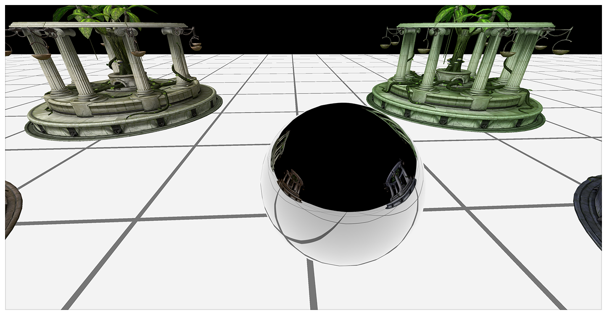
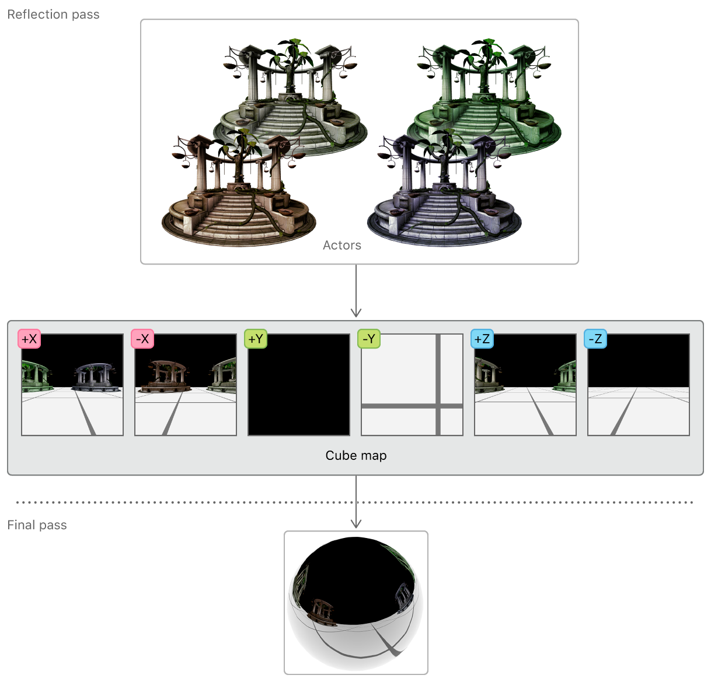
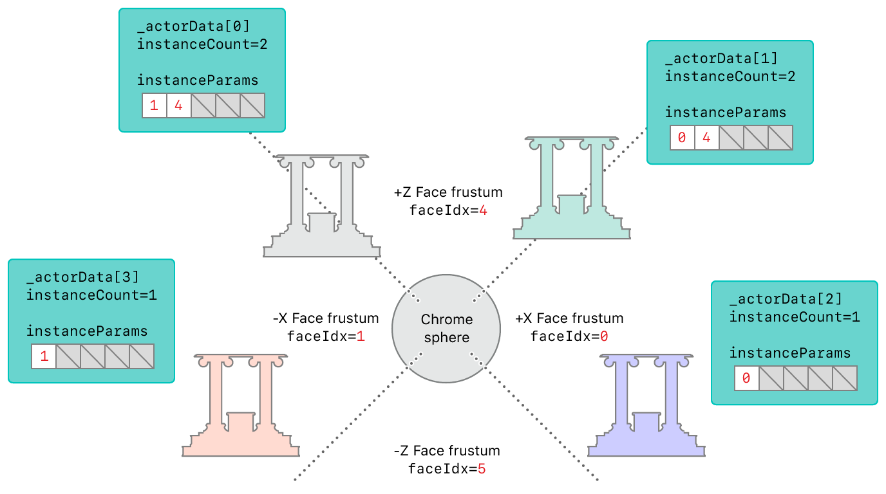
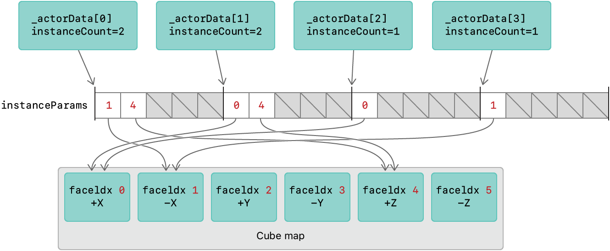

> 导航：[Technologies](../technologies.md) · [Metal](../metal.md) · [Metal sample code library](metal-sample-code-library.md)

# 用更少的渲染流程渲染反射

<sub>示例代码</sub>

使用层选择（layer selection）来减少生成环境贴图所需的渲染流程数量。

## 概述

该示例演示了铬合金球体上的动态反射效果，使用层选择技术分两个流程渲染一帧画面。第一个流程将环境渲染到立方体贴图上。第二个流程将环境反射渲染到球体上；渲染场景中的其他角色；并渲染环境本身。



你可以通过从环境的立方体贴图中采样反射，来实现一个反射其周围环境的对象。立方体贴图是由六个二维纹理层按立方体形状排列组成的单个纹理。反射效果会随环境中其他对象的位置而变化，因此立方体贴图的六个面中的每一个都需要在每一帧中动态渲染。这通常需要六个独立的渲染流程，每个面一个，但 Metal 允许你在单个流程中渲染整个立方体贴图。



### 开始使用

该示例包含 macOS 和 iOS 目标（target）。请在实体设备上运行 iOS 方案（scheme），因为模拟器不支持 Metal。

层选择在所有 macOS GPU 上都受支持，但在 iOS 上仅支持具备 [MTLFeatureSet_iOS_GPUFamily5_v1](mtlfeatureset/ios_gpufamily5_v1.md) 功能集的 GPU。

你可以通过调用 [MTLDevice](mtldevice.md) 实例的 [- supportsFeatureSet:](<mtldevice/supportsfeatureset(__).md>) 方法，来检查你在运行时选择的 GPU 是否支持间接命令缓冲区（ICB）。

**AAPLViewController.m**

```objective-c
supportsLayerSelection = [_view.device supportsFeatureSet:MTLFeatureSet_iOS_GPUFamily5_v1];
```

该示例在其视图控制器的 `viewDidLoad:` 回调中为此目的调用 `supportsFeatureSet:`。

### 拆分场景

立方体贴图表示为一个具有六层的渲染目标数组，每层对应一个面。为顶点函数返回值的结构体成员指定的 `[[render_target_array_index]]` 属性限定符，可以单独标识每个数组层。这一层选择功能让示例能够决定将环境的哪一部分渲染到立方体贴图的哪个面。

`AAPLActorData` 对象表示场景中的一个角色。在该示例中，每个角色都是一个使用相同网格数据但漫射颜色不同的神庙模型。这些角色位于 XZ 平面上；它们相对于球体总是在 X 或 Z 方向上被反射，可以渲染到立方体贴图的 +X、-X、+Z 或 -Z 任意一个面上。

### 为反射流程执行剔除测试

在渲染到立方体贴图之前，先了解每个角色应渲染到哪些面会很有帮助。确定这一信息涉及一个称为 _剔除测试（culling test）_ 的过程，该过程会针对每个角色、每个立方体贴图面执行。

在每一帧开始时，针对每个立方体贴图面计算一个视图矩阵，并将该视图的视锥体存储在 `culler_probe` 数组中。

**AAPLRenderer.mm**

```objective-c
// 1) 根据球体更新后的位置，获取该面的视图矩阵
viewMatrix[i] = _cameraReflection.GetViewMatrixForFace_LH (i);

// 2) 使用更新后的视图矩阵计算构成视锥体边界的平面
//    之后你将使用这些平面来测试一个角色的边界球体
//    是否与视锥体相交，从而判断它在该面的视口中是否可见
culler_probe[i].Reset_LH (viewMatrix [i], _cameraReflection);
```

这些剔除探针（culler probe）测试角色与每个立方体贴图面的观察视锥体之间的相交情况。测试结果决定了该角色在反射流程中被渲染到多少个面（`instanceCount`），以及被渲染到哪些面（`instanceParams`）。

**AAPLRenderer.mm**

```objective-c
if (_actorData[actorIdx].passFlags & EPassFlags::Reflection)
{
    int instanceCount = 0;
    for (int faceIdx = 0; faceIdx < 6; faceIdx++)
    {
        // 检查该角色在当前探针面中是否可见
        if (culler_probe [faceIdx].Intersects (_actorData[actorIdx].modelPosition.xyz, _actorData[actorIdx].bSphere))
        {
            // 将该面索引加入该角色的面列表
            InstanceParams instanceParams = {(ushort)faceIdx};
            instanceParams_reflection [MaxVisibleFaces * actorIdx + instanceCount].viewportIndex = instanceParams.viewportIndex;
            instanceCount++;
        }
    }
    _actorData[actorIdx].instanceCountInReflection = instanceCount;
}
```

下图展示了根据神庙角色相对于反射球体的位置对其执行剔除测试的结果。因为 `_actorData[0]` 和 `actorData[1]` 横跨两个观察视锥体，它们的 `instanceCount` 属性被设为 2，且它们的 `instanceParams` 数组中各有两个元素。（该数组包含角色所相交的观察视锥体对应的立方体贴图面索引。）



### 为反射流程配置渲染目标

反射流程的渲染目标是一个立方体贴图。该示例通过使用一个带有颜色渲染目标、深度渲染目标以及六层的 `MTLRenderPassDescriptor` 对象来配置渲染目标。`renderTargetArrayLength` 属性设置立方体贴图面的数量，并允许渲染管线渲染到其中任意一个或全部面。

**AAPLRenderer.mm**

```objective-c
reflectionPassDesc.colorAttachments[0].texture    = _reflectionCubeMap;
reflectionPassDesc.depthAttachment.texture        = _reflectionCubeMapDepth;
reflectionPassDesc.renderTargetArrayLength        = 6;
```

### 为反射流程发出绘制调用

`drawActors:pass:` 方法为每个角色设置图形渲染状态。只有当角色在六个立方体贴图面中的任意一个可见时才会被绘制，这由 `visibleVpCount` 值（通过 `instanceCountInReflection` 属性访问）决定。`visibleVpCount` 的值决定了实例化绘制调用的实例数量。

**AAPLRenderer.mm**

```objective-c
[renderEncoder drawIndexedPrimitives: metalKitSubmesh.primitiveType
                          indexCount: metalKitSubmesh.indexCount
                           indexType: metalKitSubmesh.indexType
                         indexBuffer: metalKitSubmesh.indexBuffer.buffer
                   indexBufferOffset: metalKitSubmesh.indexBuffer.offset
                       instanceCount: visibleVpCount
                          baseVertex: 0
                        baseInstance: actorIdx * MaxVisibleFaces];
```

在此绘制调用中，该示例将 `baseInstance` 参数设为 `actorIdx * 5` 的值。这一设置很重要，因为它告知顶点函数如何为每个实例选择合适的渲染目标层。

### 渲染反射流程

在 `vertexTransform` 顶点函数中，`instanceParams` 参数指向包含每个角色应渲染到的立方体贴图面的缓冲区。`instanceId` 值用作 `instanceParams` 数组的索引。

**AAPLShaders.metal**

```metal
vertex ColorInOut vertexTransform (const Vertex in                               [[ stage_in ]],
                                   const uint   instanceId                       [[ instance_id ]],
                                   const device InstanceParams* instanceParams   [[ buffer     (BufferIndexInstanceParams) ]],
                                   const device ActorParams&    actorParams      [[ buffer (BufferIndexActorParams)    ]],
                                   constant     ViewportParams* viewportParams   [[ buffer (BufferIndexViewportParams) ]] )
```

顶点函数的输出结构体 `ColorInOut` 包含使用 `[[render_target_array_index]]` 属性限定符的 `face` 成员。`face` 的返回值决定了渲染管线应渲染到的立方体贴图面。

**AAPLShaders.metal**

```metal
struct ColorInOut
{
    float4 position [[position]];
    float2 texCoord;

    half3  worldPos;
    half3  tangent;
    half3  bitangent;
    half3  normal;
    uint   face [[render_target_array_index]];
};
```

由于绘制调用的 `baseInstance` 参数被设为 `actorIdx * 5`，该绘制调用中绘制的第一个实例的 `instanceId` 值就等于这个值。之后每渲染一个实例，`instanceId` 的值就递增 1。`instanceParams` 数组为每个角色保留五个槽位，因为一个角色最多可以在五个立方体贴图面中可见。因此，`instanceParams[instanceId]` 元素始终包含该角色可见的某个面索引之一。所以，该示例使用这个值来选择一个有效的渲染目标层。

**AAPLShaders.metal**

```metal
out.face = instanceParams[instanceId].viewportIndex;
```

总而言之，要将每个角色渲染到反射立方体贴图，该示例会为该角色发出一次实例化绘制调用。顶点函数使用内置的 `instanceId` 变量作为索引，从 `instanceParams` 数组中获取该实例应渲染到的立方体贴图面的索引。因此，顶点函数将这个面索引设置到使用 `[[render_target_array_index]]` 属性限定符的 `face` 返回值成员中。这确保了每个角色都被渲染到它应该出现的每个立方体贴图面上。



### 为最终流程执行剔除测试

该示例在最终流程中对主摄像机执行类似的视图更新。在每一帧开始时，计算一个视图矩阵，并将该视图的视锥体存储在 `culler_final` 变量中。

**AAPLRenderer.mm**

```objective-c
_cameraFinal.target   = SceneCenter;

_cameraFinal.rotation = fmod ((_cameraFinal.rotation + CameraRotationSpeed), M_PI*2.f);
matrix_float3x3 rotationMatrix = matrix3x3_rotation (_cameraFinal.rotation,  CameraRotationAxis);

_cameraFinal.position = SceneCenter;
_cameraFinal.position += matrix_multiply (rotationMatrix, CameraDistanceFromCenter);

const matrix_float4x4 viewMatrix       = _cameraFinal.GetViewMatrix();
const matrix_float4x4 projectionMatrix = _cameraFinal.GetProjectionMatrix_LH();

culler_final.Reset_LH (viewMatrix, _cameraFinal);

ViewportParams *viewportBuffer = (ViewportParams *)_viewportsParamsBuffers_final[_uniformBufferIndex].contents;
viewportBuffer[0].cameraPos            = _cameraFinal.position;
viewportBuffer[0].viewProjectionMatrix = matrix_multiply (projectionMatrix, viewMatrix);
```

这个最终剔除探针用于测试角色与摄像机观察视锥体之间的相交情况。测试结果只是简单地决定每个角色在最终流程中是否可见。

**AAPLRenderer.mm**

```objective-c
if (culler_final.Intersects (_actorData[actorIdx].modelPosition.xyz, _actorData[actorIdx].bSphere))
{
    _actorData[actorIdx].visibleInFinal = YES;
}
else
{
    _actorData[actorIdx].visibleInFinal = NO;
}
```

### 为最终流程配置渲染目标

最终流程的渲染目标是视图的 _可绘制对象（drawable）_，这是一种可显示资源，通过访问视图的 `currentRenderPassDescriptor` 属性获取。但是，不要过早访问这个属性，因为它会隐式获取一个可绘制对象。可绘制对象是由 Core Animation 框架创建和维护的昂贵系统资源。应尽可能短暂地持有可绘制对象，以避免资源阻塞。在该示例中，可绘制对象是在编码最终渲染流程之前才获取的。

**AAPLRenderer.mm**

```objective-c
MTLRenderPassDescriptor* finalPassDescriptor = view.currentRenderPassDescriptor;

if(finalPassDescriptor != nil)
{
    finalPassDescriptor.renderTargetArrayLength = 1;
    id<MTLRenderCommandEncoder> renderEncoder =
    [commandBuffer renderCommandEncoderWithDescriptor:finalPassDescriptor];
    renderEncoder.label = @"FinalPass";

    [self drawActors: renderEncoder pass: EPassFlags::Final];

    [renderEncoder endEncoding];
}
```

### 为最终流程发出绘制调用

`drawActors:pass`: 方法为每个角色设置图形渲染状态。只有当角色对主摄像机可见时才会被绘制，这由 `visibleVpCount` 值（通过 `visibleInFinal` 属性访问）决定。

因为每个角色在最终流程中只绘制一次，`instanceCount` 参数始终设为 1，`baseInstance` 参数始终设为 0。

### 渲染最终流程

最终流程将最终帧直接渲染到视图的可绘制对象，然后呈现到屏幕上。

**AAPLRenderer.mm**

```objective-c
[commandBuffer presentDrawable:view.currentDrawable];
```

## 另请参阅

### 光照技术

- [Rendering a scene with forward plus lighting using tile shaders](rendering-a-scene-with-forward-plus-lighting-using-tile-shaders.md) — 使用 Apple GPU 的最新特性实现一个 forward plus 渲染器。
- [Rendering a scene with deferred lighting in Objective-C](rendering-a-scene-with-deferred-lighting-in-objective-c.md) — 通过实现一个针对即时模式和基于分块的延迟渲染器 GPU 进行优化的延迟光照渲染器，避免昂贵的光照计算。
- [Rendering a scene with deferred lighting in Swift](rendering-a-scene-with-deferred-lighting-in-swift.md) — 通过实现一个针对即时模式和基于分块的延迟渲染器 GPU 进行优化的延迟光照渲染器，避免昂贵的光照计算。
- [Rendering a scene with deferred lighting in C++](rendering-a-scene-with-deferred-lighting-in-c++.md) — 通过实现一个针对即时模式和基于分块的延迟渲染器 GPU 进行优化的延迟光照渲染器，避免昂贵的光照计算。

## 下载

- [RenderingReflectionsWithFewerRenderPasses.zip](https://docs-assets.developer.apple.com/published/251f6b50b864/RenderingReflectionsWithFewerRenderPasses.zip)
