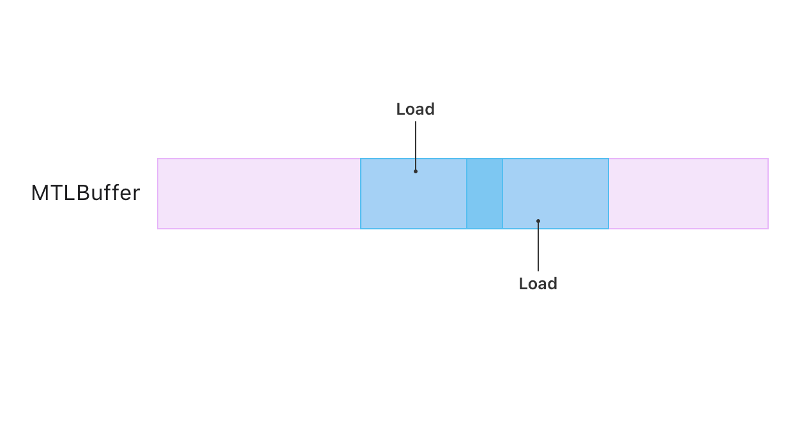
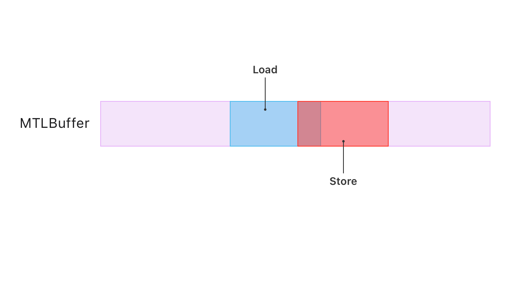

> 导航：[技术](../technologies.md) · [Metal](../metal.md)

# 资源同步

API 集合

通过使用屏障（barrier）、围栏（fence）和事件（event）协调读取和写入操作，防止可同时访问同一资源的多个命令发生冲突。

## 概述

按照设计，GPU 可以并行运行多条命令。其中许多命令会通过读取和写入操作来访问资源的底层内存，包括 buffer 和 texture。当其中一条或多条命令有内存写入（或称 store）操作，并且至少有一条其他命令有内存读取（或称 load）操作时，命令之间就可能产生**访问冲突**。

当提交给 [MTL4CommandQueue](mtl4commandqueue.md) 实例的命令与某个资源存在访问冲突时，需要对这些命令进行同步。访问冲突可能导致你的 App 出现问题，例如非确定性行为。举例来说，如果没有同步，一条从 texture 读取数据以获取前一条绘制命令结果的绘制命令，可能会在前一条命令尚未完成将输出写入该 texture 之前，就开始从该 texture 的内存加载数据。

> [!important] 重要
> [MTLResource](mtlresource.md) 实例的 [hazardTrackingMode](mtlresource/hazardtrackingmode.md) 属性的值，对你提交给 [MTL4CommandQueue](mtl4commandqueue.md) 的工作没有影响。

### 查找存在访问冲突的资源

首先，识别出哪些命令会访问同一个资源，例如 [MTLBuffer](mtlbuffer.md) 或 [MTLTexture](mtltexture.md) 实例。考虑任何可能被多个 Pass 以任何方式并发访问的资源，包括：

- 资源绑定（Resource bindings），你可以直接通过 [MTLCommandEncoder](mtlcommandencoder.md) 或 [MTL4ArgumentTable](mtl4argumenttable.md) 协议进行配置。
- 参数缓冲（Argument buffers），你自行创建和配置（参见[使用参数缓冲区管理资源组](managing-groups-of-resources-with-argument-buffers.md)）。
- 渲染 Pass 的附件（Attachments），这是存储渲染信息（如颜色、深度或模板数据）的 texture。

多条命令同时从同一资源内存加载数据是允许的，因为它们都只是从内存中读取而不做修改。例如，多条命令可以同时加载一个 buffer 的不同片段，即使这些片段有重叠，因为它们都没有向该内存写入数据。

示意图显示多条命令同时从同一 buffer 内存加载数据而无冲突，因为它们仅从内存读取。

然而，当 App 编码的命令同时读取和写入同一资源的内存时，就可能引入访问冲突。

通过检查哪些资源适用于多条命令（其中至少有一条命令通过 store 操作修改该资源），来定位潜在的访问冲突。并发运行的存在访问冲突的命令会产生竞态条件（race condition），可能导致结果不一致。这是因为任何重叠的内存加载和存储操作，其相对执行顺序并不固定。每次 GPU 在没有同步的情况下运行一批命令时，一条命令的 load 操作可能在 store 操作之前、期间或之后运行。

> [!note] 注意
> 尽管竞态条件通常源于实现错误，但某些 App 会有意引入竞态条件作为一种优化技术，例如两条命令不需要同步，因为它们对资源进行的是相同的修改。

### 检查访问其附件的渲染 Pass 命令

一个写入附件的渲染 Pass 可能会引入访问冲突，因为渲染 Pass 可能对该附件存在隐式的 load 和 store 操作。对于渲染 Pass，通过以下方式检查其附件 texture 的潜在冲突：

- 注意该 Pass 在开始和结束时分别加载和存储的附件。
- 查找任何读取或修改这些附件 texture 的命令。

渲染命令编码器（render command encoder）会为其编码的渲染 Pass 的每个适用 texture 附件添加 load 操作、store 操作或两者。当你在配置适用于每个附件的 [MTLRenderPassAttachmentDescriptor](mtlrenderpassattachmentdescriptor.md) 实例的 [loadAction](mtlrenderpassattachmentdescriptor/loadaction.md) 属性时，你可以设置在 Pass 开始时 GPU 加载哪些附件（如果有的话）。类似地，通过设置适用于每个附件的 [MTLRenderPassAttachmentDescriptor](mtlrenderpassattachmentdescriptor.md) 实例的 [storeAction](mtlrenderpassattachmentdescriptor/storeaction.md) 属性，你可以设置在 Pass 结束时 GPU 存储哪些附件（如果有的话）。

注意哪些附件 texture 的 load action 等于 [MTLLoadActionLoad](mtlloadaction/load.md)，或者 store action 等于 [MTLStoreActionStore](mtlstoreaction/store.md)，然后查找也加载和存储这些附件的命令。

> [!note] 注意
> 你可以为每个附件使用任何 load 和 store 操作的组合。

### 检查可能并发运行的计算 Pass 命令

[MTL4ComputeCommandEncoder](mtl4computecommandencoder.md) 实例会创建一个在 GPU 上并发运行命令的计算 Pass，这可能会引入访问冲突。

默认情况下，[MTLComputeCommandEncoder](mtlcomputecommandencoder.md) 编码一个串行运行其命令的计算 Pass。但是，你可以通过将 [MTLComputePassDescriptor](mtlcomputepassdescriptor.md) 实例的 [dispatchType](mtlcomputepassdescriptor/dispatchtype.md) 属性配置为 [MTLDispatchTypeConcurrent](mtldispatchtype/concurrent.md)，来创建一个编码并发计算 Pass 的编码器。

### 忽略系统已保证的内存操作

Metal 在计算 Pass 和渲染 Pass 内部提供了几个内置的资源顺序保证，你的 App 无需再对这些情况进行同步。

例如，当计算或渲染 Pass 访问原子类型的实例时，你无需进行同步，因为它们会串行地访问这些实例。更多信息，请参阅 [Metal 着色语言规范（PDF）](https://developer.apple.com/metal/Metal-Shading-Language-Specification.pdf) 的第 2.6 节“原子数据类型”。

渲染 Pass 还在特定情况下对内存操作进行排序，包括：

- 渲染 Pass 附件的 load 和 store 操作按照每个片元的图元顺序（primitive order）运行，也就是你的 App 的绘制命令的顺序以及每个绘制调用中图元的顺序。
- 片元着色器（fragment shader）对光栅顺序组（raster-order group）的 load 和 store 操作按照每个片元的图元顺序运行。
- 分片着色器（tile shader）的 load 和 store 操作按照你的 App 的 tile 调度调用的顺序运行，并且是以每个 tile 为基础。

### 通过同步解决访问冲突

你可以使用一种或多种同步机制来解决访问冲突。每种同步机制都会强制 GPU 在运行访问某个资源的阶段之前暂停，直到另一个阶段完成。这意味着一个阶段的内存操作完全完成后，另一个阶段才能执行其内存操作。

你可以选择以下同步机制之一，按作用域递增排序：

- **Pass 内屏障（Intrapass barriers）**——Pass 内屏障的作用域最小，因为它仅适用于同一 Pass 内的命令。更多信息，请参见[同步 Pass 内的阶段](synchronizing-stages-within-a-pass.md)。
- **围栏（Fences）**——围栏用于在同一命令队列的不同 Pass 之间同步资源内存操作。在产生方 Pass（修改一个或多个资源）中更新一个围栏，然后在消费方 Pass（需要来自产生方的这些资源的输出）中等待该围栏。更多信息，请参见[使用围栏同步 Pass](synchronizing-passes-with-a-fence.md)。
- **队列内屏障（Intraqueue barriers）**——队列内屏障也用于在同一命令队列的不同 Pass 之间同步资源内存操作，但比围栏更粗粒度。Metal 有两种队列内屏障，用于同步不同的依赖关系——消费方队列屏障（Consumer queue barrier）表示一个 Pass 的哪些阶段依赖并消费同一队列中一个或多个先前 Pass 的特定阶段的输出。更多信息，请参见[使用消费方屏障同步 Pass](synchronizing-passes-with-consumer-barriers.md)。
- 生产方队列屏障（Producer queue barrier）表示一个 Pass 的哪些阶段产生后续 Pass 所依赖的输出。更多信息，请参见[使用生产方屏障同步 Pass](synchronizing-passes-with-producer-barriers.md)。
- **事件（Events）**——[MTLEvent](mtlevent.md) 实例用于在跨所有命令队列的 Pass 之间同步资源内存操作。
- **共享事件（Shared events）**——[MTLSharedEvent](mtlsharedevent.md) 实例的作用域最大，因为它可以与 App 其他部分的资源内存操作同步，包括：- CPU 上运行的代码
- 来自同一 [MTLDevice](mtldevice.md) 实例的任何命令队列中的 Pass
- 来自其他 [MTLDevice](mtldevice.md) 实例的任何命令队列中的 Pass

> [!tip] 提示
> 应选择能够解决访问冲突且作用域最小的同步机制，因为作用域越大的同步机制会比作用域小的机制暂停 GPU 更多的工作。

### 在 Metal 4 之前使用框架进行 Hazard 追踪

Metal 框架会自动为你提交给 [MTLCommandQueue](mtlcommandqueue.md) 实例的命令同步资源访问冲突，但仅适用于满足以下条件的资源：

- 你将其 [hazardTrackingMode](mtlresource/hazardtrackingmode.md) 属性配置为 [MTLHazardTrackingModeTracked](mtlhazardtrackingmode/tracked.md)。
- 你将该资源直接绑定到采用 [MTLCommandEncoder](mtlcommandencoder.md) 协议的编码器类型。

从 [MTLDevice](mtldevice.md) 实例创建的资源默认使用 [MTLHazardTrackingModeTracked](mtlhazardtrackingmode/tracked.md)，而从 [MTLHeap](mtlheap.md) 实例创建的资源默认使用 [MTLHazardTrackingModeUntracked](mtlhazardtrackingmode/untracked.md)。更多信息，请参见[资源基础](resource-fundamentals.md)和[内存堆](memory-heaps.md)。

## 主题

### 使用屏障和围栏进行同步

- [同步 Pass 内的阶段](synchronizing-stages-within-a-pass.md)——阻止 Pass 中的 GPU 阶段运行，直到同一 Pass 中的其他阶段完成。
- [使用围栏同步 Pass](synchronizing-passes-with-a-fence.md)——阻止一个 Pass 中的 GPU 阶段运行，直到另一个 Pass 通过发出围栏信号解除阻塞。
- [使用消费方屏障同步 Pass](synchronizing-passes-with-consumer-barriers.md)——阻止一个 Pass 及其所有后续 Pass 中的 GPU 阶段运行，直到更早 Pass 的阶段完成。
- [使用生产方屏障同步 Pass](synchronizing-passes-with-producer-barriers.md)——阻止后续 Pass 中的 GPU 阶段运行，直到一个 Pass 及更早 Pass 的阶段完成。
- [同步 CPU 和 GPU 工作](synchronizing-cpu-and-gpu-work.md)——通过使用资源的多个实例来避免 CPU 与 GPU 工作之间的停滞。
- [使用堆和围栏实现多阶段图像滤镜](implementing-a-multistage-image-filter-using-heaps-and-fences.md)——使用围栏同步对堆上分配的资源的访问。
- [MTLStages](mtlstages.md)——Metal Pass 类型中命令执行的各个阶段。
- [MTLFence](mtlfence.md)——一种在 GPU Pass 之间对内存操作进行排序的同步机制。
- [MTLRenderStages](mtlrenderstages.md)——触发同步命令的渲染 Pass 中的阶段。
- [MTLBarrierScope](mtlbarrierscope.md)——描述屏障操作的资源类型。
- [MTL4VisibilityOptions](mtl4visibilityoptions.md)——同步命令的内存一致性选项。

### 使用事件进行同步

- [使用堆和事件实现多阶段图像滤镜](implementing-a-multistage-image-filter-using-heaps-and-events.md)——使用事件同步对堆上分配的资源的访问。
- [关于同步事件](about-synchronization-events.md)——通过发出事件信号来同步 App 中资源的访问。
- [在单个设备内同步事件](synchronizing-events-within-a-single-device.md)——使用不可共享的事件在单个设备内同步 App 的工作。
- [跨多个设备或进程同步事件](synchronizing-events-across-multiple-devices-or-processes.md)——使用可共享的事件跨多个设备或进程同步 App 的工作。
- [在 GPU 与 CPU 之间同步事件](synchronizing-events-between-a-gpu-and-the-cpu.md)——使用可共享的事件在 GPU 与 CPU 之间同步 App 的工作。
- [MTLEvent](mtlevent.md)——一种用于在单个 Metal 设备内同步对一个或多个资源的内存操作的类型。
- [MTLSharedEvent](mtlsharedevent.md)——一种用于在多个 CPU、GPU 和进程之间同步对一个或多个资源的内存操作的类型。
- [MTLSharedEventHandle](mtlsharedeventhandle.md)——用于重新创建可共享事件的实例。
- [MTLSharedEventListener](mtlsharedeventlistener.md)——用于监听可共享事件通知的监听器。
- [MTLSharedEventNotificationBlock](mtlsharedeventnotificationblock.md)——在可共享事件的信号值达到或超过给定值后调用的代码块。

## 另请参阅

### 资源

- [资源基础](resource-fundamentals.md)——控制所有 Metal 内存资源（包括 buffer 和 texture）的通用属性，以及如何配置其底层内存。
- [Buffers](buffers.md)——创建和管理 App 用于与其着色器函数交换信息的无类型数据。
- [Textures](textures.md)——创建和管理 App 用于与其着色器函数交换信息的类型化数据。
- [内存堆](memory-heaps.md)——通过为各种 buffer、texture 和其他资源创建大型内存分配，来控制 App 的 GPU 内存管理。
- [资源加载](resource-loading.md)——通过在 GPU 任务旁边运行专用的输入/输出队列，快速加载游戏和 App 中的资源。
