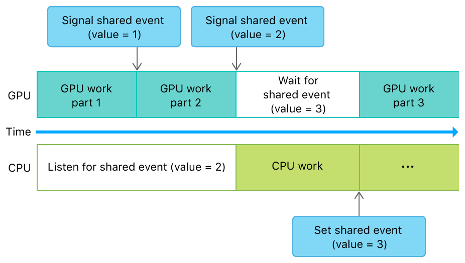

> 导航：[技术](../technologies.md) · [Metal](../metal.md) · [资源同步](resource-synchronization.md)

# 在 GPU 与 CPU 之间同步事件

<sub>文章</sub>

使用可共享事件（shareable events）在你的 App 的 GPU 与 CPU 工作之间进行同步。

## 概述

共享事件（shared event）拥有方法和属性，让你的 App 能在事件被触发时执行代码，或者更新事件的值。

调用 [- notifyListener:atValue:block:](<mtlsharedevent/notify(__atvalue_block_).md>) 方法来注册一个通知处理程序，该处理程序监听共享事件的值的变化。当某个其他操作向该事件发出信号，使其获得一个等于或大于此值的新值时（例如，当你从发送给 GPU 的命令中向事件发出信号时），通知处理程序会执行你提供的 block（代码块）。

设置共享事件的 [signaledValue](mtlsharedevent/signaledvalue.md) 属性以从 CPU 发出事件信号。仅当你设置的值大于事件中存储的当前值时，该值才会被更新。设置此值会解除所有等待小于或等于该新值的命令的阻塞，并同样触发任何基于 CPU 的通知。

下图和代码展示了一个用于同步 GPU 工作与 CPU 工作的可共享事件。



<sub>时间线示意图，展示了 GPU 和 CPU 的可共享同步事件，以及 GPU 和 CPU 执行的工作。</sub>

**Swift**

```swift
func setupGPUCPUEvent() {
    // 可共享事件
    sharedEvent = device.makeSharedEvent()
    
    // 可共享事件监听器
    let myQueue = DispatchQueue(label: "com.example.apple-samplecode.MyQueue")
    sharedEventListener = MTLSharedEventListener(dispatchQueue: myQueue)
}

func synchronizeGPUCPUEvent() {
    guard
        let sharedEvent = sharedEvent,
        let sharedEventListener = sharedEventListener,
        let commandBuffer = commandQueue.makeCommandBuffer()
        else { return }
    
    // 注册 CPU 工作
    sharedEvent.notify(sharedEventListener, atValue: 2) { (sEvent, value) in
        /* 执行 CPU 工作 */
        sEvent.signaledValue = 3
    }
    
    // 编码 GPU 工作
    /* 编码 GPU 工作第 1 部分 */
    commandBuffer.encodeSignalEvent(sharedEvent, value: 1)
    /* 编码 GPU 工作第 2 部分 */
    commandBuffer.encodeSignalEvent(sharedEvent, value: 2)
    commandBuffer.encodeWaitForEvent(sharedEvent, value: 3)
    /* 编码 GPU 工作第 3 部分 */
    commandBuffer.commit()
}
```

**Objective-C**

```objective-c
- (void)setupGPUCPUEvent
{
    // 可共享事件
    _sharedEvent = [_device newSharedEvent];
    
    // 可共享事件监听器
    dispatch_queue_t myQueue = dispatch_queue_create("com.example.apple-samplecode.MyQueue", NULL);
    _sharedEventListener = [[MTLSharedEventListener alloc] initWithDispatchQueue:myQueue];
}

- (void)renderFrame
{
    // 注册 CPU 工作
    [_sharedEvent notifyListener:_sharedEventListener
                         atValue:2
                           block:^(id<MTLSharedEvent> sharedEvent, uint64_t value) {
        /* 执行 CPU 工作 */
        sharedEvent.signaledValue = 3;
    }];
    
    // 编码 GPU 工作
    id<MTLCommandBuffer> commandBuffer = [_commandQueue commandBuffer];
    /* 编码 GPU 工作第 1 部分 */
    [commandBuffer encodeSignalEvent:_sharedEvent value:1];
    /* 编码 GPU 工作第 2 部分 */
    [commandBuffer encodeSignalEvent:_sharedEvent value:2];
    [commandBuffer encodeWaitForEvent:_sharedEvent value:3];
    /* 编码 GPU 工作第 3 部分 */
    [commandBuffer commit];
}
```

设置代码创建了一个可共享事件和一个监听器对象。监听器对象用于在事件发出信号时将通知分派给 App。

此任务的工作由 GPU 和 CPU 共同承担。如上图所示，代码需要按以下顺序执行：

1. GPU 工作第 1 部分
2. GPU 工作第 2 部分
3. CPU 工作
4. GPU 工作第 3 部分

`setupGPUCPUEvent` 函数使用信号来强制执行此执行顺序。首先，该函数注册一个事件处理程序，以便在事件发出信号时执行。当被调用时，此事件处理程序会执行第 3 步的代码，然后发出事件信号。这样就完成了任务的 CPU 部分。

接下来，该函数编码 GPU 的工作。它先编码第 1 部分的工作，发出事件信号，然后对第 2 部分执行相同操作，并再次发出事件信号。GPU 代码的第 3 部分需要在事件处理程序执行完毕后运行，因此该函数接下来编码一个等待 CPU 发出事件信号的命令。之后，该函数编码第 3 部分的命令，并提交命令缓冲区以供执行。

当函数提交命令缓冲区时，会发生以下操作：

1. GPU 执行任务的第 1 部分。
2. GPU 将事件信号值设为 1。
3. GPU 执行任务的第 2 部分。
4. GPU 将事件信号值设为 2。
5. CPU 检测到信号值并运行通知处理程序。
6. 通知处理程序将事件信号值设为 3。
7. GPU 检测到信号值并执行剩余命令。

## 另请参阅

### 与事件同步

- [使用堆和事件实现多阶段图像滤镜](implementing-a-multistage-image-filter-using-heaps-and-events.md) — 使用事件同步对堆上分配资源的访问。
- [关于同步事件](about-synchronization-events.md) — 通过发出事件信号同步你的 App 中对资源的访问。
- [在单个设备内同步事件](synchronizing-events-within-a-single-device.md) — 使用不可共享事件在你的 App 的单个设备内同步工作。
- [跨多个设备或进程同步事件](synchronizing-events-across-multiple-devices-or-processes.md) — 使用可共享事件在你的 App 的多个设备或进程之间同步工作。
- [MTLEvent](mtlevent.md) — 一种同步单个 Metal 设备内一个或多个资源的内存操作的类型。
- [MTLSharedEvent](mtlsharedevent.md) — 一种跨多个 CPU、GPU 和进程同步一个或多个资源的内存操作的类型。
- [MTLSharedEventHandle](mtlsharedeventhandle.md) — 你用来重新创建可共享事件的实例。
- [MTLSharedEventListener](mtlsharedeventlistener.md) — 用于可共享事件通知的监听器。
- [MTLSharedEventNotificationBlock](mtlsharedeventnotificationblock.md) — 在可共享事件的信号值等于或超过给定值后调用的一段代码块。
