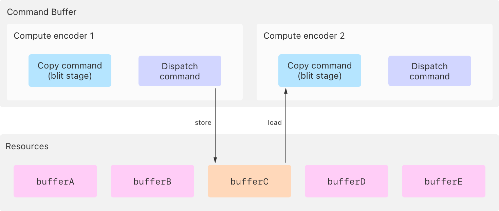
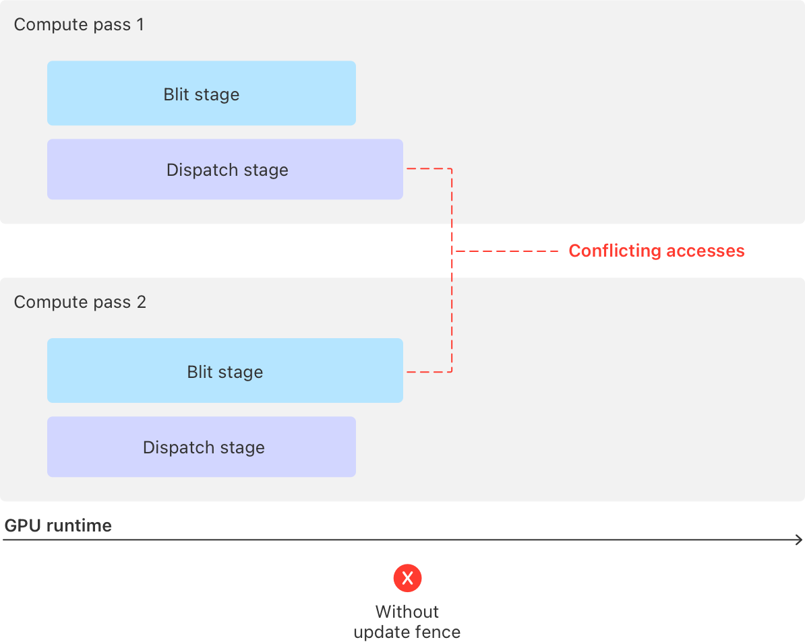
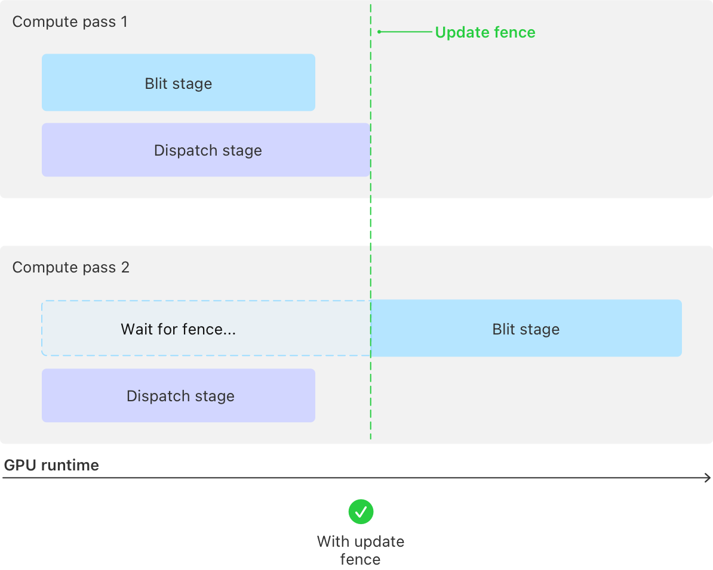

> 导航：[技术](../technologies.md) · [Metal](../metal.md) · [资源同步](resource-synchronization.md)

# 使用围栏同步通道

<sub>文章</sub>

阻止某个通道中的 GPU 阶段运行，直到另一个通道通过发出围栏（fence）信号来解除阻止。

## 概述

围栏（fence）用于解决你提交到同一命令队列的不同通道（pass）中命令之间的访问冲突，包括你在其他命令缓冲区中提交的通道。

> [!note] 注意
> Metal 3 中的 [MTLFence](mtlfence.md) 实例可跨属于同一设备的多条命令队列工作；要在 Metal 4 中跨多条命令队列进行同步，请使用 [MTLEvent](mtlevent.md) 或 [MTLSharedEvent](mtlsharedevent.md) 实例。

当你的 App 对来自不同通道——或同一通道内的不同阶段——的资源编写访问命令时，如果至少有一个命令修改该资源，就会产生访问冲突。这种冲突之所以发生，是因为 GPU 可以同时运行多个命令，包括来自以下方面的命令：

- 多个通道
- 通道的不同阶段，例如计算通道的 [MTLStageBlit](mtlstages/blit.md) 和 [MTLStageDispatch](mtlstages/dispatch.md) 阶段
- 某个阶段的多个实例，例如计算通道中两个或更多的 dispatch 命令

有关资源访问冲突和 GPU 阶段的更多信息，请分别参阅[资源同步](resource-synchronization.md)和 [MTLStages](mtlstages.md)。

> [!important] 重要
> 要同步同一通道内的阶段，请使用通道内屏障（intrapass barrier）而非围栏，因为围栏只能在不同通道的阶段之间进行同步。

有关在同一通道内进行同步的更多信息，请参阅[在通道内同步阶段](synchronizing-stages-within-a-pass.md)。

首先，确定哪些来自不同通道的内存操作会引发冲突，然后使用围栏解决：

1. 在生产方通道中更新围栏。
2. 在消费方通道中等待该围栏。

> [!note] 注意
> 通过调用 [MTLDevice](mtldevice.md) 实例的 [- newFence](<mtldevice/makefence().md>) 方法来创建 [MTLFence](mtlfence.md)。

### 识别两个或多个通道之间的访问冲突

以下代码示例编码了两个计算通道。第一个编码器创建了一个包含复制命令和 dispatch 命令的通道：

**Swift**

```swift
func encodeComputeWorkWithFence(fence: MTLFence,
                                commandBuffer: MTL4CommandBuffer,
                                argumentTable: MTL4ArgumentTable,
                                buffers: [MTLBuffer])
{
    // 编码通道 1

    // 为第一个计算通道创建一个编码器。
    let computeEncoder1: MTL4ComputeCommandEncoder!
    computeEncoder1 = commandBuffer.makeComputeCommandEncoder()

    // 将参数表分配给计算编码器。
    computeEncoder1.setArgumentTable(argumentTable)

    // 将缓冲区添加到参数表中，用于 dispatch 命令。
    let bufferA = buffers[0]
    let bufferB = buffers[1]

    argumentTable.setAddress(bufferA.gpuAddress, index: 0)
    argumentTable.setAddress(bufferB.gpuAddress, index: 1)

    // 从 `bufferA` 复制到 `bufferB`，该操作在 blit 阶段运行。
    computeEncoder1.copy(sourceBuffer: bufferA, sourceOffset: 0,
                        destinationBuffer: bufferB, destinationOffset: 0,
                        size: copySize)

    // 运行一个修改 `bufferC` 的 dispatch 命令，
    // GPU 在 dispatch 阶段运行该命令。
    let bufferC = buffers[2]
    argumentTable.setAddress(bufferC.gpuAddress, index: 2)
    computeEncoder1.setComputePipelineState(modifyBufferIndex2ComputePipeline)
    computeEncoder1.dispatchThreadgroups(threadgroupsPerGrid: threadgroupCount,
                                         threadsPerThreadgroup: threadsPerThreadgroup)

    // 通道 1 需要在此处更新围栏。

    // 结束第一个计算通道。
    computeEncoder1.endEncoding()
```

**Objective-C**

```objective-c
- (void)encodeComputeWorkWithFence:(id<MTLFence>)fence
                     commandBuffer:(id<MTL4CommandBuffer>)commandBuffer
                     argumentTable:(id<MTL4ArgumentTable>)argumentTable
                           buffers:(id<MTLBuffer> *)buffers
{
    // 编码通道 1

    // 为第一个计算通道创建一个编码器。
    id<MTL4ComputeCommandEncoder> computeEncoder1;
    computeEncoder1 = [commandBuffer computeCommandEncoder];

    // 将参数表分配给计算编码器。
    [computeEncoder1 setArgumentTable:argumentTable];

    // 将缓冲区添加到参数表中，用于 dispatch 命令。
    id<MTLBuffer> bufferA = buffers[0];
    id<MTLBuffer> bufferB = buffers[1];

    [argumentTable setAddress:bufferA.gpuAddress atIndex:0];
    [argumentTable setAddress:bufferB.gpuAddress atIndex:1];

    // 从 `bufferA` 复制到 `bufferB`，该操作在 blit 阶段运行。
    [computeEncoder1 copyFromBuffer:bufferA sourceOffset:0
                           toBuffer:bufferB destinationOffset:0
                               size:copySize];

    // 运行一个修改 `bufferC` 的 dispatch 命令，
    // GPU 在 dispatch 阶段运行该命令。
    id<MTLBuffer> bufferC = buffers[2];
    [argumentTable setAddress:bufferC.gpuAddress atIndex:2];
    [computeEncoder1 setComputePipelineState:modifyBufferIndex2ComputePipeline];
    [computeEncoder1 dispatchThreadgroups:threadgroupCount
                    threadsPerThreadgroup:threadsPerThreadgroup];

    // 通道 1 需要在此处更新围栏。

    // 结束第一个计算通道。
    [computeEncoder1 endEncoding];
```

第二个编码器也创建了一个包含复制命令和 dispatch 命令的通道：

**Swift**

```swift
    // 编码通道 2

    // 为第二个计算通道创建一个编码器。
    let computeEncoder2: MTL4ComputeCommandEncoder!
    computeEncoder2 = commandBuffer.makeComputeCommandEncoder()

    // 将参数表分配给计算编码器。
    computeEncoder2.setArgumentTable(argumentTable)

    // 通道 2 需要在此处等待围栏。

    // 从 `bufferC` 复制到 `bufferD`，该操作在 blit 阶段运行。
    let bufferD = buffers[3]
    argumentTable.setAddress(bufferD.gpuAddress, index: 3)
    computeEncoder2.copy(sourceBuffer: bufferC, sourceOffset: 0,
                         destinationBuffer: bufferD, destinationOffset: 0,
                         size: copySize)

    // 运行一个处理 `bufferE` 的 dispatch 命令。
    let bufferE = buffers[4]
    argumentTable.setAddress(bufferE.gpuAddress, index: 4)
    computeEncoder2.setComputePipelineState(modifyBufferIndex4ComputePipeline)
    computeEncoder2.dispatchThreadgroups(threadgroupsPerGrid: threadgroupCount,
                                         threadsPerThreadgroup: threadsPerThreadgroup)

    // 结束第二个计算通道。
    computeEncoder2.endEncoding()
}
```

**Objective-C**

```objective-c
    // 编码通道 2

    // 为第二个计算通道创建一个编码器。
    id<MTL4ComputeCommandEncoder> computeEncoder2;
    computeEncoder2 = [commandBuffer computeCommandEncoder];

    // 将参数表分配给计算编码器。
    [computeEncoder2 setArgumentTable:argumentTable];

    // 通道 2 需要在此处等待围栏。

    // 从 `bufferC` 复制到 `bufferD`，该操作在 blit 阶段运行。
    id<MTLBuffer> bufferD = buffers[3];
    [argumentTable setAddress:bufferD.gpuAddress atIndex:3];
    [computeEncoder2 copyFromBuffer:bufferC sourceOffset:0
                           toBuffer:bufferD destinationOffset:0
                               size:copySize];

    // 运行一个处理 `bufferE` 的 dispatch 命令。
    id<MTLBuffer> bufferE = buffers[4];
    [argumentTable setAddress:bufferE.gpuAddress atIndex:4];
    [computeEncoder2 setComputePipelineState:modifyBufferIndex4ComputePipeline];
    [computeEncoder2 dispatchThreadgroups:threadgroupCount
                    threadsPerThreadgroup:threadsPerThreadgroup];

    // 结束第二个计算通道。
    [computeEncoder2 endEncoding];
}
```

该示例至少有一个访问冲突，因为两个通道都访问了一个公共资源 `bufferC`：

- 第一个通道的 dispatch 命令写入 `bufferC`。
- 第二个通道的复制命令读取 `bufferC`。



<sub>图示显示了两个计算通道访问同一个缓冲区 C，其中通道 1 在其 dispatch 阶段写入缓冲区 C，通道 2 在其 blit 阶段从缓冲区 C 读取。</sub>

如果没有同步，GPU 可以并行运行两个通道及其阶段，这可能导致存在访问冲突的资源产生不一致的结果。



<sub>图示显示了两个通道及其阶段在没有同步的情况下并行运行，可能导致不一致的结果。</sub>

### 使用围栏解决通道之间的访问冲突

使用 [MTLFence](mtlfence.md) 实例解决来自同一命令队列的通道之间的访问冲突，方法如下：

- 通过调用编码器的 [- updateFence:afterEncoderStages:](<mtl4commandencoder/updatefence(__afterencoderstages_).md>) 方法，指示生产方通道向正在等待围栏的通道发出信号。
- 通过调用编码器的 [- waitForFence:beforeEncoderStages:](<mtl4commandencoder/waitforfence(__beforeencoderstages_).md>) 方法，指示消费方通道等待该围栏。

在等待命令之后，GPU 在运行你在消费方通道中编码的命令之前会暂停，直到 GPU 运行完你在其他相关的生产方通道中为同一围栏编码的所有更新命令。

> [!tip] 提示
> 要在更新或等待围栏的通道中获得最佳运行时性能，请尽可能将它们的编码放在靠近引入资源访问冲突的命令的位置。

以下代码示例修改了第一个通道的代码，增加了一个更新围栏的调用：

**Swift**

```swift
    // 运行一个修改 `bufferC` 的 dispatch 命令，
    // GPU 在 dispatch 阶段运行该命令。
    let bufferC = buffers[2]
    argumentTable.setAddress(bufferC.gpuAddress, index: 2)
    computeEncoder1.setComputePipelineState(modifyBufferIndex2ComputePipeline)
    computeEncoder1.dispatchThreadgroups(threadgroupsPerGrid: threadgroupCount,
                                         threadsPerThreadgroup: threadsPerThreadgroup)

    // 通过在通道 1 的 dispatch 阶段完成后更新围栏，
    // 解除正在等待该围栏的通道 2 的阻碍。
    computeEncoder1.updateFence(fence, afterEncoderStages: .dispatch)

    // 结束第一个计算通道。
    computeEncoder1.endEncoding()
```

**Objective-C**

```objective-c
    // 运行一个修改 `bufferC` 的 dispatch 命令，
    // GPU 在 dispatch 阶段运行该命令。
    id<MTLBuffer> bufferC = buffers[2];
    [argumentTable setAddress:bufferC.gpuAddress atIndex:2];
    [computeEncoder1 setComputePipelineState:modifyBufferIndex2ComputePipeline];
    [computeEncoder1 dispatchThreadgroups:threadgroupCount
                    threadsPerThreadgroup:threadsPerThreadgroup];

    // 通过在通道 1 的 dispatch 阶段完成后更新围栏，
    // 解除正在等待该围栏的通道 2 的阻碍。
    [computeEncoder1 updateFence:fence afterEncoderStages:MTLStageDispatch];

    // 结束第一个计算通道。
    [computeEncoder1 endEncoding];
```

以下代码示例修改了第二个通道的代码，增加了一个等待围栏的调用。

**Swift**

```swift
    // 将参数表分配给计算编码器。
    computeEncoder2.setArgumentTable(argumentTable)

    // 等待通道 1 更新围栏。
    computeEncoder2.waitForFence(fence, beforeEncoderStages: .blit)

    // 从 `bufferC` 复制到 `bufferD`，该操作在 blit 阶段运行。
    let bufferD = buffers[3]
    argumentTable.setAddress(bufferD.gpuAddress, index: 3)
    computeEncoder2.copy(sourceBuffer: bufferC, sourceOffset: 0,
                         destinationBuffer: bufferD, destinationOffset: 0,
                         size: copySize)
```

**Objective-C**

```objective-c
    // 将参数表分配给计算编码器。
    [computeEncoder2 setArgumentTable:argumentTable];

    // 等待通道 1 更新围栏。
    [computeEncoder2 waitForFence:fence beforeEncoderStages:MTLStageBlit];

    // 从 `bufferC` 复制到 `bufferD`，该操作在 blit 阶段运行。
    id<MTLBuffer> bufferD = buffers[3];
    [argumentTable setAddress:bufferD.gpuAddress atIndex:3];
    [computeEncoder2 copyFromBuffer:bufferC sourceOffset:0
                           toBuffer:bufferD destinationOffset:0
                               size:copySize];
```

围栏强制 GPU 在运行第二个通道的 blit 阶段之前等待，直到第一个通道的 dispatch 阶段完成其对 `bufferC` 底层内存的修改写入。



<sub>图示显示了围栏同步，其中 GPU 等待通道 1 的 dispatch 阶段完成后，再运行通道 2 的 blit 阶段。</sub>

在为某个通道编码等待命令后，你可以重用围栏实例来解决后续命令中的资源访问冲突。

> [!important] 重要
> 要在同一通道内重用围栏，请先编码等待命令，然后编码更新命令。

有关其他同步机制的更多信息，请参阅本系列中的以下文章：

- [在通道内同步阶段](synchronizing-stages-within-a-pass.md)
- [使用消费者屏障同步通道](synchronizing-passes-with-consumer-barriers.md)
- [使用生产者屏障同步通道](synchronizing-passes-with-producer-barriers.md)

## 另请参阅

### 使用屏障和围栏进行同步

- [在通道内同步阶段](synchronizing-stages-within-a-pass.md) — 阻止通道中的 GPU 阶段运行，直到同一通道中的其他阶段完成。
- [使用消费者屏障同步通道](synchronizing-passes-with-consumer-barriers.md) — 阻止某个通道中的 GPU 阶段以及所有后续通道运行，直到早期通道中的阶段完成。
- [使用生产者屏障同步通道](synchronizing-passes-with-producer-barriers.md) — 阻止后续通道中的 GPU 阶段运行，直到某个通道及其之前通道中的阶段完成。
- [同步 CPU 和 GPU 工作](synchronizing-cpu-and-gpu-work.md) — 通过使用资源的多个实例来避免 CPU 和 GPU 工作之间的停顿。
- [使用堆和围栏实现多阶段图像滤镜](implementing-a-multistage-image-filter-using-heaps-and-fences.md) — 使用围栏同步对堆上分配资源的访问。
- [MTLStages](mtlstages.md) — Metal 通道类型中的命令执行分段。
- [MTLFence](mtlfence.md) — 一种在 GPU 通道之间对内存操作进行排序的同步机制。
- [MTLRenderStages](mtlrenderstages.md) — 渲染通道中触发同步命令的阶段。
- [MTLBarrierScope](mtlbarrierscope.md) — 描述屏障所操作的资源类型。
- [MTL4VisibilityOptions](mtl4visibilityoptions.md) — 同步命令的内存一致性选项。
