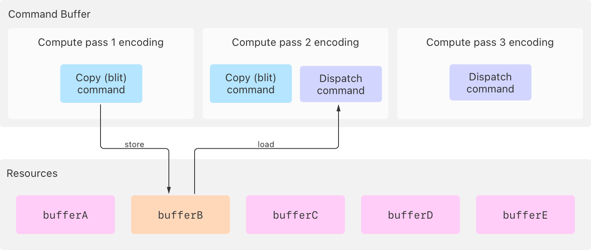
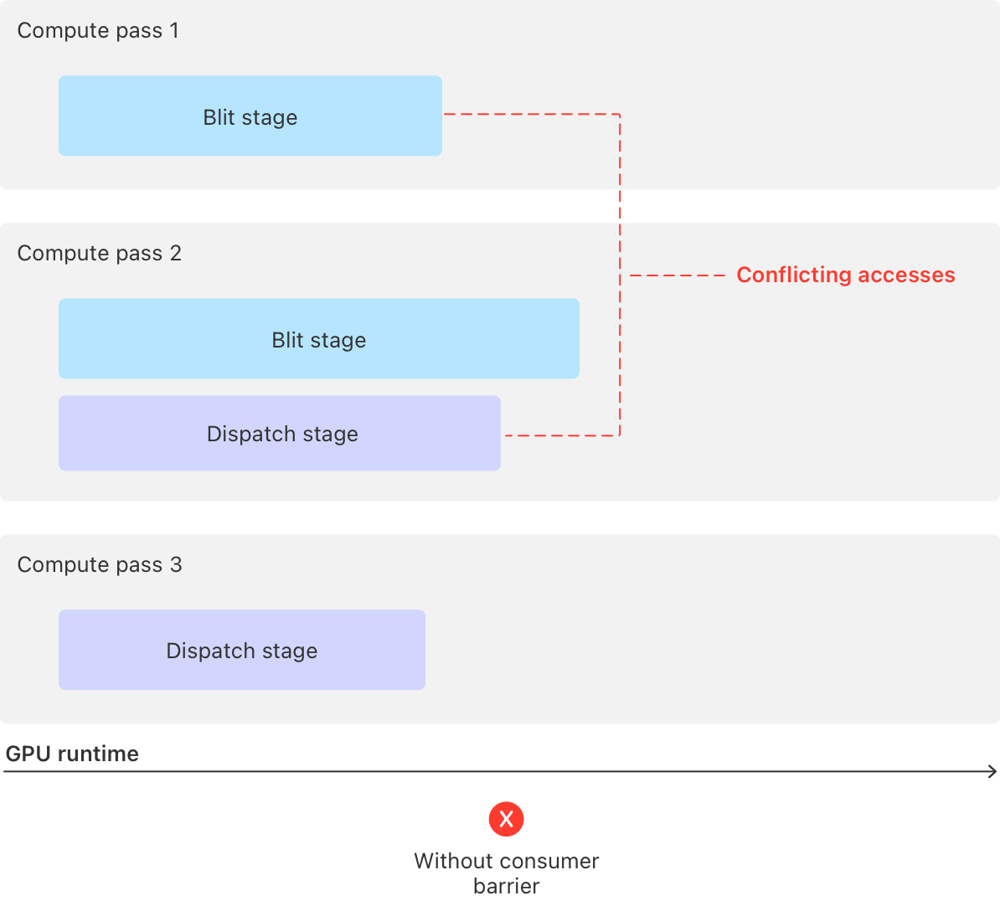
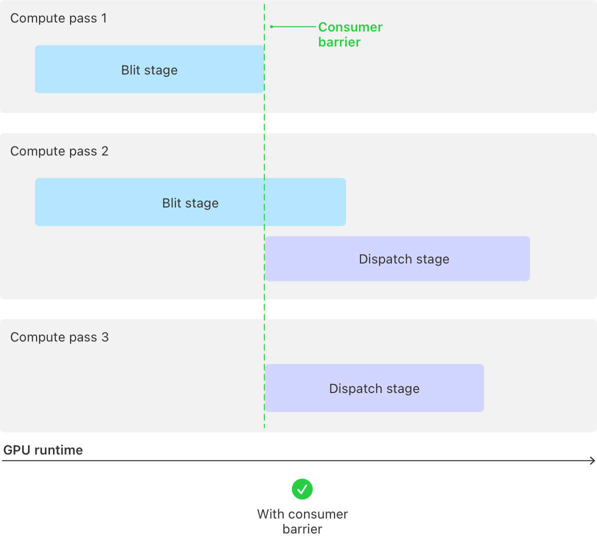

> 导航：[技术](../technologies.md) · [Metal](../metal.md) · [资源同步](resource-synchronization.md)

# 使用消费者 barrier 同步 pass

<sub>文章</sub>

阻塞一个 pass 中的 GPU 阶段以及所有后续 pass，直到较早 pass 的阶段完成。

## 概述

消费者队列 barrier（consumer queue barrier）是一种粗粒度的同步原语，用于解决你提交到同一命令队列的不同 pass 中命令之间的访问冲突，包括提交到同一队列的其他命令缓冲中的 pass。消费者 barrier 便于同步那些从被同一队列中更早 pass 修改的公共资源加载数据的 pass。

> [!note] 注意
> 你还可以使用 Metal 3 的编码器类型添加消费者 barrier。

当你的 App 编码的命令从不同的 pass（或同一 pass 内的不同阶段）访问某个资源时，如果其中至少有一条命令修改了该资源，就会产生访问冲突。这种冲突之所以发生，是因为 GPU 可以同时运行多条命令，包括来自以下方面的命令：

- 多个 pass
- pass 的不同阶段，例如计算 pass 中的 [MTLStageBlit](mtlstages/blit.md) 和 [MTLStageDispatch](mtlstages/dispatch.md) 阶段
- 某个阶段的多个实例，例如计算 pass 中的两条或更多条 dispatch 命令

有关资源访问冲突和 GPU 阶段的更多信息，请分别参阅[资源同步](resource-synchronization.md)和 [MTLStages](mtlstages.md)。

首先，确定同一队列中先前哪些 pass 的内存操作引入了冲突，然后使用作为消费者的 pass 中的消费者队列 barrier 来解决该冲突。

> [!tip] 提示
> 作为 Metal 4 队列的替代方案，在适用场景下，你可以在生产 pass 中创建一个单个的生产者队列 barrier，它相当于多个消费者队列 barrier。有关更多信息，请参阅[使用生产者 barrier 同步 pass](synchronizing-passes-with-producer-barriers.md)。

### 识别同一队列上的访问冲突

以下代码示例对三个计算 pass 进行编码。第一个 pass 运行一条 copy 命令：

**Swift**

```swift
func encodeComputeWorkWithConsumerBarrier(commandBuffer: MTL4CommandBuffer,
                                          argumentTable: MTL4ArgumentTable,
                                          buffers: [MTLBuffer])
{
    // === 编码 pass 1 ===

    // 为第一个计算 pass 创建编码器。
    let computeEncoder1: MTL4ComputeCommandEncoder!
    computeEncoder1 = commandBuffer.makeComputeCommandEncoder()

    // 将参数表分配给计算编码器。
    computeEncoder1.setArgumentTable(argumentTable)

    // 将缓冲区添加到参数表中，用于 dispatch 命令。
    let bufferA = buffers[0]
    let bufferB = buffers[1]

    argumentTable.setAddress(bufferA.gpuAddress, index: 0)
    argumentTable.setAddress(bufferB.gpuAddress, index: 1)

    // 从 `bufferA` 向 `bufferB` 复制，此操作在 blit 阶段运行。
    computeEncoder1.copy(sourceBuffer: bufferA, sourceOffset: 0,
                         destinationBuffer: bufferB, destinationOffset: 0,
                         size: copySize)

    // 完成第一个计算 pass。
    computeEncoder1.endEncoding()
```

**Objective-C**

```objective-c
- (void)encodeComputeWorkWithConsumerBarrier:(id<MTL4CommandBuffer>)commandBuffer
                               argumentTable:(id<MTL4ArgumentTable>)argumentTable
                                     buffers:(id<MTLBuffer> *)buffers
{
    // === 编码 pass 1 ===

    // 为第一个计算 pass 创建编码器。
    id<MTL4ComputeCommandEncoder> computeEncoder1;
    computeEncoder1 = [commandBuffer computeCommandEncoder];

    // 将参数表分配给计算编码器。
    [computeEncoder1 setArgumentTable:argumentTable];

    // 将缓冲区添加到参数表中，用于 dispatch 命令。
    id<MTLBuffer> bufferA = buffers[0];
    id<MTLBuffer> bufferB = buffers[1];

    [argumentTable setAddress:bufferA.gpuAddress atIndex:0];
    [argumentTable setAddress:bufferB.gpuAddress atIndex:1];

    // 从 `bufferA` 向 `bufferB` 复制，此操作在 blit 阶段运行。
    [computeEncoder1 copyFromBuffer:bufferA sourceOffset:0
                           toBuffer:bufferB destinationOffset:0
                               size:copySize];

    // 完成第一个计算 pass。
    [computeEncoder1 endEncoding];
```

第二个 pass 运行一条 copy 命令和一条 dispatch 命令：

**Swift**

```swift
    // === 编码 pass 2 ===

    // 为第二个计算 pass 创建编码器。
    let computeEncoder2: MTL4ComputeCommandEncoder!
    computeEncoder2 = commandBuffer.makeComputeCommandEncoder()

    // 将参数表分配给计算编码器。
    computeEncoder2.setArgumentTable(argumentTable)

    // 从 `bufferC` 向 `bufferD` 复制，此操作在 blit 阶段运行。
    let bufferC = buffers[2]
    let bufferD = buffers[3]
    argumentTable.setAddress(bufferC.gpuAddress, index: 2)
    argumentTable.setAddress(bufferD.gpuAddress, index: 3)
    computeEncoder2.copy(sourceBuffer: bufferC, sourceOffset: 0,
                         destinationBuffer: bufferD, destinationOffset: 0,
                         size: copySize)

    // pass 2 需要在此处添加消费者 barrier，因为 pass 2 和 pass 3 中的
    // dispatch 阶段需要等待 pass 1 中的 blit 阶段完成。

    // 运行一条处理 `bufferB` 的 dispatch 命令，
    // GPU 在 dispatch 阶段执行它。
    computeEncoder2.setComputePipelineState(modifyBufferIndex1ComputePipeline)
    computeEncoder2.dispatchThreadgroups(threadgroupsPerGrid: threadgroupCount,
                                         threadsPerThreadgroup: threadsPerThreadgroup)

    // 完成第二个计算 pass。
    computeEncoder2.endEncoding()
```

**Objective-C**

```objective-c
    // === 编码 pass 2 ===

    // 为第二个计算 pass 创建编码器。
    id<MTL4ComputeCommandEncoder> computeEncoder2;
    computeEncoder2 = [commandBuffer computeCommandEncoder];

    // 将参数表分配给计算编码器。
    [computeEncoder2 setArgumentTable:argumentTable];

    // 从 `bufferC` 向 `bufferD` 复制，此操作在 blit 阶段运行。
    id<MTLBuffer> bufferC = buffers[2];
    id<MTLBuffer> bufferD = buffers[3];
    [argumentTable setAddress:bufferC.gpuAddress atIndex:2];
    [argumentTable setAddress:bufferD.gpuAddress atIndex:3];
    [computeEncoder2 copyFromBuffer:bufferC sourceOffset:0
                           toBuffer:bufferD destinationOffset:0
                               size:copySize];

    // pass 2 需要在此处添加消费者 barrier，因为 pass 2 和 pass 3 中的
    // dispatch 阶段需要等待 pass 1 中的 blit 阶段完成。

    // 运行一条处理 `bufferB` 的 dispatch 命令，
    // GPU 在 dispatch 阶段执行它。
    [computeEncoder2 setComputePipelineState:modifyBufferIndex1ComputePipeline];
    [computeEncoder2 dispatchThreadgroups:threadgroupCount
                    threadsPerThreadgroup:threadsPerThreadgroup];

    // 完成第二个计算 pass。
    [computeEncoder2 endEncoding];
```

第三个 pass 运行一条 dispatch 命令：

**Swift**

```swift
    // === 编码 pass 3 ===

    // 为第三个计算 pass 创建编码器。
    let computeEncoder3: MTL4ComputeCommandEncoder!
    computeEncoder3 = commandBuffer.makeComputeCommandEncoder()

    // 将参数表分配给计算编码器。
    computeEncoder3.setArgumentTable(argumentTable)

    // 运行一条处理 `bufferE` 的 dispatch 命令，
    // GPU 在 dispatch 阶段执行它。
    let bufferE = buffers[4]
    argumentTable.setAddress(bufferE.gpuAddress, index: 4)
    computeEncoder3.setComputePipelineState(modifyBufferIndex4ComputePipeline)
    computeEncoder3.dispatchThreadgroups(threadgroupsPerGrid: threadgroupCount,
                                         threadsPerThreadgroup: threadsPerThreadgroup)

    // 完成第三个计算 pass。
    computeEncoder3.endEncoding()
}
```

**Objective-C**

```objective-c
    // === 编码 pass 3 ===

    // 为第三个计算 pass 创建编码器。
    id<MTL4ComputeCommandEncoder> computeEncoder3;
    computeEncoder3 = [commandBuffer computeCommandEncoder];

    // 将参数表分配给计算编码器。
    [computeEncoder3 setArgumentTable:argumentTable];

    // 运行一条处理 `bufferE` 的 dispatch 命令，
    // GPU 在 dispatch 阶段执行它。
    id<MTLBuffer> bufferE = buffers[4];
    [argumentTable setAddress:bufferE.gpuAddress atIndex:4];
    [computeEncoder3 setComputePipelineState:modifyBufferIndex4ComputePipeline];
    [computeEncoder3 dispatchThreadgroups:threadgroupCount
                    threadsPerThreadgroup:threadsPerThreadgroup];

    // 完成第三个计算 pass。
    [computeEncoder3 endEncoding];
}
```

该示例至少存在一处访问冲突，因为 pass 1 和 pass 2 都访问了一个公共资源 `bufferB`：

- 第一个 pass 中的 copy 命令将数据存入 `bufferB`。
- 第二个 pass 中的 dispatch 命令从 `bufferB` 加载数据。



<sub>一张示意图，展示了三个计算 pass，其中 pass 1 在其 blit 阶段存储到 buffer B，pass 2 在其 dispatch 阶段从 buffer B 读取，从而产生访问冲突。</sub>

在没有同步的情况下，GPU 可以并行运行所有三个 pass 及其阶段，这可能会导致资源在存在访问冲突时产生不一致的结果。



<sub>一张示意图，展示了所有三个 pass 及其阶段在没有同步的情况下并行运行，可能导致访问 buffer B 时产生不一致的结果。</sub>

### 使用消费者 barrier 解决访问冲突

通过调用编码器的 [barrier(afterQueueStages:beforeStages:visibilityOptions:)](<mtl4commandencoder/barrier(afterqueuestages_beforestages_visibilityoptions_).md>) 方法，使用消费者 barrier 来解决来自同一命令队列的 pass 之间的访问冲突。

每个消费者队列 barrier 都会暂时阻塞 GPU，使其无法运行你传递给当前 pass 中 `beforeStages` 参数的特定阶段类型，以及同一队列中所有后续 pass 中的这些阶段。当你在 `afterQueueStages` 参数中传递的所有阶段类型在所有更早的 pass 中都已完成运行时，该 barrier 将解除对这些阶段的阻塞。

> [!important] 重要
> 你传递给 [barrier(afterQueueStages:beforeStages:visibilityOptions:)](<mtl4commandencoder/barrier(afterqueuestages_beforestages_visibilityoptions_).md>) 方法的 `beforeStages` 参数指定的阶段，适用于你正在编码的 pass 以及所有后续 pass，但 `afterQueueStages` 参数指定的阶段仅适用于更早的 pass。

以下示例修改了编码第二个 pass 的代码，在该 pass 的 dispatch 命令阶段之前添加一个消费者队列 barrier：

**Swift**

```swift
    // === 编码 pass 2 ===

    // 为第二个计算 pass 创建编码器。
    let computeEncoder2: MTL4ComputeCommandEncoder!
    computeEncoder2 = commandBuffer.makeComputeCommandEncoder()

    // 将参数表分配给计算编码器。
    computeEncoder2.setArgumentTable(argumentTable)

    // 从 `bufferC` 向 `bufferD` 复制，此操作在 blit 阶段运行。
    let bufferC = buffers[2]
    let bufferD = buffers[3]
    argumentTable.setAddress(bufferC.gpuAddress, index: 2)
    argumentTable.setAddress(bufferD.gpuAddress, index: 3)
    computeEncoder2.copy(sourceBuffer: bufferC, sourceOffset: 0,
                         destinationBuffer: bufferD, destinationOffset: 0,
                         size: copySize)

    // 添加一个消费者队列 barrier，用于阻塞队列中后续 pass（包括本 pass）
    // 中的任意 dispatch 阶段，直到所有更早 pass（不包括本 pass）中的
    // blit 阶段完成运行。
    computeEncoder2.barrier(afterQueueStages: .blit,
                            beforeStages: .dispatch,
                            visibilityOptions: .device)

    // 运行一条处理 `bufferB` 的 dispatch 命令，
    // GPU 在 dispatch 阶段执行它。
    computeEncoder2.setComputePipelineState(modifyBufferIndex1ComputePipeline)
    computeEncoder2.dispatchThreadgroups(threadgroupsPerGrid: threadgroupCount,
                                         threadsPerThreadgroup: threadsPerThreadgroup)

    // 完成第二个计算 pass。
    computeEncoder2.endEncoding()
```

**Objective-C**

```objective-c
    // === 编码 pass 2 ===

    // 为第二个计算 pass 创建编码器。
    id<MTL4ComputeCommandEncoder> computeEncoder2;
    computeEncoder2 = [commandBuffer computeCommandEncoder];

    // 将参数表分配给计算编码器。
    [computeEncoder2 setArgumentTable:argumentTable];

    // 从 `bufferC` 向 `bufferD` 复制，此操作在 blit 阶段运行。
    id<MTLBuffer> bufferC = buffers[2];
    id<MTLBuffer> bufferD = buffers[3];
    [argumentTable setAddress:bufferC.gpuAddress atIndex:2];
    [argumentTable setAddress:bufferD.gpuAddress atIndex:3];
    [computeEncoder2 copyFromBuffer:bufferC sourceOffset:0
                           toBuffer:bufferD destinationOffset:0
                               size:copySize];

    // 添加一个消费者队列 barrier，用于阻塞队列中后续 pass（包括本 pass）
    // 中的任意 dispatch 阶段，直到所有更早 pass（不包括本 pass）中的
    // blit 阶段完成运行。
    [computeEncoder2 barrierAfterQueueStages:MTLStageBlit
                                beforeStages:MTLStageDispatch
                           visibilityOptions:MTL4VisibilityOptionDevice];

    // 运行一条处理 `bufferB` 的 dispatch 命令，
    // GPU 在 dispatch 阶段执行它。
    [computeEncoder2 setComputePipelineState:modifyBufferIndex1ComputePipeline];
    [computeEncoder2 dispatchThreadgroups:threadgroupCount
                    threadsPerThreadgroup:threadsPerThreadgroup];

    // 完成第二个计算 pass。
    [computeEncoder2 endEncoding];
```

在此示例中，barrier 阻止 GPU 运行第二个和第三个 pass 中的 dispatch 阶段，直到第一个 pass 中的 blit 阶段完成存储修改。



<sub>一张示意图，展示了消费者 barrier 同步过程，其中 GPU 等待 pass 1 的 blit 阶段完成，然后再运行 pass 2 和 pass 3 的 dispatch 阶段。</sub>

当第一个 pass 中的 blit 阶段完成运行时，barrier 会解除对这两个 dispatch 阶段的阻塞，因为它是唯一适用于 `afterQueueStages` 参数的 pass。

有关其他同步机制的更多信息，请参阅本系列中的以下文章：

- [同步 pass 内的阶段](synchronizing-stages-within-a-pass.md)
- [使用 fence 同步 pass](synchronizing-passes-with-a-fence.md)
- [使用生产者 barrier 同步 pass](synchronizing-passes-with-producer-barriers.md)

## 另请参阅

### 使用 barrier 和 fence 进行同步

- [同步 pass 内的阶段](synchronizing-stages-within-a-pass.md) — 阻塞一个 pass 中的 GPU 阶段，直到同一 pass 中的其他阶段完成。
- [使用 fence 同步 pass](synchronizing-passes-with-a-fence.md) — 阻塞一个 pass 中的 GPU 阶段，直到另一个 pass 通过标记 fence 来解除阻塞。
- [使用生产者 barrier 同步 pass](synchronizing-passes-with-producer-barriers.md) — 阻塞后续 pass 中的 GPU 阶段，直到某个 pass 及其更早 pass 的阶段完成。
- [同步 CPU 和 GPU 工作](synchronizing-cpu-and-gpu-work.md) — 通过使用资源的多个实例来避免 CPU 与 GPU 工作之间的停滞。
- [使用堆和 fence 实现多阶段图像滤镜](implementing-a-multistage-image-filter-using-heaps-and-fences.md) — 使用 fence 来同步对分配在堆上的资源的访问。
- [MTLStages](mtlstages.md) — Metal pass 类型中的命令执行段。
- [MTLFence](mtlfence.md) — 一种对 GPU pass 之间的内存操作进行排序的同步机制。
- [MTLRenderStages](mtlrenderstages.md) — 触发同步命令的渲染 pass 中的阶段。
- [MTLBarrierScope](mtlbarrierscope.md) — 描述 barrier 所作用的资源类型。
- [MTL4VisibilityOptions](mtl4visibilityoptions.md) — 同步命令的内存一致性选项。
