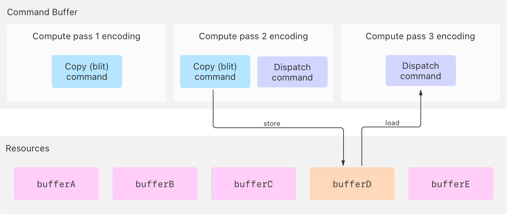
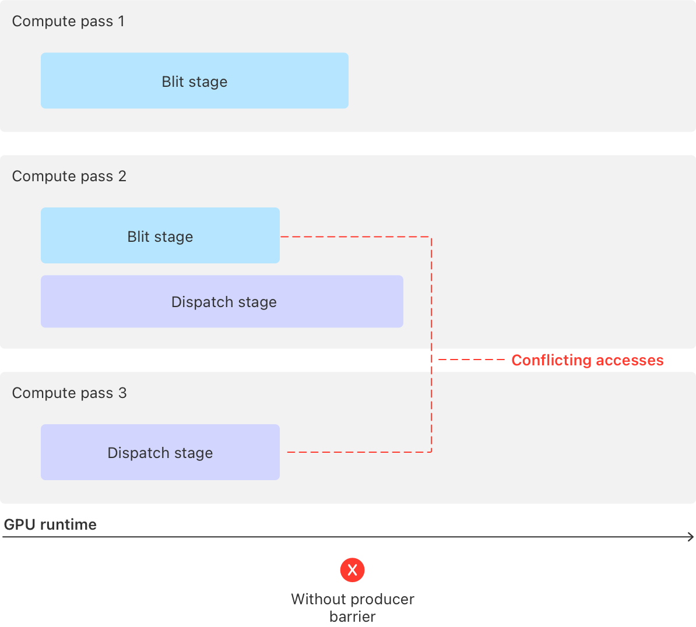
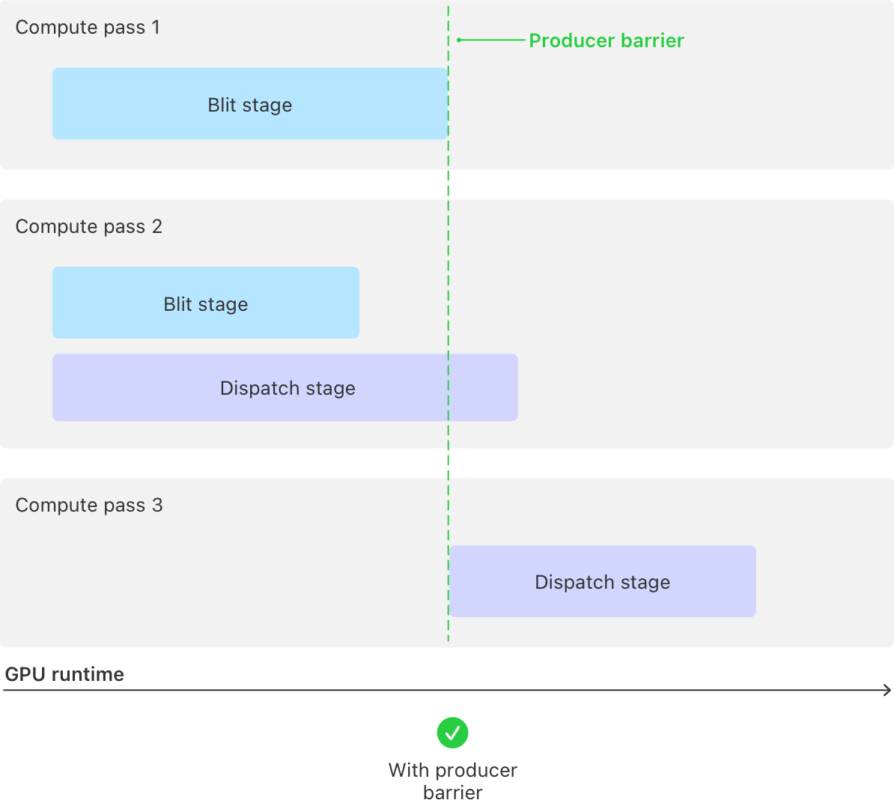

> 导航：[技术](../technologies.md) · [Metal](../metal.md) · [资源同步](resource-synchronization.md)

# 使用生产者屏障同步通道

<sub>文章</sub>

阻止后续通道中的 GPU 阶段运行，直到某通道中的阶段及更早的通道执行完毕。

## 概述

生产者队列屏障（producer queue barriers）是一种粗粒度的同步原语（synchronization primitive），用于解决你提交到同一命令队列的不同通道（包括来自其他命令缓冲区的通道）中命令之间的访问冲突。生产者屏障方便同步那些会修改共同资源，且同一队列中多个后续通道稍后会加载该资源的通道。

> [!note] 注意
> 生产者屏障仅适用于 Metal 4 编码器类型。

当你的 App 对来自不同通道——或单个通道内不同阶段——访问同一资源的命令进行编码时，如果至少有一条命令修改了该资源，就会产生访问冲突。这种冲突是因为 GPU 可以同时运行多条命令，包括来自以下方面的命令：

- 多个通道
- 一个通道的不同阶段，例如计算通道中的 [MTLStageBlit](mtlstages/blit.md) 和 [MTLStageDispatch](mtlstages/dispatch.md) 阶段
- 一个阶段的多个实例，例如计算通道中的两条或更多调度命令

有关资源访问冲突和 GPU 阶段的更多信息，请分别参阅[资源同步](resource-synchronization.md)和 [MTLStages](mtlstages.md)。

> [!tip] 提示
> 作为生产者队列屏障的替代方案，你也可以在消费者通道中创建消费者队列屏障。更多信息请参阅[使用消费者屏障同步通道](synchronizing-passes-with-consumer-barriers.md)。

首先，识别同一队列中后续通道的哪些内存操作会引入冲突，然后在生产者通道中使用队列内屏障（intraqueue barrier）来解决它们。

### 识别与后续通道的访问冲突

以下代码示例编码了三个计算通道。第一个通道运行一条复制命令：

**Swift**

```swift
func encodeComputeWorkWithProducerBarrier(commandBuffer: MTL4CommandBuffer,
                                          argumentTable: MTL4ArgumentTable,
                                          buffers: [MTLBuffer])
{
    // === 编码通道 1 ===

    // 为第一个计算通道创建编码器。
    let computeEncoder1: MTL4ComputeCommandEncoder!
    computeEncoder1 = commandBuffer.makeComputeCommandEncoder()

    // 将参数表分配给计算编码器。
    computeEncoder1.setArgumentTable(argumentTable)

    // 将缓冲区添加到用于调度命令的参数表中。
    let bufferA = buffers[0]
    let bufferB = buffers[1]

    argumentTable.setAddress(bufferA.gpuAddress, index: 0)
    argumentTable.setAddress(bufferB.gpuAddress, index: 1)

    // 从 `bufferA` 复制到 `bufferB`，此操作在 blit 阶段运行。
    computeEncoder1.copy(sourceBuffer: bufferA, sourceOffset: 0,
                         destinationBuffer: bufferB, destinationOffset: 0,
                         size: copySize)

    // 结束第一个计算通道。
    computeEncoder1.endEncoding()
```

**Objective-C**

```objective-c
- (void)encodeComputeWorkWithProducerBarrier:(id<MTL4CommandBuffer>)commandBuffer
                               argumentTable:(id<MTL4ArgumentTable>)argumentTable
                                     buffers:(id<MTLBuffer> *)buffers
{
    // === 编码通道 1 ===

    // 为第一个计算通道创建编码器。
    id<MTL4ComputeCommandEncoder> computeEncoder1;
    computeEncoder1 = [commandBuffer computeCommandEncoder];

    // 将参数表分配给计算编码器。
    [computeEncoder1 setArgumentTable:argumentTable];

    // 将缓冲区添加到用于调度命令的参数表中。
    id<MTLBuffer> bufferA = buffers[0];
    id<MTLBuffer> bufferB = buffers[1];

    [argumentTable setAddress:bufferA.gpuAddress atIndex:0];
    [argumentTable setAddress:bufferB.gpuAddress atIndex:1];

    // 从 `bufferA` 复制到 `bufferB`，此操作在 blit 阶段运行。
    [computeEncoder1 copyFromBuffer:bufferA sourceOffset:0
                           toBuffer:bufferB destinationOffset:0
                               size:copySize];

    // 结束第一个计算通道。
    [computeEncoder1 endEncoding];
```

第二个通道运行一条复制命令和一条调度命令：

**Swift**

```swift
    // === 编码通道 2 ===

    // 为第二个计算通道创建编码器。
    let computeEncoder2: MTL4ComputeCommandEncoder!
    computeEncoder2 = commandBuffer.makeComputeCommandEncoder()

    // 将参数表分配给计算编码器。
    computeEncoder2.setArgumentTable(argumentTable)

    // 从 `bufferC` 复制到 `bufferD`，此操作在 blit 阶段运行。
    let bufferC = buffers[2]
    let bufferD = buffers[3]
    argumentTable.setAddress(bufferC.gpuAddress, index: 2)
    argumentTable.setAddress(bufferD.gpuAddress, index: 3)
    computeEncoder2.copy(sourceBuffer: bufferC, sourceOffset: 0,
                         destinationBuffer: bufferD, destinationOffset: 0,
                         size: copySize)

    // 通道 3 中的调度需要等待
    // 通道 2 中的 blit 阶段完成。

    // 运行一条使用 `bufferC` 的调度命令，
    // 该命令在 dispatch 阶段由 GPU 运行。
    computeEncoder2.setComputePipelineState(modifyBufferIndex2ComputePipeline)
    computeEncoder2.dispatchThreadgroups(threadgroupsPerGrid: threadgroupCount,
                                         threadsPerThreadgroup: threadsPerThreadgroup)

    // 结束第二个计算通道。
    computeEncoder2.endEncoding()
```

**Objective-C**

```objective-c
    // === 编码通道 2 ===

    // 为第二个计算通道创建编码器。
    id<MTL4ComputeCommandEncoder> computeEncoder2;
    computeEncoder2 = [commandBuffer computeCommandEncoder];

    // 将参数表分配给计算编码器。
    [computeEncoder2 setArgumentTable:argumentTable];

    // 从 `bufferC` 复制到 `bufferD`，此操作在 blit 阶段运行。
    id<MTLBuffer> bufferC = buffers[2];
    id<MTLBuffer> bufferD = buffers[3];
    [argumentTable setAddress:bufferC.gpuAddress atIndex:2];
    [argumentTable setAddress:bufferD.gpuAddress atIndex:3];
    [computeEncoder2 copyFromBuffer:bufferC sourceOffset:0
                           toBuffer:bufferD destinationOffset:0
                               size:copySize];

    // 通道 3 中的调度需要等待
    // 通道 2 中的 blit 阶段完成。

    // 运行一条使用 `bufferC` 的调度命令，
    // 该命令在 dispatch 阶段由 GPU 运行。
    [computeEncoder2 setComputePipelineState:modifyBufferIndex2ComputePipeline];
    [computeEncoder2 dispatchThreadgroups:threadgroupCount
                    threadsPerThreadgroup:threadsPerThreadgroup];

    // 结束第二个计算通道。
    [computeEncoder2 endEncoding];
```

第三个通道运行一条调度命令：

**Swift**

```swift
    // === 编码通道 3 ===

    // 为第三个计算通道创建编码器。
    let computeEncoder3: MTL4ComputeCommandEncoder!
    computeEncoder3 = commandBuffer.makeComputeCommandEncoder()

    // 将参数表分配给计算编码器。
    computeEncoder3.setArgumentTable(argumentTable)

    // 运行一条使用 `bufferD` 的调度命令，
    // 该命令在 dispatch 阶段由 GPU 运行。
    computeEncoder3.setComputePipelineState(modifyBufferIndex3ComputePipeline)
    computeEncoder3.dispatchThreadgroups(threadgroupsPerGrid: threadgroupCount,
                                         threadsPerThreadgroup: threadsPerThreadgroup)

    // 结束第三个计算通道。
    computeEncoder3.endEncoding()
}
```

**Objective-C**

```objective-c
    // === 编码通道 3 ===

    // 为第三个计算通道创建编码器。
    id<MTL4ComputeCommandEncoder> computeEncoder3;
    computeEncoder3 = [commandBuffer computeCommandEncoder];

    // 将参数表分配给计算编码器。
    [computeEncoder3 setArgumentTable:argumentTable];

    // 运行一条使用 `bufferD` 的调度命令，
    // 该命令在 dispatch 阶段由 GPU 运行。
    [computeEncoder3 setComputePipelineState:modifyBufferIndex3ComputePipeline];
    [computeEncoder3 dispatchThreadgroups:threadgroupCount
                    threadsPerThreadgroup:threadsPerThreadgroup];

    // 结束第三个计算通道。
    [computeEncoder3 endEncoding];
}
```

示例中存在至少一处访问冲突，因为通道 2 和 3 都访问了一个共同资源 `bufferD`：

- 第二条通道的复制命令向 `bufferD` 存储数据。
- 第三条通道的调度命令从 `bufferD` 加载数据。



<sub>示意图展示了三个计算通道，其中通道 2 在其 blit 阶段向 buffer D 存储数据，而通道 3 在其调度阶段从 buffer D 加载数据，从而产生访问冲突。</sub>

如果没有同步机制，GPU 可以并行运行所有三个通道及其阶段，这会导致存在访问冲突的资源产生不一致的结果。



<sub>示意图展示了在没有同步机制的情况下，所有三个通道及其阶段并行运行，可能导致访问 buffer D 时结果不一致。</sub>

### 使用生产者屏障解决访问冲突

要解决同一命令队列中不同通道之间的访问冲突，请使用生产者屏障，即调用编码器的 [barrier(afterStages:beforeQueueStages:visibilityOptions:)](<mtl4commandencoder/barrier(afterstages_beforequeuestages_visibilityoptions_).md>) 方法。

每个生产者队列屏障会临时阻止 GPU 在同一队列的所有后续通道中运行特定阶段类型（你通过 `beforeQueueStages` 参数传入）。当 `afterStages` 参数传入的所有阶段类型在当前通道及之前所有通道中均运行完毕后，屏障才会解除对这些阶段的阻塞。

> [!important] 重要
> 你传递给 [barrier(afterStages:beforeQueueStages:visibilityOptions:)](<mtl4commandencoder/barrier(afterstages_beforequeuestages_visibilityoptions_).md>) 方法的 `afterStages` 参数中的阶段作用于当前正在编码的通道及之前所有通道，但 `beforeQueueStages` 参数中的阶段仅作用于后续通道。

以下示例修改了编码第二个通道的代码，在第二个通道的调度命令阶段之前添加了一个生产者队列屏障。

**Swift**

```swift
    // 从 `bufferC` 复制到 `bufferD`，此操作在 blit 阶段运行。
    let bufferC = buffers[2]
    let bufferD = buffers[3]
    argumentTable.setAddress(bufferC.gpuAddress, index: 2)
    argumentTable.setAddress(bufferD.gpuAddress, index: 3)
    computeEncoder2.copy(sourceBuffer: bufferC, sourceOffset: 0,
                         destinationBuffer: bufferD, destinationOffset: 0,
                         size: copySize)

    // 添加一个生产者队列屏障，阻止队列中后续通道（不包含当前通道）
    // 中的任何 dispatch 阶段运行，直到之前所有通道（包括当前通道）
    // 中的 blit 阶段全部运行完毕。
    computeEncoder2.barrier(afterStages: .blit,
                            beforeQueueStages: .dispatch,
                            visibilityOptions: .device)

    // 运行一条使用 `bufferC` 的调度命令，
    // 该命令在 dispatch 阶段由 GPU 运行。
    computeEncoder2.setComputePipelineState(modifyBufferIndex2ComputePipeline)
    computeEncoder2.dispatchThreadgroups(threadgroupsPerGrid: threadgroupCount,
                                         threadsPerThreadgroup: threadsPerThreadgroup)

    // 结束第二个计算通道。
    computeEncoder2.endEncoding()
```

**Objective-C**

```objective-c
    // 从 `bufferC` 复制到 `bufferD`，此操作在 blit 阶段运行。
    id<MTLBuffer> bufferC = buffers[2];
    id<MTLBuffer> bufferD = buffers[3];
    [argumentTable setAddress:bufferC.gpuAddress atIndex:2];
    [argumentTable setAddress:bufferD.gpuAddress atIndex:3];
    [computeEncoder2 copyFromBuffer:bufferC sourceOffset:0
                           toBuffer:bufferD destinationOffset:0
                               size:copySize];

    // 添加一个生产者队列屏障，阻止队列中后续通道（不包含当前通道）
    // 中的任何 dispatch 阶段运行，直到之前所有通道（包括当前通道）
    // 中的 blit 阶段全部运行完毕。
    [computeEncoder2 barrierAfterStages:MTLStageBlit
                      beforeQueueStages:MTLStageDispatch
                      visibilityOptions:MTL4VisibilityOptionDevice];

    // 运行一条使用 `bufferC` 的调度命令，
    // 该命令在 dispatch 阶段由 GPU 运行。
    [computeEncoder2 setComputePipelineState:modifyBufferIndex2ComputePipeline];
    [computeEncoder2 dispatchThreadgroups:threadgroupCount
                    threadsPerThreadgroup:threadsPerThreadgroup];

    // 结束第二个计算通道。
    [computeEncoder2 endEncoding];
```

在此示例中，屏障会阻止 GPU 在第一个和第二个通道的 blit 阶段都完成其修改存储之前，运行第三个通道中的调度阶段。



<sub>示意图展示了生产者屏障同步，GPU 会等待通道 1 和 2 的 blit 阶段完成后，再运行通道 3 的调度阶段。</sub>

屏障会在第一个通道的 blit 阶段运行完毕时解除对第三个通道调度阶段的阻塞，因为第一个通道的 blit 阶段是所有适用于 `afterStages` 参数的通道中最后一个完成的 blit 阶段。

有关其他同步机制的信息，请参阅该系列中的以下文章：

- [同步通道内的阶段](synchronizing-stages-within-a-pass.md)
- [使用围栏同步通道](synchronizing-passes-with-a-fence.md)
- [使用消费者屏障同步通道](synchronizing-passes-with-consumer-barriers.md)

## 另请参阅

### 使用屏障和围栏同步

- [同步通道内的阶段](synchronizing-stages-within-a-pass.md)——阻止通道中的 GPU 阶段运行，直到同一通道中的其他阶段执行完毕。
- [使用围栏同步通道](synchronizing-passes-with-a-fence.md)——阻止某通道中的 GPU 阶段，直到另一通道通过发出围栏信号解除阻塞。
- [使用消费者屏障同步通道](synchronizing-passes-with-consumer-barriers.md)——阻止某通道及其所有后续通道中的 GPU 阶段运行，直到之前通道中的阶段执行完毕。
- [同步 CPU 与 GPU 工作](synchronizing-cpu-and-gpu-work.md)——通过使用资源的多个实例来避免 CPU 与 GPU 工作之间的停滞。
- [使用堆和围栏实现多级图像滤镜](implementing-a-multistage-image-filter-using-heaps-and-fences.md)——使用围栏同步对堆上分配资源的访问。
- [MTLStages](mtlstages.md)——Metal 通道类型中的命令执行片段。
- [MTLFence](mtlfence.md)——一种用于对 GPU 通道间的内存操作进行排序的同步机制。
- [MTLRenderStages](mtlrenderstages.md)——渲染通道中触发同步命令的阶段。
- [MTLBarrierScope](mtlbarrierscope.md)——描述屏障所操作的资源类型。
- [MTL4VisibilityOptions](mtl4visibilityoptions.md)——同步命令的内存一致性选项。
