> 导航：[Technologies](../technologies.md) · [Metal](../metal.md)

# 针对 Apple GPU 和基于瓦片的延迟渲染定制你的 App

文章

了解 Apple GPU 的特色功能，包括 imageblock、瓦片着色器和栅格顺序组。

## 概述

Apple 芯片中的 GPU 实现了一种名为_基于瓦片的延迟渲染_（tile-based deferred rendering，TBDR）的渲染技术，用于优化性能和能效。GPU 会将渲染目标拆分成一个由更小区域组成的网格，这些区域被称为_瓦片_。它使用其中一个 GPU 核心处理每个瓦片，通常会同时运行许多个核心。在评估完某个瓦片的全部几何体之前，GPU 会推迟（或延后）该瓦片的渲染阶段。

从 A11 开始，Apple 设计的 GPU 提供了若干显著增强 TBDR 的功能。你的 App 可以通过 Metal API 访问这些增强功能，帮助你的 App 和游戏实现新水平的性能与能力。这些功能包括 imageblock、瓦片着色、栅格顺序组，以及 imageblock 样本覆盖控制。A11 及更新的 Apple GPU 还提升了片段丢弃性能，并简化了包括次表面散射、独立于顺序的透明度，以及基于瓦片的光照算法在内的多种技术的实现。

### 借助基于瓦片的延迟渲染绘制更多内容

你的 App 可以在 TBDR GPU 上绘制更复杂的场景，因为与传统的即时模式（immediate-mode，IM）GPU 相比，它通过节省时间、能耗和内存带宽显著提升了性能。例如，无论图元（比如线条和三角形）在渲染结果中是否可见，IM GPU 都会对其进行完整处理。

TBDR GPU 通过同时处理一个渲染流程的所有几何体、并只为可见图元着色，来避免执行不必要的工作。GPU 将工作拆分成多个瓦片，从而能够分别、同时处理与每个瓦片相交的所有几何体，并丢弃任何被遮挡（或隐藏）的图元。对于每个瓦片，GPU 随后从剩余的可见图元中生成片段（或潜在像素），用片段着色器处理它们，并将其写入_瓦片内存_中。瓦片内存是位于 GPU 本身之上的一种快速临时存储。当 GPU 完成将每个瓦片渲染到瓦片内存中之后，它会将最终结果写入设备内存。

瓦片内存是 TBDR 的一个重要组成部分，因为它通过尽可能避免访问设备内存，节省了时间和能耗。相比 GPU 访问设备内存，片段着色器核心对瓦片内存的访问具有以下重要优势：

- 带宽比设备内存快许多倍
- 访问延迟比设备内存低许多倍
- 能耗显著低于访问设备内存

当 GPU 将某个渲染流程的最后阶段渲染到瓦片内存时，它可以开始未来某个渲染流程的顶点阶段。由于这两个阶段往往使用不同的计算和内存组件，GPU 可以通过并行运行它们，同时使用更多的硬件模块。

### 使用 imageblock 为你的片段着色器添加自定内容

你可以在 _imageblock 内存_中定义并操作自定的逐像素数据结构，imageblock 内存是 GPU 中一块高带宽的内存区域。imageblock 是存储在本地内存中的结构化图像数据瓦片，让你能够在瓦片内存中描述 Apple GPU 可以高效操作的图像数据。它们与片段处理和瓦片着色阶段深度集成，也可供计算内核使用。在搭载 Apple 芯片的设备上，Metal 一直都会渲染到 imageblock 中，但从 A11 GPU 开始，Metal 让你可以完全控制 imageblock 中的数据结构。imageblock 可以在一个渲染流程的片段阶段和瓦片阶段之间传递数据。线程组内存适合非结构化数据，而 imageblock 更适合图像数据。

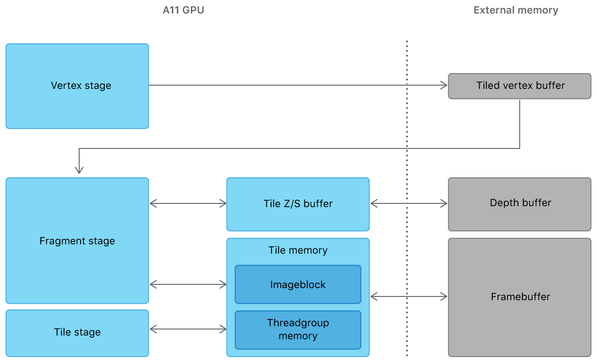

A11 GPU 架构与外部内存的模块流程示意图，两者由一条虚线分隔。顶点阶段从 GPU 流向外部内存中的瓦片顶点缓冲区。该瓦片顶点缓冲区又流回 GPU 的片段阶段，片段阶段与 GPU 中另外两个模块相连：用于瓦片 z 缓冲区和 s 缓冲区的内存模块，以及瓦片内存。瓦片内存模块包含两个组件——imageblock 内存和线程组内存——并与 GPU 的片段阶段和瓦片阶段相连，也与外部内存中的帧缓冲区相连。

imageblock 是一种具有宽度、高度和像素深度的二维数据结构。imageblock 中的每个像素都可以由多个分量组成，你可以将每个分量当作一个独立的图像切片来寻址。例如，你可以拥有三个分别代表反照率、高光和法线分量的图像切片。

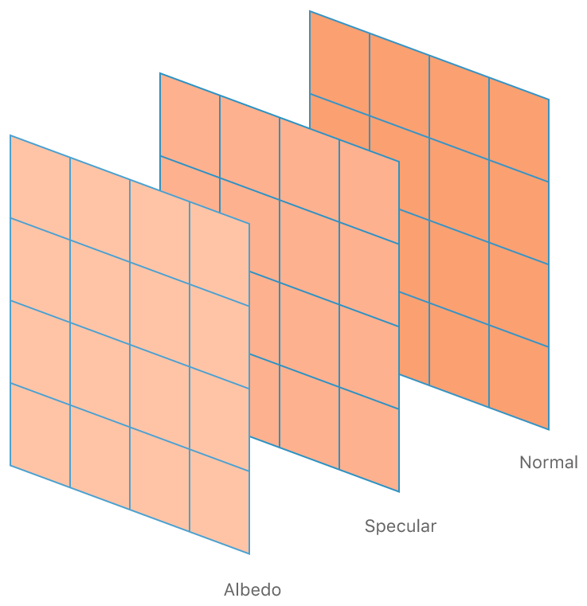

imageblock 可供内核函数和片段函数使用，并在一个瓦片的整个生命周期中持续存在，跨越多次绘制和分派。imageblock 的持久性意味着，你可以使用瓦片着色器在单个渲染流程中混合渲染和计算操作，其中两者都可以访问同一块本地内存。通过让多个操作都保留在一个瓦片之内，你可以创建保持在本地 GPU 内存中的复杂算法。

你现有的代码会自动创建与你渲染附件格式相匹配的 imageblock。不过，你也可以完全在着色器内部定义自己的 imageblock。你所定义的 imageblock 可以比渲染附件所创建的 imageblock 复杂得多。例如，一个 imageblock 可以包含额外的通道、数组和嵌套结构体。此外，你还可以在计算过程的不同阶段中，将你定义的 imageblock 重新用于不同的目的。

在片段着色器内部，当前片段只能访问与该片段在瓦片中位置相关联的 imageblock 数据。而在计算函数中，一个线程可以访问全部的 imageblock 数据。使用附件进行渲染时，加载和存储操作仍然会在瓦片内存中读写数据。然而，如果你使用的是显式 imageblock，请使用计算函数显式地对设备内存进行读写。GPU 可能会利用内存硬件的优势，通过一次高效的块传输，自动将瓦片内存的内容刷新到系统内存。

### 使用瓦片着色器在渲染和计算流程之间节省内存带宽

瓦片着色让你能够在共享本地内存的同时，将渲染和计算操作合并到单个渲染流程中。许多渲染技术都需要绘制命令和计算命令的混合使用。传统 GPU 将渲染命令和计算命令拆分到不同的流程中。这些流程通常无法直接相互通信。App 会通过将某个流程的结果保存到设备内存中、再为下一个流程重新加载该数据，来规避这一限制。在某些场景下，比如在一个多阶段渲染算法中，App 可能需要多次将中间数据复制到设备内存中。

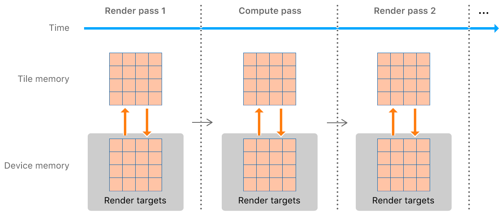

时间线流程示意图，展示了两个渲染流程，中间夹着一个计算流程。每个流程开始时都会将同样的数据从设备内存加载到瓦片内存中，结束时又会为下一个流程将数据存回设备内存。

瓦片着色器是作为渲染流程一部分执行的计算或片段函数。它们让你的 App 能够计算数据，并将其保存到在多个渲染流程之间于 GPU 上持续存在的瓦片内存中。

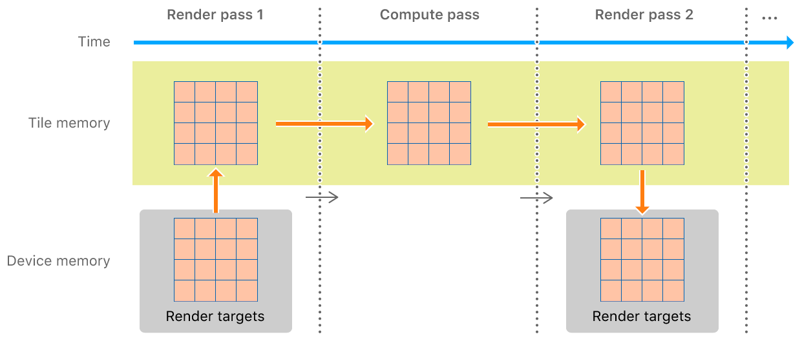

时间线流程示意图，展示了两个渲染流程，中间夹着一个计算流程。第一个渲染流程从设备内存加载数据，并将其输出存储到瓦片内存中。计算流程仅使用瓦片内存来加载其输入并保存其输出，避免了对设备内存的任何访问。第二个渲染流程直接从瓦片内存中读取数据，并将其输出存储到设备内存中。

使用瓦片着色器的 App 可以避免将中间结果存储到设备内存中，并通过将数据存储在速度更快的瓦片内存中来节省时间。

### 使用栅格顺序组对操作进行排序

借助_栅格顺序组（raster order group）_，你的 App 可以精确控制访问相同像素坐标的并行片段着色器线程的执行顺序。栅格顺序组提供了来自片段着色器的有序内存操作，并简化了诸如独立于顺序的透明度、双层几何缓冲区和体素化等渲染技术。

Metal 保证 GPU 按绘制调用的顺序进行混合，从而营造出 GPU 按顺序渲染场景的假象。例如，下面是一个包含两个重叠三角形的场景。蓝色三角形部分遮挡了其后方的绿色三角形。

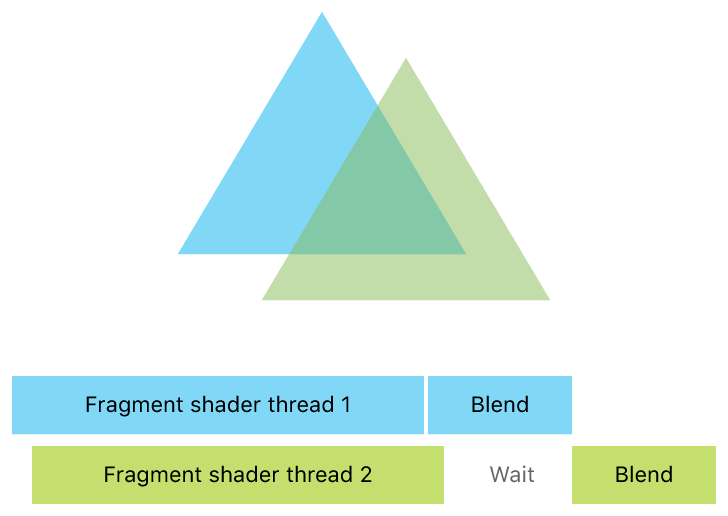

展示两个大小相同、相互重叠的三角形的示意图。三角形下方是两条大部分重叠的片段着色器时间线。第一条片段着色器代表后方三角形，其开始时间略早于前方三角形的着色器。前方着色器的混合阶段必须等待后方着色器的混合阶段完成。

每个三角形的片段着色器都在各自的线程上并发运行。后方三角形的片段着色器可能不会先于前方三角形的片段着色器执行完毕，如果某个着色器的自定混合函数需要另一个三角形着色器的结果，这就可能成为一个问题。由于并发性，这种「读取-修改-写入」序列可能会产生竞态条件。

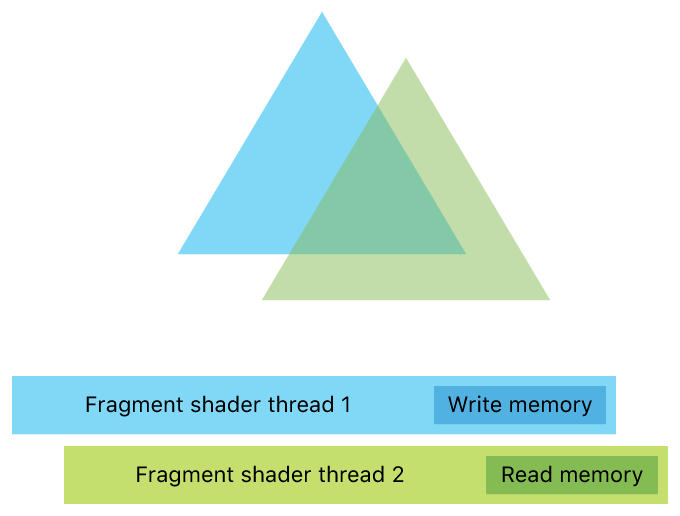

展示了与上一张图相同的两个重叠三角形。三角形下方的着色器时间线显示，前方三角形的着色器在读取内存的同时，后方三角形的着色器正在写入内存。

栅格顺序组通过对以相同像素坐标和样本（如果你启用了逐样本着色）为目标的线程进行同步，克服了这种访问冲突。

要实现栅格顺序组，请用一个属性限定符对指向内存的指针进行标注。通过这些指针访问像素的着色器会按逐像素的提交顺序执行。硬件会等待与当前线程重叠的任何更早的片段着色器线程完成之后，当前线程才会继续执行。

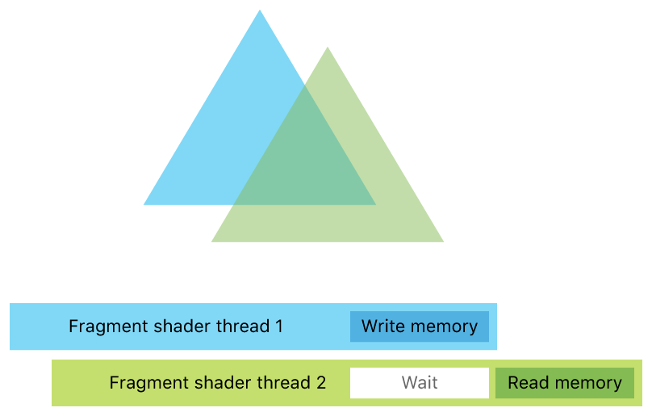

展示了与上一张图相同的两个重叠三角形。三角形下方的着色器时间线显示，前方三角形的着色器会先等待，直到后方三角形的着色器完成内存写入之后，才会读取内存。

在较新的 Apple GPU 上，Metal 为栅格顺序组扩展了额外的能力。它们让你能够对一个 imageblock 和线程组内存的各个独立通道进行同步。你还可以创建多个顺序组，从而获得更细粒度的同步，并尽量减少线程等待访问的频率。例如，这些栅格顺序组可以提升 _延迟着色_ 技术的性能——这是一种与 TBDR 无关的流行光照技术。传统上，延迟着色需要两个阶段：

1. 填充一个几何缓冲区（或称 _g-buffer_），生成多张纹理。
2. 使用这些纹理计算着色结果，渲染光照体积。

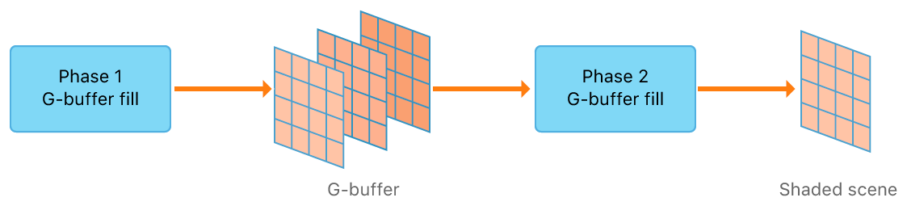

流程示意图，从填充一个由三张纹理组成的几何缓冲区的第一阶段开始。这些纹理随后流入第二阶段，生成已着色场景的渲染结果。

延迟着色对内存带宽的消耗很大，因为着色器需要先在第一阶段将这些纹理写入设备内存，再在第二阶段将其读回。你可以通过使用多个顺序组，将两个渲染阶段合并为一个，从而消除对中间纹理的需求。要做到这一点，需要将几何缓冲区保持为瓦片大小的分块，以便它们能够留在本地 imageblock 内存中。

在传统 GPU 上，负责某个次要光源的线程，需要等待之前的线程完成之后才能开始访问。这种等待会迫使各线程串行运行，即使这些内存操作彼此并不冲突。

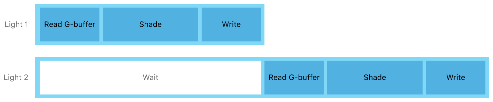

场景中两个光源的时间线示意图。第一个光源立即读取几何缓冲区、为场景着色并写入其结果。第二个光源执行相同的步骤，但必须等到第一个光源完成对内存的写入之后，才能读取几何缓冲区。

你可以使用多个顺序组，通过以下方式让不冲突的读取操作并发运行：

1. 将三个几何缓冲区字段——反照率、法线和深度——添加到第一组
2. 将累积的光照结果添加到第二组

Apple GPU 可以分别对这两个组进行排序，这样对第二组尚未完成的写入操作就不会妨碍对第一组的读取操作。

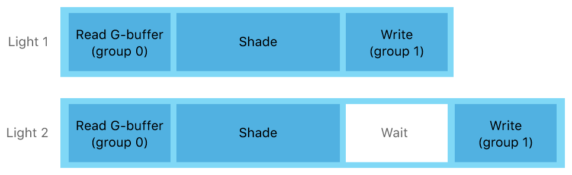

场景中两个光源的时间线示意图。两个光源都立即读取几何缓冲区，并并行为场景着色。第一个光源在其着色阶段结束后立即写入第一组，而第二个光源要等到第一个光源完成写入之后，才会同样写入第一组。

这两个线程会在执行结束时进行同步，以累加光照结果。

### 使用增强的多重采样抗锯齿自定像素混合

你可以通过在瓦片着色器中访问多重采样跟踪数据，创建自定的多重采样抗锯齿（MSAA）算法。MSAA 是一种通过为每个像素使用多个深度和颜色样本来改善图元边缘外观的技术。

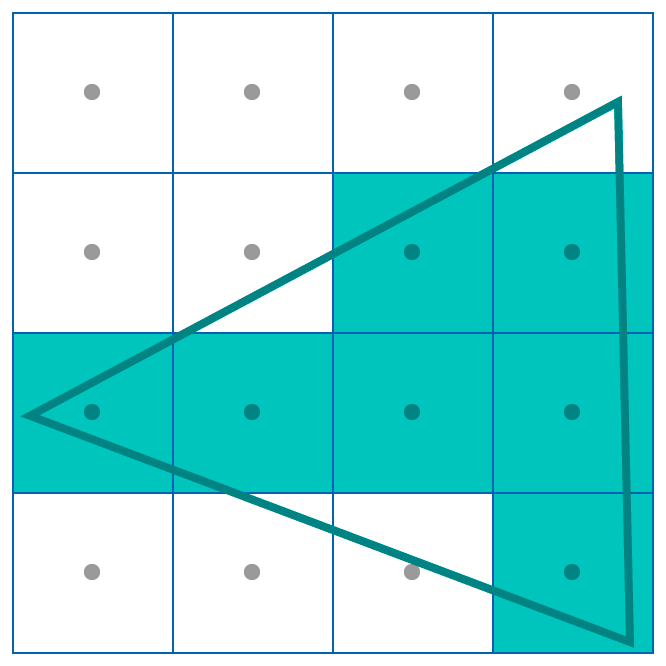

展示一个覆盖多个像素的三角形的示意图。每个像素在该像素区域的中心都有一个采样位置。三角形内部的像素采用三角形的颜色。三角形边缘上的像素，如果其采样点位于三角形内部，也会采用三角形的颜色。

每个像素都有一个单一的采样位置，三角形要么覆盖它，要么不覆盖，这可能会在某些角度下产生锯齿状边缘。

不过，4 倍 MSAA 会通过在四个不同位置对每个像素进行采样，来平滑锯齿状边缘的外观。GPU 会对该像素内每个样本的颜色取平均值，以确定其最终颜色。

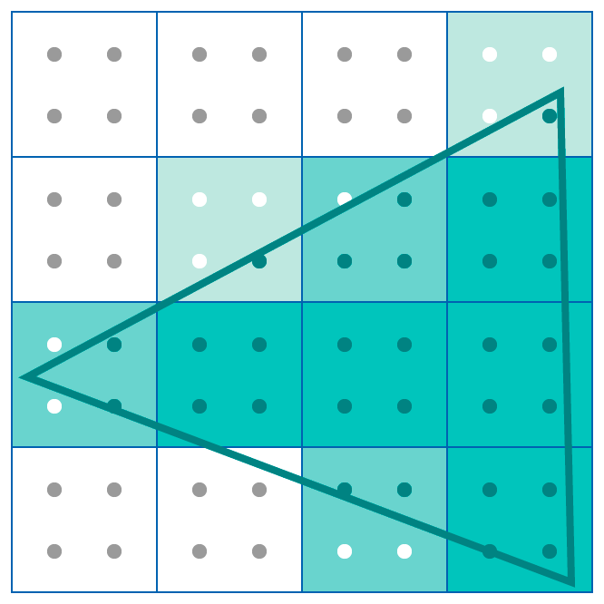

展示一个覆盖多个像素的三角形的示意图。每个像素在其区域内有四个采样位置。在某些三角形中，三角形覆盖了全部四个采样位置，而在另一些三角形中，只覆盖一个、两个或三个样本。三角形覆盖的样本越多，该像素的色调就越接近三角形的颜色。

Apple GPU 拥有高效的 MSAA 实现。硬件会跟踪每个像素是否包含某个图元的边缘，因此只有在必要时才会执行逐样本混合。如果另一个图元覆盖了某个像素内的这些样本，GPU 只需为整个像素混合一次。

Apple GPU 会跟踪每个像素中唯一样本（或颜色）的数量，并在渲染新图元时更新这些数据。例如，考虑一个包含两个重叠三角形边缘的像素，其采样位置代表三种不同的颜色。

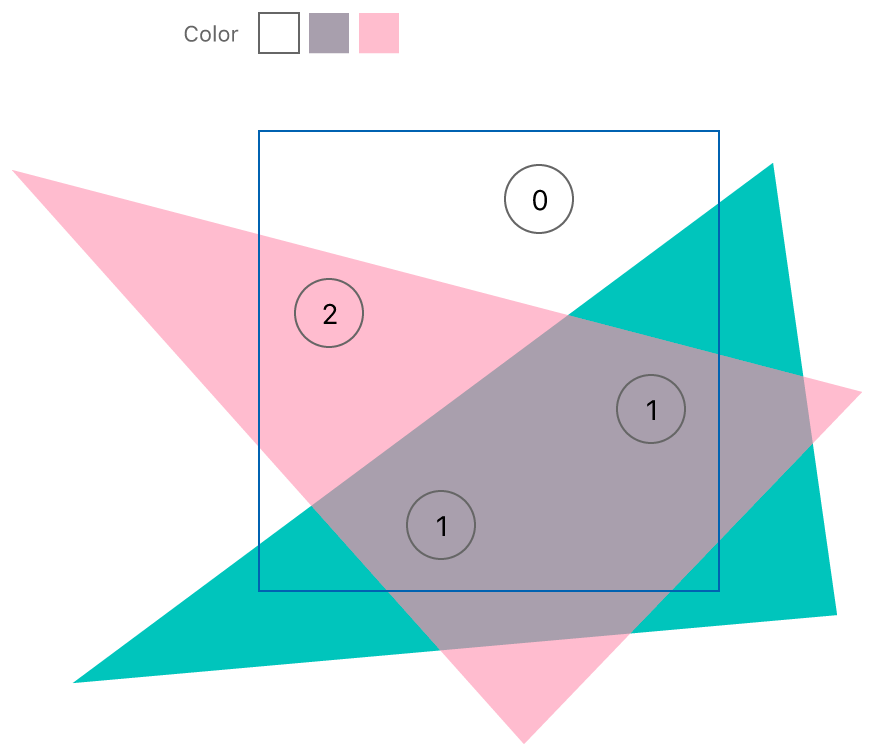

展示两个透明三角形的示意图。其中一个三角形覆盖了该像素内四个采样位置中的三个。第二个三角形覆盖了两个采样位置，这两个位置也都被第一个三角形覆盖。

A11 之前的 Apple GPU 会对该像素被覆盖的三个样本分别进行混合。从 A11 开始，由于其中两个样本共享同一种颜色，Apple GPU 只需混合两次。在这个例子中，索引 1 处的颜色是绿色和粉色的混合，索引 2 处的颜色是粉色。

Apple GPU 可以减少一个像素中唯一颜色的数量。例如，如果 GPU 在先前的三角形之上渲染一个不透明三角形，它就会用单一颜色来表示该像素。

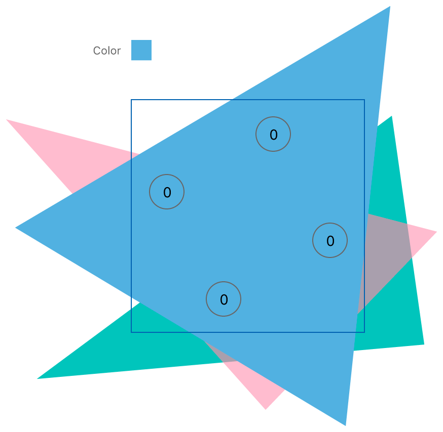

展示一个覆盖另外两个透明三角形的不透明三角形的示意图。该不透明三角形覆盖了该像素内全部四个采样位置。

在这种情况下，新的三角形覆盖了所有样本，GPU 可以通过将这三种颜色合并为一种，来用单一颜色表示该像素。

你可以通过在瓦片着色器中修改样本覆盖数据，来实现自定的解析算法。例如，考虑一个包含不透明几何体和半透明几何体独立渲染阶段的复杂场景。你可以添加一个瓦片着色器，在混合半透明几何体之前，先为不透明几何体解析样本数据。

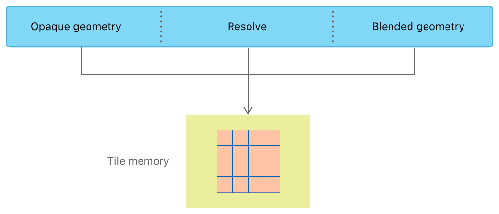

模块示意图，展示了访问瓦片内存的三个模块：不透明几何体、混合几何体和一个解析算法。

该瓦片着色器处理的是本地内存中的数据，可以作为不透明几何体阶段的一部分。

## 另请参阅

### Apple 芯片

- [将你的 Metal 代码移植到 Apple 芯片](../apple-silicon/porting-your-metal-code-to-apple-silicon.md) — 创建一个既可在 Apple 芯片上运行、也可在基于 Intel 的 Mac 计算机上运行的 Metal App 版本。
