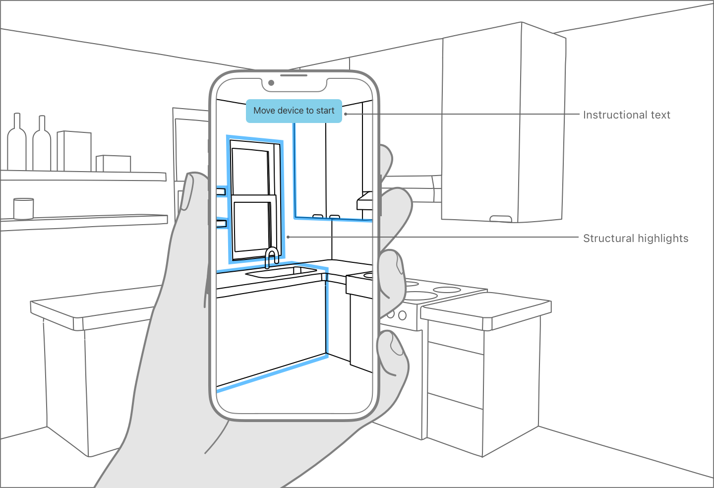
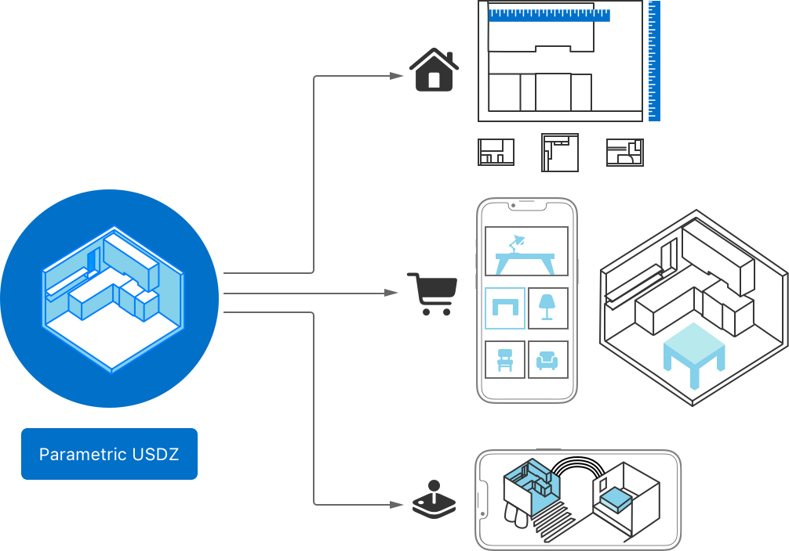

> 导航：[Technologies](technologies.md)

# RoomPlan

框架

通过交互式引导用户使用设备的摄像头扫描其所处的物理环境，创建房间的 3D 模型。

## 概述

使用 RoomPlan 创建室内房间的 3D 模型。该框架利用设备的传感器、经过训练的机器学习模型以及 RealityKit 的渲染能力来捕捉室内房间的物理环境。例如，该框架会检查设备的摄像头画面和 LiDAR 读数,以识别墙壁、窗户、开口和门。RoomPlan 还能识别房间特征、家具和电器，例如壁炉、床或冰箱,并将这些信息提供给 App。

要开始一次捕捉，App 会呈现一个视图（[RoomCaptureView](roomplan/roomcaptureview.md)），用户通过它以 AR 方式查看自己的房间。该视图会在用户在房间内移动时显示虚拟提示：

- 实时图形叠加层会显示在房间中物理结构的上方，传达扫描进度。
- 如果框架需要特定类型的设备移动或视角才能完成捕捉，界面会显示说明，解释如何摆放设备。

一幅插图,展示一只手以竖屏方式握持 iPhone,置身于厨房中。设备屏幕显示厨房的摄像头画面,窗户和水槽等物理结构周围带有高亮标记。屏幕顶部有一条横幅,写着「移动设备以开始」。该横幅右侧有一个标注,写着「说明文字」。设备屏幕右侧的另一个标注写着「结构高亮标记」,并指向窗户周围的高亮。

当 App 判断当前扫描已完成时，视图会显示已扫描房间的缩小版本，供用户确认。

此外，你的 App 也可以直接创建并使用一个扫描会话对象（[RoomCaptureSession](roomplan/roomcapturesession.md)），在扫描过程中显示自定图形。

### 访问捕捉结果

该框架以 _参数化_ 数据的形式输出扫描结果，使你的 App 可以轻松修改扫描房间的各个组成部分。RoomPlan 还以多种 Universal Scene Description（USD）格式提供结果。借助这些资源，你的 App 可以实现自定功能，例如：

- 估算房间特定区域的尺寸。
- 从目录中以多种样式和位置预览虚拟家具。
- 将已扫描房间或建筑结构的一个版本集成到 3D 游戏中。

一幅插图,展示已扫描房间及其数据表现形式。从左侧开始,插图展示了已扫描房间的小比例 3D 版本。三条箭头向右延伸。最上方的箭头指向一个房屋图标,以及四张带有测量对象标尺的 2D 平面图图像。中间的箭头指向一个购物车图标,以及一部竖屏 iPhone,其屏幕显示包含桌子、台灯和椅子的家具目录。手机旁边是已扫描房间小比例 3D 版本的副本,其中包含来自目录的一张高亮虚拟桌子。最下方的箭头指向一个游戏手柄图标,以及一部横屏 iPhone,其屏幕显示已扫描房间的 3D 游戏版本。

### 在 macOS 上通过 Mac Catalyst 处理扫描结果

使用 Mac Catalyst 构建的 Mac App 可以访问 [CapturedRoom](roomplan/capturedroom.md) 和 [CapturedStructure](roomplan/capturedstructure.md)，并可执行编码、解码和导出。环境扫描依赖摄像头、LiDAR 及其他支持 iOS 和 iPad OS 设备增强现实功能的传感器。不过，使用 Mac Catalyst 构建的 macOS App 可以处理在这些设备上执行的房间捕捉会话的结果。在使用 Mac Catalyst 构建的 macOS App 中，RoomPlan 会忽略所有与捕捉会话相关的调用。

## 主题

### 要点

- [Create a 3D model of an interior room by guiding the user through an AR experience](roomplan/create-a-3d-model-of-an-interior-room-by-guiding-the-user-through-an-ar-experience.md) — 高亮物理结构并显示文字,借助框架提供的视图引导用户扫描其物理环境的形状。

### 用户界面

- [RoomCaptureView](roomplan/roomcaptureview.md) — 使用户能够通过设备摄像头扫描其房间的视图。
- [RoomCaptureViewDelegate](roomplan/roomcaptureviewdelegate.md) — 用于对扫描结果进行后处理的规范。

### 扫描协议

- [RoomCaptureSession](roomplan/roomcapturesession.md) — 管理房间扫描过程的对象。
- [RoomCaptureSessionDelegate](roomplan/roomcapturesessiondelegate.md) — 房间扫描过程中重要事件的规范。

### 捕捉的数据

- [Merging multiple scans into a single structure](roomplan/merging-multiple-scans-into-a-single-structure.md) — 导出一个由在同一物理区域内捕捉的多个房间组成的 3D 模型。
- [Scanning the rooms of a single structure](roomplan/scanning-the-rooms-of-a-single-structure.md) — 创建一种 AR 体验,使人们能够扫描包含多个房间的建筑。
- [CapturedRoom](roomplan/capturedroom.md) — 提供已扫描房间关键详情的结构体。
- [CapturedStructure](roomplan/capturedstructure.md) — 保存多个捕捉会话合并结果的对象。
- [CapturedRoomData](roomplan/capturedroomdata.md) — 保存扫描原始结果的不透明对象。
- [Captured Object Attributes](roomplan/captured-object-attributes.md) — 确定框架在扫描中识别出的对象和表面的详细信息。

### 3D 资源输出

- [Providing custom models for captured rooms and structure exports](roomplan/providing-custom-models-for-captured-rooms-and-structure-exports.md) — 通过用精细的 3D 渲染替换对象包围盒,提升导出的 3D 模型的观感。
- [RoomBuilder](roomplan/roombuilder.md) — 根据房间捕捉数据生成 3D 资源的对象。
- [StructureBuilder](roomplan/structurebuilder.md) — 将多个扫描会话合并为单一捕捉结果的对象。
- [USDExportOptions](roomplan/capturedroom/usdexportoptions.md) — 决定扫描导出的底层数据格式的选项。
