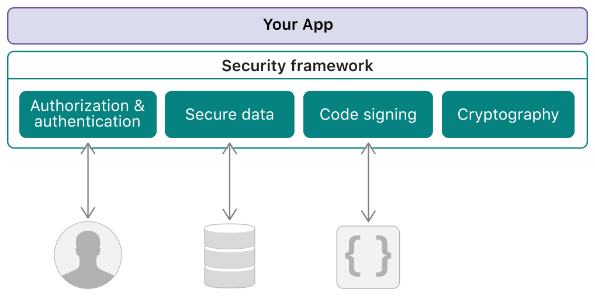

> 导航：[Technologies](technologies.md)

# Security

框架

保护你的 App 所管理的数据，并控制对你 App 的访问。

## 概述

使用 Security 框架来保护信息、建立信任并控制对软件的访问。总体而言，安全服务支持以下目标：

- 建立用户的身份（认证），然后有选择地授予对资源的访问权限（授权）。
- 保护数据，无论是磁盘上的数据还是在网络连接中传输的数据。
- 确保将要执行的代码对特定用途而言是有效的。

如下图所示，你还可以使用更低层级的加密资源来创建新的安全服务。加密很困难，出错的代价通常很高，因此自行实现加密方案通常不是好主意。当你的 App 需要用到加密功能时，应依赖 Security 框架。

图示显示你的 App 位于 Security 框架之上，该框架提供了可与用户、数据和代码进行安全交互的工具。

> [!note] 注意
> 始终使用满足你需求的最高层级 API。Security 框架并不总是你的最佳选择。例如，若要进行安全的网络通信，可先考虑 [Foundation](foundation.md) 框架的 [URL Loading System](foundation/url-loading-system.md)，它构建在 Security 框架之上。只有当你的 App 需要对安全协议函数进行更底层的访问时，才应直接使用 secure transport API。

## 主题

### 基础

- [Security updates](updates/security.md) — 了解 Security 的重要变更。

### 授权与认证

- [Password AutoFill](security/password-autofill.md) — 简化你的 App 的登录和用户引导流程。
- [Shared Web Credentials](security/shared-web-credentials.md) — 在 iOS App 与其对应网站之间共享凭据。
- [Authorization Services](security/authorization-services.md) — 访问操作系统的受限区域，并控制对你的 macOS App 特定功能的访问。
- [Authorization Plug-ins](security/authorization-plug-ins.md) — 通过创建可参与授权决策的插件来扩展授权服务 API。
- [Sessions](security/sessions.md) — 在 macOS 中管理登录、授权和安全会话。
- [One-time codes](security/one-time-codes.md) — 简化认证码和恢复码的输入。

### 安全数据

- [Keychain services](security/keychain-services.md) — 代表用户安全地存储小块数据。
- [Preventing Insecure Network Connections](security/preventing-insecure-network-connections.md) — 依靠 App Transport Security 在你的 App 中强制使用安全的网络链接。

### 安全代码

- [Code Signing Services](security/code-signing-services.md) — 检查并验证系统上运行的已签名代码。
- [Notarizing macOS software before distribution](security/notarizing-macos-software-before-distribution.md) — 将你的 macOS 软件提交给 Apple 进行公证，让用户对你的软件更加放心。
- [Preparing your app to work with pointer authentication](security/preparing-your-app-to-work-with-pointer-authentication.md) — 针对 arm64e 架构测试你的 App，确保它能与增强的安全功能无缝协作。
- [App Sandbox](security/app-sandbox.md) — 限制对 macOS App 中系统资源和用户数据的访问，以便在 App 被攻破时遏制损害。
- [Hardened Runtime](security/hardened-runtime.md) — 为你的 macOS App 管理安全防护和资源访问。
- [Disabling and Enabling System Integrity Protection](security/disabling-and-enabling-system-integrity-protection.md) — 仅在开发期间临时禁用系统防护，以测试驱动程序、内核扩展和其他底层代码。
- [Using the latest code signature format](xcode/using-the-latest-code-signature-format.md) — 更新旧版 App 代码签名，使你的 App 能在当前的 OS 版本上运行。
- [Updating Mac Software](security/updating-mac-software.md) — 在不引发代码签名崩溃的情况下实现 Mac 软件更新。
- [TN3125: Inside Code Signing: Provisioning Profiles](technotes/tn3125-inside-code-signing-provisioning-profiles.md) — 了解描述文件如何使第三方代码能够在 Apple 平台上运行。

### 启动环境约束

- [Applying launch environment and library constraints](security/applying-launch-environment-and-library-constraints.md) — 限制你的进程加载的库，以及它运行的场景。
- [Defining launch environment and library constraints](security/defining-launch-environment-and-library-constraints.md) — 将你的 App 的组件限制在其预期的上下文中。
- [Constraining a tool’s launch environment](security/constraining-a-tool's-launch-environment.md) — 通过限制你的 macOS App 组件的运行方式来提升安全性。

### 加密

- [Complying with Encryption Export Regulations](security/complying-with-encryption-export-regulations.md) — 声明你的 App 中加密功能的使用，以简化 App 提交流程。
- [Certificate, Key, and Trust Services](security/certificate-key-and-trust-services.md) — 使用证书和加密密钥建立信任。
- [Cryptographic Message Syntax Services](security/cryptographic-message-syntax-services.md) — 对 S/MIME 消息进行加密签名和加密。
- [Randomization Services](security/randomization-services.md) — 生成加密安全的随机数。
- [Security Transforms](security/security-transforms.md) — 执行编码、加密、签名和签名验证等加密功能。
- [ASN.1](security/asn-1.md) — 编码和解码可辨别编码规则（DER）和基本编码规则（BER）数据流。

### 结果代码

- [Security Framework Result Codes](security/security-framework-result-codes.md) — 评估许多 Security 框架函数共用的结果代码。

### 旧版接口

- [Common Security Services Manager](security/common-security-services-manager.md) — 支撑 Security 框架旧版实现的一组开源模块。
- [Secure Transport](security/secure-transport.md) — 使用标准化的传输层安全机制进行安全的网络通信。
- [Secure Download](security/secure-download.md) — 在 macOS 中实现 Apple 的 Secure Download System。
- [Security legacy reference](security/security-legacy-reference.md) — 了解旧版 API。

### 参考

- [Security Structures](security/security-structures.md)
- [Security Constants](security/security-constants.md)
- [Security Functions](security/security-functions.md)
- [Security Data Types](security/security-data-types.md)

### 变量

- [CSSM_APPLE_PRIVATE_CSPDL_CODE_28](security/cssm_apple_private_cspdl_code_28.md)
- [TLS_ECDHE_PSK_WITH_CHACHA20_POLY1305_SHA256](security/tls_ecdhe_psk_with_chacha20_poly1305_sha256.md)
- [errSecCSDetachedCertificates](security/errseccsdetachedcertificates.md)
- [errSecCSMultipleSelfSigning](security/errseccsmultipleselfsigning.md)
- [errSecCSRemoteSignerFirstSlotFull](security/errseccsremotesignerfirstslotfull.md)
- [errSecCSRemoteSignerSecondSlotFull](security/errseccsremotesignersecondslotfull.md)
- [errSecCSUnsupportedAlgorithm](security/errseccsunsupportedalgorithm.md)
- [errSecMissingQualifiedCertStatement](security/errsecmissingqualifiedcertstatement.md)
- [kSecCFErrorDetachedCertificates](security/kseccferrordetachedcertificates.md)
- [kSecCS_MAX_SIGNATURES](security/kseccs_max_signatures.md)
- [kSecCodeInfoChosenSignature](security/kseccodeinfochosensignature.md)
- [kSecCodeInfoSignerInfoSKID](security/kseccodeinfosignerinfoskid.md)
- [kSecCodeInfoTotalSignatures](security/kseccodeinfototalsignatures.md)
- [kSecPolicyAppleEAPClient](security/ksecpolicyappleeapclient.md)
- [kSecPolicyAppleEAPServer](security/ksecpolicyappleeapserver.md)
- [kSecPolicyAppleIPSecClient](security/ksecpolicyappleipsecclient.md)
- [kSecPolicyAppleIPSecServer](security/ksecpolicyappleipsecserver.md)
- [kSecPolicyAppleSSLClient](security/ksecpolicyapplesslclient.md)
- [kSecPolicyAppleSSLServer](security/ksecpolicyapplesslserver.md)
- [kSecTrustQCStatements](security/ksectrustqcstatements.md)
- [kSecTrustQWACValidation](security/ksectrustqwacvalidation.md)

### 函数

- [SecIdentityCreate](<security/secidentitycreate(______).md>)
- [sec_protocol_metadata_copy_negotiated_protocol](<security/sec_protocol_metadata_copy_negotiated_protocol(__).md>)
- [sec_protocol_metadata_copy_server_name](<security/sec_protocol_metadata_copy_server_name(__).md>)

### 类型别名

- [CE_DataType](security/ce_datatype-swift.typealias.md)
- [CE_ExtendedKeyUsage](security/ce_extendedkeyusage-swift.typealias.md)
- [CE_GeneralNameType](security/ce_generalnametype-swift.typealias.md)
