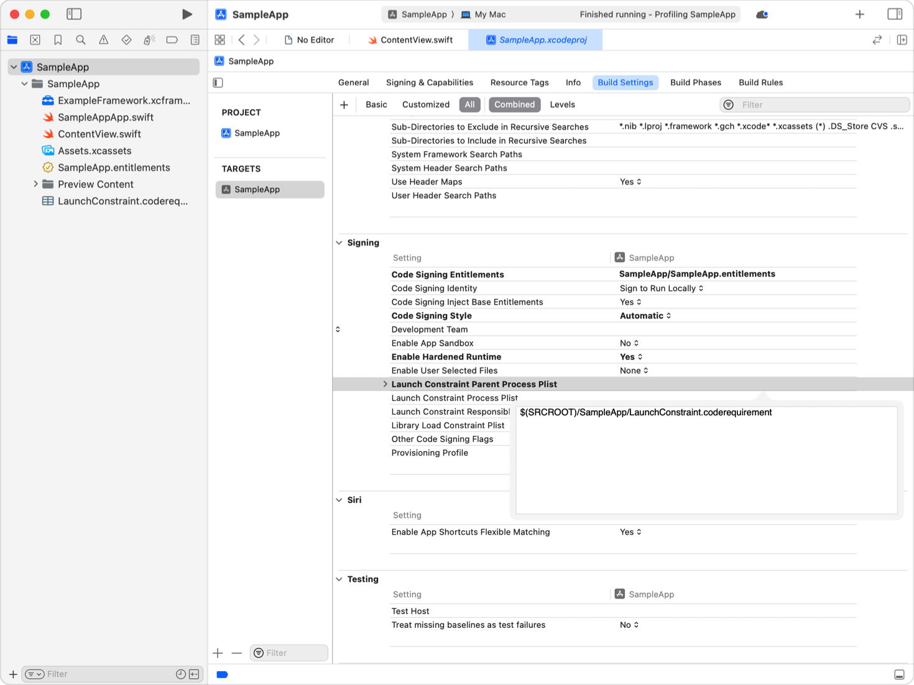

> 导航：[技术](../technologies.md) · [Security](../security.md)

# 应用启动环境与库约束

<sub>文章</sub>

限制你的进程加载的库，以及它运行的环境。

## 概述

将复杂的 App 拆分为多个组件，每个组件对用户在电脑上的数据和资源拥有不同的访问权限，是一种良好的安全实践。使用启动环境约束（launch environment constraints）和库约束（library constraints），通过限制其他进程使用你 App 中具有特权的组件，进一步保护用户安全。

### 确定要使用的约束类型

库约束是对你的进程加载的库文件属性进行测试，如果库文件的属性不匹配，内核会阻止你的进程加载该库。

启动环境约束是对参与启动你进程的可执行文件的属性进行测试。你可以定义三种类型的启动环境约束：

- **自身约束** — 该约束适用于在其代码签名中内嵌了该约束的可执行文件。
- **父约束** — 该约束适用于启动受约束可执行文件的进程的可执行文件，例如通过调用 `posix_spawn(_:_:_:_:_:_:)`。
- **责任约束** — 该约束适用于负责启动受约束可执行文件的进程的可执行文件。发起 [XPC](../xpc.md) 连接的 App 负责启动 XPC 服务。直接启动辅助进程的 App 既是该辅助进程的父进程，也是其责任进程。

如果可执行文件中内嵌了任何未满足的启动环境约束，内核将不会启动该进程。

*Spawn 约束* 是一个正在运行的进程在启动另一个进程时所断言的启动约束。操作系统的初始化进程 `launchd` 会使用你在 `launchd` 属性列表文件中定义的 spawn 约束来决定是否启动你的守护进程或代理。如果属性列表文件中指定的可执行文件不满足 spawn 约束，`launchd` 将不会将其作为启动守护进程或代理启动。

### 定义约束

创建一个属性列表（property list）文件，描述适合你组件的约束。对于启动守护进程和启动代理，将 spawn 约束写入组件 `launchd` 属性列表文件中 `SpawnConstraint` 键的值所对应的字典。对于库约束和启动约束，创建一个单独的属性列表文件，扩展名为 `.coderequirement`。

有关添加到约束属性列表中的键和值的说明，请参阅[定义启动环境与库约束](defining-launch-environment-and-library-constraints.md)。

### 将约束内嵌到可执行文件的代码签名中

要将启动约束或库约束内嵌到可执行文件的代码签名中，请按照以下步骤操作：

1. 在 Xcode 中打开你的项目。
2. 在文件导航器中选择你的项目。
3. 在项目编辑器中选择构建可执行文件的目标。
4. 切换到构建设置标签页。
5. 在签名分组中，将相应的构建设置设置为包含约束定义的属性列表文件的路径。对于自身约束，使用 **Launch Constraint Process Plist（启动约束进程 Plist）**。对于父约束，使用 **Launch Constraint Parent Process Plist（启动约束父进程 Plist）**。对于责任进程约束，使用 **Launch Constraint Responsible Process List（启动约束责任进程列表）**。对于库约束，使用 **Library Load Constraint Plist（库加载约束 Plist）**。



<sub>一张 Xcode 截图。其中显示了签名（Signing）构建设置，并且正在编辑 Launch Constraint Parent Process Plist 设置。</sub>

关于在终端中使用 `codesign` 的选项的信息，请参见 `codesign` 的 UNIX 手册页。

> [!NOTE] 注意
> 不要将用于 `launchd` 守护进程和代理的 spawn 约束内嵌到其可执行文件的代码签名中。相反，应将约束添加到守护进程或代理的 `launchd` 属性列表文件的 `SpawnConstraint` 键中。

### 诊断启动约束失败

当操作系统因未满足的启动约束而阻止进程启动时，该进程的崩溃日志会报告发生了启动约束违反。此外，当操作系统检测到未满足的启动约束时，它会记录一条消息，你可以在控制台（Console）中搜索该消息。日志消息的格式如下：

```console
AMFI: Launch Constraint Violation (<enforcement status>), error info: c[<constraint identifier>]p[<process identifier>]m[<match result>]e[<error code>], (<message>) launching proc[vc: <launching process validation category> pid: <launching process pid>]: <launching process path>, launch type <launch type>, failure proc [vc: <failing process validation category> pid: <failing process pid>]: <failing process path>
```

日志消息中的字段含义如下。

- **`<enforcement status>`** — 一个字符串，如果操作系统阻止进程启动，则为 `enforcing`；否则为 `not enforcing`，表示操作系统记录此违反事件但仍启动进程。
- **`<constraint identifier>`** — 一个整数，表示未满足的约束类型。对于失败的启动约束，约束标识符为 `4`；对于失败的 spawn 约束，约束标识符为 `5`。其他值由操作系统保留。
- **`<process identifier>`** — 一个整数，表示违反事件涉及的是 (`1`) 正在启动的进程；(`2`) 正在启动进程的父进程；还是 (`3`) 正在启动进程的责任进程。
- **`<match result>`** — 一个整数，标识违反的原因。可能的匹配结果值列于下方的「解读匹配结果与错误码」。
- **`<error code>`** — 一个整数，标识操作系统检测到的错误。可能的错误码值取决于匹配结果：请参见下方的「解读匹配结果与错误码」。
- **`<message>`** — 一个人类可读的字符串，描述此错误。
- **`<launching process validation category>`, `<failing process validation category>`** — 一个整数，分别是正在启动进程的验证类别，以及验证失败的进程的验证类别。关于验证类别值的列表，请参阅[定义启动环境与库约束](defining-launch-environment-and-library-constraints.md)。
- **`<launching process pid>`, `<failing process pid>`** — 一个整数，分别是正在启动进程的进程标识符，以及验证失败的进程的进程标识符。
- **`<launching process path>`, `<failing process path>`** — 一个字符串，分别是正在启动进程的可执行文件路径，以及验证失败的进程的可执行文件路径。
- **`<launch type>`** — 一个整数，标识进程启动的类型。关于启动类型值的列表，请参阅[定义启动环境与库约束](defining-launch-environment-and-library-constraints.md)。

### 解读匹配结果与错误码

约束违反日志消息中的匹配结果整数具有以下值之一：

- **`1`** — 进程启动与存在的启动约束不匹配。错误码为 `0`。
- **`2`** — 操作系统无法解析启动约束字典。错误码为下方列表中的值。
- **`3`** — 进程启动违反了与启动约束无关的操作系统策略。错误码为 `255`，并且消息中包含更多信息。
- **`4`** — 操作系统无法解析 spawn 约束，或者 spawn 约束缺少必需的数据。如果 spawn 约束包含意外数据，错误码为 `1`；如果 spawn 约束格式不正确，错误码为 `2`。
- **`5`** — 操作系统无法将可执行文件与约束匹配，因为约束包含一个对该可执行文件未定义的必需事实（fact）。错误码为下方列表中的值。

当匹配结果为 `2` 或 `5` 时，错误码具有以下值之一：

- **`1`** — 启动约束包含操作系统无法识别的运算符。
- **`2`** — 启动约束为空。
- **`3`** — 启动约束包含的元素不被它所应用的运算符支持。
- **`4`** — 启动约束包含一个运算符，但该运算符没有可操作的事实或子运算符。
- **`5`** — 启动约束包含一个操作系统无法识别的事实。
- **`6`** — 启动约束的版本未知，或不符合操作系统所期望的语法规则。
- **`7`** — 操作系统无法解析启动约束。

有关可在启动约束中使用的运算符和事实的信息，以及如何构建有效约束，请参阅[定义启动环境与库约束](defining-launch-environment-and-library-constraints.md)。

### 诊断库约束失败

如果你的 App、辅助进程或命令行工具尝试加载一个不满足进程库约束的动态库，该库将加载失败。例如，如果你使用 `dlopen(_:_:)` 加载库，返回的句柄将是 `NULL`，并且系统会将 `errno` 设置为 `EPERM`（操作不被允许）。此外，操作系统会记录一条消息，你可以在控制台中搜索。消息的格式如下：

```console
Library Load Constraint Rejection: Rejecting '<library path>' (Team ID: <library team identifier>, platform: <is platform library>) for process '<process name>(<process id>)' (Team ID: <process team identifier>, platform: is <platform process>), reason: Constraint not matched
```

日志消息中的字段含义如下：

- **`<library path>`** — 进程尝试加载的库的路径。
- **`<library team identifier>`, `<process team identifier>`** — 分别是库和加载进程的 Apple Developer 团队 ID。
- **`<is platform library>`, `<is platform process>`** — 分别表示库和加载进程是否是操作系统的一部分。
- **`<process name>`** — 尝试加载库的进程名称。
- **`<process id>`** — 尝试加载库的进程的进程标识符。
