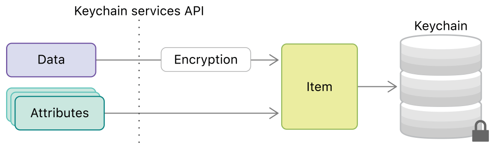

> 导航：[技术](../technologies.md) · [Security](../security.md) · [钥匙串服务](keychain-services.md)

# 钥匙串项目

API 集合

将机密信息嵌入到你存储在钥匙串中的项目里。

## 概述

当你要存储密码或加密密钥等秘密时，可以将其打包为一个钥匙串项目（keychain item）。除数据本身外，你还需要提供一组公开可见的特性（attribute），既用于控制项目的可访问性，也使其可被搜索。如图 1 所示，钥匙串服务（Keychain Services）负责在钥匙串（即存储在磁盘上的加密数据库）中处理数据加密与存储（包括数据特性）。之后，经过授权的进程使用钥匙串服务查找该项目并解密其数据。

示意图展示数据被加密后与特性结合为钥匙串项目，再存储到钥匙串中的过程。

## 主题

### 基础

- [使用钥匙串管理用户秘密](using-the-keychain-to-manage-user-secrets.md) — 通过将小秘密存储在钥匙串中，减轻用户的记忆负担。
- [TN3137：关于 Mac 钥匙串 API 与实现](../technotes/tn3137-on-mac-keychains.md) — 了解 macOS 上的钥匙串与其他 Apple 平台的区别。
- [SecKeychainItem](seckeychainitem.md) — 表示钥匙串项目的不透明类型。
- [SecKeychainItemGetTypeID](<seckeychainitemgettypeid().md>) — 返回钥匙串项目对象所属不透明类型的唯一标识符。 _(已废弃)_

### 添加钥匙串项目

- [向钥匙串添加密码](adding-a-password-to-the-keychain.md) — 代表用户将网络凭据添加到钥匙串。
- [SecItemAdd](<secitemadd(____).md>) — 向钥匙串添加一个或多个项目。
- [项目类键与值](item-class-keys-and-values.md) — 指定钥匙串项目的类。
- [项目特性键与值](item-attribute-keys-and-values.md) — 指定钥匙串项目的特性。

### 钥匙串项目搜索

- [搜索钥匙串项目](searching-for-keychain-items.md) — 根据你指定的搜索条件查找钥匙串项目。
- [SecItemCopyMatching](<secitemcopymatching(____).md>) — 返回匹配搜索查询的一个或多个钥匙串项目，或复制特定钥匙串项目的特性。
- [搜索特性键与值](search-attribute-keys-and-values.md) — 过滤钥匙串项目搜索。
- [项目返回结果键](item-return-result-keys.md) — 指定返回的钥匙串项目数据的格式。

### 钥匙串项目修改

- [更新与删除钥匙串项目](updating-and-deleting-keychain-items.md) — 当用户数据发生变化时修改钥匙串中的项目。
- [SecItemUpdate](<secitemupdate(____).md>) — 修改匹配搜索查询的项目。
- [SecItemDelete](<secitemdelete(__).md>) — 删除匹配搜索查询的项目。

### 钥匙串项目访问

- [在一组 App 之间共享钥匙串项目的访问权限](sharing-access-to-keychain-items-among-a-collection-of-apps.md) — 通过将 App 添加至访问组，使其能够彼此共享钥匙串项目。
- [钥匙串访问组 Entitlement](../bundleresources/entitlements/keychain-access-groups.md) — App 可用于共享项目的钥匙串组的标识符。
- [限制钥匙串项目的可访问性](restricting-keychain-item-accessibility.md) — 设置 App 访问密码等钥匙串项目的条件。
- [SecAccessControlCreateWithFlags](<secaccesscontrolcreatewithflags(________).md>) — 使用指定的保护类型和标志创建新的访问控制对象。
- [SecAccessControlCreateFlags](secaccesscontrolcreateflags.md) — 用于规定钥匙串项目使用方式的访问控制常量。
- [SecAccessControl](secaccesscontrol.md) — 包含钥匙串项目使用方式信息的不透明类型。
- [SecAccessControlGetTypeID](<secaccesscontrolgettypeid().md>) — 返回钥匙串项目访问控制对象所属不透明类型的唯一标识符。

### 导入与导出

- [SecItemImport](<secitemimport(________________).md>) — 导入一个或多个证书、密钥或身份，并可选地将其添加到钥匙串。
- [SecItemExport](<secitemexport(__________).md>) — 导出一个或多个证书、密钥或身份。
- [SecExternalFormat](secexternalformat.md) — 钥匙串项目的外部格式。
- [SecExternalItemType](secexternalitemtype.md) — 导入项目类型。
- [SecItemImportExportFlags](secitemimportexportflags.md) — 导入与导出函数标志。
- [SecItemImportExportKeyParameters](secitemimportexportkeyparameters.md) — 导入/导出参数结构。
- [SecKeyImportExportFlags](seckeyimportexportflags.md) — 导入/导出参数结构标志。
- [SEC_KEY_IMPORT_EXPORT_PARAMS_VERSION](sec_key_import_export_params_version.md) — 导入/导出参数结构版本。
- [SecKeyImportExportParameters](seckeyimportexportparameters.md) — 遗留的导入/导出参数结构。 _(已废弃)_

### 遗留钥匙串项目创建

- [SecKeychainItemCreateFromContent](<seckeychainitemcreatefromcontent(______________).md>) — 根据提供的参数创建新的钥匙串项目。 _(已废弃)_
- [SecKeychainItemCreateCopy](<seckeychainitemcreatecopy(________).md>) — 将钥匙串项目从一个钥匙串复制到另一个。 _(已废弃)_
- [SecKeychainItemCreatePersistentReference](<seckeychainitemcreatepersistentreference(____).md>) — 为钥匙串项目创建持久引用。 _(已废弃)_
- [SecKeychainItemCopyFromPersistentReference](<seckeychainitemcopyfrompersistentreference(____).md>) — 根据持久引用提供钥匙串项目引用。 _(已废弃)_
- [SecItemClass](secitemclass.md) — 指定钥匙串项目的类代码。

### 遗留钥匙串项目管理

- [SecKeychainItemCopyAttributesAndData](<seckeychainitemcopyattributesanddata(____________).md>) — 检索给定钥匙串项目中存储的数据和/或特性。 _(已废弃)_
- [SecKeychainItemModifyAttributesAndData](<seckeychainitemmodifyattributesanddata(________).md>) — 在更改现有钥匙串项目的特性或数据后对其进行更新。 _(已废弃)_
- [SecKeychainItemFreeAttributesAndData](<seckeychainitemfreeattributesanddata(____).md>) — 释放由调用 `SecKeychainItemCopyAttributesAndData` 获取的钥匙串特性列表和/或钥匙串数据所占用的内存。 _(已废弃)_
- [SecKeychainItemCopyContent](<seckeychainitemcopycontent(__________).md>) — 复制给定钥匙串项目中存储的数据和特性。 _(已废弃)_
- [SecKeychainItemModifyContent](<seckeychainitemmodifycontent(________).md>) — 在更改现有钥匙串项目的特性和/或数据后对其进行更新。 _(已废弃)_
- [SecKeychainItemFreeContent](<seckeychainitemfreecontent(____).md>) — 释放由调用 [SecKeychainItemCopyContent](<seckeychainitemcopycontent(__________).md>) 函数获取的钥匙串特性列表和钥匙串数据所占用的内存。 _(已废弃)_
- [SecKeychainItemCopyKeychain](<seckeychainitemcopykeychain(____).md>) — 返回给定钥匙串项目的钥匙串对象。 _(已废弃)_
- [SecKeychainItemDelete](<seckeychainitemdelete(__).md>) — 从默认钥匙串的持久数据存储中删除一个钥匙串项目。 _(已废弃)_
- [SecKeychainAttrType](seckeychainattrtype.md) — 钥匙串特性类型。
- [SecKeychainAttribute](seckeychainattribute.md) — 包含单个钥匙串特性的结构体。
- [SecKeychainAttributePtr](seckeychainattributeptr.md) — 指向钥匙串特性结构体的指针。
- [SecKeychainAttributeList](seckeychainattributelist.md) — 钥匙串特性列表。

### 遗留特性信息

- [SecKeychainAttributeInfoForItemID](<seckeychainattributeinfoforitemid(______).md>) — 获取给定项目类所有可能特性的标签。 _(已废弃)_
- [SecKeychainFreeAttributeInfo](<seckeychainfreeattributeinfo(__).md>) — 释放通过调用 `SecKeychainAttributeInfoForItemID` 函数获取的内存。 _(已废弃)_
- [SecKeychainAttributeInfo](seckeychainattributeinfo.md) — 表示特性的结构体。
- [SecItemAttr](secitemattr.md) — 指定钥匙串项目的特性。
- [钥匙串项目特性常量（用于密钥）](keychain-item-attribute-constants-for-keys.md) — 指定钥匙串中密钥项目的特性。
- [SecAFPServerSignature](secafpserversignature.md) — 表示 16 字节的 Apple 文件协议服务器签名区块。 _(已废弃)_

### 遗留密码存储

- [SecKeychainAddInternetPassword](<seckeychainaddinternetpassword(______________________________).md>) — 向钥匙串添加新的互联网密码。 _(已废弃)_
- [SecKeychainFindInternetPassword](<seckeychainfindinternetpassword(______________________________).md>) — 根据传入的特性查找第一个互联网密码。 _(已废弃)_
- [SecKeychainAddGenericPassword](<seckeychainaddgenericpassword(________________).md>) — 向钥匙串添加新的通用密码。 _(已废弃)_
- [SecKeychainFindGenericPassword](<seckeychainfindgenericpassword(________________).md>) — 根据传入的特性查找第一个通用密码。 _(已废弃)_
- [SecProtocolType](secprotocoltype.md) — 与互联网密码关联的协议类型。
- [SecAuthenticationType](secauthenticationtype.md) — 互联网密码使用的认证类型。
- [SecPassword](secpassword.md) — 包含密码信息。
