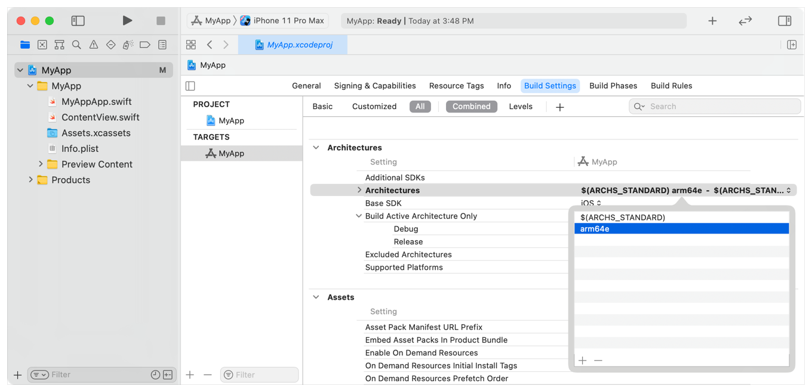

> 导航：[技术](../technologies.md) · [安全性](../security.md)

# 让 App 支持指针认证

<sub>文章</sub>

在 arm64e 架构上测试你的 App，确保它能无缝配合增强的安全特性。

## 概述

arm64e 架构引入了指针认证码（pointer authentication code，PAC），用于检测并防范内存中指针的意外改动。指针认证的添加对大多数 App 而言是透明的，因为编译器会管理这一过程。在极少数情况下——例如，如果你的 App 直接操控栈，或者你在 C++ 和 Objective-C++ 之间传递指针——你可能需要调整代码以配合 PAC。

指针认证的工作原理是：在存储指针之前，使用一条特殊的 CPU 指令向指针未使用的高位添加一个加密签名（即 PAC）；从内存中读取指针后，再用另一条指令移除并验证该签名。在写入和读取之间，存储值的任何改动都会使签名失效。CPU 会将认证失败解释为内存损坏，并在指针中设置一个高位，从而使指针失效并导致 App 崩溃。

### 构建 arm64e 二进制文件以采用指针认证

当你构建并部署一个面向 arm64e 架构的二进制文件时，你的 App 会自动采用指针认证。从 Xcode 10.1 开始即可实现此操作。要构建 arm64e 分片，请前往目标（target）在 Xcode 中的构建设置（Build Settings），找到“架构（Architectures）”项。点击当前设置并选择“其他（Other）”。在出现的框中，添加 `arm64e`。



<sub>Xcode 的截图，展示了在 iOS App 目标的构建设置（Build Settings）面板的“架构（Architectures）”项中添加 arm64e 的过程。</sub>

搭载 Apple A12 或更新 A 系列处理器的设备——例如 iPhone XS、iPhone XS Max、iPhone XR 以及 Apple TV 4K（第 2 代）——以及 Apple Watch Series 4 或更新机型、配备 Apple 芯片的 Mac 和 iPad 均支持 arm64e 架构。要测试你的采用情况，你必须在这些设备之一上运行你的 App。你无法使用模拟器进行测试。

### 识别指针认证失败

当指针认证失败时，系统会通过设置一个高位来使失败的指针失效。随后对该指针的使用会导致段错误（segmentation fault）。崩溃报告会包含一条消息，其中包含指针在失效后和失效前的值：

```console
Exception Subtype: KERN_INVALID_ADDRESS at 0x0040000105394398 -> 0x0000000105394398 (possible pointer authentication failure)
```

通常情况下，编译器会同时添加用于创建和验证 PAC 的 CPU 指令。在极少数情况下，如果你自己管理这些步骤——例如，如果你正在编写自己的编译器——并且你在未首先应用认证指令来移除签名的情况下尝试使用已签名的指针，这同样会触发段错误。在这种情况下，高位中的签名会导致指针失效：

```console
Exception Subtype: KERN_INVALID_ADDRESS at 0x217c000105394398 -> 0x0000000105394398 (possible pointer authentication failure)
```

请注意，其他无效的内存访问（其中高位被错误地设置）也可能看起来像是指针认证失败。

### 更新代码以避免指针认证失败

大多数代码无需修改即可在指针认证下运行，但某些依赖 arm64 特定行为的底层代码可能例外。例如，检查栈内容的崩溃报告库需要从返回地址中剥离 PAC。Apple Clang 编译器在 `ptrauth.h` 头文件中提供了实用工具——例如 `ptrauth_strip` 宏——来协助完成这类任务。

指针认证还可能暴露现有代码中的潜在 bug。在 C++ 中，使用与定义不同的声明来调用虚方法是不正确的。实际上，此类调用通常在 arm64 中会成功，但在 arm64e 中会触发指针认证失败。在使用 `OS_OBJECT` 类型（如 [dispatch_queue_t](../dispatch/dispatch_queue_t.md) 和 [xpc_connection_t](../xpc/xpc_connection_t.md)）时，你可能会遇到这个 bug。你不能将这些类型的实例从 C++ 代码传递给 Objective-C++ 函数（反之亦然），因为它们在 Objective-C++ 中的定义不同以支持自动引用计数（automatic reference counting，ARC）。

更一般地说，PAC 的计算会考虑指针值、加载到 CPU 中的几个密钥之一以及一个可选的盐值（salt）。为了防止指针在不同上下文中被重用，PAC 的计算依赖于指针类型。在查找代码中可能的问题时，请牢记以下规则：

- 返回地址使用每个进程唯一的密钥进行签名，并使用从栈指针派生的盐值。
- 函数指针使用所有进程间固定的密钥进行签名，允许进程之间共享库代码。
- 虚方法表条目使用所有 App 共享的密钥进行签名，并使用从方法签名派生的盐值。
