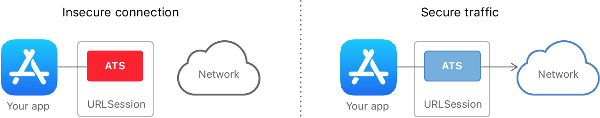
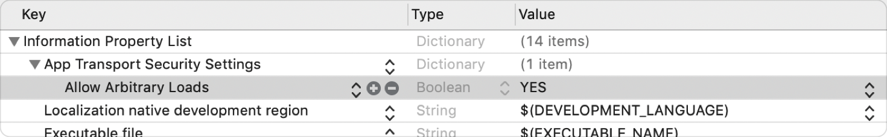
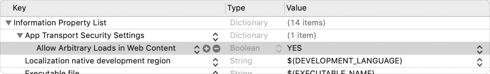
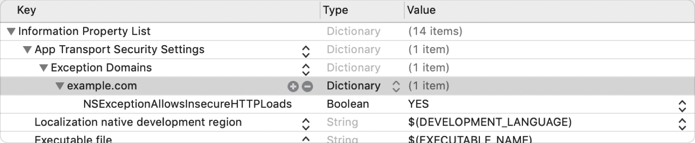

> 导航：[技术](../technologies.md) · [安全](../security.md)

# 防止不安全的网络连接

通过依赖 App Transport Security，在你的 App 中强制使用安全的网络连接。

## 概述

在 Apple 平台上，一项名为 App Transport Security（ATS）的网络安全功能可以提高所有 App 和 App 扩展的隐私与数据完整性。它要求你的 App 发起的网络连接必须通过传输层安全性（TLS）协议，并使用可靠的证书和密码套件进行保护。ATS 会阻止不符合最低安全性要求的连接。



对于链接到 iOS 9.0 或 macOS 10.11 SDK 及更高版本的 App，ATS 默认启用。在你需要连接到未完全安全的服务器，并且无法重新配置该服务器使其更安全的情况下，你可以添加例外来放宽某些 ATS 要求。

> [!note] 注意
> 如果你的 App 链接的是 iOS 9.0 或 macOS 10.11 之前的 SDK，那么无论你的 App 在哪个操作系统版本上运行，ATS 都会被禁用。

### 在你的 App 中优先使用高级框架

当你使用标准的 [URL 加载系统](../foundation/url-loading-system.md) 时，系统会强制执行 ATS。[URLSession](../foundation/urlsession.md) 的实例会自动协商服务器可用的最安全连接。你的 App 唯一需要做的就是使用安全的 URL，例如以 `https` 开头的 URL。否则，ATS 会拒绝连接并在控制台中打印一条消息：

```console
App Transport Security has blocked a cleartext HTTP (http://) resource
load since it is insecure. Temporary exceptions can be configured via
your app's Info.plist file.
```

ATS 不适用于你的 App 对较低层级网络接口（例如 [Network](../network.md) 框架或 [CFNetwork](../cfnetwork.md)）的调用。在这些情况下，你需要自行负责确保连接的安全性。虽然你也可以通过这种方式建立安全连接，但错误容易发生并且代价高昂。通常情况下，依赖 [URL 加载系统](../foundation/url-loading-system.md) 是最安全的做法。

### 确保网络服务器满足最低要求

安全服务器使用 X.509 数字证书来确立其身份。连接的客户端会检查此证书以执行默认的服务器信任评估，其中包括检查证书：

- 具有完整的数字签名，表明证书未被篡改。
- 未过期。
- 名称与服务器的 DNS 名称匹配。
- 由另一张有效证书签名，而该证书又由另一张证书签名，依此类推，直到受信任的根证书（anchor certificate），该证书必须由证书颁发机构（CA）签发。根证书必须是客户端操作系统的一部分，如 [iOS 可用受信任根证书列表](https://support.apple.com/en-us/HT204132) 所示，或者由用户或系统管理员安装在客户端上。

ATS 要求满足以上所有条件，然后还提供了扩展的安全性检查：

- 服务器证书必须使用至少 2048 位的 RSA（Rivest-Shamir-Adleman）密钥或至少 256 位的 ECC（椭圆曲线密码学，Elliptic-Curve Cryptography）密钥进行签名。
- 证书必须使用安全哈希算法 2（SHA-2），且摘要长度（有时称为_指纹_）至少为 256 位（即 SHA-256 或更高）。
- 连接必须使用传输层安全性（TLS）协议 1.2 或更高版本。
- 数据必须使用 AES-128 或 AES-256 对称密码进行交换。
- 链路必须通过椭圆曲线 Diffie-Hellman 临时密钥交换（ECDHE）支持完全前向保密（PFS）。

> [!note] 注意
> [URLSession](../foundation/urlsession.md) 会自动为你处理服务器信任评估，但也允许你自定义该过程，例如将信任扩展到嵌入在 App 中的自签名证书，或绕过证书过期。当 ATS 启用时，你无法再通过这种方式放宽信任评估要求，但仍然可以收紧它们——例如，实现证书锁定（certificate pinning）。更多信息，请参阅[执行手动服务器信任认证](../foundation/performing-manual-server-trust-authentication.md)。

### 可选的 NIAP TLS 需求功能包

ATS 支持进一步限制默认的 TLS 客户端行为，以帮助满足美国国家信息保障伙伴关系（NIAP）在传输层安全性功能包中概述的要求。此合规模式是自愿加入的，并为受监管的环境提供了额外的选项。要选择加入此模式，请使用 [NSRequiresNIAPTLSPackageVersion](../bundleresources/information-property-list/nsrequiresniaptlspackageversion.md) 键（可设置为全局强制此模式）和 [NSExceptionRequiresNIAPTLSPackageVersion](../bundleresources/information-property-list/nsexceptionrequiresniaptlspackageversion.md) 键（用于逐域配置全局策略的例外）。

### 仅在需要时配置例外，并优先修复服务器

如果服务器未能通过上一节讨论的某项安全检查，ATS 会拒绝连接。你最好的应对措施是更新服务器。如果出于某种原因你无法这样做，你可以在你的 App 中指定例外，以禁用 ATS 的一个或多个方面。

> [!important] 重要
> 面对 ATS 失败时，修复服务器总是更好的做法。例外会降低 App 的安全性。有些例外在向 App Store 提交 App 时还需要提供正当理由，如下一节所述。

你可以通过提供一个字典作为 App 的 [Information Property List](../bundleresources/information-property-list.md) 文件中可选键 [NSAppTransportSecurity](../bundleresources/information-property-list/nsapptransportsecurity.md) 的值，来配置 ATS 例外。该字典具有以下结构，其中所有键都是可选的：

```console
NSAppTransportSecurity : Dictionary {
    NSAllowsArbitraryLoads : Boolean
    NSAllowsArbitraryLoadsForMedia : Boolean
    NSAllowsArbitraryLoadsInWebContent : Boolean
    NSAllowsLocalNetworking : Boolean
    NSRequiresNIAPTLSPackageVersion : String
    NSExceptionDomains : Dictionary {
        <domain-name-string> : Dictionary {
            NSIncludesSubdomains : Boolean
            NSExceptionAllowsInsecureHTTPLoads : Boolean
            NSExceptionMinimumTLSVersion : String
            NSExceptionRequiresForwardSecrecy : Boolean
            NSRequiresCertificateTransparency : Boolean
            NSExceptionRequiresNIAPTLSPackageVersion : String
        }
    }
}
```

[NSAppTransportSecurity](../bundleresources/information-property-list/nsapptransportsecurity.md) 字典第一层的键适用于对任何未在 [NSExceptionDomains](../bundleresources/information-property-list/nsapptransportsecurity/nsexceptiondomains.md) 子字典中特别指出的域进行的连接。例如，通过将 [NSAllowsArbitraryLoads](../bundleresources/information-property-list/nsapptransportsecurity/nsallowsarbitraryloads.md) 设置为 `YES`，当你将此条目添加到 App 的 Info.plist 时，你将完全禁用所有网络连接的 ATS：



根据你的使用场景，你可以提供范围更窄的例外。例如，通过将 [NSAllowsArbitraryLoadsInWebContent](../bundleresources/information-property-list/nsapptransportsecurity/nsallowsarbitraryloadsinwebcontent.md) 设置为 `YES`，你可以禁用从 Web 视图（例如 [WKWebView](../webkit/wkwebview.md) 的实例）内部发起的调用的 ATS 限制：



你可能只需要将 ATS 例外限制在单个域。例如，如果你需要访问不安全的服务器 `http://example.com`，你仍然可以通过将域特定子字典中的 [NSExceptionAllowsInsecureHTTPLoads](../bundleresources/information-property-list/nsexceptionallowsinsecurehttploads.md) 设置为 `YES`，来维持 ATS 对其他域的所有好处：



> [!note] 注意
> 全局例外不适用于你添加到 [NSExceptionDomains](../bundleresources/information-property-list/nsapptransportsecurity/nsexceptiondomains.md) 字典的任何域。因此，你可以反转前面的例子——允许_除_ `example.com` 之外的所有域上的不安全流量——方法是在顶层放置 [NSAllowsArbitraryLoads](../bundleresources/information-property-list/nsapptransportsecurity/nsallowsarbitraryloads.md)，并包含一个空的 `example.com` 字典作为例外域。

你可以使用 `nscurl` 命令行工具，使用不同的 ATS 例外组合来连接服务器。这有助于你快速缩小任何 ATS 失败的原因，并确定你需要哪些例外。详细信息请参阅[识别被阻止连接的来源](identifying-the-source-of-blocked-connections.md)。

### 为例外提供正当理由

在你的 App 的 [Information Property List](../bundleresources/information-property-list.md) 文件中添加某些 ATS 例外需要你提供正当理由，并且可能会触发对你的 App 进行额外的 App Store 审查。需要提供正当理由的例外包括：

- 任意连接例外（[NSAllowsArbitraryLoads](../bundleresources/information-property-list/nsapptransportsecurity/nsallowsarbitraryloads.md)）
- 流媒体例外（[NSAllowsArbitraryLoadsForMedia](../bundleresources/information-property-list/nsapptransportsecurity/nsallowsarbitraryloadsformedia.md)）
- Web 内容加载（[NSAllowsArbitraryLoadsInWebContent](../bundleresources/information-property-list/nsapptransportsecurity/nsallowsarbitraryloadsinwebcontent.md)）
- 按域的非安全连接（[NSExceptionAllowsInsecureHTTPLoads](../bundleresources/information-property-list/nsexceptionallowsinsecurehttploads.md)）
- 按域的最低 TLS 版本（[NSExceptionMinimumTLSVersion](../bundleresources/information-property-list/nsexceptionminimumtlsversion.md)）

[NSRequiresNIAPTLSPackageVersion](../bundleresources/information-property-list/nsrequiresniaptlspackageversion.md) 和 [NSExceptionRequiresNIAPTLSPackageVersion](../bundleresources/information-property-list/nsexceptionrequiresniaptlspackageversion.md) 不需要提供正当理由，因为它们加强而非削弱了安全性要求。

一些符合考虑条件的正当理由示例包括：

- App 必须连接到由不支持安全连接的另一个实体管理的服务器。
- App 必须支持连接到无法升级以使用安全连接的设备，并且必须使用公共主机名访问这些设备。
- App 必须显示来自各种来源的嵌入网页内容，但无法使用 Web 内容例外所支持的类。
- App 加载的媒体内容已加密且不包含任何个性化信息。

在向 App Store 提交你的 App 时，请提供足够的信息，以便 App Store 确定你的 App 为何无法默认使用安全连接。

> [!important] 重要
> 始终寻找一种方法来避免将使用例外作为首选方案。如果你必须使用例外，请尽可能将其范围限制到最小。

## 主题

### 评估

- [识别被阻止连接的来源](identifying-the-source-of-blocked-connections.md) — 找出 App Transport Security 拒绝网络连接的原因。

### 例外

- [NSAppTransportSecurity](../bundleresources/information-property-list/nsapptransportsecurity.md) — 对 HTTP 连接默认安全性所做的更改的描述。
