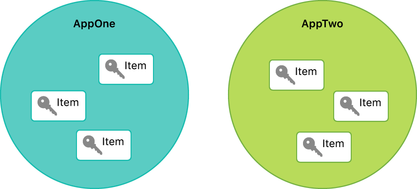
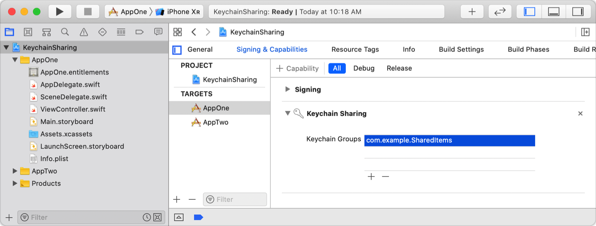
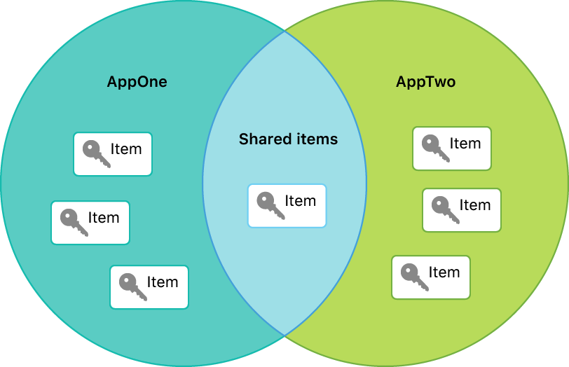
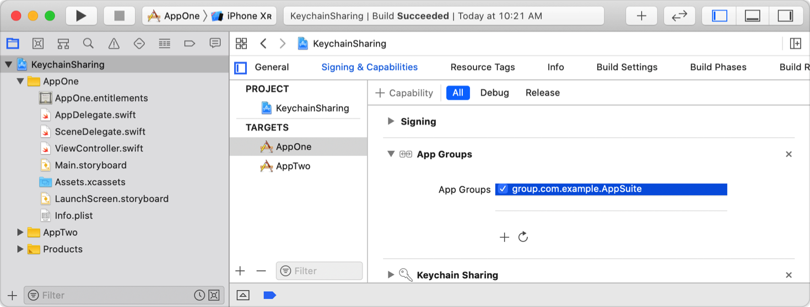
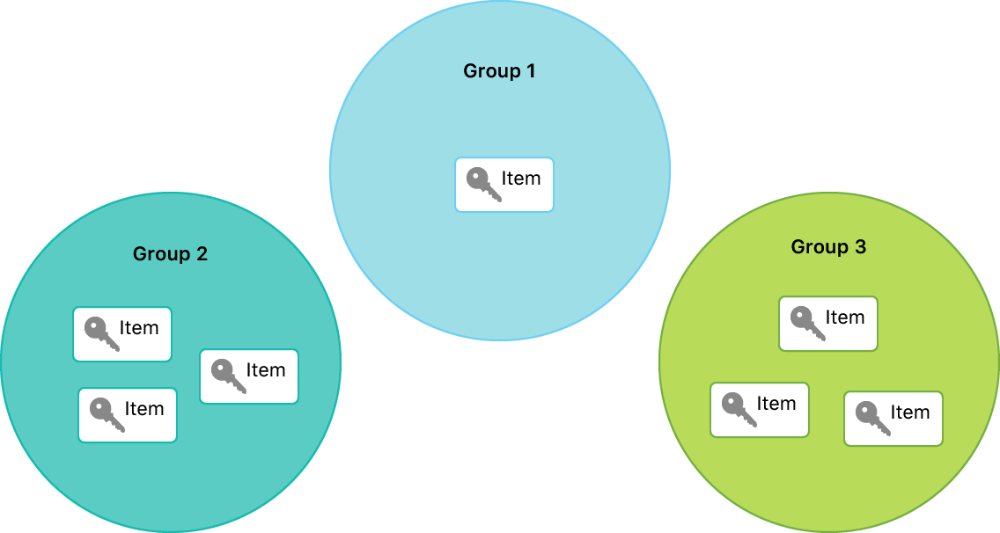

> 导航：[技术](../technologies.md) · [Security](../security.md) · [Keychain services](keychain-services.md) · [钥匙串项目](keychain-items.md)

# 在 App 集合中共享钥匙串项目的访问权限

<sub>文章</sub>

通过将 App 添加至访问群组，让它们能够相互共享钥匙串项目。

## 概述

如果你开发了一组 App，它们全都依赖同一个密码或加密密钥，你可以使用访问群组在该组 App 之间安全地共享该密码或密钥。例如，你可以共享凭据，这样登录你的一个 App 就会自动授予用户访问你所有 App 的权限。这种共享不需要用户的交互或权限，但仅限于由同一个开发团队分发的 App。

访问群组是用特定群组名称字符串标记的 App 的逻辑集合。给定群组中的任何 App 都可以与同一群组中的所有其他 App 共享钥匙串项目。你可以将 App 添加到任意数量的群组中，但该 App 总是至少属于一个只包含它自己的群组。也就是说，无论 App 是否还参与任何其他群组，它始终可以存储和检索私有钥匙串项目。另一方面，钥匙串项目则始终只属于一个群组。

> [!important] 重要
> 这种钥匙串项目共享形式适用于所有 iOS 钥匙串项目，以及在查询时使用了 [kSecUseDataProtectionKeychain](ksecusedataprotectionkeychain.md) 键、设置了项目的 [kSecAttrSynchronizable](ksecattrsynchronizable.md) 属性、或两者兼具的 macOS 钥匙串项目。

### 设置你的 App 的访问群组

你可以通过操作 App 的 entitlement 来控制其所属的群组。具体来说，一个 App 属于系统为每个 App 形成的一个虚拟字符串数组中的所有群组，该数组由以下项目按此顺序拼接而成：

- **钥匙串访问群组 (Keychain access groups)** — 可选的[钥匙串访问群组 Entitlement](../bundleresources/entitlements/keychain-access-groups.md) 包含一个字符串数组，每个字符串命名一个访问群组。
- **应用程序标识符 (Application identifier)** — Xcode 在代码签名期间自动将 `application-identifier` entitlement（在 macOS 中为 `com.apple.application-identifier` entitlement）添加到每个 App，它由团队标识符 (team ID) 加上捆绑包标识符 (bundle ID) 组成。
- **应用程序群组 (Application groups)** — 当你使用 [App Groups Entitlement](../bundleresources/entitlements/com.apple.security.application-groups.md) 将相关 App 收集到一个应用程序群组中时，它们可以共享访问一个群组容器，并能够以特定方式相互发送消息。你可以将 App Group 名称用作钥匙串访问群组名称，而无需将它们添加到钥匙串访问群组 entitlement 中。

当你设置 bundle ID 时，Xcode 会为你处理应用程序标识符。你可以通过在 Xcode 中操控功能来设置其他项。

#### 建立你的 App 的私有访问群组

当你创建一个新的 App 时，你会为其分配一个 bundle ID，通常使用反向 DNS 表示法，例如字符串 `com.example.AppOne`。在对 App 进行代码签名时，Xcode 会自动将 bundle ID 前缀加上你的 team ID——Apple 为每个开发团队分配的唯一字符序列——并将组合后的字符串存储为 app ID。系统通过将 app ID 包含在你的访问群组数组中，将其识别为你的 App 的默认钥匙串访问群组名称：

```console
[$(teamID).com.example.AppOne]
```

由于 app ID 在所有 App 中是唯一的，并且 app ID 存储在受代码签名保护的 entitlement 中，因此没有其他 App 可以使用它，所以没有其他 App 在这个群组中。以此访问群组存储的任何钥匙串项目对 App One 来说都是私有的。类似地，如果你第二个 App 的 bundle ID 是 `com.example.AppTwo`，它会自动属于它自己的群组：

```console
[$(teamID).com.example.AppTwo]
```

因此，默认情况下，每个 App 的钥匙串项目与所有其他 App 保持隔离，尽管你可以使用[钥匙串访问群组 Entitlement](../bundleresources/entitlements/keychain-access-groups.md) 将另一个由相同 Apple Developer 团队签名的 App 添加到该 App 的默认钥匙串访问群组。



#### 将 App 添加到一个或多个钥匙串访问群组

当你希望两个 App 能够共享钥匙串项目时，你可以将两者都添加到同一个钥匙串访问群组。为此，请在 Xcode 中为每个 App 启用钥匙串共享 (Keychain Sharing) 功能，并在每个 App 的钥匙串群组列表中添加一个共同的字符串。通常，你会使用与 bundle ID 相同类型的反向 DNS 命名来命名钥匙串群组，因此你可能会选择 `com.example.SharedItems`：



<sub>截图显示了 Xcode 的“签名和功能”选项卡中的钥匙串共享项目，其中有一个名为 com.example.SharedItems 的钥匙串群组。</sub>

与从 bundle ID 形成 app ID 类似，Xcode 会自动为钥匙串群组添加前缀你的 team ID。这确保了你的群组专属于你的开发团队。当你如上所示为 App One 启用该功能时，其逻辑上的 App 群组列表变为：

```console
[$(teamID).com.example.SharedItems,
 $(teamID).com.example.AppOne]
```

如果你也将相同的钥匙串群组添加到 App Two，其逻辑上的 App 群组列表变为：

```console
[$(teamID).com.example.SharedItems,
 $(teamID).com.example.AppTwo]
```

实际上，这两个 App 获得了一个重叠区域来共享项目。



请注意，由 app ID 表示的独立区域仍然存在，允许每个 App 继续访问其自己的私有项目。但现在两个 App 也都属于共享项目群组，使它们能够共享钥匙串项目。通过这种方式，你可以根据喜好将 App 添加到任意多个不同的群组。

#### 使用 App Group 扩展钥匙串和非钥匙串数据的共享

当你的 App 属于一个 App Group 时，它可以与同一群组中的其他 App 共享某些类型的非钥匙串数据。例如，你可以使用 [init(suiteName:)](<../foundation/userdefaults/init(suitename_).md>) 方法创建一个新的 [UserDefaults](../foundation/userdefaults.md) 实例，该实例在 App Group 中的所有 App 之间共享你设置的偏好设置。与钥匙串访问群组类似，你也可以通过在 Xcode 中启用一个功能来启用 App Group。

从 iOS 8 开始，当 App 属于一个 App Group 时，它也可以使用此机制来共享钥匙串项目。在此示例中，将 App One 添加到 `group.com.example.AppSuite` App Group：



App One 的访问群组列表扩展为包含该 App Group：

```console
[$(teamID).com.example.SharedItems,
 $(teamID).com.example.AppOne,
 group.com.example.AppSuite]
```

这允许它与 App Suite 群组中的任何 App 共享钥匙串项目（区别于它已经在共享项目钥匙串访问群组中与 App 进行的任何共享）。

Xcode 不会给 App Group 添加团队标识符前缀。相反，当尝试将 App Group 添加到 provisioning profile 时，它会防止跨团队重用 App Group 名称。

#### 了解 App Group 与钥匙串访问群组之间的区别

App Group 和钥匙串访问群组并非互斥——你可以在同一个 App 中同时使用两者——但它们在几个重要方面确实存在差异，这些差异可能有助于你决定在特定情况下使用哪一个。

首先，如上所述，使用 App Group 可以启用钥匙串项目之外的其他数据共享。你可能需要这种额外的共享，或者可能已经在为此目的使用 App Group，因此不需要再添加钥匙串访问群组。另一方面，你可能根本不想启用这种额外的共享，而更愿意使用钥匙串访问群组。

其次，顺序很重要。系统将访问群组列表中的第一项视为 App 的默认访问群组。如果添加钥匙串项目时没有另行指定，钥匙串服务将假定使用此访问群组。App Group 永远不能成为默认群组，因为 app ID 始终存在并且出现在列表的更前面。然而，钥匙串访问群组可以成为默认群组，因为它出现在 app ID 之前。具体来说，你在相应功能中指定的第一个钥匙串访问群组（如果有）将成为 App 的默认访问群组。如果你未指定任何钥匙串访问群组，那么 app ID 就是默认群组。

### 设置钥匙串项目的访问群组

与可以属于多个访问群组的 App 不同，钥匙串项目属于单个群组，由 [kSecAttrAccessGroup](ksecattraccessgroup.md) 属性标识。从项目的角度来看，世界是一组不相交的群组，而该项目恰好属于其中一个。



当你使用 [SecItemAdd](<secitemadd(____).md>) 方法创建新项目时，你可以使用 [kSecAttrAccessGroup](ksecattraccessgroup.md) 键在添加属性中指定一个群组。例如，你可以在上面定义的 Shared Items 群组中创建一个新的通用密码项目：

```swift
let accessGroup = "<# Your Team ID #>.com.example.SharedItems"
let attributes = [kSecClass: kSecClassGenericPassword,
                  kSecAttrService: service,
                  kSecAttrAccount: username,
                  kSecAttrAccessGroup: accessGroup,
                  kSecValueData: password] as [String: Any]
let addStatus = SecItemAdd(attributes as CFDictionary, nil)
```

使用你的 App 所属的任何群组。如果你尝试使用你的 App 不属于的访问群组，操作将失败并返回 [errSecMissingEntitlement](errsecmissingentitlement.md) 状态。这包括尝试使用零长度字符串作为 [kSecAttrAccessGroup](ksecattraccessgroup.md) 键的值来“预填”条目，因为空字符串表示一个无效的群组。

如果添加项目时未指定任何访问群组，钥匙串服务将应用你的 App 的默认访问群组，即[设置你的 App 的访问群组](sharing-access-to-keychain-items-among-a-collection-of-apps.md#Set-your-apps-access-groups)中描述的拼接群组列表中的第一个群组。

当你使用 [SecItemCopyMatching](<secitemcopymatching(____).md>) 方法搜索钥匙串项目时，同样可以在搜索查询中指定一个访问群组，以将搜索限制在特定的访问群组：

```swift
let query = [kSecClass: kSecClassGenericPassword,
             kSecAttrService: service,
             kSecAttrAccount: username,
             kSecReturnAttributes: true,
             kSecAttrAccessGroup: accessGroup,
             kSecReturnData: true] as [String: Any]
var item: CFTypeRef?
let readStatus = SecItemCopyMatching(query as CFDictionary, &item)
```

如果你指定了一个你的 App 不属于的群组，则没有项目匹配，查询将返回 [errSecItemNotFound](errsecitemnotfound.md) 状态。如果你在查询中未指定访问群组，搜索将匹配你的 App 的任何群组。
