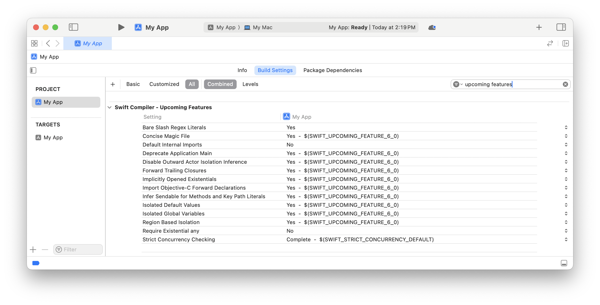
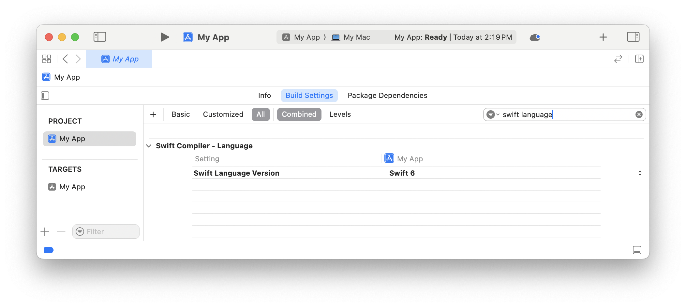

> 导航：[技术](../technologies.md) · [Swift](../swift.md)

# 在 Swift 6 App 中采用严格并发

文章

启用严格并发检查（strict concurrency checking），在编译时发现数据争用（data races）。

## 概述

Swift 6 语言模式中的严格并发检查可帮助你在编译时发现并修复数据争用。

对共享可变状态的重叠访问会产生数据争用的风险。数据争用可能导致 App 崩溃、行为异常或损坏用户数据。由于数据争用取决于并发操作的顺序，它们可能非常难以重现和调试。严格并发检查让你在编译 App 时能够确认其代码不存在数据争用。当你发现数据争用时，可以通过消除重叠访问、共享访问或可变状态来修复它。

有关 Swift 中语言级并发模型的信息，请参阅 [The Swift Programming Language](https://docs.swift.org/swift-book/) 中的[并发](https://docs.swift.org/swift-book/LanguageGuide/Concurrency.html)。

### 决定何时升级到严格检查

Xcode 16 支持新的 Swift 6 语言模式，该模式使用严格并发检查，并且仍然包括 Swift 5、4.2 和 4 语言模式。Swift 6 语言模式是可选的：你的项目继续使用当前的语言模式构建，而新项目默认使用 Swift 5 语言模式。

采用 Swift 6 语言模式可以在编译时捕获并发代码中的错误，从而显著提高 App 质量。如果你正在经历难以重现的崩溃，并希望有条理地消除数据争用的风险，这会特别有用。如果你正在积极整合更多并发以提高响应速度和性能，采用 Swift 6 语言模式可以确保这些更改不会引入新的数据争用风险。

如果你的 App 由多个模块组成，你可以一次迁移一个模块。通常先迁移 App 本身，然后再迁移它依赖的模块会更容易。

如果你维护一个公共 Swift 包，采用 Swift 6 语言模式也有助于那些想要迁移其代码库的用户。你可以在 `SwiftPackageIndex.com` 上关注热门包对 Swift 6 语言的采用情况。

### 将项目升级到 Swift 6

在将项目升级到 Swift 6 语言模式之前，你可以开始使用 Swift 6 的新特性，例如严格并发检查。要启用新的语言特性，请打开你的构建设置，选择 Swift Compiler - Upcoming Features；然后在你想要采用的特性旁边选择 Yes。当你准备升级到 Swift 6 语言版本时，可以通过将 Strict Concurrency Checking 构建设置从 Minimal 更改为 Complete 来提高并发检查的级别。

要将项目升级到 Swift 6 语言模式，请打开你的构建设置，并选择 Swift Compiler - Language > Swift Language Version。

升级到 Swift 6 语言模式会启用 Swift 6 中包含的所有新语言特性，包括严格并发检查。

> [!note] 注意
> 升级后，即将推出的特性列表中仍然包含一些将成为未来 Swift 版本一部分的特性，这些特性在 Swift 6 语言模式中默认是禁用的。

开启严格并发检查后，你可能会看到大量新的编译器错误和警告。然而，修复 App 中某一部分的数据争用通常可以解决多个报告的错误。你不必一次性修复所有报告的数据争用。如果需要，你可以现在修复其中一些，切换回 Swift 5 语言模式或切换回最小并发检查，然后再继续修复其余的数据争用。

有关如何进行迁移的信息，包括与尚未迁移到严格检查的代码进行互操作的技术，请参阅[迁移到 Swift 6](https://swift.org/migration)。

## 另请参阅

### 基础

- [Swift 更新](../updates/swift.md) — 了解 Swift 的重要更改。
