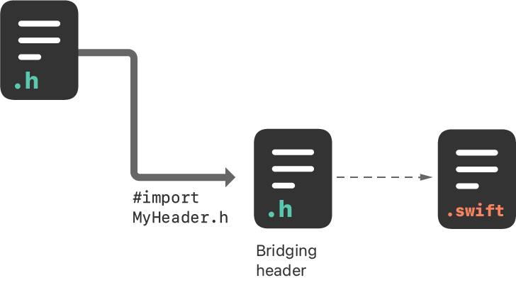
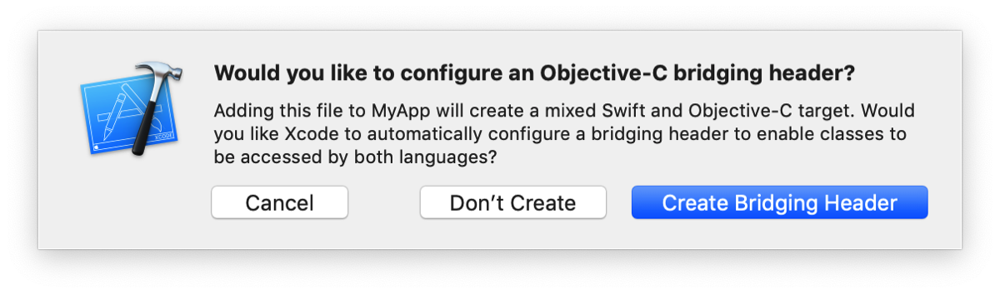

> 导航：[技术](../technologies.md) · [Swift](../swift.md) · [导入的 C 与 Objective-C API](imported-c-and-objective-c-apis.md)

# 将 Objective-C 导入 Swift

文章

在 Swift 中访问来自 Objective-C 代码的类及其他声明。

## 概述

你可以在单个项目里同时使用 Objective-C 和 Swift 文件，无论该项目最初使用的是哪种语言。这使得创建混合语言 App 和框架目标的流程与创建单一语言编写的 App 或框架目标同样直接。

图示：将 Objective-C 声明导入 Swift 代码的步骤。将你的 Objective-C 头文件导入 Objective-C 桥接头文件，即可向所有 Swift 文件暴露这些声明。

在混合语言目标中，从 Swift 代码使用 Objective-C 声明的流程因你是编写 App 还是框架而略有不同。下面分别介绍这两种流程。

### 在 App 目标中导入代码

要在同一 App 目标中将一组 Objective-C 文件导入 Swift 代码，你需要借助一个 Objective-C 桥接头文件将这些文件暴露给 Swift。当你向现有的 Objective-C App 添加 Swift 文件，或向现有的 Swift App 添加 Objective-C 文件时，Xcode 会提示创建该头文件。

如果你接受，Xcode 会在创建文件的同时创建桥接头文件，并使用你的产品模块名后接 `"-Bridging-Header.h"` 来命名。你也可以选择“文件（File）”>“新建（New）”>“文件（File）”>“[_operating system_]”>“源文件（Source）”>“头文件（Header File）”，自行创建桥接头。

编辑桥接头以将 Objective-C 代码暴露给 Swift：

1. 在 Objective-C 桥接头中，导入你想要暴露给 Swift 的每个 Objective-C 头文件。
2. 在“构建设置（Build Settings）”的“Swift 编译器 - 通用（Swift Compiler - General）”中，确保“Objective-C 桥接头（Objective-C Bridging Header）”构建设置具有指向桥接头文件的路径。该路径应相对于你的项目，与 `Info.plist` 路径在“构建设置”中的指定方式类似。大多数情况下，你无需修改此设置。

桥接头中列出的所有公共 Objective-C 头文件都会对 Swift 可见。Objective-C 声明会自动可用，无需任何 import 语句，即可从该目标内的任何 Swift 文件访问。你可以使用与系统类相同的 Swift 语法，从自定义 Objective-C 代码中使用类及其他声明。

### 在框架目标中导入代码

要在与 Swift 代码相同的框架目标中访问 Objective-C 声明，请按如下方式配置伞头文件（umbrella header）：

1. 在“构建设置（Build Settings）”的“打包（Packaging）”中，确保框架目标的“定义模块（Defines Module）”设置为“是（Yes）”。
2. 在伞头文件中，导入你想要暴露给 Swift 的每个 Objective-C 头文件。

Swift 能访问你在伞头文件中公开暴露的每个头文件。该框架中 Objective-C 文件的内容会自动可用，无需任何 import 语句，即可从该框架目标内的任何 Swift 文件访问。你可以使用与系统类相同的 Swift 语法，从 Objective-C 代码中使用类及其他声明。

## 另请参阅

### 同一项目中的 Swift 与 Objective-C

- [将 Swift 导入 Objective-C](importing-swift-into-objective-c.md) — 从 Objective-C 代码库中访问 Swift 类型和声明。
