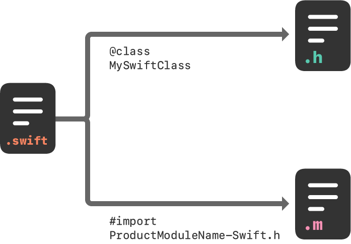

> 导航：[技术](../technologies.md) · [Swift](../swift.md) · [导入的 C 与 Objective-C API](imported-c-and-objective-c-apis.md)

# 将 Swift 导入到 Objective-C

<sub>文章</sub>

在你的 Objective-C 代码库中访问 Swift 类型和声明。

## 概述

你可以通过导入 Xcode 生成的头文件，在项目的 Objective-C 代码中使用 Swift 中声明的类型。这个文件是一个 Objective-C 头文件，声明了你 target 中的 Swift 接口，你可以把它看作是 Swift 代码的总括头文件。你不需要做任何特殊操作来创建这个生成的头文件——只需导入它，即可在 Objective-C 代码中使用其内容。

头文件的名称由你的产品模块名后接 `"-Swift.h"` 生成。默认情况下，此名称与你的产品名相同，其中所有非字母数字字符均替换为下划线（`_`）。如果名称以数字开头，则该首数字会被替换为下划线。



<sub>图示说明将 Swift 声明导入到 Objective-C 代码的步骤。在 Objective-C 头文件中使用前置声明声明 Swift 类，并在 Objective-C .m 文件中使用 #import 语句导入 Xcode 生成的头文件。</sub>

导入 Swift 声明到 Objective-C 代码的流程略有不同，具体取决于你编写的是 App 还是框架。以下将对这两种流程进行说明。

### 在 App target 中导入代码

当构建一个 App target 时，你可以使用以下语法并替换为对应的名称，将 Swift 代码导入到同一 target 中的任何 Objective-C `.m` 文件中：

```occ
#import "ProductModuleName-Swift.h"
```

默认情况下，生成的头文件包含标记了 `public` 或 `open` 修饰符的 Swift 声明的接口。如果你的 App target 有一个 Objective-C bridging header，则生成的头文件还会包含标记了 `internal` 修饰符的接口。标记了 `private` 或 `fileprivate` 修饰符的声明不会出现在生成的头文件中，并且不会暴露给 Objective-C 运行时，除非它们被显式标记为 `@IBAction`、`@IBOutlet` 或 `@objc` 特性（attribute）。在单元测试 target 内部，你可以通过在 product module 导入语句前添加 `@testable`，将导入的内部声明视为公开声明进行访问。

生成的头文件中的 Swift 接口包含了对其中使用的所有 Objective-C 类型的引用，因此请确保首先导入这些类型的 Objective-C 头文件。

构建 App target 时，你可以通过修改 Product Module Name 构建设置来为产品模块提供自定义名称。Xcode 在命名生成的头文件时会使用此名称。

### 在框架 target 中导入代码

要将一组 Swift 文件导入到与 Objective-C 代码位于同一框架 target 中，请将 Xcode 为你的 Swift 代码生成的头文件导入到你想要使用 Swift 代码的任何 Objective-C `.m` 文件中。

因为生成的头文件是框架公共接口的一部分，所以对于框架 target，只有标记了 `public` 或 `open` 修饰符的声明才会出现在生成的头文件中。标记了 `internal` 修饰符并在继承自 Objective-C 类的类中声明的方法和属性，对 Objective-C 运行时是可访问的。但是，它们在编译时不可访问，并且不会出现在框架 target 的生成的头文件中。

在同一框架中将 Swift 代码导入到 Objective-C：

1. 在 Build Settings 的 Packaging 下，确保该框架 target 的 Defines Module 设置为 Yes。
2. 使用以下语法并替换为对应的名称，将该框架 target 中的 Swift 代码导入到同一 target 中的任何 Objective-C `.m` 文件中：

```occ
#import <ProductName/ProductModuleName-Swift.h>
```

### 使用前置声明在 Objective-C 头文件中包含 Swift 类

当 Objective-C 头文件中的声明引用了来自同一 target 的 Swift 类或协议时，导入生成的头文件会产生循环引用。为了避免这种情况，请使用 Swift 类或协议的前置声明来在 Objective-C 接口（interface）中引用它。

```occ
// MyObjcClass.h
@class MySwiftClass;
@protocol MySwiftProtocol;

@interface MyObjcClass : NSObject
- (MySwiftClass *)returnSwiftClassInstance;
- (id <MySwiftProtocol>)returnInstanceAdoptingSwiftProtocol;
// ...
@end
```

Swift 类和协议的前置声明只能用作方法和属性声明的类型。

## 另请参阅

### 同一项目中的 Swift 与 Objective-C

- [将 Objective-C 导入到 Swift](importing-objective-c-into-swift.md) —— 在 Swift 中访问 Objective-C 代码中的类和其他声明。
