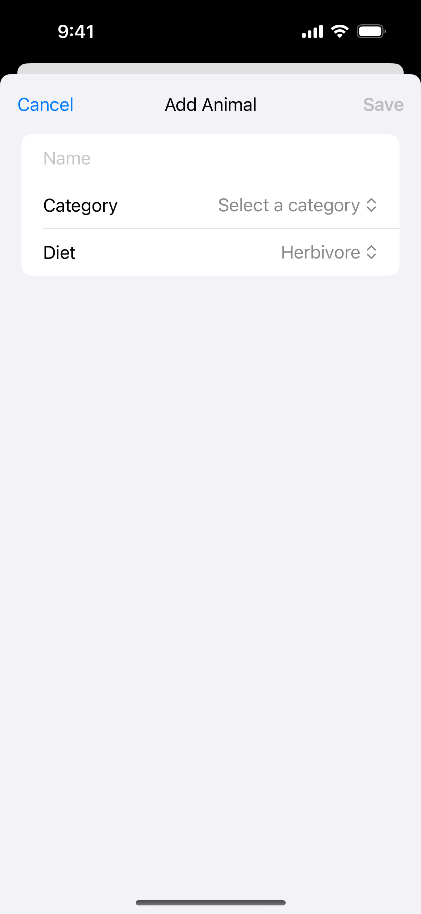
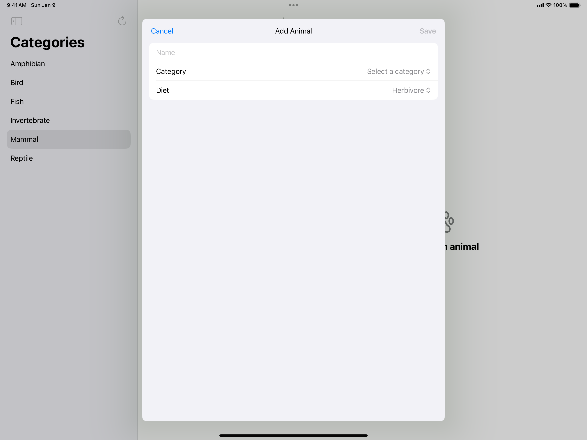
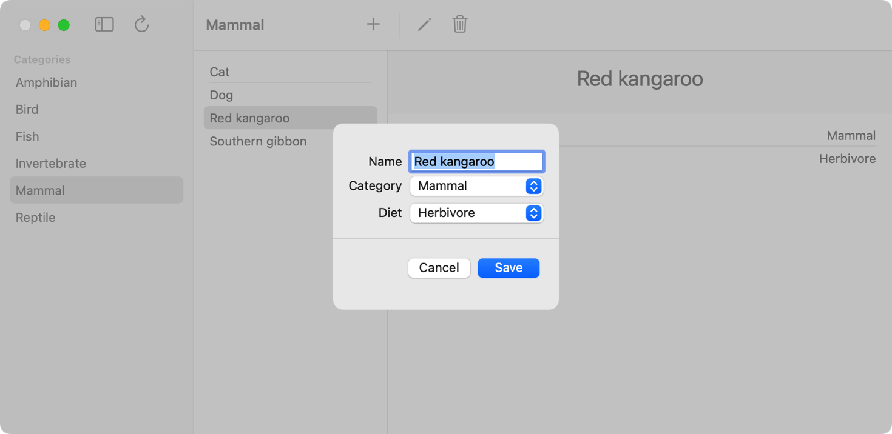
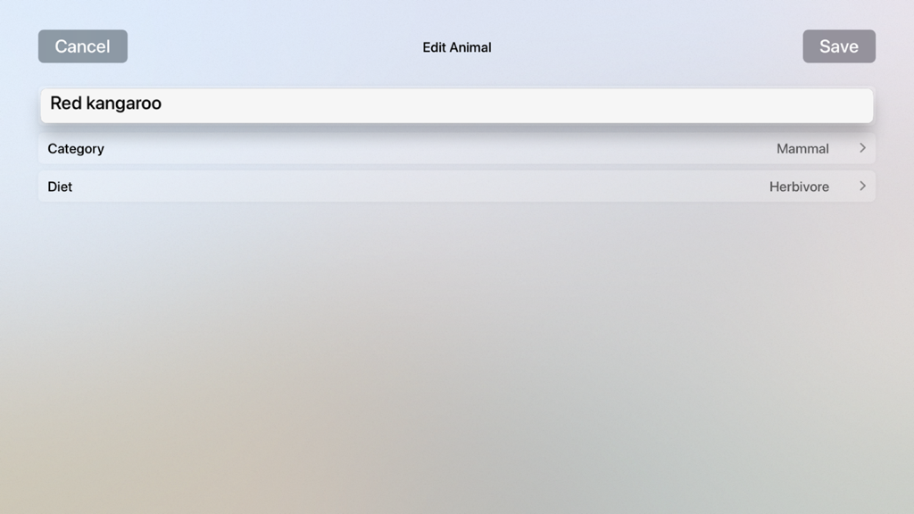

> 导航：[技术](../technologies.md) · [SwiftData](../swiftdata.md)

# 在你的 App 中添加和编辑持久化数据

<sub>示例代码</sub>

创建一个数据输入表单，用于收集和更改 SwiftData 管理的数据。

## 概述

添加和编辑数据是数据驱动型 App 的基础功能，但每个 App 提供这些功能的方式各不相同。本示例展示了一种方法，即使用 SwiftData 的数据输入表单，让用户可以添加、编辑和存储关于动物的数据。

### 定义数据模型

在 SwiftData 能够存储 App 的数据之前，App 必须定义表示数据的数据模型。SwiftData 使用模型类来构建数据模型的模式（schema）。例如，示例 App 存储关于动物的数据，并将这些动物分组到分类中。为了定义此数据模型的模式，示例定义了两个模型类：`Animal` 和 `AnimalCategory`。

`Animal` 模型类存储关于动物的信息，例如其名称和食性。为了持久化 `Animal` 的实例，类定义应用了 [Model()](<model().md>) 宏。这个宏在编译时生成代码，确保类符合 [PersistentModel](persistentmodel.md) 协议，并使 SwiftData 能够将动物数据保存到模型容器（model container）中。

```swift
import SwiftData

@Model
final class Animal {
    var name: String
    var diet: Diet
    var category: AnimalCategory?
    
    init(name: String, diet: Diet) {
        self.name = name
        self.diet = diet
    }
}
```

`AnimalCategory` 模型类存储关于动物分类（例如哺乳动物或爬行动物）的信息。与 `Animal` 一样，`AnimalCategory` 的定义应用了 [Model()](<model().md>) 宏，以确保类符合 [PersistentModel](persistentmodel.md)，并将动物分类数据保存到模型容器中。

```swift
import SwiftData

@Model
final class AnimalCategory {
    @Attribute(.unique) var name: String
    // `.cascade` 告诉 SwiftData，在删除分类时，
    // 同时删除该分类中包含的所有动物。
    @Relationship(deleteRule: .cascade, inverse: \Animal.category)
    var animals = [Animal]()
    
    init(name: String) {
        self.name = name
    }
}
```

模型类还有两个属性（property）：

- **`name`** —— 分类的名称。每个分类名称在所有动物分类中必须是唯一的。为确保唯一性，模型类对该属性应用了 [Attribute(_:originalName:hashModifier:)](<attribute(__originalname_hashmodifier_).md>) 宏，并使用 [unique](schema/attribute/option/unique.md) 选项。此选项确保属性值在所有同类型模型中保持唯一。有关选项的完整列表，请参阅 [Option](schema/attribute/option.md)。
- **`animal`** —— 分类中包含的动物列表。模型类对该属性应用了 [Relationship(_:deleteRule:minimumModelCount:maximumModelCount:originalName:inverse:hashModifier:)](<relationship(__deleterule_minimummodelcount_maximummodelcount_originalname_inverse_hashmodifier_).md>) 宏，以在模型类 `AnimalCategory` 和 `Animal` 之间形成关系。要了解更多关于关系的信息，请参阅[使用枚举和模型类定义数据关系](defining-data-relationships-with-enumerations-and-model-classes.md)。

### 设计数据编辑器

在决定用户如何在你的 App 中添加和编辑数据时，请考虑用户体验。例如，示例 App 使用一个名为 `AnimalEditor` 的自定义数据输入视图，让用户可以添加和编辑关于动物的信息。

**iOS**



<sub>示例 App 在 iOS 上运行的截图，显示动物编辑器。编辑器沿顶部水平显示一个取消按钮，接着是标题“Add Animal”，然后是一个保存按钮。其下方是一个占位符文本为“Name”的名称字段。名称字段下方是类别字段，标签为“Category”，接着是一个标签为“Select a category”的选择器。类别字段下方是食性字段，标签为“Diet”，以及一个标签为“Herbivore”的选择器。</sub>

**iPadOS**



<sub>示例 App 在 iPadOS 上运行的截图，显示动物编辑器，背景为示例 App。编辑器沿顶部水平显示一个取消按钮，接着是标题“Add Animal”，然后是一个保存按钮。其下方是一个占位符文本为“Name”的名称字段。名称字段下方是类别字段，标签为“Category”，接着是一个标签为“Select a category”的选择器。类别字段下方是食性字段，标签为“Diet”，以及一个标签为“Herbivore”的选择器。</sub>

**macOS**



<sub>示例 App 在 macOS 上运行的截图，显示动物编辑器，背景为示例 App 的主窗口。编辑器在一个文本字段旁边显示标签“name”，文本字段中显示文字“Red kangaroo”。名称标签下方是一个显示“category”的标签，接着是一个显示已选项为“mammal”的选择器。类别标签下方是一个显示“Diet”的标签，接着是一个显示已选项为“Herbivore”的选择器。这些字段下方是一条水平线，线下水平并排显示两个按钮：“cancel”和“save”。</sub>

**tvOS**



<sub>示例 App 在 tvOS 上运行的截图，显示动物编辑器。编辑器沿顶部水平显示一个取消按钮，接着是标题“Edit Animal”，然后是一个保存按钮。其下方是一个高亮的文本字段，显示文字“Red kangaroo”。文本字段下方是一个标签为“Category”的选择器，已选项为“Mammal”。类别选择器下方是另一个标签为“Diet”的选择器，已选项为“Herbivore”。</sub>

`AnimalEditor` 的设计允许 App 使用同一个视图来添加新动物和编辑现有动物。为了实现此行为，编辑器将 `animal` 属性声明为可选的 `Animal` 类型。如果 `animal` 为 `nil`，则表示用户正在添加动物；否则，用户正在编辑现有动物。编辑器通过计算属性根据 `animal` 的值来确定编辑器的标题，从而明确了其意图。

```swift
struct AnimalEditor: View {
    let animal: Animal?
    
    private var editorTitle: String {
        animal == nil ? "Add Animal" : "Edit Animal"
    }
    // ...
}
```

为了能够编辑新动物或现有动物的值，编辑器为每个可编辑的值定义了状态变量。这些状态变量存储用户在编辑器中输入的数据，将用户输入的数据与 `animal` 中存储的数据分离开来。这种分离确保了 SwiftData 仅在用户准备好保存更改时才保存这些更改。这也让用户有机会放弃他们在编辑器中可能对数据做出的任何更改。

```swift
@State private var name = ""
@State private var selectedDiet = Animal.Diet.herbivorous
@State private var selectedCategory: AnimalCategory?

var body: some View {
    NavigationStack {
        Form {
            TextField("Name", text: $name)
            
            Picker("Category", selection: $selectedCategory) {
                Text("Select a category").tag(nil as AnimalCategory?)
                ForEach(categories) { category in
                    Text(category.name).tag(category as AnimalCategory?)
                }
            }
            
            Picker("Diet", selection: $selectedDiet) {
                ForEach(Animal.Diet.allCases, id: \.self) { diet in
                    Text(diet.rawValue).tag(diet)
                }
            }
        }
    }
}
```

示例 App 采用此方法是因为它使用了 SwiftData 的自动保存（autosave）功能。自动保存功能会自动保存对模型类实例（例如 `animal`）所做的数据更改，而不是依赖 App 显式调用模型上下文的 [save()](<modelcontext/save().md>) 方法。有关自动保存的更多信息，请参阅 [autosaveEnabled](modelcontext/autosaveenabled.md)。

最后，为了让使用编辑器的人清楚其用途，`AnimalEditor` 使用 `editorTitle` 计算属性将标题显示在工具栏的 [principal](<../swiftui/toolbaritemplacement/principal.md>) 项区域中：

```swift
.toolbar {
    ToolbarItem(placement: .principal) {
        Text(editorTitle)
    }
}
```

### 设置默认值

`AnimalEditor` 视图为其状态变量声明了适用于新动物的默认值，将 `name` 设为空字符串，`selectedDiet` 设为 `herbivorous`，并将 `selectedCategory` 留为 `nil`。但此编辑器也支持编辑现有动物。

如果用户编辑现有动物，编辑器需要显示要编辑的动物的值，而不是新动物的默认值。该视图将要编辑的动物存储在 `animal` 属性中。为了显示该动物的当前值，编辑器应用了 [onAppear(perform:)](<../swiftui/view/onappear(perform_).md>) 修饰符，并将可编辑的值从 `animal` 复制到状态变量中：

```swift
.onAppear {
    if let animal {
        // 编辑传入的动物。
        name = animal.name
        selectedDiet = animal.diet
        selectedCategory = animal.category
    }
}
```

### 保存数据更改

为了允许用户保存在编辑器中做出的更改，编辑器在工具栏中提供了一个“Save”按钮：

```swift
ToolbarItem(placement: .confirmationAction) {
    Button("Save") {
        withAnimation {
            save()
            dismiss()
        }
    }
}
```

当用户点击“Save”按钮时，它会调用编辑器的 `save` 方法。如果用户正在编辑现有动物，`save` 会将值从状态变量复制到 `Animal` 的实例。这会直接更新 SwiftData 管理的数据，并且由于 App 使用了自动保存功能，SwiftData 会自动保存这些更改，而无需调用模型上下文的 [save()](<modelcontext/save().md>) 方法。

```swift
private func save() {
    if let animal {
        // 编辑动物。
        animal.name = name
        animal.diet = selectedDiet
        animal.category = selectedCategory
    } else {
        // 添加动物。
        // ...
    }
}
```

当添加新动物时，`save` 函数会创建一个新的 `Animal` 实例，并使用状态变量中的名称和食性对其进行初始化。然后设置其分类，并通过调用模型上下文的 [insert(_:)](<modelcontext/insert(__).md>) 方法将动物插入到模型上下文中：

```swift
private func save() {
    if let animal {
        // 编辑动物。
        // ...
    } else {
        // 添加动物。
        let newAnimal = Animal(name: name, diet: selectedDiet)
        newAnimal.category = selectedCategory
        modelContext.insert(newAnimal)
    }
}
```

保存数据后，“Save”按钮的操作通过调用 [dismiss](../swiftui/environmentvalues/dismiss.md) 来关闭编辑器。

> [!note] 注意
> `AnimalEditor` 视图通过使用 `@Environment(\.modelContext) private var modelContext` 创建对上下文的引用，从视图的环境中检索模型上下文。有关更多信息，请参阅 [modelContext](../swiftui/environmentvalues/modelcontext.md)。

### 放弃数据更改

为了放弃用户所做的更改，编辑器在工具栏中提供了一个“Cancel”按钮：

```swift
ToolbarItem(placement: .cancellationAction) {
    Button("Cancel", role: .cancel) {
        dismiss()
    }
}
```

当用户点击“Cancel”按钮时，编辑器通过在按钮的操作中调用 [dismiss](../swiftui/environmentvalues/dismiss.md) 来放弃对数据所做的任何更改。这会关闭编辑器而不保存更改。

## 另请参阅

### 基础

- [在 App 启动之间保留 App 的模型数据](preserving-your-apps-model-data-across-launches.md) —— 使用框架的宏向 SwiftData 描述你的模型类，并存储这些模型的实例，使其在 App 运行期之外仍然存在。
- [为 Core Data App 采用 SwiftData](../coredata/adopting-swiftdata-for-a-core-data-app.md) —— 使用 Swift 原生持久化框架在 App 中直观地持久化数据。_(beta)_
- [SwiftData 更新](../updates/swiftdata.md) —— 了解 SwiftData 的重要更改。
- [在 SwiftData 中采用继承](adopting-inheritance-in-swiftdata.md) —— 使用类继承为你的模型增加灵活性。

## 下载

- [SwiftDataAnimals.zip](https://docs-assets.developer.apple.com/published/f84bac78ac34/SwiftDataAnimals.zip)
