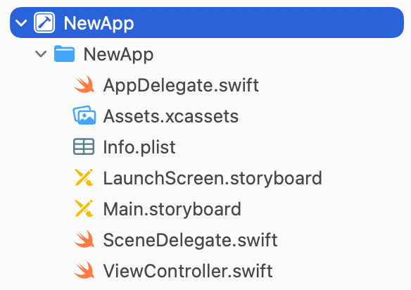
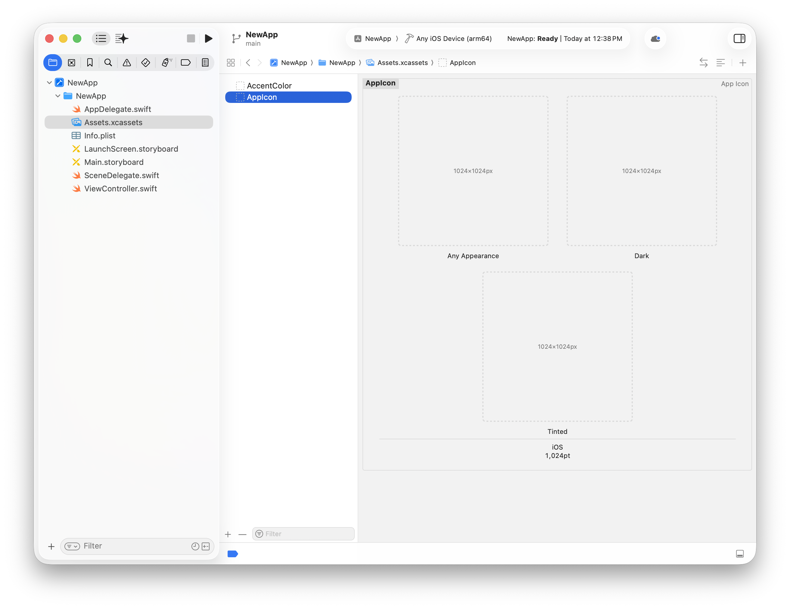
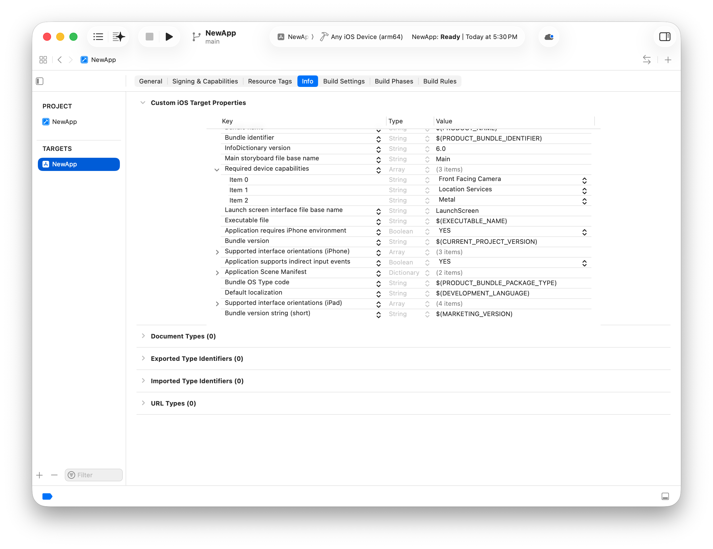

> 导航：[技术](../technologies.md) · [UIKit](../uikit.md)

# 关于使用 UIKit 进行 App 开发

文章

了解 UIKit 和 Xcode 为你的 iOS 和 tvOS App 提供的基本支持。

## 概述

UIKit 框架提供了为 iOS 和 tvOS 构建 App 所需的核心对象。你使用这些对象在屏幕上显示内容、与内容交互，并管理与系统的交互。App 的基本行为依赖 UIKit，而 UIKit 提供了许多方式，让你可以自定这些行为来满足自己的特定需求。

> [!important] 重要
> 开发 iOS 或 tvOS App 时，先在 Xcode（Apple 的集成开发环境）中创建一个项目。如果你没有 Xcode，可以从 App Store 下载，也可以从 [developer.apple.com/downloads](https://developer.apple.com/downloads) 下载最新版本。

Xcode 为你创建的每个 App 都提供模板项目作为起点。例如，下图展示了使用 Xcode 中的 iOS App 模板创建的 App 的结构。模板项目提供了一个最小化的用户界面，因此你可以立即构建并运行项目，在设备或模拟器上查看结果。

Xcode 中项目导航器的局部屏幕快照，展示了一个新建单视图 App 的模板。该 App 包含 App 委托（app delegate）、场景委托（scene delegate）和视图控制器（view controller）的源文件，还包含 storyboard、资源目录（asset catalog）和 Info.plist 文件。

构建 App 时，Xcode 会编译你的源文件，并为项目创建一个 App 捆绑包（app bundle）。App 捆绑包是一个结构化的目录，包含与 App 相关联的代码和资源。资源包括支持你的代码的图像资源、storyboard 文件、字符串文件和 App 元数据。

### 添加必需的资源

每个 UIKit App 都必须具备以下资源：

- App 图标
- 启动屏幕 storyboard

系统会在主屏幕、Settings 中以及任何需要把你的 App 与其他 App 区分开的地方显示你的 App 图标。由于图标可能以深色或浅色外观显示，用户也可能选择着色显示选项，因此你要在 Xcode 项目的 AppIcon 图像资源中提供 App 图标的多个版本。创建一个有辨识度的 App 图标，帮助用户在主屏幕上快速识别你的 App。测试不同的外观和显示选项，以确定是否需要调整图标的细节。更多信息参见[使用 Icon Composer 创建你的 App 图标](../xcode/creating-your-app-icon-using-icon-composer.md)和[通过素材目录配置 App 图标](../xcode/configuring-your-app-icon.md)。

`LaunchScreen.storyboard` 文件包含你的 App 的初始界面，它可以是启动画面（splash screen），也可以是实际界面的简化版本。当用户轻点你的 App 图标时，系统会立即显示你的启动屏幕（launch screen），让用户知道你的 App 正在启动。在 App 自行初始化期间，启动屏幕还能为它提供遮盖。当你的 App 准备就绪时，系统会隐藏启动屏幕，呈现出你的 App 的实际界面。更多信息参见[指定你的 App 的启动画面](../xcode/specifying-your-apps-launch-screen.md)。

### 更新必需的 App 元数据

系统会从信息属性列表（information property list）中获取有关你的 App 配置和能力的信息。Xcode 为每个新项目模板都提供了这个列表的预配置版本，你可以根据 App 的需要修改它。例如，如果你的 App 依赖特定硬件，或使用特定系统框架，你可以将与这些功能相关的信息添加到列表中。

你可以对信息属性列表做的一项常见修改，是声明你的 App 的硬件和软件要求。系统依据这些要求得知你的 App 运行所需的条件。例如，导航类 App 可能要求设备具备 GPS 硬件，才能提供逐向导航。App Store 会阻止用户在与你的 App 要求不符的设备上安装你的 App。

Xcode 中 Info 标签页的屏幕快照，显示了自定的 iOS target 属性。设备能力部分包含诸如 App 是否需要相机、定位服务或某项特定技术等信息。

关于可包含在信息属性列表中的键，参见[信息属性列表](../bundleresources/information-property-list.md)。

### 查看 UIKit App 的代码结构

UIKit 提供了你的 App 的许多核心对象，其中包括与系统交互的对象、运行 App 主事件循环的对象，以及在屏幕上显示内容的对象。这些对象中的大多数你都可以直接使用，或只需稍作修改。了解哪些对象需要修改、何时修改，对实现你的 App 至关重要。

你的 App 使用 [UIApplication](uiapplication.md) 和 [UIApplicationDelegate](uiapplicationdelegate.md) 的子类来与应用级服务和信息交互。你需要配置并自定一个或多个[场景](scenes.md)（scene）来在屏幕上呈现你的 App。使用多个场景可以表示你的 App 的多个实例，或处理在外部非交互式显示器上显示你的 App 的情况。

UIKit App 的结构基于模型-视图-控制器（Model-View-Controller，MVC）设计模式，你创建的对象各自承担特定的用途。模型对象管理 App 的数据和业务逻辑。视图对象提供数据的可视化呈现。控制器对象充当模型对象与视图对象之间的桥梁，在合适的时机在两者之间传递数据。

### 用 UIKit 对象构建并组织你的 App

UIKit 和 Foundation 框架提供了定义你的 App 的模型对象时用到的许多基本类型。UIKit 提供 [UIDocument](uidocument.md) 对象，用于整理那些归属于基于磁盘的文件的数据结构。Foundation 框架定义了表示字符串、数字、数组以及其他数据类型的基本对象。[Swift 标准库](../swift/swift-standard-library.md)提供了与 Foundation 框架中可用的许多相同类型。

UIKit 提供控制器对象，帮助你组织视图并在视图之间切换。[UIViewController](uiviewcontroller.md) 是基本的控制器对象，你可以派生它的子类来管理和显示视图。使用 [UINavigationController](uinavigationcontroller.md)、[UISplitViewController](uisplitviewcontroller.md) 和 [UITabBarController](uitabbarcontroller.md) 等控制器实现常见的用户界面设计。更多信息参见[视图控制器](view-controllers.md)。

使用 [UIView](uiview.md) 构建视图，它会在屏幕上显示你的内容。使用 [UIStackView](uistackview.md) 布置你的视图，或者使用 Auto Layout 实现更复杂的布局。利用[视图布局](view-layout.md)中的详细内容，让你的 App 能够响应尺寸变化。使用 [UIScrollView](uiscrollview.md)、[UITableView](uitableview.md) 和 [UICollectionView](uicollectionview.md) 等对象来高效布置多个视图，或者显示单屏无法容纳的大量数据对应的视图。

使用 [UIControl](uicontrol.md) 对象（例如 [UIButton](uibutton.md)、[UISlider](uislider.md) 和 [UISegmentedControl](uisegmentedcontrol.md)）管理并响应交互。使用 [UICalendarView](uicalendarview.md)、[UIImageView](uiimageview.md) 和 [UIPickerView](uipickerview.md) 等视图来显示特定类型的数据并与之交互。借助 [UIGestureRecognizer](uigesturerecognizer.md) 及相关子类，让你的视图响应长按、平移、轻扫、捏合等各种手势。

使用 [UILabel](uilabel.md)、[UITextField](uitextfield.md) 和 [UITextView](uitextview.md) 显示文本并与之交互。更多信息参见[视图与控制](views-and-controls.md)。

## 另请参阅

### 基础

- [采用 Liquid Glass](../technologyoverviews/adopting-liquid-glass.md) — 了解如何把这种新材质引入你的 App。
- [UIKit 更新](../updates/uikit.md) — 了解 UIKit 的重要变更。
- [保护用户隐私](protecting-the-user-s-privacy.md) — 保护个人数据的安全，并尊重用户对数据使用方式的偏好。
