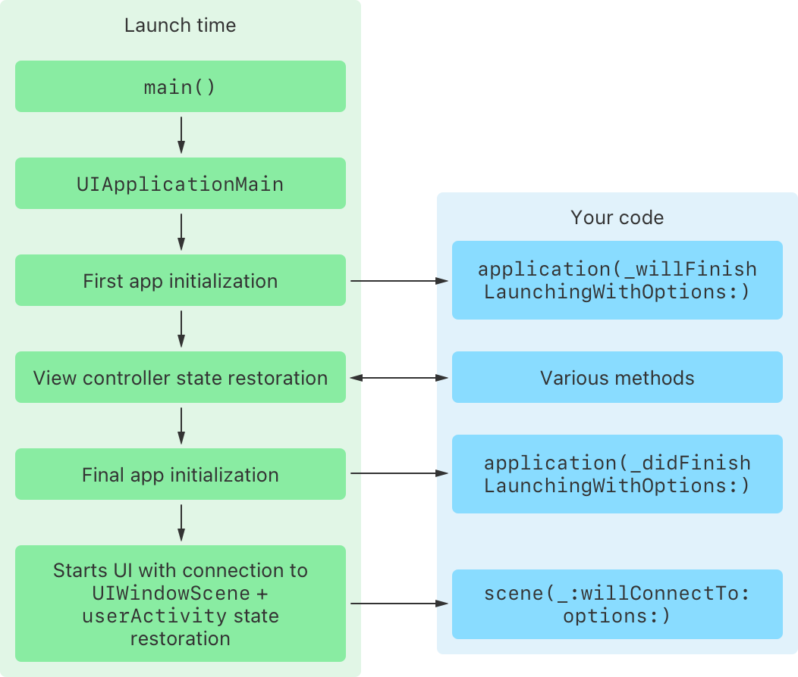

> 导航：[技术](../technologies.md) · [UIKit](../uikit.md) · [App 与环境](app-and-environment.md) · [响应 App 的启动](responding-to-the-launch-of-your-app.md)

# 关于 App 启动序列

文章

了解系统在 App 启动时执行你的代码的顺序。

## 概述

App 启动涉及一系列复杂的步骤，其中大部分由系统自动处理。在启动序列期间，UIKit 会调用你的 App 委托（app delegate）和场景委托（scene delegate）中的方法，以便你为 App 的用户交互做好准备，并执行任何特定于你 App 需求的任务。下图展示了启动序列的各个步骤，从用户或系统启动 App 到序列完成：

一张描绘 App 启动序列的示意图。左侧是一个标题为“启动时间”的框，包含启动序列每个步骤的标签，步骤间有向下的箭头表示流程方向。从上到下，标签依次为：main()、UIApplicationMain、First app initialization、View controller state restoration、Final app initialization、Starts UI with connection to UIWindowScene + userActivity state restoration。右侧是一个标题为“你的代码”的框，包含四个标签。从上到下，标签依次为：application:willFinishLaunchingWithOptions:、Various methods、application:didFinishLaunchingWithOptions:、scene:willConnectTo:options:。在“启动时间”框中的 First app initialization 标签和“你的代码”框中的 application:willFinishLaunchingWithOptions: 标签之间有一个向右的箭头。在“启动时间”框中的 View controller state restoration 标签和“你的代码”框中的 Various methods 标签之间有一个双向箭头。在“启动时间”框中的 Final app initialization 标签和“你的代码”框中的 application:willFinishLaunchingWithOptions: 标签之间有一个向右的箭头。并且有一个从“启动时间”框中的 Starts UI with connection to UIWindowScene + userActivity state restoration 标签指向“你的代码”框中的 scene:willConnectTo:options: 标签的箭头。

1. 系统执行 `main()` 函数——在 Objective-C 项目中由 Xcode 提供，或在 Swift 项目中使用 `@main` 时可用。
2. `main()` 函数调用 [UIApplicationMain](<uiapplicationmain(________)-1yub7.md>)，它会创建 [UIApplication](uiapplication.md) 和你的 App 委托（app delegate）的实例。
3. UIKit 调用你的 App 委托中的 [- application:willFinishLaunchingWithOptions:](<uiapplicationdelegate/application(__willfinishlaunchingwithoptions_).md>) 方法。
4. UIKit 执行视图控制器状态恢复（view controller state restoration），这会调用你的 App 委托和视图控制器（view controller）中的额外方法。更多信息，请参阅[关于 UI 恢复过程](about-the-ui-restoration-process.md)。
5. UIKit 调用你的 App 委托的 [- application:didFinishLaunchingWithOptions:](<uiapplicationdelegate/application(__didfinishlaunchingwithoptions_).md>) 方法。
6. App 启动完成后，UIKit 准备一个场景（scene）以连接到你的 App，然后调用 [- scene:willConnectToSession:options:](<uiscenedelegate/scene(__willconnectto_options_).md>)。UIKit 可能会将一个用户活动（user activity）传递给此方法，供你在场景连接期间处理。

启动序列完成后，系统显示你的 App 用户界面，并在生命周期事件发生时通知你的 App 或场景委托（scene delegate）。

取决于设备条件，系统可能会 _prewarm_（预先启动进程）你的 App——启动未运行的 App 进程以减少用户等待 App 变为可用的时间。Prewarming 会创建你的进程并加载你的 App 所链接的库，然后挂起你的进程而不允许任何 App 代码运行。

系统 prewarms 你的 App 进程后，该新进程会保持挂起状态，直到系统唤醒你的 App 以继续执行标准启动序列，或者系统结束 prewarmed 进程以回收资源。系统可以在设备重启后，以及在系统条件允许时定期 prewarm 你的 App。

### 优化 App 启动性能

为了实现更快的启动时间，尽量减少在调用 [UIApplicationMain](<uiapplicationmain(________)-1yub7.md>) 之前你的 App 执行的工作量。在系统于 `main()` 之前自动调用的方法中（例如 [load()](<../objectivec/nsobject-swift.class/load().md>)）运行开销大或耗时的代码，可能会延长你的 App 启动时间。

考虑将复杂的初始化任务推迟到启动序列的后续阶段。对于 UI 层面的任务——例如配置你的界面或响应用户活动——将工作推迟到场景委托（scene delegate）的 [- scene:willConnectToSession:options:](<uiscenedelegate/scene(__willconnectto_options_).md>)、[- sceneWillEnterForeground:](<uiscenedelegate/scenewillenterforeground(__).md>) 或 [- sceneDidBecomeActive:](<uiscenedelegate/scenedidbecomeactive(__).md>) 方法中。对于不特定于某个场景的任务，例如设置数据库层或配置 App 范围的服务，使用你的 App 委托的 [- application:willFinishLaunchingWithOptions:](<uiapplicationdelegate/application(__willfinishlaunchingwithoptions_).md>) 或 [- application:didFinishLaunchingWithOptions:](<uiapplicationdelegate/application(__didfinishlaunchingwithoptions_).md>) 方法。这种方法能提升启动性能，并确保初始化发生在你的 App 能完全访问系统服务时。

使用 [MetricKit](../metrickit.md) 来精确测量用户驱动的启动和恢复时间，并识别优化机会。

## 另请参阅

### 启动时间

- [为你的 App 执行一次性设置](performing-one-time-setup-for-your-app.md) —— 确保你的 App 环境配置正确。
- [在启动之间保留 App 的 UI](preserving-your-app-s-ui-across-launches.md) —— 在系统终止你的 App 后将其恢复到先前状态。
