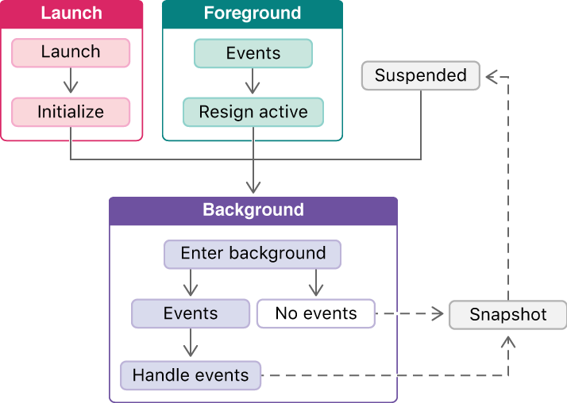
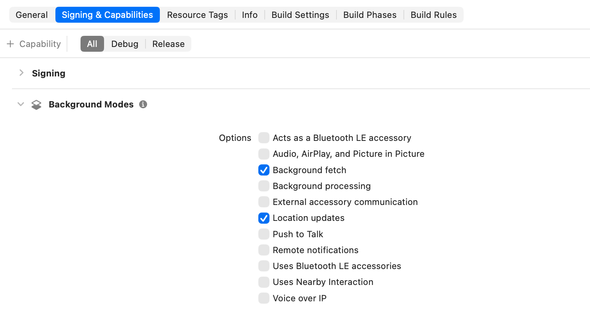

> 导航：[技术](../technologies.md) · [UIKit](../uikit.md) · [App 与环境](app-and-environment.md) · [场景](scenes.md) · [准备在后台运行 UI](preparing-your-ui-to-run-in-the-background.md)

# 关于后台运行序列

文章

了解你的 App 移到后台时，你的自定代码的执行顺序。

## 概述

App 可能从若干个不同的起点进入后台。系统事件可能使已挂起的 App 回到后台，也可能使未运行的 App 直接在后台启动。当另一个 App 启动或用户回到主屏幕时，前台 App 会过渡到后台。

App 可以在后台启动，也可以从前台过渡到后台。当 App 在后台处理完事件后，系统会先对 App 的 UI 拍摄快照，再把它移到挂起状态。

### 处理后台事件

对于支持 Background Modes 能力之一的 App，系统会在后台启动或恢复该 App，以处理与这些能力相关联的事件。例如，系统可能会启动或恢复 App，以响应位置更新或执行后台获取（background fetch）。

如果事件到达时你的 App 尚未运行，系统会启动该 App 并把它直接移到后台，遵循以下序列：

1. 系统启动 App，并遵循[关于 App 启动序列](about-the-app-launch-sequence.md)中描述的初始化序列。
2. UIKit 调用 App 委托（app delegate）的 [- applicationDidEnterBackground:](<uiapplicationdelegate/applicationdidenterbackground(__).md>) 方法。
3. UIKit 传递导致这次启动的事件。
4. 拍摄 App 的快照。
5. App 可能再次被挂起。

如果事件到达时你的 App 还在内存中且处于挂起状态，系统会在后台恢复该 App，遵循以下序列：

1. 系统恢复该 App。
2. UIKit 调用 App 委托的 [- applicationDidEnterBackground:](<uiapplicationdelegate/applicationdidenterbackground(__).md>) 方法。
3. UIKit 传递导致这次启动的事件。
4. 拍摄 App 的快照。
5. App 可能再次被挂起。

### 从前台过渡

当另一个 App 启动或用户回到主屏幕时，前台 App 会移到后台，遵循以下序列：

1. 用户退出正在运行的 App。
2. UIKit 调用 App 委托的 [- applicationWillResignActive:](<uiapplicationdelegate/applicationwillresignactive(__).md>) 方法。
3. UIKit 调用 App 委托的 [- applicationDidEnterBackground:](<uiapplicationdelegate/applicationdidenterbackground(__).md>) 方法。
4. 拍摄 App 的快照。
5. App 可能再次被挂起。

## 另请参阅

### 后台运行

- [使用后台任务更新你的 App](using-background-tasks-to-update-your-app.md) — 配置你的 App 在后台执行任务，高效利用处理时间和电量。
- [延长你的 App 的后台运行时间](extending-your-app-s-background-execution-time.md) — 确保关键任务能在你的 App 移到后台时完成。
