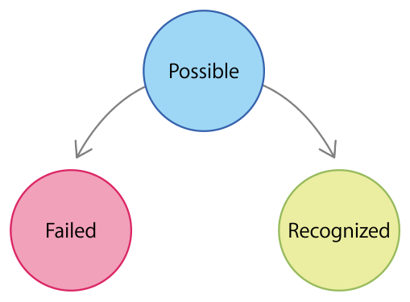
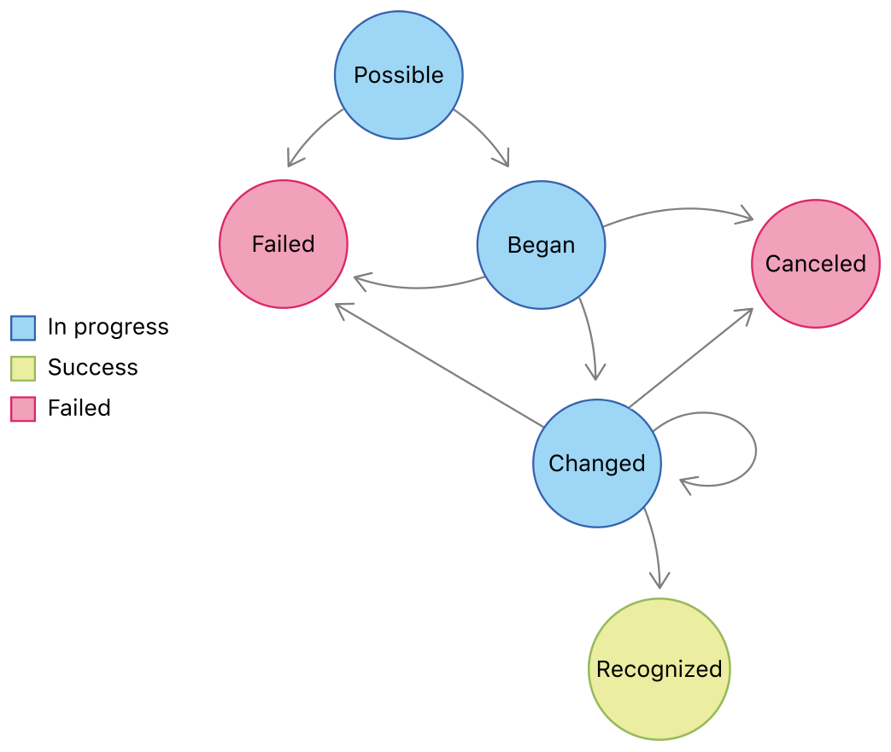

> 导航：[技术](../technologies.md) · [UIKit](../uikit.md) · [触摸、按压与手势](touches-presses-and-gestures.md) · [实现自定义手势识别器](implementing-a-custom-gesture-recognizer.md)

# 关于手势识别器状态机

文章

了解手势识别器底层状态机（state machine）的状态和过渡（transition）。

## 概述

手势识别器由状态机驱动，UIKit 使用该状态机确保事件得到正确处理。状态机决定了以下几种重要行为：

- 连续手势识别器（continuous gesture recognizer）是否允许进入 [UIGestureRecognizerStateBegan](uigesturerecognizer/state-swift.enum/began.md) 状态
- 离散手势识别器（discrete gesture recognizer）是否允许进入 [UIGestureRecognizerStateEnded](uigesturerecognizer/state-swift.enum/ended.md) 状态
- 何时调用所附加的动作处理器

在实现自定义手势识别器时，你必须适时更新其状态机。手势识别器始终从 [UIGestureRecognizerStatePossible](uigesturerecognizer/state-swift.enum/possible.md) 状态开始，这表示它已准备好开始处理事件。从该状态起，离散和连续手势识别器会遵循不同的路径，直到它们到达 [UIGestureRecognizerStateEnded](uigesturerecognizer/state-swift.enum/ended.md)、[UIGestureRecognizerStateFailed](uigesturerecognizer/state-swift.enum/failed.md) 或 [UIGestureRecognizerStateCancelled](uigesturerecognizer/state-swift.enum/cancelled.md) 状态。手势识别器会保持在这些最终状态之一，直到当前事件序列结束，此时 UIKit 会重置手势识别器并将其恢复到 [UIGestureRecognizerStatePossible](uigesturerecognizer/state-swift.enum/possible.md) 状态。

### 管理离散手势识别器的状态过渡

在实现离散手势识别器时，你将 [state](uigesturerecognizer/state-swift.property.md) 属性更改为两个可能的值之一：[UIGestureRecognizerStateEnded](uigesturerecognizer/state-swift.enum/ended.md) 或 [UIGestureRecognizerStateFailed](uigesturerecognizer/state-swift.enum/failed.md)。下图展示了这些过渡的状态图。当传入事件成功匹配你的手势时，将状态更改为 [UIGestureRecognizerStateEnded](uigesturerecognizer/state-swift.enum/ended.md)。当事件与你预期的手势不匹配时，一旦检测到失败，就立即将状态更改为 [UIGestureRecognizerStateFailed](uigesturerecognizer/state-swift.enum/failed.md)。

当你的手势识别器过渡到 [UIGestureRecognizerStateEnded](uigesturerecognizer/state-swift.enum/ended.md) 状态时，UIKit 会调用任何关联目标对象的动作方法。当手势识别器过渡到 [UIGestureRecognizerStateFailed](uigesturerecognizer/state-swift.enum/failed.md) 状态时，UIKit 不会调用任何动作方法。

有关如何实现离散手势识别器的示例，请参阅[实现离散手势识别器](implementing-a-discrete-gesture-recognizer.md)。

### 管理连续手势识别器的状态过渡

下图展示了连续手势识别器的状态图。你进行的状态过渡可以分解为三个通用阶段：

1. 初始事件序列将手势识别器移动到 [UIGestureRecognizerStateBegan](uigesturerecognizer/state-swift.enum/began.md) 或 [UIGestureRecognizerStateFailed](uigesturerecognizer/state-swift.enum/failed.md) 状态。
2. 后续事件将手势识别器移动到 [UIGestureRecognizerStateChanged](uigesturerecognizer/state-swift.enum/changed.md) 或 [UIGestureRecognizerStateCancelled](uigesturerecognizer/state-swift.enum/cancelled.md) 状态。
3. 最终事件将手势识别器移动到 [UIGestureRecognizerStateEnded](uigesturerecognizer/state-swift.enum/ended.md) 状态。

当你的手势识别器处于 [UIGestureRecognizerStatePossible](uigesturerecognizer/state-swift.enum/possible.md) 状态时，如果初始事件序列与你的手势不匹配，请立即将你的手势识别器移动到 [UIGestureRecognizerStateFailed](uigesturerecognizer/state-swift.enum/failed.md) 状态。UIKit 通常一次只允许一个手势识别器通知其客户端。将你的自定义手势识别器移动到失败状态，可以让其他手势识别器有机会处理它们的手势。

如果初始事件序列匹配你的手势，请将你的手势识别器移动到 [UIGestureRecognizerStateBegan](uigesturerecognizer/state-swift.enum/began.md) 状态。对于任何后续事件，重复将你的手势识别器移动到 [UIGestureRecognizerStateChanged](uigesturerecognizer/state-swift.enum/changed.md) 状态，以指示事件信息已更改。（对于每个新事件，务必将手势识别器的 [state](uigesturerecognizer/state-swift.property.md) 属性设置为 [UIGestureRecognizerStateChanged](uigesturerecognizer/state-swift.enum/changed.md)，即使该属性已经设置为该值。设置该属性会触发对关联动作方法的调用）。当某个事件指示你的手势成功完成时，将状态更改为 [UIGestureRecognizerStateEnded](uigesturerecognizer/state-swift.enum/ended.md)。但是，如果某个事件指示你的手势未成功完成，则将状态更改为 [UIGestureRecognizerStateCancelled](uigesturerecognizer/state-swift.enum/cancelled.md)。

当你的手势识别器过渡到 [UIGestureRecognizerStateBegan](uigesturerecognizer/state-swift.enum/began.md)、[UIGestureRecognizerStateChanged](uigesturerecognizer/state-swift.enum/changed.md) 或 [UIGestureRecognizerStateEnded](uigesturerecognizer/state-swift.enum/ended.md) 状态时，UIKit 会调用任何关联目标的动作方法。当你的手势识别器过渡到其他状态时，UIKit 不会调用任何动作方法。

有关如何实现连续手势识别器的示例，请参阅[实现连续手势识别器](implementing-a-continuous-gesture-recognizer.md)。

### 处理取消

手势的取消会在当前事件序列被系统事件（例如来电）中断时自动发生。你也可以根据事件信息或 App 中的条件，以编程方式取消手势。取消可以防止手势识别器执行用户未预期的任务。

当系统取消手势时，UIKit 会调用手势识别器的 [- touchesCancelled:withEvent:](<uiresponder/touchescancelled(__with_).md>) 或 [- pressesCancelled:withEvent:](<uigesturerecognizer/pressescancelled(__with_).md>) 方法。发生这种情况时，请立即将你的手势识别器移动到 [UIGestureRecognizerStateCancelled](uigesturerecognizer/state-swift.enum/cancelled.md) 状态。当你将手势识别器移动到 [UIGestureRecognizerStateCancelled](uigesturerecognizer/state-swift.enum/cancelled.md) 状态时，UIKit 会在重置手势识别器之前最后一次调用其动作方法。

### 重置手势识别器状态机

实现 [- reset](<uigesturerecognizer/reset().md>) 方法，并使用它来将你的手势识别器恢复到其初始配置。例如，使用此方法将手势识别器的自定义属性恢复到其起始值。在传送新事件序列的事件之前，UIKit 会调用每个收到触摸或处于 [UIGestureRecognizerStateFailed](uigesturerecognizer/state-swift.enum/failed.md)、[UIGestureRecognizerStateCancelled](uigesturerecognizer/state-swift.enum/cancelled.md) 或 [UIGestureRecognizerStateEnded](uigesturerecognizer/state-swift.enum/ended.md) 状态的手势识别器的 [- reset](<uigesturerecognizer/reset().md>) 方法。除了调用 [- reset](<uigesturerecognizer/reset().md>) 方法外，UIKit 还会自动将每个手势识别器的 [state](uigesturerecognizer/state-swift.property.md) 属性更改回 [UIGestureRecognizerStatePossible](uigesturerecognizer/state-swift.enum/possible.md)，以便它能够响应新的事件序列。

## 另请参阅

### 创建自定义手势识别器

- [实现离散手势识别器](implementing-a-discrete-gesture-recognizer.md)——如果你的手势涉及特定的事件模式，请考虑为其实现一个离散手势识别器。
- [实现连续手势识别器](implementing-a-continuous-gesture-recognizer.md)——对于不容易匹配特定模式的手势，或者当你希望使用手势识别器收集触摸输入时，请创建一个连续手势识别器。
