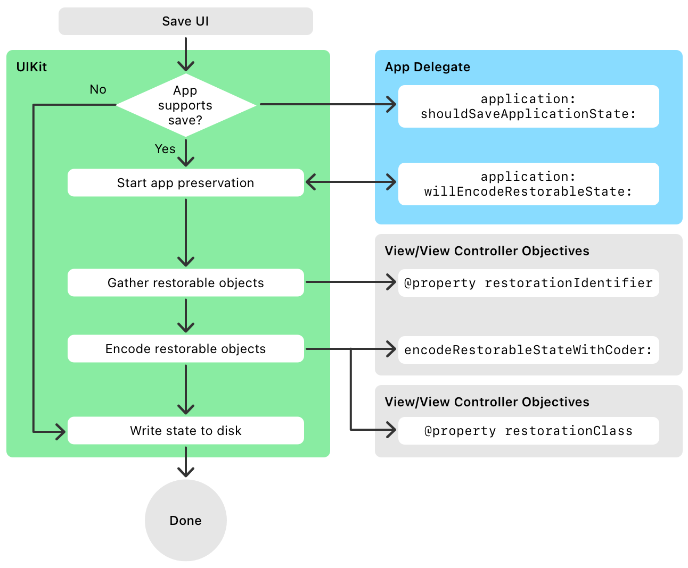

> 导航：[技术](../technologies.md) · [UIKit](../uikit.md) · [视图控制器](view-controllers.md) · [在多次启动间保留你的 App 的 UI](preserving-your-app-s-ui-across-launches.md)

# 关于 UI 保留过程

文章

了解如何自定 UIKit 的状态保留（state preservation）过程。

## 概述

下图展示了界面保留过程中发生的调用序列。UIKit 先询问你的 App 委托是否要保留你的 App 状态，然后对当前位于你的 App 视图控制器层级结构中的对象进行编码。只有拥有有效 [restorationIdentifier](uiviewcontroller/restorationidentifier.md) 的视图控制器才会被保留。

保留过程会遍历你的视图控制器层级结构，并递归地对找到的对象进行编码。该过程从你的 App 各个窗口的根视图控制器开始，由它们把自己的数据写入提供的归档（archive）。如果根视图控制器的数据包含对其他视图控制器的引用，UIKit 会要求每个新的视图控制器把它的数据编码到归档的一个单独部分。这些子视图控制器随后可以继续对它们自己的子视图控制器进行编码，依此类推。

UIKit 的视图控制器会在适当的情况下自动对子视图控制器进行编码。如果你定义了自定容器视图控制器（container view controller），你的视图控制器的 [- encodeRestorableStateWithCoder:](<uistaterestoring/encoderestorablestate(with_).md>) 方法也必须同样把所有子视图控制器写入提供的归档。

### 将视图控制器排除在保留过程之外

有两种方法可以把视图控制器（及其视图）排除在状态恢复（state restoration）过程之外：

- 把它的 [restorationIdentifier](uiviewcontroller/restorationidentifier.md) 属性设为 `nil`。
- 提供一个恢复类（restoration class），并从 [+ viewControllerWithRestorationIdentifierPath:coder:](<uiviewcontrollerrestoration/viewcontroller(withrestorationidentifierpath_coder_).md>) 方法返回 `nil`。

排除一个视图控制器，会阻止该视图控制器被保存到归档中，同时也会把该视图控制器的所有子级排除在保留范围之外。

### 对 App 中的任何对象进行编码

状态恢复并不局限于你的 App 的视图和视图控制器。任何采用 [UIStateRestoring](uistaterestoring.md) 协议的对象也都可以包含在恢复归档中。例如，你可以在一个为你的 App 存储全局配置数据的对象上采用该协议。要把这样的对象添加到归档中：

1. 在你的 App 运行期间，通过调用 [UIApplication](uiapplication.md) 的 [+ registerObjectForStateRestoration:restorationIdentifier:](<uiapplication/registerobject(forstaterestoration_restorationidentifier_).md>) 方法来注册该对象。例如，你可以在创建配置对象之后立即注册它。
2. 在你的某个 [- encodeRestorableStateWithCoder:](<uistaterestoring/encoderestorablestate(with_).md>) 方法中，把该对象编码到恢复归档中。你也可以在你的 App 委托的 [- application:willEncodeRestorableStateWithCoder:](<uiapplicationdelegate/application(__willencoderestorablestatewith_).md>) 方法中对它进行编码。

对于自定对象，你可以编码任何需要的数据，只要这些数据足以让该对象在下一次启动周期中恢复到先前的状态。只编码那些对你的 App 的行为不关键的数据，绝不要编码那些应该以其他方式持久化的数据。例如，不要编码你的 App 的设置，也不要编码必须在各次启动周期之间持久保存的用户数据。

## 另请参阅

### 过程细节

- [关于 UI 恢复过程](about-the-ui-restoration-process.md) — 了解如何自定 UIKit 的状态恢复过程。
